# Moodify System Architecture Documentation

A comprehensive overview of the architecture of the Moodify platform, detailing the design principles, system components, data flow, security measures, deployment strategy, and monitoring approach. This document serves as a reference for developers, architects, and stakeholders to understand the technical foundation of the system and guide future development and maintenance efforts.

## Table of Contents

- [1. Executive Summary](#1-executive-summary)
- [2. System Overview](#2-system-overview)
- [3. Architecture Principles](#3-architecture-principles)
- [4. High-Level Architecture](#4-high-level-architecture)
- [5. Component Architecture](#5-component-architecture)
- [6. Data Architecture](#6-data-architecture)
- [7. Security Architecture](#7-security-architecture)
- [8. Deployment Architecture](#8-deployment-architecture)
- [9. Scalability and Performance](#9-scalability-and-performance)
- [10. Disaster Recovery](#10-disaster-recovery)
- [11. Monitoring and Observability](#11-monitoring-and-observability)
- [12. Technology Stack](#12-technology-stack)

## 1. Executive Summary

Moodify is a sophisticated emotion-based music recommendation system that combines modern web technologies, advanced AI/ML models, and cloud infrastructure to deliver personalized music experiences. The system analyzes user emotions through three modalities (text, speech, and facial expressions) and provides curated music recommendations via Deezer's public Search API. (The recommender ran on Spotify in earlier iterations; Spotify locked down /v1/search for client-credentials apps and the service was migrated to Deezer, which is free and keyless.)

### Two deployment topologies

This document describes the system architecture **independent of deploy target**. Two production topologies are supported:

| Topology                           | Frontend          | Backend                 | ML inference     | Data store          |
| ---------------------------------- | ----------------- | ----------------------- | ---------------- | ------------------- |
| 🟢 **Vercel + Modal (canonical)** | Vercel (SPA)      | Vercel (Django)         | Modal serverless | MongoDB Atlas       |
| 🔵 **Self-host on Kubernetes**    | nginx + Helm chart | Helm chart (`helm/moodify-backend`) | Modal OR in-cluster GPU | Managed Postgres + Mongo OR self-host |

Component contracts (REST API surface, JWT auth flow, model interfaces,
recommender output shape) are identical across both topologies. See
[`DEPLOYMENT.md`](DEPLOYMENT.md) for deploy steps and
[`INFRASTRUCTURE_SETUP.md`](INFRASTRUCTURE_SETUP.md) for the self-host
infra bootstrap.

### Key Capabilities

- **Multi-Modal Emotion Detection**: Text, speech, and facial expression analysis
- **Real-Time Processing**: Sub-second response times for emotion detection
- **Scalable Architecture**: Containerized microservices with horizontal scaling
- **High Availability**: 99.9% uptime through redundancy and load balancing
- **Security-First Design**: JWT authentication, encrypted communications, rate limiting

## 2. System Overview

### System Context

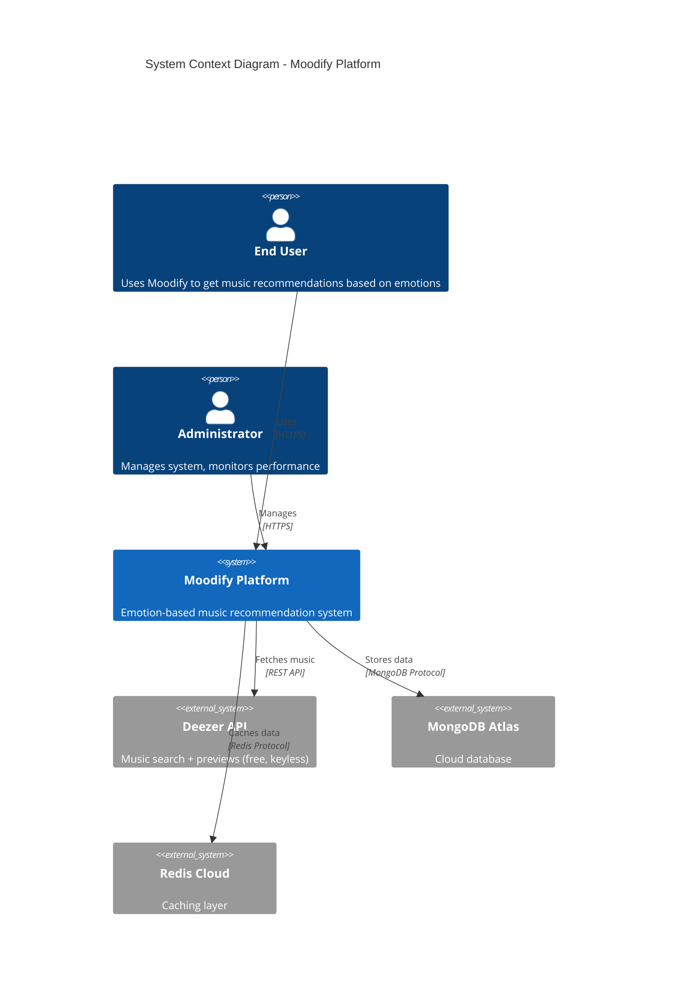
```mermaid
C4Context
    title System Context Diagram - Moodify Platform

    Person(user, "End User", "Uses Moodify to get music recommendations based on emotions")
    Person(admin, "Administrator", "Manages system, monitors performance")

    System(moodify, "Moodify Platform", "Emotion-based music recommendation system")

    System_Ext(deezer, "Deezer API", "Music search + previews (free, keyless)")
    System_Ext(mongodb, "MongoDB Atlas", "Cloud database")
    System_Ext(redis, "Redis Cloud", "Caching layer")

    Rel(user, moodify, "Uses", "HTTPS")
    Rel(admin, moodify, "Manages", "HTTPS")
    Rel(moodify, deezer, "Fetches music", "REST API")
    Rel(moodify, mongodb, "Stores data", "MongoDB Protocol")
    Rel(moodify, redis, "Caches data", "Redis Protocol")
```

### System Boundaries

- **In Scope**:
  - Frontend web application (React)
  - Mobile application (React Native)
  - Backend API services (Django REST Framework)
  - AI/ML services (Flask, PyTorch, TensorFlow)
  - Data analytics pipeline (Spark, Hadoop)
  - Infrastructure orchestration (Kubernetes, Docker)

- **Out of Scope**:
  - Music playback functionality (delegated to Deezer's web player)
  - Music content creation
  - Payment processing
  - Email/SMS notification services

## 3. Architecture Principles

### Design Principles

1. **Modularity**: Loosely coupled services with well-defined interfaces
2. **Scalability**: Horizontal scaling for all stateless components
3. **Resilience**: Graceful degradation and fault tolerance
4. **Security**: Defense in depth, zero-trust architecture
5. **Observability**: Comprehensive logging, monitoring, and tracing
6. **Performance**: Response time < 2s for 95th percentile
7. **Maintainability**: Clean code, comprehensive documentation

### Architectural Patterns

- **Microservices Architecture**: Independent, deployable services
- **API Gateway Pattern**: Single entry point for clients
- **Repository Pattern**: Data access abstraction
- **Factory Pattern**: Model instantiation and dependency injection
- **Observer Pattern**: Event-driven state management (Redux)
- **Proxy Pattern**: Load balancing and request routing (NGINX)

## 4. High-Level Architecture

### Complete System Architecture


```mermaid
graph TB
    subgraph "Client Tier"
        WEB[Web Application<br/>React + Redux]
        MOB[Mobile Application<br/>React Native]
    end

    subgraph "Edge Layer"
        CDN[CDN<br/>CloudFront/Cloudflare]
        WAF[Web Application Firewall]
    end

    subgraph "Load Balancing Layer"
        ALB[Application Load Balancer]
        NGINX[NGINX Reverse Proxy]
    end

    subgraph "Application Tier"
        subgraph "Backend Services"
            BE1[Backend Instance 1<br/>Django]
            BE2[Backend Instance 2<br/>Django]
            BE3[Backend Instance 3<br/>Django]
        end

        subgraph "AI/ML Services"
            ML1[ML Service 1<br/>Flask]
            ML2[ML Service 2<br/>Flask]
        end

        subgraph "Worker Services"
            WK1[Celery Worker 1]
            WK2[Celery Worker 2]
        end
    end

    subgraph "Data Tier"
        subgraph "Primary Storage"
            MONGO[(MongoDB Cluster<br/>Replica Set)]
        end

        subgraph "Caching Layer"
            REDIS[(Redis Cluster<br/>Master-Replica)]
        end

        subgraph "Message Queue"
            RMQ[RabbitMQ<br/>Cluster]
        end

        subgraph "Object Storage"
            S3[(S3/GCS<br/>Models & Assets)]
        end
    end

    subgraph "Analytics Tier"
        SPARK[Apache Spark<br/>Data Processing]
        HADOOP[Apache Hadoop<br/>HDFS]
        VIZ[Visualization<br/>Matplotlib/Plotly]
    end

    subgraph "External Services"
        DEEZER[Deezer API]
        MAIL[Email Service<br/>SendGrid]
    end

    subgraph "Observability"
        PROM[Prometheus<br/>Metrics]
        GRAF[Grafana<br/>Dashboards]
        ELK[ELK Stack<br/>Logs]
    end

    WEB & MOB --> CDN
    CDN --> WAF
    WAF --> ALB
    ALB --> NGINX
    NGINX --> BE1 & BE2 & BE3
    BE1 & BE2 & BE3 --> ML1 & ML2
    BE1 & BE2 & BE3 --> MONGO
    BE1 & BE2 & BE3 --> REDIS
    BE1 & BE2 & BE3 --> RMQ
    RMQ --> WK1 & WK2
    WK1 & WK2 --> MONGO
    ML1 & ML2 --> S3
    BE1 & BE2 & BE3 --> SPOT
    BE1 & BE2 & BE3 --> MAIL
    MONGO -.->|ETL| SPARK
    SPARK <--> HADOOP
    SPARK --> VIZ
    BE1 & BE2 & BE3 --> PROM
    PROM --> GRAF
    BE1 & BE2 & BE3 --> ELK

    style WEB fill:#61DAFB
    style MOB fill:#61DAFB
    style BE1 fill:#092E20
    style BE2 fill:#092E20
    style BE3 fill:#092E20
    style ML1 fill:#FF6F00
    style ML2 fill:#FF6F00
    style MONGO fill:#47A248
    style REDIS fill:#DC382D
    style SPOT fill:#1DB954
```

### Architecture Layers

#### 1. Presentation Layer
- **Web Frontend**: React SPA with Material-UI
- **Mobile Frontend**: React Native with Expo
- **Responsibilities**: UI rendering, user interaction, client-side validation

#### 2. API Gateway Layer
- **Load Balancer**: NGINX for request routing
- **Responsibilities**: SSL termination, rate limiting, request routing

#### 3. Application Layer
- **Backend Services**: Django REST Framework
- **AI/ML Services**: Flask microservices
- **Responsibilities**: Business logic, authentication, data validation

#### 4. Data Layer
- **Primary Database**: MongoDB (document store)
- **Cache**: Redis (in-memory)
- **Object Storage**: S3/GCS (models, media)
- **Responsibilities**: Data persistence, caching, file storage

#### 5. Analytics Layer
- **Processing**: Apache Spark
- **Storage**: Apache Hadoop HDFS
- **Responsibilities**: Batch processing, analytics, reporting

## 5. Component Architecture

### Frontend Architecture

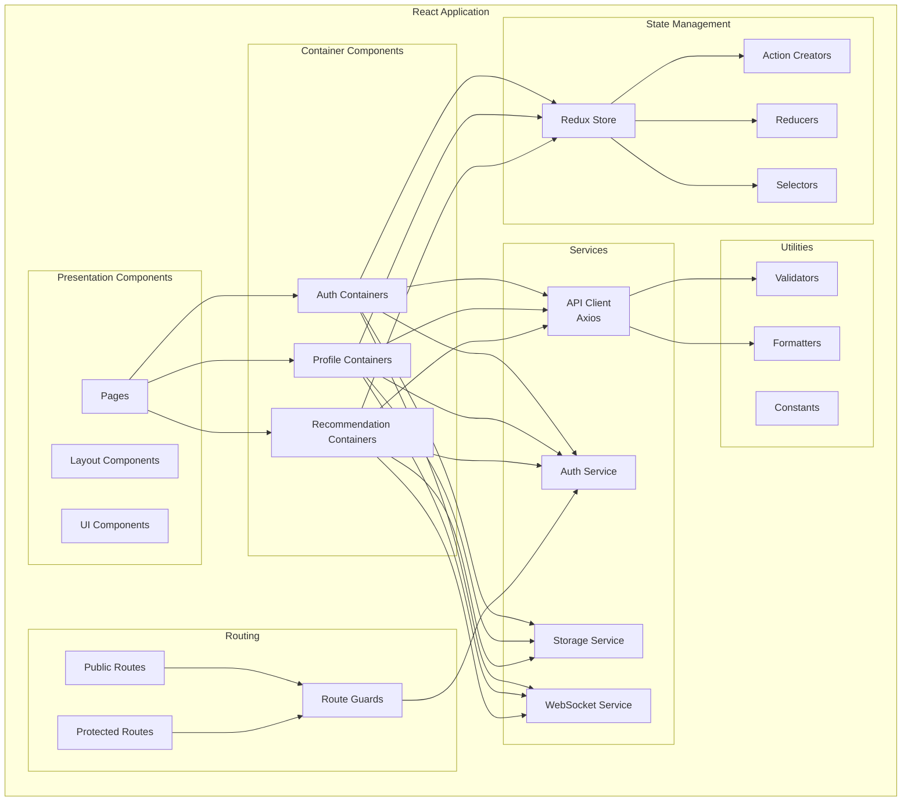
```mermaid
graph TB
    subgraph "React Application"
        subgraph "Presentation Components"
            PC1[Pages]
            PC2[Layout Components]
            PC3[UI Components]
        end

        subgraph "Container Components"
            CC1[Auth Containers]
            CC2[Profile Containers]
            CC3[Recommendation Containers]
        end

        subgraph "State Management"
            SM1[Redux Store]
            SM2[Action Creators]
            SM3[Reducers]
            SM4[Selectors]
        end

        subgraph "Services"
            SV1[API Client<br/>Axios]
            SV2[Auth Service]
            SV3[Storage Service]
            SV4[WebSocket Service]
        end

        subgraph "Utilities"
            UT1[Validators]
            UT2[Formatters]
            UT3[Constants]
        end

        subgraph "Routing"
            RT1[Public Routes]
            RT2[Protected Routes]
            RT3[Route Guards]
        end
    end

    PC1 --> CC1 & CC2 & CC3
    CC1 & CC2 & CC3 --> SM1
    SM1 --> SM2 & SM3 & SM4
    CC1 & CC2 & CC3 --> SV1 & SV2 & SV3 & SV4
    SV1 --> UT1 & UT2
    RT1 & RT2 --> RT3
    RT3 --> SV2
```

### Backend Architecture

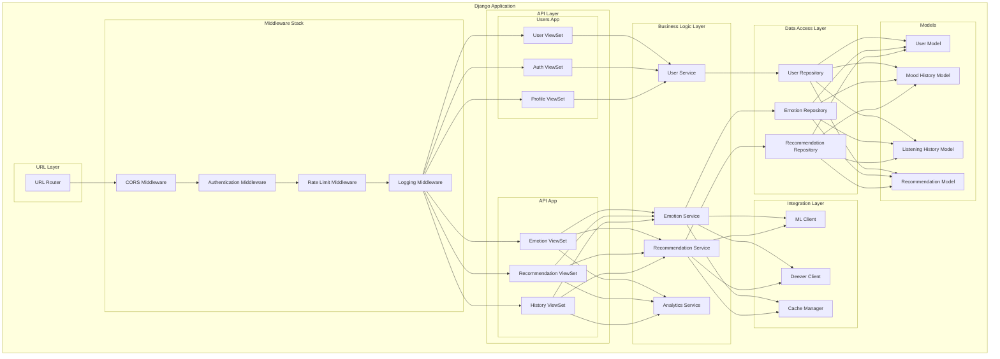
```mermaid
graph TB
    subgraph "Django Application"
        subgraph "URL Layer"
            URL[URL Router]
        end

        subgraph "Middleware Stack"
            MW1[CORS Middleware]
            MW2[Authentication Middleware]
            MW3[Rate Limit Middleware]
            MW4[Logging Middleware]
        end

        subgraph "API Layer"
            subgraph "Users App"
                UA1[User ViewSet]
                UA2[Auth ViewSet]
                UA3[Profile ViewSet]
            end

            subgraph "API App"
                AA1[Emotion ViewSet]
                AA2[Recommendation ViewSet]
                AA3[History ViewSet]
            end
        end

        subgraph "Business Logic Layer"
            BL1[User Service]
            BL2[Emotion Service]
            BL3[Recommendation Service]
            BL4[Analytics Service]
        end

        subgraph "Data Access Layer"
            DA1[User Repository]
            DA2[Emotion Repository]
            DA3[Recommendation Repository]
        end

        subgraph "Integration Layer"
            IN1[ML Client]
            IN2[Deezer Client]
            IN3[Cache Manager]
        end

        subgraph "Models"
            MD1[User Model]
            MD2[Mood History Model]
            MD3[Listening History Model]
            MD4[Recommendation Model]
        end
    end

    URL --> MW1
    MW1 --> MW2
    MW2 --> MW3
    MW3 --> MW4
    MW4 --> UA1 & UA2 & UA3 & AA1 & AA2 & AA3
    UA1 & UA2 & UA3 --> BL1
    AA1 & AA2 & AA3 --> BL2 & BL3 & BL4
    BL1 --> DA1
    BL2 --> DA2
    BL3 --> DA3
    BL2 & BL3 --> IN1 & IN2 & IN3
    DA1 & DA2 & DA3 --> MD1 & MD2 & MD3 & MD4
```

### AI/ML Architecture

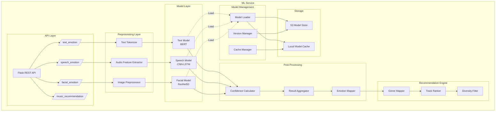
```mermaid
graph TB
    subgraph "ML Service"
        subgraph "API Layer"
            API[Flask REST API]
            EP1[/text_emotion/]
            EP2[/speech_emotion/]
            EP3[/facial_emotion/]
            EP4[/music_recommendation/]
        end

        subgraph "Preprocessing Layer"
            PP1[Text Tokenizer]
            PP2[Audio Feature Extractor]
            PP3[Image Preprocessor]
        end

        subgraph "Model Layer"
            ML1[Text Model<br/>BERT]
            ML2[Speech Model<br/>CNN-LSTM]
            ML3[Facial Model<br/>ResNet50]
        end

        subgraph "Post-Processing"
            POST1[Confidence Calculator]
            POST2[Result Aggregator]
            POST3[Emotion Mapper]
        end

        subgraph "Recommendation Engine"
            RE1[Genre Mapper]
            RE2[Track Ranker]
            RE3[Diversity Filter]
        end

        subgraph "Model Management"
            MM1[Model Loader]
            MM2[Version Manager]
            MM3[Cache Manager]
        end

        subgraph "Storage"
            ST1[S3 Model Store]
            ST2[Local Model Cache]
        end
    end

    API --> EP1 & EP2 & EP3 & EP4
    EP1 --> PP1 --> ML1
    EP2 --> PP2 --> ML2
    EP3 --> PP3 --> ML3
    ML1 & ML2 & ML3 --> POST1 --> POST2
    POST2 --> POST3
    POST3 --> RE1 --> RE2 --> RE3
    MM1 --> ST1 & ST2
    MM2 --> ST1
    MM3 --> ST2
    ML1 & ML2 & ML3 -.->|Load| MM1
```

## 6. Data Architecture

### Data Model

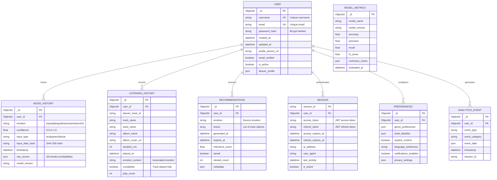
```mermaid
erDiagram
    USER ||--o{ MOOD_HISTORY : tracks
    USER ||--o{ LISTENING_HISTORY : records
    USER ||--o{ RECOMMENDATIONS : receives
    USER ||--o{ SESSION : authenticates
    USER ||--o{ PREFERENCES : configures

    USER {
        ObjectId _id PK
        string username UK "Unique username"
        string email UK "Unique email"
        string password_hash "Bcrypt hashed"
        datetime created_at
        datetime updated_at
        string profile_picture_url
        boolean email_verified
        boolean is_active
        json deezer_profile
    }

    MOOD_HISTORY {
        ObjectId _id PK
        ObjectId user_id FK
        string emotion "joy|sad|angry|fear|surprise|neutral"
        float confidence "0.0 to 1.0"
        string input_type "text|speech|facial"
        string input_data_hash "SHA-256 hash"
        datetime timestamp
        json raw_scores "All emotion probabilities"
        string model_version
    }

    LISTENING_HISTORY {
        ObjectId _id PK
        ObjectId user_id FK
        string deezer_track_id
        string track_name
        string artist_name
        string album_name
        string album_cover_url
        int duration_ms
        datetime played_at
        string emotion_context "Associated emotion"
        boolean completed "Track played fully"
        int play_count
    }

    RECOMMENDATIONS {
        ObjectId _id PK
        ObjectId user_id FK
        string emotion "Source emotion"
        array tracks "List of track objects"
        datetime generated_at
        datetime expires_at
        float relevance_score
        boolean saved
        int viewed_count
        json metadata
    }

    SESSION {
        string session_id PK
        ObjectId user_id FK
        string access_token "JWT access token"
        string refresh_token "JWT refresh token"
        datetime access_expires_at
        datetime refresh_expires_at
        string ip_address
        string user_agent
        datetime last_activity
        boolean is_active
    }

    PREFERENCES {
        ObjectId _id PK
        ObjectId user_id FK
        json genre_preferences
        json artist_blacklist
        boolean explicit_content
        string language_preference
        boolean notifications_enabled
        json privacy_settings
    }

    ANALYTICS_EVENT {
        ObjectId _id PK
        ObjectId user_id FK
        string event_type
        string event_category
        json event_data
        datetime timestamp
        string session_id
    }

    MODEL_METRICS {
        ObjectId _id PK
        string model_name
        string model_version
        float accuracy
        float precision
        float recall
        float f1_score
        json confusion_matrix
        datetime evaluated_at
    }

    USER ||--o{ ANALYTICS_EVENT : generates
```

### Data Flow

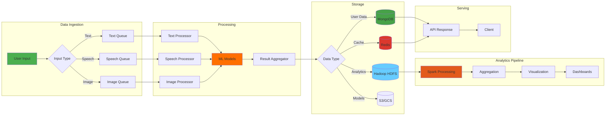
```mermaid
flowchart LR
    subgraph "Data Ingestion"
        A[User Input] --> B{Input Type}
        B -->|Text| C[Text Queue]
        B -->|Speech| D[Speech Queue]
        B -->|Image| E[Image Queue]
    end

    subgraph "Processing"
        C --> F[Text Processor]
        D --> G[Speech Processor]
        E --> H[Image Processor]
        F & G & H --> I[ML Models]
        I --> J[Result Aggregator]
    end

    subgraph "Storage"
        J --> K{Data Type}
        K -->|User Data| L[(MongoDB)]
        K -->|Cache| M[(Redis)]
        K -->|Analytics| N[(Hadoop HDFS)]
        K -->|Models| O[(S3/GCS)]
    end

    subgraph "Analytics Pipeline"
        N --> P[Spark Processing]
        P --> Q[Aggregation]
        Q --> R[Visualization]
        R --> S[Dashboards]
    end

    subgraph "Serving"
        L --> T[API Response]
        M --> T
        T --> U[Client]
    end

    style A fill:#4CAF50
    style I fill:#FF6F00
    style L fill:#47A248
    style M fill:#DC382D
    style N fill:#66CCFF
    style P fill:#E25A1C
```

### Data Storage Strategy

| Data Type | Storage | TTL | Backup Strategy |
|-----------|---------|-----|----------------|
| User Profiles | MongoDB | Permanent | Daily full + hourly incremental |
| Session Data | Redis | 7 days | Not backed up (regenerable) |
| Mood History | MongoDB | 1 year | Weekly full backup |
| Listening History | MongoDB | 2 years | Monthly aggregation + archive |
| Recommendations | MongoDB + Redis | 24 hours (MongoDB), 1 hour (Redis) | Not backed up |
| ML Models | S3/GCS | Versioned | Multi-region replication |
| Analytics Data | Hadoop HDFS | 5 years | Quarterly archive to Glacier |
| Logs | Elasticsearch | 90 days | Compressed archive to S3 |

## 7. Security Architecture

### Security Layers

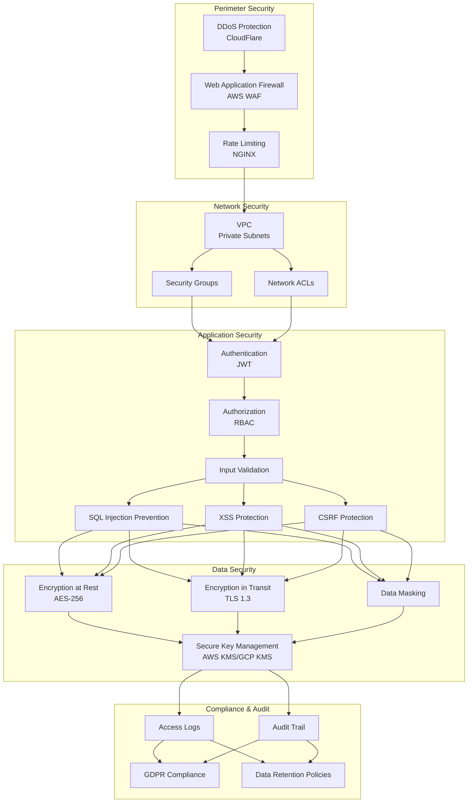
```mermaid
graph TB
    subgraph "Perimeter Security"
        A[DDoS Protection<br/>CloudFlare]
        B[Web Application Firewall<br/>AWS WAF]
        C[Rate Limiting<br/>NGINX]
    end

    subgraph "Network Security"
        D[VPC<br/>Private Subnets]
        E[Security Groups]
        F[Network ACLs]
    end

    subgraph "Application Security"
        G[Authentication<br/>JWT]
        H[Authorization<br/>RBAC]
        I[Input Validation]
        J[SQL Injection Prevention]
        K[XSS Protection]
        L[CSRF Protection]
    end

    subgraph "Data Security"
        M[Encryption at Rest<br/>AES-256]
        N[Encryption in Transit<br/>TLS 1.3]
        O[Data Masking]
        P[Secure Key Management<br/>AWS KMS/GCP KMS]
    end

    subgraph "Compliance & Audit"
        Q[Access Logs]
        R[Audit Trail]
        S[GDPR Compliance]
        T[Data Retention Policies]
    end

    A --> B --> C
    C --> D
    D --> E & F
    E & F --> G
    G --> H --> I
    I --> J & K & L
    J & K & L --> M & N & O
    M & N & O --> P
    P --> Q & R
    Q & R --> S & T
```

### Authentication Flow

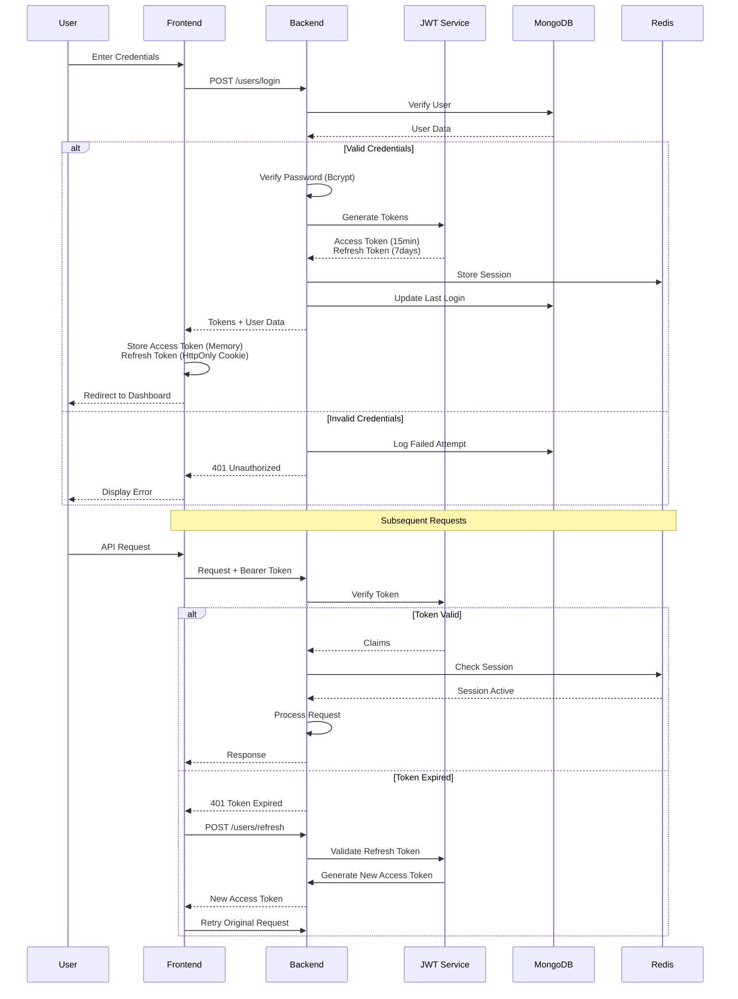
```mermaid
sequenceDiagram
    participant U as User
    participant FE as Frontend
    participant BE as Backend
    participant JWT as JWT Service
    participant DB as MongoDB
    participant RD as Redis

    U->>FE: Enter Credentials
    FE->>BE: POST /users/login
    BE->>DB: Verify User
    DB-->>BE: User Data

    alt Valid Credentials
        BE->>BE: Verify Password (Bcrypt)
        BE->>JWT: Generate Tokens
        JWT-->>BE: Access Token (15min)<br/>Refresh Token (7days)
        BE->>RD: Store Session
        BE->>DB: Update Last Login
        BE-->>FE: Tokens + User Data
        FE->>FE: Store Access Token (Memory)<br/>Refresh Token (HttpOnly Cookie)
        FE-->>U: Redirect to Dashboard
    else Invalid Credentials
        BE->>DB: Log Failed Attempt
        BE-->>FE: 401 Unauthorized
        FE-->>U: Display Error
    end

    Note over FE,RD: Subsequent Requests
    U->>FE: API Request
    FE->>BE: Request + Bearer Token
    BE->>JWT: Verify Token
    alt Token Valid
        JWT-->>BE: Claims
        BE->>RD: Check Session
        RD-->>BE: Session Active
        BE->>BE: Process Request
        BE-->>FE: Response
    else Token Expired
        BE-->>FE: 401 Token Expired
        FE->>BE: POST /users/refresh
        BE->>JWT: Validate Refresh Token
        JWT->>BE: Generate New Access Token
        BE-->>FE: New Access Token
        FE->>BE: Retry Original Request
    end
```

### Security Controls

| Control | Implementation | Purpose |
|---------|---------------|---------|
| Authentication | JWT with RS256 | Stateless auth with asymmetric encryption |
| Authorization | RBAC with user roles | Fine-grained access control |
| Rate Limiting | Token bucket (100 req/min) | Prevent abuse and DoS |
| Input Validation | Pydantic models, DRF serializers | Prevent injection attacks |
| Password Policy | Min 8 chars, complexity rules | Strong password enforcement |
| Session Management | Redis with TTL | Secure session storage |
| API Security | API key rotation, CORS | Prevent unauthorized access |
| Encryption at Rest | AES-256-GCM | Protect sensitive data |
| Encryption in Transit | TLS 1.3 | Secure communication |
| Secret Management | AWS Secrets Manager | Centralized secret storage |
| Audit Logging | CloudWatch/Stackdriver | Compliance and forensics |

## 8. Deployment Architecture

### Cloud Deployment - AWS

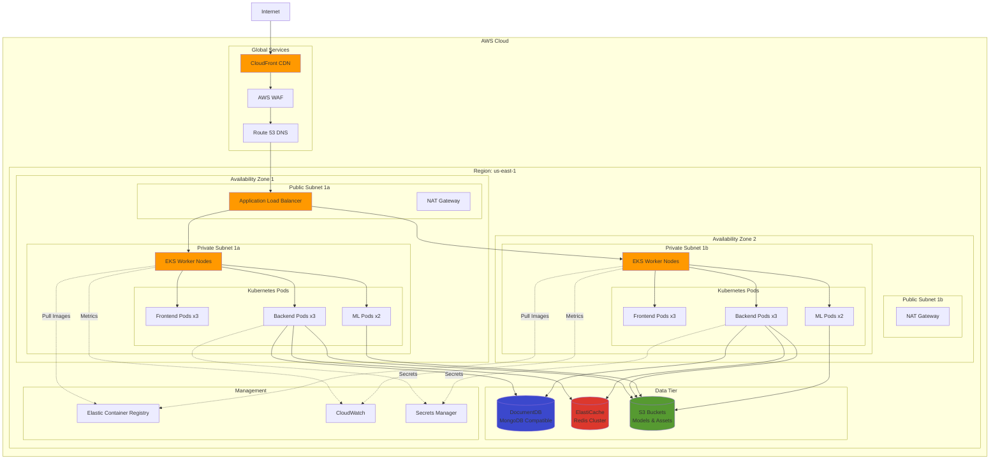
```mermaid
graph TB
    subgraph "AWS Cloud"
        subgraph "Region: us-east-1"
            subgraph "Availability Zone 1"
                subgraph "Public Subnet 1a"
                    ALB1[Application Load Balancer]
                    NAT1[NAT Gateway]
                end

                subgraph "Private Subnet 1a"
                    EKS1[EKS Worker Nodes]
                    subgraph "Kubernetes Pods"
                        FE1[Frontend Pods x3]
                        BE1[Backend Pods x3]
                        ML1[ML Pods x2]
                    end
                end
            end

            subgraph "Availability Zone 2"
                subgraph "Public Subnet 1b"
                    NAT2[NAT Gateway]
                end

                subgraph "Private Subnet 1b"
                    EKS2[EKS Worker Nodes]
                    subgraph "Kubernetes Pods"
                        FE2[Frontend Pods x3]
                        BE2[Backend Pods x3]
                        ML2[ML Pods x2]
                    end
                end
            end

            subgraph "Data Tier"
                RDS[(DocumentDB<br/>MongoDB Compatible)]
                REDIS[(ElastiCache<br/>Redis Cluster)]
                S3[(S3 Buckets<br/>Models & Assets)]
            end

            subgraph "Management"
                ECR[Elastic Container Registry]
                CW[CloudWatch]
                SM[Secrets Manager]
            end
        end

        subgraph "Global Services"
            CF[CloudFront CDN]
            R53[Route 53 DNS]
            WAF[AWS WAF]
        end
    end

    Internet --> CF
    CF --> WAF
    WAF --> R53
    R53 --> ALB1
    ALB1 --> EKS1 & EKS2
    EKS1 --> FE1 & BE1 & ML1
    EKS2 --> FE2 & BE2 & ML2
    BE1 & BE2 --> RDS & REDIS & S3
    ML1 & ML2 --> S3
    EKS1 & EKS2 -.->|Pull Images| ECR
    EKS1 & EKS2 -.->|Metrics| CW
    BE1 & BE2 -.->|Secrets| SM

    style CF fill:#FF9900
    style ALB1 fill:#FF9900
    style EKS1 fill:#FF9900
    style EKS2 fill:#FF9900
    style RDS fill:#3B48CC
    style REDIS fill:#DC382D
    style S3 fill:#569A31
```

### Self-host module map

The Kubernetes / hybrid path is composed entirely from in-repo modules; nothing
is fetched from a private chart museum. The table below maps each layer to
the Terraform module or Helm chart that owns it.

| Layer            | Owner (repo path)                               | Notes |
| ---------------- | ----------------------------------------------- | ----- |
| Network          | `terraform/modules/vpc/`                        | VPC + 3 AZ subnets + flow logs |
| K8s control plane| `terraform/modules/{eks,gke,aks}/`              | One module per cloud; per-cloud root in `aws/terraform/`, `gcp/terraform/`, `oracle-cloud/terraform/` |
| Postgres         | `terraform/modules/rds/`                        | Multi-AZ + KMS + Secrets Manager |
| Cache            | `terraform/modules/redis/`                      | ElastiCache replication group + AUTH token |
| Object storage   | `terraform/modules/s3/`                         | TLS-only bucket policy + lifecycle |
| GitOps           | `terraform/modules/argocd/` + `argocd/applications/` | Argo CD HA install + app-of-apps pattern |
| Observability    | `helm/monitoring/` (umbrella)                   | kube-prometheus-stack + Loki + Promtail + Tempo + Moodify dashboards |
| Backend chart    | `helm/moodify-backend/`                         | Blue/green-aware, HPA, PDB, ingress, network policy |
| Frontend chart   | `helm/moodify-frontend/`                        | Runtime `env.js`, read-only rootfs, cert-manager-issued TLS |
| Edge proxy       | `nginx/` + `nginx/snippets/` + `nginx/exporter/` | Optional; covers single-VM + "single ingress" cluster cases |
| Identity         | `aws/iam/irsa-examples.tf` (AWS) · Workload Identity bindings in `gcp/kubernetes/external-secrets.yaml` (GCP) · Federated Identity in `terraform/modules/aks/` (Azure) | One ServiceAccount → one cloud IAM role |
| Secrets sync     | `aws/kubernetes/production/external-secrets.yaml` · `gcp/kubernetes/external-secrets.yaml` | External Secrets Operator pulls Secrets Manager / Secret Manager into Kubernetes Secrets |
| Out-of-band view | `aws/cloudwatch/{dashboard,alarms}.tf` · `gcp/monitoring/{dashboard,alerts}.tf` | Survives a Prometheus outage |

### Kubernetes Deployment

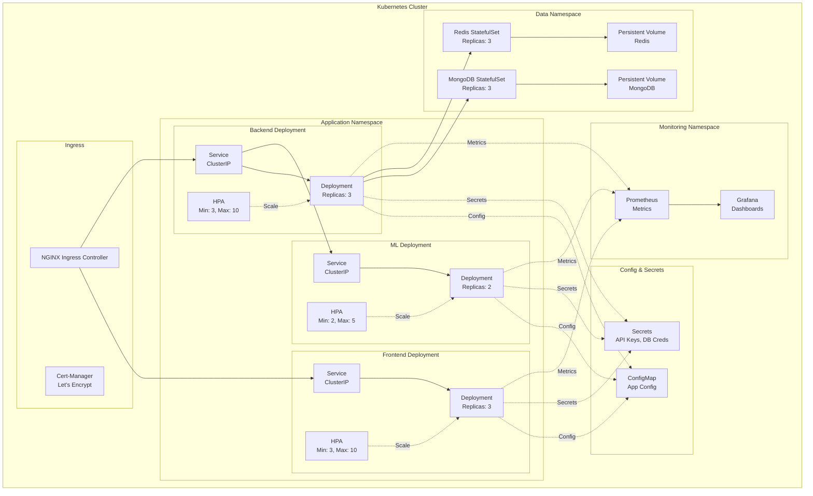
```mermaid
graph TB
    subgraph "Kubernetes Cluster"
        subgraph "Ingress"
            ING[NGINX Ingress Controller]
            CERT[Cert-Manager<br/>Let's Encrypt]
        end

        subgraph "Application Namespace"
            subgraph "Frontend Deployment"
                FE_DEP[Deployment<br/>Replicas: 3]
                FE_SVC[Service<br/>ClusterIP]
                FE_HPA[HPA<br/>Min: 3, Max: 10]
            end

            subgraph "Backend Deployment"
                BE_DEP[Deployment<br/>Replicas: 3]
                BE_SVC[Service<br/>ClusterIP]
                BE_HPA[HPA<br/>Min: 3, Max: 10]
            end

            subgraph "ML Deployment"
                ML_DEP[Deployment<br/>Replicas: 2]
                ML_SVC[Service<br/>ClusterIP]
                ML_HPA[HPA<br/>Min: 2, Max: 5]
            end
        end

        subgraph "Data Namespace"
            MONGO_STS[MongoDB StatefulSet<br/>Replicas: 3]
            REDIS_STS[Redis StatefulSet<br/>Replicas: 3]
            PV1[Persistent Volume<br/>MongoDB]
            PV2[Persistent Volume<br/>Redis]
        end

        subgraph "Config & Secrets"
            CM[ConfigMap<br/>App Config]
            SEC[Secrets<br/>API Keys, DB Creds]
        end

        subgraph "Monitoring Namespace"
            PROM[Prometheus<br/>Metrics]
            GRAF[Grafana<br/>Dashboards]
        end
    end

    ING --> FE_SVC & BE_SVC
    FE_SVC --> FE_DEP
    BE_SVC --> BE_DEP
    BE_SVC --> ML_SVC
    ML_SVC --> ML_DEP
    FE_DEP & BE_DEP & ML_DEP -.->|Config| CM
    FE_DEP & BE_DEP & ML_DEP -.->|Secrets| SEC
    BE_DEP --> MONGO_STS & REDIS_STS
    MONGO_STS --> PV1
    REDIS_STS --> PV2
    FE_HPA -.->|Scale| FE_DEP
    BE_HPA -.->|Scale| BE_DEP
    ML_HPA -.->|Scale| ML_DEP
    FE_DEP & BE_DEP & ML_DEP -.->|Metrics| PROM
    PROM --> GRAF
```

## 9. Scalability and Performance

### Scalability Strategy

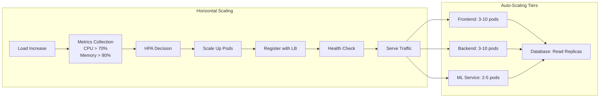
```mermaid
graph LR
    subgraph "Horizontal Scaling"
        A[Load Increase]
        B[Metrics Collection<br/>CPU > 70%<br/>Memory > 80%]
        C[HPA Decision]
        D[Scale Up Pods]
        E[Register with LB]
        F[Health Check]
        G[Serve Traffic]
    end

    subgraph "Auto-Scaling Tiers"
        H[Frontend: 3-10 pods]
        I[Backend: 3-10 pods]
        J[ML Service: 2-5 pods]
        K[Database: Read Replicas]
    end

    A --> B
    B --> C
    C --> D
    D --> E
    E --> F
    F --> G
    G --> H & I & J
    H & I & J --> K
```

### Performance Optimization

| Component | Optimization | Target Metric |
|-----------|-------------|---------------|
| Frontend | Code splitting, lazy loading | Initial load < 3s |
| Backend API | Query optimization, indexing | P95 latency < 500ms |
| ML Models | Model quantization, batching | Inference < 200ms |
| Database | Compound indexes, sharding | Query time < 100ms |
| Cache | Multi-level caching (L1/L2) | Cache hit rate > 80% |
| CDN | Edge caching, compression | Static asset < 100ms |
| Images | WebP format, lazy loading | LCP < 2.5s |

### Caching Strategy

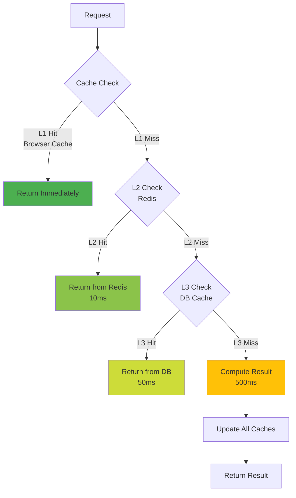
```mermaid
graph TB
    A[Request] --> B{Cache Check}
    B -->|L1 Hit<br/>Browser Cache| C[Return Immediately]
    B -->|L1 Miss| D{L2 Check<br/>Redis}
    D -->|L2 Hit| E[Return from Redis<br/>10ms]
    D -->|L2 Miss| F{L3 Check<br/>DB Cache}
    F -->|L3 Hit| G[Return from DB<br/>50ms]
    F -->|L3 Miss| H[Compute Result<br/>500ms]
    H --> I[Update All Caches]
    I --> J[Return Result]

    style C fill:#4CAF50
    style E fill:#8BC34A
    style G fill:#CDDC39
    style H fill:#FFC107
```

### Inference cost protection (as deployed)

The diagram above describes the aspirational multi-tier caching for
the long-term enterprise stack. The **current production deployment**
on Modal + Vercel uses a tighter, simpler model that's appropriate
for serverless / scale-to-zero — documented here for accuracy.

#### Caches (in-process, per Modal container)

| Cache | Key | TTL | Max | Why safe to cache |
|---|---|---|---|---|
| `text_emotion`  | `text.strip().lower()`   | 24 h | 2048 | BERT classifier is deterministic; normalisation matches the tokenizer. |
| `deezer_search` | `(query, limit)`         | 1 h  | 256  | Only ~30 mood-keyword queries; Deezer rank refreshes daily at most. |
| `speech_emotion`| `sha256(upload_bytes)`   | 6 h  | 256  | Defends against retry storms + working-session reuploads. Stores **label only**, never bytes. |
| `facial_emotion`| `sha256(upload_bytes)`   | 6 h  | 256  | Same as speech. |

Three invalidation mechanisms: lazy TTL expiry, LRU eviction, and
container restart (any `modal deploy` clears every cache). Empty /
failed / `degraded=True` results are **never** cached.

#### Rate limiting (per-caller sliding window)

| Tier | Endpoints | Default | Notes |
|---|---|---|---|
| `general` | `/text_emotion`, `/music_recommendation` | 45/min per user | Cheap calls (~100 ms each). |
| `media`   | `/speech_emotion`, `/facial_emotion`     | 15/min per user | Expensive calls (~500 ms each, plus sha256). Independent budget. |
| `service-token` (Django proxy) | all | bypassed | DRF throttling on the Django side covers proxied traffic. |

Algorithm: sliding window of monotonic timestamps in a per-user
`deque`, lazy expiry on every check, LRU bound on the key set.
Standard `X-RateLimit-Limit / Remaining / Window` headers on every
response, `Retry-After` (rounded up) on a 429.

#### Cost ceiling stack

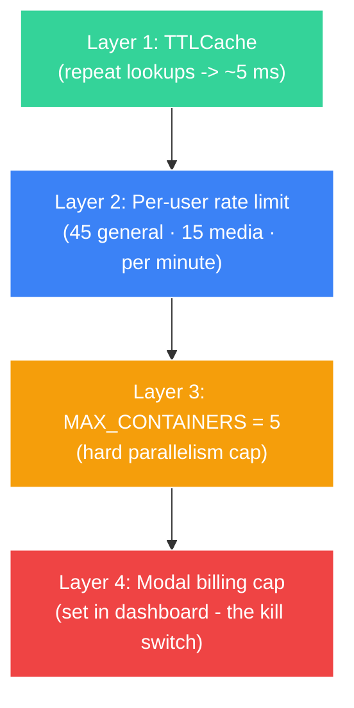
```mermaid
flowchart TD
    L1["Layer 1: TTLCache<br/>(repeat lookups -> ~5 ms)"] --> L2
    L2["Layer 2: Per-user rate limit<br/>(45 general · 15 media · per minute)"] --> L3
    L3["Layer 3: MAX_CONTAINERS = 5<br/>(hard parallelism cap)"] --> L4
    L4["Layer 4: Modal billing cap<br/>(set in dashboard - the kill switch)"]

    style L1 fill:#34d399,stroke:#fff,color:#fff
    style L2 fill:#3b82f6,stroke:#fff,color:#fff
    style L3 fill:#f59e0b,stroke:#fff,color:#fff
    style L4 fill:#ef4444,stroke:#fff,color:#fff
```

**Worst-case math at the defaults**:
`5 containers × $0.000104/sec × 60 s ≈ $0.031/min ≈ $1.87/hour ≈ $45/day`.
Real-world usage with cache hits + scale-to-zero idle windows lands
at single-digit dollars per month for the inference layer.

See `modal_inference/README.md` for the implementation
(`cache.py`, `rate_limit.py`, the `/health` observability surface).

## 10. Disaster Recovery

### Backup Strategy

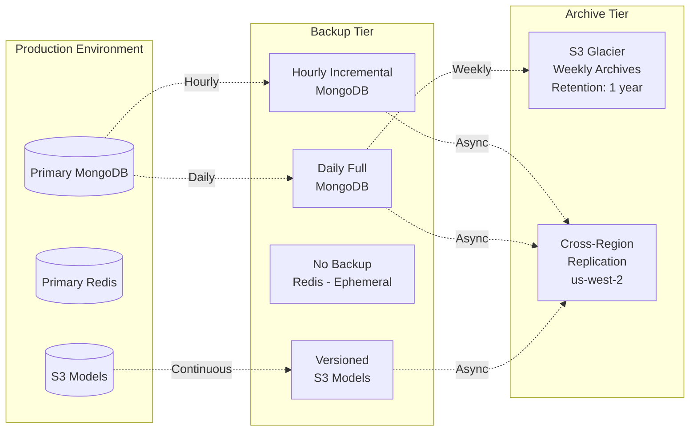
```mermaid
graph LR
    subgraph "Production Environment"
        A[(Primary MongoDB)]
        B[(Primary Redis)]
        C[(S3 Models)]
    end

    subgraph "Backup Tier"
        D[Hourly Incremental<br/>MongoDB]
        E[Daily Full<br/>MongoDB]
        F[No Backup<br/>Redis - Ephemeral]
        G[Versioned<br/>S3 Models]
    end

    subgraph "Archive Tier"
        H[S3 Glacier<br/>Weekly Archives<br/>Retention: 1 year]
        I[Cross-Region<br/>Replication<br/>us-west-2]
    end

    A -.->|Hourly| D
    A -.->|Daily| E
    C -.->|Continuous| G
    E -.->|Weekly| H
    D & E & G -.->|Async| I
```

### Recovery Time Objectives (RTO/RPO)

| Component | RTO | RPO | Strategy |
|-----------|-----|-----|----------|
| Frontend | 5 minutes | 0 (stateless) | Blue-green deployment |
| Backend API | 15 minutes | 1 hour | Pod restart, fallback to replicas |
| Database | 30 minutes | 1 hour | Replica promotion + restore |
| ML Models | 1 hour | 24 hours | S3 versioning, fallback to previous |
| Cache | 5 minutes | N/A (rebuild) | Redis persistence (RDB) |
| Complete System | 2 hours | 4 hours | Full stack deployment from backup |

### Incident Response

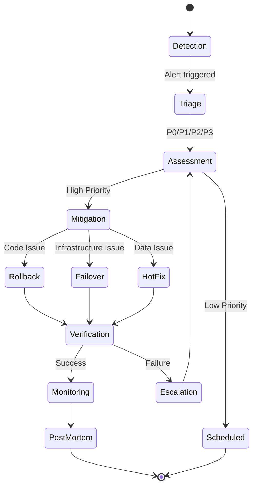
```mermaid
stateDiagram-v2
    [*] --> Detection
    Detection --> Triage: Alert triggered
    Triage --> Assessment: P0/P1/P2/P3
    Assessment --> Mitigation: High Priority
    Assessment --> Scheduled: Low Priority

    Mitigation --> Rollback: Code Issue
    Mitigation --> Failover: Infrastructure Issue
    Mitigation --> HotFix: Data Issue

    Rollback --> Verification
    Failover --> Verification
    HotFix --> Verification

    Verification --> Monitoring: Success
    Verification --> Escalation: Failure

    Monitoring --> PostMortem
    Escalation --> Assessment

    PostMortem --> [*]
    Scheduled --> [*]
```

## 11. Monitoring and Observability

### Monitoring Stack

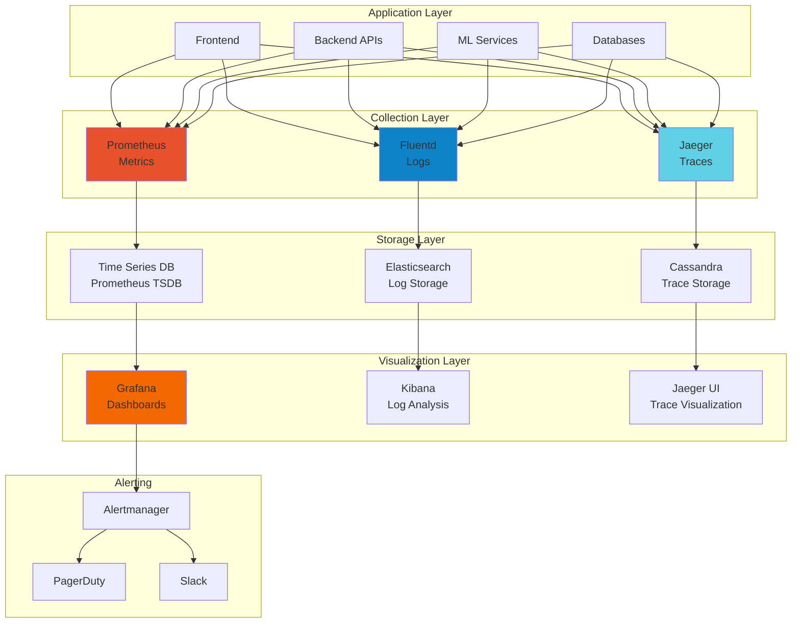
```mermaid
graph TB
    subgraph "Application Layer"
        A[Frontend]
        B[Backend APIs]
        C[ML Services]
        D[Databases]
    end

    subgraph "Collection Layer"
        E[Prometheus<br/>Metrics]
        F[Fluentd<br/>Logs]
        G[Jaeger<br/>Traces]
    end

    subgraph "Storage Layer"
        H[Time Series DB<br/>Prometheus TSDB]
        I[Elasticsearch<br/>Log Storage]
        J[Cassandra<br/>Trace Storage]
    end

    subgraph "Visualization Layer"
        K[Grafana<br/>Dashboards]
        L[Kibana<br/>Log Analysis]
        M[Jaeger UI<br/>Trace Visualization]
    end

    subgraph "Alerting"
        N[Alertmanager]
        O[PagerDuty]
        P[Slack]
    end

    A & B & C & D --> E & F & G
    E --> H
    F --> I
    G --> J
    H --> K
    I --> L
    J --> M
    K --> N
    N --> O & P

    style E fill:#E6522C
    style F fill:#0E83C8
    style G fill:#60D0E4
    style K fill:#F46800
```

### Key Metrics

| Metric Type | Metrics | Threshold | Action |
|------------|---------|-----------|--------|
| **Golden Signals** | Latency, Traffic, Errors, Saturation | P95 > 2s | Alert |
| **Application** | Request rate, Error rate, Response time | Error rate > 1% | Alert |
| **Infrastructure** | CPU, Memory, Disk I/O, Network | CPU > 80% | Auto-scale |
| **Database** | Query time, Connections, Cache hit rate | Connections > 90% | Alert |
| **Business** | User registrations, Emotion detections, Recommendations | - | Dashboard |

### SRE metrics pipeline (as deployed)

The Prometheus/Fluentd/Jaeger stack above describes the aspirational
long-term observability target. The **current production deployment**
on Vercel + Modal + Atlas runs a simpler, free-tier-only pipeline
that backs the live `/metrics` endpoints on both services.

#### Pipeline

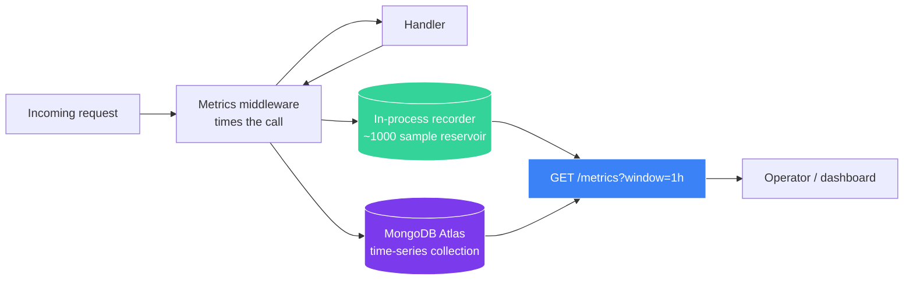
```mermaid
flowchart LR
    Req[Incoming request] --> MW[Metrics middleware<br/>times the call]
    MW --> H[Handler]
    H --> MW
    MW --> Live[(In-process recorder<br/>~1000 sample reservoir)]
    MW --> Store[(MongoDB Atlas<br/>time-series collection)]
    Live --> Endpoint["GET /metrics?window=1h"]
    Store --> Endpoint
    Endpoint --> Operator[Operator / dashboard]

    style Live fill:#34d399,stroke:#fff,color:#fff
    style Store fill:#7c3aed,stroke:#fff,color:#fff
    style Endpoint fill:#3b82f6,stroke:#fff,color:#fff
```

#### Collections

| Collection           | Service                | Endpoint to read                |
|----------------------|------------------------|---------------------------------|
| `inference_metrics`  | Modal (FastAPI)        | `GET /metrics` (service token)  |
| `backend_metrics`    | Django (Vercel)        | `GET /api/metrics/` (admin token) |

#### Per-doc schema

```json
{
  "ts":         "ISODate (time-series index)",
  "meta": {
    "service":      "modal | django",
    "endpoint":     "/text_emotion | /users/<str:user_id>/profile/ | ...",
    "method":       "POST",
    "container":    "modal-task-... | iad1-...",
    "status_class": "2xx | 3xx | 4xx | 5xx"
  },
  "status":     200,
  "latency_ms": 142.3,
  "degraded":   false
}
```

Native time-series compression brings each doc to roughly **150 B
on disk**; 10 k req/day × 30 days ≈ **45 MB** -- well inside the
Atlas free tier (512 MB).

#### Properties

| Property              | Behaviour |
|-----------------------|-----------|
| Write pattern         | Per-request synchronous (`~1 ms` warm), failures swallowed |
| Cardinality           | Path params normalised to the route template; `/health`, `/metrics`, `/swagger/`, `/redoc/`, `/` are skipped |
| TTL                   | 30 days native (env-tunable via `METRICS_TTL_DAYS`) |
| Latency percentiles   | Computed Python-side from raw `latency_ms` samples (linear-interp percentile) at query time |
| Auth on `/metrics`    | **Service token only** -- end-user JWTs explicitly rejected |
| Resilience            | Metrics MUST NEVER break the request: every layer (recorder, store, middleware) catches its own exceptions |
| Persistence offline   | If `MONGO_DB_URI` is unset or Atlas is unreachable, persistence silently disables; live in-process counters still work |

#### Response shape (both services)

```json
{
  "service": "modal | django",
  "window":  {"label": "1h", "since": "...", "until": "...", "seconds": 3600},
  "persisted": {
    "available": true,
    "endpoints": [
      {
        "endpoint": "/text_emotion", "method": "POST",
        "count": 412, "error_count": 3, "error_rate": 0.0073,
        "latency_ms": {"p50": 102, "p95": 245, "p99": 412, "max": 891, "mean": 134, "samples": 412},
        "status_codes": {"200": 409, "401": 2, "500": 1}
      }
    ]
  },
  "live": {
    "container": "...",
    "uptime_seconds": 412.5,
    "endpoints": [...]
  }
}
```

The `persisted` block aggregates across every container that wrote
into the window; the `live` block is the calling container's
in-process counters since startup, useful for verifying behaviour
right now without waiting for the next Mongo aggregation tick.

Implementation lives in `modal_inference/metrics{,_store}.py` and
`backend/observability/` -- see the per-service READMEs for the
deep dive.

### Distributed Tracing

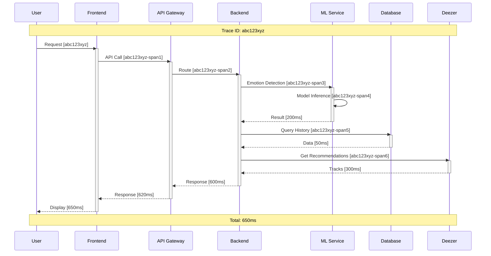
```mermaid
sequenceDiagram
    participant U as User
    participant FE as Frontend
    participant GW as API Gateway
    participant BE as Backend
    participant ML as ML Service
    participant DB as Database
    participant SP as Deezer

    Note over U,SP: Trace ID: abc123xyz

    U->>FE: Request [abc123xyz]
    activate FE
    FE->>GW: API Call [abc123xyz-span1]
    activate GW
    GW->>BE: Route [abc123xyz-span2]
    activate BE
    BE->>ML: Emotion Detection [abc123xyz-span3]
    activate ML
    ML->>ML: Model Inference [abc123xyz-span4]
    ML-->>BE: Result [200ms]
    deactivate ML
    BE->>DB: Query History [abc123xyz-span5]
    activate DB
    DB-->>BE: Data [50ms]
    deactivate DB
    BE->>SP: Get Recommendations [abc123xyz-span6]
    activate SP
    SP-->>BE: Tracks [300ms]
    deactivate SP
    BE-->>GW: Response [600ms]
    deactivate BE
    GW-->>FE: Response [620ms]
    deactivate GW
    FE-->>U: Display [650ms]
    deactivate FE

    Note over U,SP: Total: 650ms
```

## 12. Technology Stack

### Complete Technology Matrix

| Layer | Technology | Version | Purpose |
|-------|-----------|---------|---------|
| **Frontend** | | | |
| | React | 18.2.0 | UI framework |
| | Redux Toolkit | 1.9.5 | State management |
| | Material-UI | 5.14.0 | Component library |
| | Axios | 1.4.0 | HTTP client |
| | React Router | 6.14.0 | Routing |
| **Backend** | | | |
| | Python | 3.10+ | Runtime |
| | Django | 4.2.0 | Web framework |
| | Django REST Framework | 3.14.0 | API framework |
| | Gunicorn | 21.2.0 | WSGI server |
| | Celery | 5.3.0 | Task queue |
| **AI/ML** | | | |
| | PyTorch | 2.0.1 | Deep learning |
| | TensorFlow | 2.13.0 | Deep learning |
| | Transformers | 4.30.0 | NLP models |
| | Librosa | 0.10.0 | Audio processing |
| | OpenCV | 4.8.0 | Computer vision |
| | Flask | 2.3.0 | ML API server |
| **Databases** | | | |
| | MongoDB | 6.0 | Primary database |
| | Redis | 7.0 | Caching |
| | PostgreSQL | 15.0 | Optional RDBMS |
| **Analytics** | | | |
| | Apache Spark | 3.4.0 | Data processing |
| | Apache Hadoop | 3.3.6 | Distributed storage |
| | Pandas | 2.0.0 | Data manipulation |
| | Matplotlib | 3.7.0 | Visualization |
| **Infrastructure** | | | |
| | Docker | 24.0.0 | Containerization |
| | Kubernetes | 1.27.0 | Orchestration |
| | NGINX | 1.25.0 | Load balancer |
| | Terraform | 1.5.0 | IaC |
| **CI/CD** | | | |
| | GitHub Actions | - | Automation |
| | Jenkins | 2.400.0 | CI/CD pipeline |
| | ArgoCD | 2.7.0 | GitOps |
| **Monitoring** | | | |
| | Prometheus | 2.45.0 | Metrics |
| | Grafana | 10.0.0 | Dashboards |
| | ELK Stack | 8.9.0 | Logging |
| | Jaeger | 1.47.0 | Tracing |
| **Cloud Providers** | | | |
| | AWS | - | Primary cloud |
| | GCP | - | Alternative cloud |
| | Vercel | - | Frontend hosting |
| | Vercel | - | Backend (Django) + frontend hosting |
| | Modal | - | ML inference service (memory snapshots, scale-to-zero) |

---

## Appendix

### A. API Endpoint Reference

See [OpenAPI Specification](openapi.yaml) for complete API documentation.

### B. Database Indexes

| Collection | Index | Type | Purpose |
|-----------|-------|------|---------|
| users | username | Unique | User lookup |
| users | email | Unique | Email lookup |
| mood_history | user_id, timestamp | Compound | User history queries |
| listening_history | user_id, played_at | Compound | Listening history |
| recommendations | user_id, generated_at | Compound | Recommendations lookup |

### C. Environment Variables

See `.env.example` for complete list of required environment variables.

### D. Glossary

- **HPA**: Horizontal Pod Autoscaler
- **RBAC**: Role-Based Access Control
- **RTO**: Recovery Time Objective
- **RPO**: Recovery Point Objective
- **TSDB**: Time Series Database
- **WSGI**: Web Server Gateway Interface

---

**Document Version:** 1.0
**Last Updated:** 2025-10-07
**Author:** Son Nguyen
