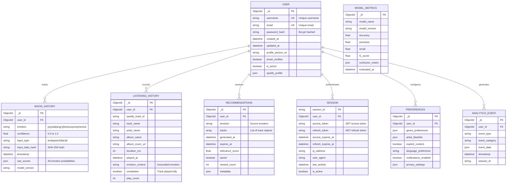

# Moodify System Architecture Documentation

**Version:** 1.0
**Last Updated:** 2025-10-07
**Author:** Son Nguyen

## Table of Contents

- [1. Executive Summary](#1-executive-summary)
- [2. System Overview](#2-system-overview)
- [3. Architecture Principles](#3-architecture-principles)
- [4. High-Level Architecture](#4-high-level-architecture)
- [5. Component Architecture](#5-component-architecture)
- [6. Data Architecture](#6-data-architecture)
- [7. Security Architecture](#7-security-architecture)
- [8. Deployment Architecture](#8-deployment-architecture)
- [9. Scalability and Performance](#9-scalability-and-performance)
- [10. Disaster Recovery](#10-disaster-recovery)
- [11. Monitoring and Observability](#11-monitoring-and-observability)
- [12. Technology Stack](#12-technology-stack)

## 1. Executive Summary

Moodify is a sophisticated emotion-based music recommendation system that combines modern web technologies, advanced AI/ML models, and cloud infrastructure to deliver personalized music experiences. The system analyzes user emotions through three modalities (text, speech, and facial expressions) and provides curated music recommendations via Spotify integration.

### Key Capabilities

- **Multi-Modal Emotion Detection**: Text, speech, and facial expression analysis
- **Real-Time Processing**: Sub-second response times for emotion detection
- **Scalable Architecture**: Containerized microservices with horizontal scaling
- **High Availability**: 99.9% uptime through redundancy and load balancing
- **Security-First Design**: JWT authentication, encrypted communications, rate limiting

## 2. System Overview

### System Context

### System Boundaries

- **In Scope**:
  - Frontend web application (React)
  - Mobile application (React Native)
  - Backend API services (Django REST Framework)
  - AI/ML services (Flask, PyTorch, TensorFlow)
  - Data analytics pipeline (Spark, Hadoop)
  - Infrastructure orchestration (Kubernetes, Docker)

- **Out of Scope**:
  - Music playback functionality (delegated to Spotify)
  - Music content creation
  - Payment processing
  - Email/SMS notification services

## 3. Architecture Principles

### Design Principles

1. **Modularity**: Loosely coupled services with well-defined interfaces
2. **Scalability**: Horizontal scaling for all stateless components
3. **Resilience**: Graceful degradation and fault tolerance
4. **Security**: Defense in depth, zero-trust architecture
5. **Observability**: Comprehensive logging, monitoring, and tracing
6. **Performance**: Response time < 2s for 95th percentile
7. **Maintainability**: Clean code, comprehensive documentation

### Architectural Patterns

- **Microservices Architecture**: Independent, deployable services
- **API Gateway Pattern**: Single entry point for clients
- **Repository Pattern**: Data access abstraction
- **Factory Pattern**: Model instantiation and dependency injection
- **Observer Pattern**: Event-driven state management (Redux)
- **Proxy Pattern**: Load balancing and request routing (NGINX)

## 4. High-Level Architecture

### Complete System Architecture

### Architecture Layers

#### 1. Presentation Layer
- **Web Frontend**: React SPA with Material-UI
- **Mobile Frontend**: React Native with Expo
- **Responsibilities**: UI rendering, user interaction, client-side validation

#### 2. API Gateway Layer
- **Load Balancer**: NGINX for request routing
- **Responsibilities**: SSL termination, rate limiting, request routing

#### 3. Application Layer
- **Backend Services**: Django REST Framework
- **AI/ML Services**: Flask microservices
- **Responsibilities**: Business logic, authentication, data validation

#### 4. Data Layer
- **Primary Database**: MongoDB (document store)
- **Cache**: Redis (in-memory)
- **Object Storage**: S3/GCS (models, media)
- **Responsibilities**: Data persistence, caching, file storage

#### 5. Analytics Layer
- **Processing**: Apache Spark
- **Storage**: Apache Hadoop HDFS
- **Responsibilities**: Batch processing, analytics, reporting

## 5. Component Architecture

### Frontend Architecture

### Backend Architecture

### AI/ML Architecture

## 6. Data Architecture

### Data Model

### Data Flow

### Data Storage Strategy

| Data Type | Storage | TTL | Backup Strategy |
|-----------|---------|-----|----------------|
| User Profiles | MongoDB | Permanent | Daily full + hourly incremental |
| Session Data | Redis | 7 days | Not backed up (regenerable) |
| Mood History | MongoDB | 1 year | Weekly full backup |
| Listening History | MongoDB | 2 years | Monthly aggregation + archive |
| Recommendations | MongoDB + Redis | 24 hours (MongoDB), 1 hour (Redis) | Not backed up |
| ML Models | S3/GCS | Versioned | Multi-region replication |
| Analytics Data | Hadoop HDFS | 5 years | Quarterly archive to Glacier |
| Logs | Elasticsearch | 90 days | Compressed archive to S3 |

## 7. Security Architecture

### Security Layers

### Authentication Flow

### Security Controls

| Control | Implementation | Purpose |
|---------|---------------|---------|
| Authentication | JWT with RS256 | Stateless auth with asymmetric encryption |
| Authorization | RBAC with user roles | Fine-grained access control |
| Rate Limiting | Token bucket (100 req/min) | Prevent abuse and DoS |
| Input Validation | Pydantic models, DRF serializers | Prevent injection attacks |
| Password Policy | Min 8 chars, complexity rules | Strong password enforcement |
| Session Management | Redis with TTL | Secure session storage |
| API Security | API key rotation, CORS | Prevent unauthorized access |
| Encryption at Rest | AES-256-GCM | Protect sensitive data |
| Encryption in Transit | TLS 1.3 | Secure communication |
| Secret Management | AWS Secrets Manager | Centralized secret storage |
| Audit Logging | CloudWatch/Stackdriver | Compliance and forensics |

## 8. Deployment Architecture

### Cloud Deployment - AWS

### Kubernetes Deployment

## 9. Scalability and Performance

### Scalability Strategy

### Performance Optimization

| Component | Optimization | Target Metric |
|-----------|-------------|---------------|
| Frontend | Code splitting, lazy loading | Initial load < 3s |
| Backend API | Query optimization, indexing | P95 latency < 500ms |
| ML Models | Model quantization, batching | Inference < 200ms |
| Database | Compound indexes, sharding | Query time < 100ms |
| Cache | Multi-level caching (L1/L2) | Cache hit rate > 80% |
| CDN | Edge caching, compression | Static asset < 100ms |
| Images | WebP format, lazy loading | LCP < 2.5s |

### Caching Strategy

## 10. Disaster Recovery

### Backup Strategy

### Recovery Time Objectives (RTO/RPO)

| Component | RTO | RPO | Strategy |
|-----------|-----|-----|----------|
| Frontend | 5 minutes | 0 (stateless) | Blue-green deployment |
| Backend API | 15 minutes | 1 hour | Pod restart, fallback to replicas |
| Database | 30 minutes | 1 hour | Replica promotion + restore |
| ML Models | 1 hour | 24 hours | S3 versioning, fallback to previous |
| Cache | 5 minutes | N/A (rebuild) | Redis persistence (RDB) |
| Complete System | 2 hours | 4 hours | Full stack deployment from backup |

### Incident Response

## 11. Monitoring and Observability

### Monitoring Stack

### Key Metrics

| Metric Type | Metrics | Threshold | Action |
|------------|---------|-----------|--------|
| **Golden Signals** | Latency, Traffic, Errors, Saturation | P95 > 2s | Alert |
| **Application** | Request rate, Error rate, Response time | Error rate > 1% | Alert |
| **Infrastructure** | CPU, Memory, Disk I/O, Network | CPU > 80% | Auto-scale |
| **Database** | Query time, Connections, Cache hit rate | Connections > 90% | Alert |
| **Business** | User registrations, Emotion detections, Recommendations | - | Dashboard |

### Distributed Tracing

## 12. Technology Stack

### Complete Technology Matrix

| Layer | Technology | Version | Purpose |
|-------|-----------|---------|---------|
| **Frontend** | | | |
| | React | 18.2.0 | UI framework |
| | Redux Toolkit | 1.9.5 | State management |
| | Material-UI | 5.14.0 | Component library |
| | Axios | 1.4.0 | HTTP client |
| | React Router | 6.14.0 | Routing |
| **Backend** | | | |
| | Python | 3.10+ | Runtime |
| | Django | 4.2.0 | Web framework |
| | Django REST Framework | 3.14.0 | API framework |
| | Gunicorn | 21.2.0 | WSGI server |
| | Celery | 5.3.0 | Task queue |
| **AI/ML** | | | |
| | PyTorch | 2.0.1 | Deep learning |
| | TensorFlow | 2.13.0 | Deep learning |
| | Transformers | 4.30.0 | NLP models |
| | Librosa | 0.10.0 | Audio processing |
| | OpenCV | 4.8.0 | Computer vision |
| | Flask | 2.3.0 | ML API server |
| **Databases** | | | |
| | MongoDB | 6.0 | Primary database |
| | Redis | 7.0 | Caching |
| | PostgreSQL | 15.0 | Optional RDBMS |
| **Analytics** | | | |
| | Apache Spark | 3.4.0 | Data processing |
| | Apache Hadoop | 3.3.6 | Distributed storage |
| | Pandas | 2.0.0 | Data manipulation |
| | Matplotlib | 3.7.0 | Visualization |
| **Infrastructure** | | | |
| | Docker | 24.0.0 | Containerization |
| | Kubernetes | 1.27.0 | Orchestration |
| | NGINX | 1.25.0 | Load balancer |
| | Terraform | 1.5.0 | IaC |
| **CI/CD** | | | |
| | GitHub Actions | - | Automation |
| | Jenkins | 2.400.0 | CI/CD pipeline |
| | ArgoCD | 2.7.0 | GitOps |
| **Monitoring** | | | |
| | Prometheus | 2.45.0 | Metrics |
| | Grafana | 10.0.0 | Dashboards |
| | ELK Stack | 8.9.0 | Logging |
| | Jaeger | 1.47.0 | Tracing |
| **Cloud Providers** | | | |
| | AWS | - | Primary cloud |
| | GCP | - | Alternative cloud |
| | Vercel | - | Frontend hosting |
| | Render | - | Backend hosting |

---

## Appendix

### A. API Endpoint Reference

See [OpenAPI Specification](openapi.yaml) for complete API documentation.

### B. Database Indexes

| Collection | Index | Type | Purpose |
|-----------|-------|------|---------|
| users | username | Unique | User lookup |
| users | email | Unique | Email lookup |
| mood_history | user_id, timestamp | Compound | User history queries |
| listening_history | user_id, played_at | Compound | Listening history |
| recommendations | user_id, generated_at | Compound | Recommendations lookup |

### C. Environment Variables

See `.env.example` for complete list of required environment variables.

### D. Glossary

- **HPA**: Horizontal Pod Autoscaler
- **RBAC**: Role-Based Access Control
- **RTO**: Recovery Time Objective
- **RPO**: Recovery Point Objective
- **TSDB**: Time Series Database
- **WSGI**: Web Server Gateway Interface

---

**Document Version:** 1.0
**Last Updated:** 2025-10-07
**Author:** Son Nguyen
