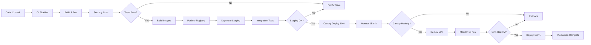
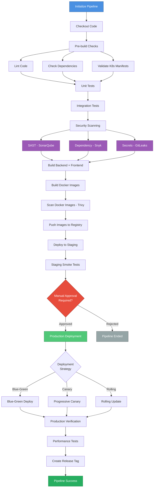
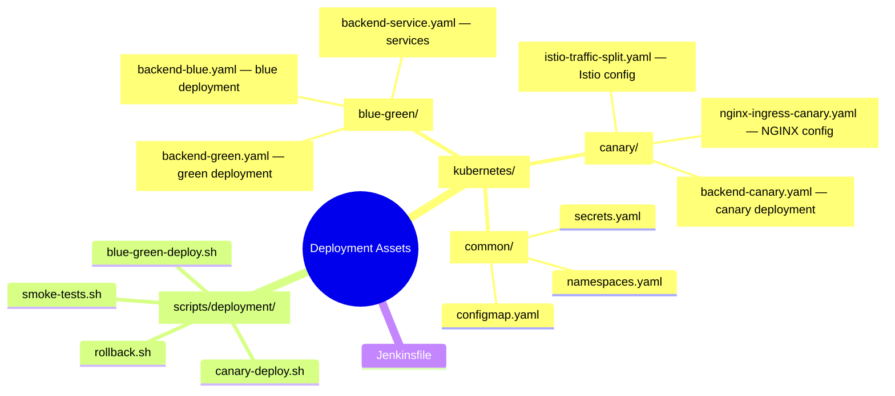

# Moodify Deployment Runbook

Comprehensive deployment procedures, runbooks, and operational guidelines for Moodify production environments.

## Table of Contents

- [Deployment Overview](#deployment-overview)
  - [Deployment Architecture](#deployment-architecture)
  - [Deployment Strategies](#deployment-strategies)
- [Quick Start](#quick-start)
- [Pre-Deployment Checklist](#pre-deployment-checklist)
- [Deployment Procedures](#deployment-procedures)
  - [Blue-Green Deployment](#blue-green-deployment)
  - [Canary Deployment](#canary-deployment)
  - [Automated CI/CD Pipeline](#automated-cicd-pipeline)
- [Rollback Procedures](#rollback-procedures)
- [Incident Response](#incident-response)
- [Operational Runbooks](#operational-runbooks)
- [Monitoring and Alerting](#monitoring-and-alerting)
- [Infrastructure Components](#infrastructure-components)

## Deployment Overview

### Deployment Architecture

Moodify employs a production-ready, cloud-native deployment architecture with multiple deployment strategies and comprehensive automation:

**Key Features:**
- 🔵🟢 **Blue-Green Deployment**: Instant traffic switching with zero downtime
- 🐤 **Canary Deployment**: Progressive rollout with traffic-based validation
- 🔄 **Automated CI/CD**: Comprehensive Jenkins pipeline with quality gates
- 🛡️ **Security**: Multi-layer security scanning (SAST, DAST, container scanning)
- 📊 **Monitoring**: Real-time metrics, health checks, and automated alerting
- 🔙 **Automated Rollback**: Instant rollback capabilities on failure detection
- ☸️ **Kubernetes**: Container orchestration with auto-scaling
- 🔀 **Traffic Management**: Istio service mesh with advanced routing

### Deployment Strategies

Moodify supports three deployment strategies:

#### 1. Blue-Green Deployment (Recommended)

**Use Case**: Major releases, critical updates

**Benefits:**
- Instant rollback capability
- Zero downtime
- Full environment validation before traffic switch
- Easy A/B testing

**How it works:**
1. Deploy new version to inactive environment (Green)
2. Run comprehensive tests on Green
3. Switch traffic from Blue to Green
4. Keep Blue as instant rollback option

**Script:** `./scripts/deployment/blue-green-deploy.sh`

#### 2. Canary Deployment (Progressive Rollout)

**Use Case**: Gradual rollouts, risk mitigation, feature flags

**Benefits:**
- Progressive traffic increase (10% → 25% → 50% → 100%)
- Early issue detection with minimal user impact
- Automated rollback on error threshold breach
- Real-time monitoring at each stage

**How it works:**
1. Deploy canary version alongside stable
2. Route 10% traffic to canary
3. Monitor metrics for 5 minutes
4. Progressively increase traffic if healthy
5. Promote to 100% or rollback on issues

**Script:** `./scripts/deployment/canary-deploy.sh`

#### 3. Rolling Deployment

**Use Case**: Minor updates, patches

**Benefits:**
- Simple and straightforward
- Gradual pod replacement
- Built into Kubernetes

**Recommended for:** Non-critical updates, configuration changes

### Deployment Strategy

Moodify uses **Blue-Green Deployment** as the primary strategy with **Canary Releases** available for high-risk changes.



### Deployment Environments

| Environment | Purpose | Update Frequency | Approval Required |
|-------------|---------|------------------|-------------------|
| **Development** | Feature development | On every commit | No |
| **Staging** | Pre-production testing | Daily | Team Lead |
| **Production** | Live system | Weekly (Tue 10 AM EST) | CTO + DevOps Lead |

### Deployment Windows

**Preferred Deployment Times:**
- **Staging**: Anytime during business hours
- **Production**: Tuesday-Thursday, 10:00 AM - 2:00 PM EST
- **Emergency**: Anytime with on-call approval

**Blackout Periods:**
- Major holidays
- Black Friday / Cyber Monday
- Last week of quarter
- During active incidents

## Quick Start

### Deploy to Staging

```bash
# Using CI/CD pipeline (recommended)
# Trigger Jenkins pipeline with DEPLOY_ENVIRONMENT=staging

# Manual deployment
export IMAGE_TAG=v1.2.3
export IMAGE_REGISTRY=your-registry.azurecr.io
export NAMESPACE=moodify-staging

./scripts/deployment/blue-green-deploy.sh \
    -e staging \
    -v $IMAGE_TAG \
    -r $IMAGE_REGISTRY
```

### Deploy to Production (Blue-Green)

```bash
# Using automation script
./scripts/deployment/blue-green-deploy.sh \
    -e production \
    -v v1.2.3 \
    -r your-registry.azurecr.io

# Or trigger via Jenkins pipeline
# Set DEPLOY_ENVIRONMENT=production and DEPLOY_STRATEGY=blue-green
```

### Deploy to Production (Canary)

```bash
# Progressive canary rollout
./scripts/deployment/canary-deploy.sh \
    -v v1.2.3 \
    -r your-registry.azurecr.io \
    -s progressive \
    -m 300

# Quick canary (shorter monitoring)
./scripts/deployment/canary-deploy.sh \
    -v v1.2.3 \
    -s progressive \
    -m 180
```

### Emergency Rollback

```bash
# Rollback blue-green deployment
./scripts/deployment/rollback.sh -t blue-green -f

# Rollback canary deployment
./scripts/deployment/rollback.sh -t canary -f

# Rollback to specific version
./scripts/deployment/rollback.sh -t version -v v1.2.2 -f
```

## Pre-Deployment Checklist

### 1. Code Quality

- [ ] All tests passing (unit, integration, e2e)
- [ ] Code review completed and approved
- [ ] Security scan passed (Snyk, SonarQube)
- [ ] No critical or high vulnerabilities
- [ ] Documentation updated
- [ ] CHANGELOG.md updated

### 2. Infrastructure

- [ ] Terraform plan reviewed
- [ ] No breaking changes in dependencies
- [ ] Database migrations tested
- [ ] Redis cache warmed
- [ ] SSL certificates valid (>30 days)
- [ ] DNS TTL reduced (if DNS changes)

### 3. Monitoring

- [ ] Monitoring dashboards verified
- [ ] Alerts configured
- [ ] Runbooks updated
- [ ] On-call engineer identified
- [ ] Incident response team notified

### 4. Communication

- [ ] Deployment scheduled in calendar
- [ ] Stakeholders notified
- [ ] Status page message prepared
- [ ] Rollback plan documented
- [ ] Customer support team briefed

### 5. Backup

- [ ] Database backup completed
- [ ] Redis snapshot created
- [ ] Previous deployment artifacts saved
- [ ] Configuration backed up
- [ ] Rollback tested in staging

## Deployment Procedures

### Blue-Green Deployment

Blue-Green deployment provides instant traffic switching with zero downtime by maintaining two identical production environments.

#### Prerequisites

```bash
# Verify kubectl access
kubectl cluster-info
kubectl get nodes

# Verify namespace exists
kubectl get namespace moodify-production

# Verify current environment
kubectl get service backend-service -n moodify-production \
    -o jsonpath='{.spec.selector.environment}'
```

#### Automated Blue-Green Deployment

The recommended approach is using the automation script:

```bash
./scripts/deployment/blue-green-deploy.sh \
    -e production \
    -v v1.2.3 \
    -r your-registry.azurecr.io
```

**Script Features:**
- ✅ Automatic environment detection (blue/green)
- ✅ Health checks and smoke tests
- ✅ Automated traffic switching
- ✅ Rollout verification
- ✅ Detailed logging and reporting

#### Manual Blue-Green Deployment

For advanced use cases or troubleshooting:

##### Step 1: Identify Current Environment

```bash
# Get active environment
ACTIVE_ENV=$(kubectl get service backend-service -n moodify-production \
    -o jsonpath='{.spec.selector.environment}')

echo "Active environment: $ACTIVE_ENV"

# Determine target environment
if [ "$ACTIVE_ENV" = "blue" ]; then
    TARGET_ENV="green"
else
    TARGET_ENV="blue"
fi

echo "Deploying to: $TARGET_ENV"
```

##### Step 2: Deploy to Inactive Environment

```bash
# Set variables
export IMAGE_TAG=v1.2.3
export IMAGE_REGISTRY=your-registry.azurecr.io
export NAMESPACE=moodify-production

# Apply deployment
envsubst < kubernetes/blue-green/backend-$TARGET_ENV.yaml | \
    kubectl apply -f - -n $NAMESPACE

# Wait for rollout
kubectl rollout status deployment/backend-$TARGET_ENV -n $NAMESPACE --timeout=10m
```

##### Step 3: Verify New Environment

```bash
# Check pod status
kubectl get pods -n $NAMESPACE -l environment=$TARGET_ENV

# Check pod logs
kubectl logs -f deployment/backend-$TARGET_ENV -n $NAMESPACE

# Run health checks
kubectl exec deployment/backend-$TARGET_ENV -n $NAMESPACE -- \
    wget -q -O- http://localhost:8000/health/ready

# Run smoke tests
./scripts/deployment/smoke-tests.sh production
```

##### Step 4: Switch Traffic

```bash
# Switch service selector to new environment
kubectl patch service backend-service -n $NAMESPACE \
    -p "{\"spec\":{\"selector\":{\"environment\":\"$TARGET_ENV\"}}}"

# Verify switch
kubectl get service backend-service -n $NAMESPACE \
    -o jsonpath='{.spec.selector.environment}'
```

##### Step 5: Monitor and Validate

```bash
# Watch pod metrics
kubectl top pods -n $NAMESPACE -l environment=$TARGET_ENV

# Check service endpoints
kubectl get endpoints backend-service -n $NAMESPACE

# Monitor logs
kubectl logs -f deployment/backend-$TARGET_ENV -n $NAMESPACE --tail=100

# Run post-deployment validation
./scripts/deployment/smoke-tests.sh production
```

### Canary Deployment

Canary deployment enables progressive rollout with traffic-based validation and automatic rollback.

#### Automated Canary Deployment (Recommended)

```bash
# Progressive canary with default settings (10% → 25% → 50% → 100%)
./scripts/deployment/canary-deploy.sh \
    -v v1.2.3 \
    -r your-registry.azurecr.io \
    -s progressive \
    -m 300  # Monitor for 5 minutes at each stage

# Immediate canary (direct to 100% after validation)
./scripts/deployment/canary-deploy.sh \
    -v v1.2.3 \
    -s immediate
```

**Script Features:**
- ✅ Progressive traffic increase (10% → 25% → 50% → 100%)
- ✅ Automated monitoring at each stage
- ✅ Error rate threshold checking
- ✅ Automatic rollback on failures
- ✅ Health check validation

#### Manual Canary Deployment

##### Step 1: Deploy Canary

```bash
export IMAGE_TAG=v1.2.3-canary
export IMAGE_REGISTRY=your-registry.azurecr.io
export NAMESPACE=moodify-production

# Deploy canary
envsubst < kubernetes/canary/backend-canary.yaml | kubectl apply -f -

# Wait for canary to be ready
kubectl rollout status deployment/backend-canary -n $NAMESPACE
```

##### Step 2: Configure Traffic Splitting

**Option A: Using Istio**

```bash
# Set 10% traffic to canary
kubectl patch virtualservice backend-vs -n $NAMESPACE --type='json' \
    -p='[
        {"op": "replace", "path": "/spec/http/1/route/0/weight", "value": 90},
        {"op": "replace", "path": "/spec/http/1/route/1/weight", "value": 10}
    ]'
```

**Option B: Using NGINX Ingress**

```bash
# Set canary weight to 10%
kubectl annotate ingress backend-ingress-canary -n $NAMESPACE \
    nginx.ingress.kubernetes.io/canary-weight="10" \
    --overwrite
```

##### Step 3: Monitor Canary

```bash
# Watch canary pods
watch -n 5 'kubectl get pods -n moodify-production -l version=canary'

# Monitor metrics
kubectl top pods -n $NAMESPACE -l version=canary

# Check logs
kubectl logs -f deployment/backend-canary -n $NAMESPACE

# Monitor error rates (example using metrics endpoint)
kubectl exec deployment/backend-canary -n $NAMESPACE -- \
    wget -q -O- http://localhost:8000/metrics | grep error_rate
```

##### Step 4: Increase Traffic Progressively

```bash
# Increase to 25%
kubectl patch virtualservice backend-vs -n $NAMESPACE --type='json' \
    -p='[
        {"op": "replace", "path": "/spec/http/1/route/0/weight", "value": 75},
        {"op": "replace", "path": "/spec/http/1/route/1/weight", "value": 25}
    ]'

# Monitor for 5 minutes, then increase to 50%
kubectl patch virtualservice backend-vs -n $NAMESPACE --type='json' \
    -p='[
        {"op": "replace", "path": "/spec/http/1/route/0/weight", "value": 50},
        {"op": "replace", "path": "/spec/http/1/route/1/weight", "value": 50}
    ]'

# Monitor for 5 minutes, then increase to 100%
kubectl patch virtualservice backend-vs -n $NAMESPACE --type='json' \
    -p='[
        {"op": "replace", "path": "/spec/http/1/route/0/weight", "value": 0},
        {"op": "replace", "path": "/spec/http/1/route/1/weight", "value": 100}
    ]'
```

##### Step 5: Promote Canary to Stable

```bash
# Get canary image
CANARY_IMAGE=$(kubectl get deployment backend-canary -n $NAMESPACE \
    -o jsonpath='{.spec.template.spec.containers[0].image}')

# Determine active environment
ACTIVE_ENV=$(kubectl get service backend-service -n $NAMESPACE \
    -o jsonpath='{.spec.selector.environment}')

# Update stable deployment with canary image
kubectl set image deployment/backend-$ACTIVE_ENV \
    backend=$CANARY_IMAGE \
    -n $NAMESPACE \
    --record

# Wait for rollout
kubectl rollout status deployment/backend-$ACTIVE_ENV -n $NAMESPACE

# Scale down canary
kubectl scale deployment backend-canary -n $NAMESPACE --replicas=0
```

### Automated CI/CD Pipeline

The Jenkins pipeline provides end-to-end automation for the entire deployment lifecycle.

#### Pipeline Features

- **Build & Test**: Automated building, unit tests, integration tests
- **Security**: SAST, DAST, dependency scanning, secret detection, container scanning
- **Quality Gates**: Code coverage, SonarQube analysis
- **Multi-Environment**: Automatic staging deployment, manual production approval
- **Flexible Strategies**: Support for blue-green, canary, and rolling deployments
- **Monitoring**: Integrated smoke tests, health checks, performance tests
- **Notifications**: Slack notifications for all pipeline events
- **Rollback**: Automatic rollback on deployment failure

#### Triggering Deployments via Jenkins

**1. Via Jenkins UI:**
- Navigate to Moodify pipeline
- Click "Build with Parameters"
- Select deployment options:
  - `DEPLOY_ENVIRONMENT`: staging/production
  - `DEPLOY_STRATEGY`: blue-green/canary/rolling
  - `RUN_SECURITY_SCAN`: true/false
- Click "Build"

**2. Via Jenkins API:**

```bash
# Trigger build with parameters
curl -X POST "https://jenkins.moodify.com/job/moodify-pipeline/buildWithParameters" \
    -u "username:api-token" \
    --data-urlencode "DEPLOY_ENVIRONMENT=production" \
    --data-urlencode "DEPLOY_STRATEGY=blue-green"
```

**3. Automated Triggers:**

- **On Commit**: Automatic build and staging deployment for `develop` branch
- **On PR**: Build and test (no deployment)
- **On Merge to Master**: Build, test, and await production approval

#### Pipeline Stages



### Standard Deployment (Legacy Reference)

#### Phase 1: Preparation (T-30 minutes)

```bash
# 1. Verify current state
kubectl get deployments -n moodify-production
kubectl get pods -n moodify-production -o wide

# 2. Check resource utilization
kubectl top nodes
kubectl top pods -n moodify-production

# 3. Create backup
./scripts/backup.sh production

# 4. Update status page
curl -X POST https://status.moodify.com/api/incidents \
  -H "Authorization: Bearer $STATUS_TOKEN" \
  -d '{"status": "investigating", "message": "Planned deployment in progress"}'
```

#### Phase 2: Deploy to Staging (T-15 minutes)

```bash
# 1. Set environment
export ENVIRONMENT=staging
export IMAGE_TAG=v1.2.3

# 2. Deploy to staging
cd kubernetes/staging
kubectl apply -f .

# 3. Wait for pods to be ready
kubectl rollout status deployment/backend-deployment -n moodify-staging
kubectl rollout status deployment/frontend-deployment -n moodify-staging

# 4. Run smoke tests
./scripts/smoke-tests.sh staging

# 5. Verify staging
curl -f https://staging.moodify.com/health || exit 1
```

#### Phase 3: Canary Deployment (T-0 minutes)

```bash
# 1. Deploy canary (10% traffic)
kubectl apply -f kubernetes/production/canary/

# 2. Monitor for 15 minutes
watch -n 5 'kubectl get pods -n moodify-production | grep canary'

# 3. Check metrics
kubectl top pods -n moodify-production -l version=canary

# 4. Verify error rates
curl https://api.moodify.com/metrics/error-rate

# 5. If healthy, proceed to 50%
kubectl patch service backend-service -n moodify-production \
  -p '{"spec":{"selector":{"version":"canary"}}}'

# 6. Monitor for 15 minutes

# 7. Deploy 100%
kubectl set image deployment/backend-deployment \
  backend=$IMAGE_REGISTRY/backend:$IMAGE_TAG \
  -n moodify-production

kubectl set image deployment/frontend-deployment \
  frontend=$IMAGE_REGISTRY/frontend:$IMAGE_TAG \
  -n moodify-production
```

#### Phase 4: Verification (T+15 minutes)

```bash
# 1. Check deployment status
kubectl rollout status deployment/backend-deployment -n moodify-production
kubectl rollout status deployment/frontend-deployment -n moodify-production

# 2. Verify all pods running
kubectl get pods -n moodify-production

# 3. Run post-deployment tests
./scripts/post-deploy-tests.sh production

# 4. Check error rates
curl https://api.moodify.com/metrics | jq '.error_rate'

# 5. Verify key endpoints
curl -f https://api.moodify.com/health
curl -f https://api.moodify.com/users/login -X POST -d '{}'

# 6. Check database connections
kubectl exec -it deployment/backend-deployment -n moodify-production -- \
  python manage.py dbshell -c "SELECT 1;"
```

#### Phase 5: Completion (T+30 minutes)

```bash
# 1. Update status page
curl -X PATCH https://status.moodify.com/api/incidents/$INCIDENT_ID \
  -H "Authorization: Bearer $STATUS_TOKEN" \
  -d '{"status": "resolved", "message": "Deployment completed successfully"}'

# 2. Notify team
./scripts/notify-team.sh "Production deployment v$IMAGE_TAG completed successfully"

# 3. Update documentation
git tag -a v$IMAGE_TAG -m "Production release $IMAGE_TAG"
git push origin v$IMAGE_TAG

# 4. Monitor for 2 hours
# Check metrics dashboard every 15 minutes
```

### Hotfix Deployment (Emergency)

```bash
# 1. Create hotfix branch
git checkout -b hotfix/critical-bug main

# 2. Implement fix and test locally

# 3. Fast-track CI/CD
git commit -m "hotfix: critical bug fix"
git push origin hotfix/critical-bug

# 4. Emergency approval via Slack
# Get approval from CTO or on-call lead

# 5. Deploy directly to production (skip canary)
kubectl set image deployment/backend-deployment \
  backend=$IMAGE_REGISTRY/backend:hotfix-$BUILD_ID \
  -n moodify-production \
  --record

# 6. Monitor closely for 1 hour

# 7. Create post-mortem document
./scripts/create-postmortem.sh "Critical bug hotfix"
```

## Rollback Procedures

### Automatic Rollback Triggers

- Error rate > 5%
- Response time P95 > 5s
- Pod crash loop detected
- Health check failures > 50%

### Manual Rollback

#### Option 1: Kubernetes Rollback (Fastest)

```bash
# 1. Check deployment history
kubectl rollout history deployment/backend-deployment -n moodify-production

# 2. Rollback to previous version
kubectl rollout undo deployment/backend-deployment -n moodify-production
kubectl rollout undo deployment/frontend-deployment -n moodify-production

# 3. Verify rollback
kubectl rollout status deployment/backend-deployment -n moodify-production

# 4. Verify functionality
./scripts/smoke-tests.sh production
```

#### Option 2: Redeploy Previous Version

```bash
# 1. Get previous version
PREVIOUS_VERSION=$(git describe --tags --abbrev=0 HEAD^)

# 2. Deploy previous version
kubectl set image deployment/backend-deployment \
  backend=$IMAGE_REGISTRY/backend:$PREVIOUS_VERSION \
  -n moodify-production

# 3. Verify
kubectl get pods -n moodify-production
```

#### Option 3: Database Rollback (If needed)

```bash
# 1. Stop application
kubectl scale deployment --all --replicas=0 -n moodify-production

# 2. Restore database from backup
# AWS DocumentDB
aws docdb restore-db-cluster-from-snapshot \
  --db-cluster-identifier moodify-production-restored \
  --snapshot-identifier $SNAPSHOT_ID

# GCP Firestore
gcloud firestore import gs://moodify-backups/$BACKUP_ID

# 3. Update database connection strings

# 4. Restart application
kubectl scale deployment --all --replicas=3 -n moodify-production
```

### Post-Rollback Actions

1. **Immediate**: Notify stakeholders
2. **Within 1 hour**: Create incident report
3. **Within 24 hours**: Root cause analysis
4. **Within 1 week**: Post-mortem meeting

## Incident Response

### Severity Levels

| Level | Description | Response Time | Example |
|-------|-------------|---------------|---------|
| **P0** | Complete outage | 15 minutes | Site down |
| **P1** | Major degradation | 30 minutes | API errors >10% |
| **P2** | Minor issues | 2 hours | Slow response times |
| **P3** | Non-critical | Next business day | UI glitch |

### P0 Incident Response

```bash
# 1. Acknowledge incident (within 5 minutes)
./scripts/acknowledge-incident.sh $INCIDENT_ID

# 2. Assess impact
kubectl get pods --all-namespaces
kubectl top nodes

# 3. Check recent changes
kubectl rollout history deployment --all-namespaces

# 4. Quick diagnosis
kubectl logs -f deployment/backend-deployment -n moodify-production --tail=100
kubectl describe pod $POD_NAME -n moodify-production

# 5. Immediate mitigation
# Option A: Rollback
kubectl rollout undo deployment/backend-deployment -n moodify-production

# Option B: Scale up
kubectl scale deployment backend-deployment --replicas=10 -n moodify-production

# Option C: Disable feature
kubectl set env deployment/backend-deployment FEATURE_FLAG=false

# 6. Communicate
./scripts/update-status-page.sh "Investigating service disruption"

# 7. Monitor recovery
watch -n 5 'kubectl get pods -n moodify-production'

# 8. Verify resolution
./scripts/smoke-tests.sh production
```

## Operational Runbooks

### Runbook: High CPU Usage

**Symptoms**: CPU usage > 80% for 5+ minutes

**Steps**:

```bash
# 1. Identify high CPU pods
kubectl top pods -n moodify-production --sort-by=cpu

# 2. Check pod logs
kubectl logs $HIGH_CPU_POD -n moodify-production --tail=100

# 3. Describe pod
kubectl describe pod $HIGH_CPU_POD -n moodify-production

# 4. Scale horizontally
kubectl scale deployment/$DEPLOYMENT --replicas=5 -n moodify-production

# 5. Monitor
watch -n 5 'kubectl top pods -n moodify-production'

# 6. If persistent, restart pod
kubectl delete pod $HIGH_CPU_POD -n moodify-production
```

### Runbook: High Memory Usage

**Symptoms**: Memory usage > 85% for 5+ minutes

**Steps**:

```bash
# 1. Check memory usage
kubectl top pods -n moodify-production --sort-by=memory

# 2. Check for memory leaks
kubectl exec -it $POD_NAME -n moodify-production -- \
  python -c "import psutil; print(psutil.virtual_memory())"

# 3. Increase memory limits (if appropriate)
kubectl set resources deployment/$DEPLOYMENT \
  --limits=memory=4Gi \
  -n moodify-production

# 4. Restart pods with high memory
kubectl delete pod $HIGH_MEMORY_POD -n moodify-production
```

### Runbook: Database Connection Issues

**Symptoms**: Database connection errors in logs

**Steps**:

```bash
# 1. Test database connectivity
kubectl run -it --rm debug \
  --image=postgres:15 \
  --restart=Never \
  -- psql -h $DB_HOST -U $DB_USER -d $DB_NAME -c "SELECT 1;"

# 2. Check connection pool
kubectl exec -it deployment/backend-deployment -n moodify-production -- \
  python manage.py dbshell -c "SELECT count(*) FROM pg_stat_activity;"

# 3. Verify database status (AWS)
aws docdb describe-db-clusters --db-cluster-identifier moodify-production

# 4. Check for long-running queries
kubectl exec -it deployment/backend-deployment -n moodify-production -- \
  python manage.py dbshell -c "SELECT pid, now() - query_start, query FROM pg_stat_activity WHERE state != 'idle';"

# 5. Restart application pods
kubectl rollout restart deployment/backend-deployment -n moodify-production
```

### Runbook: Redis Cache Issues

**Symptoms**: High cache miss rate or connection timeouts

**Steps**:

```bash
# 1. Check Redis status
redis-cli -h $REDIS_HOST -p $REDIS_PORT ping

# 2. Check memory usage
redis-cli -h $REDIS_HOST -p $REDIS_PORT INFO memory

# 3. Check connected clients
redis-cli -h $REDIS_HOST -p $REDIS_PORT CLIENT LIST

# 4. Clear cache if needed (careful!)
redis-cli -h $REDIS_HOST -p $REDIS_PORT FLUSHDB

# 5. Restart Redis (AWS ElastiCache)
aws elasticache reboot-cache-cluster \
  --cache-cluster-id moodify-production-redis \
  --cache-node-ids-to-reboot 0001 0002 0003
```

## Monitoring and Alerting

### Critical Metrics

| Metric | Warning | Critical | Action |
|--------|---------|----------|--------|
| Error Rate | >1% | >5% | Investigate immediately |
| Response Time (P95) | >2s | >5s | Check application logs |
| CPU Usage | >70% | >85% | Scale or optimize |
| Memory Usage | >80% | >90% | Scale or investigate leak |
| Pod Restarts | >5/hour | >10/hour | Check logs |
| Database Connections | >80% | >95% | Increase pool or scale |

### Alert Response Times

- **P0 (Critical)**: 15 minutes
- **P1 (High)**: 30 minutes
- **P2 (Medium)**: 2 hours
- **P3 (Low)**: Next business day

## Infrastructure Components

### Kubernetes Resources

#### Deployments
- **backend-blue**: Blue environment deployment (stable)
- **backend-green**: Green environment deployment (candidate)
- **backend-canary**: Canary deployment for progressive rollout

#### Services
- **backend-service**: Main service (routes to active environment)
- **backend-blue-service**: Direct access to blue environment
- **backend-green-service**: Direct access to green environment
- **backend-canary-service**: Direct access to canary deployment

#### Auto-scaling
- **HorizontalPodAutoscaler**: Auto-scales based on CPU, memory, and custom metrics
  - Min replicas: 3
  - Max replicas: 15
  - Target CPU: 70%
  - Target Memory: 80%

#### Traffic Management

**Istio (Recommended):**
- VirtualService for traffic splitting
- DestinationRule for load balancing and circuit breaking
- Gateway for external traffic
- ServiceEntry for external dependencies
- PeerAuthentication for mTLS

**NGINX Ingress (Alternative):**
- Main ingress for stable traffic
- Canary ingress with weight-based routing
- Test ingresses for blue/green/canary environments

### Deployment Scripts

| Script | Purpose | Usage |
|--------|---------|-------|
| `blue-green-deploy.sh` | Blue-green deployment | `./blue-green-deploy.sh -e production -v v1.2.3` |
| `canary-deploy.sh` | Canary deployment | `./canary-deploy.sh -v v1.2.3 -s progressive` |
| `rollback.sh` | Rollback operations | `./rollback.sh -t blue-green -f` |
| `smoke-tests.sh` | Post-deployment tests | `./smoke-tests.sh production` |

### Jenkins Pipeline

**Configuration File**: `Jenkinsfile`

**Credentials Required**:
- `docker-registry-url`: Docker registry URL
- `docker-registry-credentials`: Registry credentials
- `kubeconfig-production`: Kubernetes config
- `sonarqube-url`: SonarQube server
- `snyk-token`: Snyk API token
- `slack-webhook`: Slack webhook URL

### Monitoring & Observability

**Health Check Endpoints**:
- `/health/live`: Liveness probe
- `/health/ready`: Readiness probe
- `/health/startup`: Startup probe
- `/metrics`: Prometheus metrics

**Logging**:
- Fluent Bit sidecar for log shipping
- Centralized logging to cloud provider

**Metrics**:
- Prometheus for metrics collection
- Grafana for visualization
- Custom metrics for business KPIs

### Security

**Container Security**:
- Non-root user (UID 1000)
- Read-only root filesystem
- Dropped all capabilities
- No privilege escalation

**Network Security**:
- Istio mTLS for service-to-service communication
- Network policies for pod-to-pod communication
- TLS termination at ingress

**Scanning**:
- Snyk for dependency scanning
- Trivy for container image scanning
- SonarQube for code quality and security
- GitLeaks for secret detection

### Directory Structure



---

**Document Version**: 2.0
**Last Updated**: 2025-11-26
**Maintained by**: DevOps Team
**Changes in v2.0**:
- Added blue-green deployment infrastructure
- Added canary deployment with progressive rollout
- Enhanced Jenkinsfile with comprehensive CI/CD
- Added automated deployment scripts
- Added smoke testing framework
- Enhanced security scanning
- Added Istio/NGINX traffic management
- Comprehensive rollback procedures
