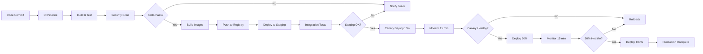

# Moodify Deployment Runbook

Comprehensive deployment procedures, runbooks, and operational guidelines for Moodify production environments.

## Table of Contents

- [Deployment Overview](#deployment-overview)
- [Pre-Deployment Checklist](#pre-deployment-checklist)
- [Deployment Procedures](#deployment-procedures)
- [Rollback Procedures](#rollback-procedures)
- [Incident Response](#incident-response)
- [Operational Runbooks](#operational-runbooks)
- [Monitoring and Alerting](#monitoring-and-alerting)

## Deployment Overview

### Deployment Strategy

Moodify uses **Blue-Green Deployment** with **Canary Releases** for zero-downtime deployments.



### Deployment Environments

| Environment | Purpose | Update Frequency | Approval Required |
|-------------|---------|------------------|-------------------|
| **Development** | Feature development | On every commit | No |
| **Staging** | Pre-production testing | Daily | Team Lead |
| **Production** | Live system | Weekly (Tue 10 AM EST) | CTO + DevOps Lead |

### Deployment Windows

**Preferred Deployment Times:**
- **Staging**: Anytime during business hours
- **Production**: Tuesday-Thursday, 10:00 AM - 2:00 PM EST
- **Emergency**: Anytime with on-call approval

**Blackout Periods:**
- Major holidays
- Black Friday / Cyber Monday
- Last week of quarter
- During active incidents

## Pre-Deployment Checklist

### 1. Code Quality

- [ ] All tests passing (unit, integration, e2e)
- [ ] Code review completed and approved
- [ ] Security scan passed (Snyk, SonarQube)
- [ ] No critical or high vulnerabilities
- [ ] Documentation updated
- [ ] CHANGELOG.md updated

### 2. Infrastructure

- [ ] Terraform plan reviewed
- [ ] No breaking changes in dependencies
- [ ] Database migrations tested
- [ ] Redis cache warmed
- [ ] SSL certificates valid (>30 days)
- [ ] DNS TTL reduced (if DNS changes)

### 3. Monitoring

- [ ] Monitoring dashboards verified
- [ ] Alerts configured
- [ ] Runbooks updated
- [ ] On-call engineer identified
- [ ] Incident response team notified

### 4. Communication

- [ ] Deployment scheduled in calendar
- [ ] Stakeholders notified
- [ ] Status page message prepared
- [ ] Rollback plan documented
- [ ] Customer support team briefed

### 5. Backup

- [ ] Database backup completed
- [ ] Redis snapshot created
- [ ] Previous deployment artifacts saved
- [ ] Configuration backed up
- [ ] Rollback tested in staging

## Deployment Procedures

### Standard Deployment (Blue-Green with Canary)

#### Phase 1: Preparation (T-30 minutes)

```bash
# 1. Verify current state
kubectl get deployments -n moodify-production
kubectl get pods -n moodify-production -o wide

# 2. Check resource utilization
kubectl top nodes
kubectl top pods -n moodify-production

# 3. Create backup
./scripts/backup.sh production

# 4. Update status page
curl -X POST https://status.moodify.com/api/incidents \
  -H "Authorization: Bearer $STATUS_TOKEN" \
  -d '{"status": "investigating", "message": "Planned deployment in progress"}'
```

#### Phase 2: Deploy to Staging (T-15 minutes)

```bash
# 1. Set environment
export ENVIRONMENT=staging
export IMAGE_TAG=v1.2.3

# 2. Deploy to staging
cd kubernetes/staging
kubectl apply -f .

# 3. Wait for pods to be ready
kubectl rollout status deployment/backend-deployment -n moodify-staging
kubectl rollout status deployment/frontend-deployment -n moodify-staging

# 4. Run smoke tests
./scripts/smoke-tests.sh staging

# 5. Verify staging
curl -f https://staging.moodify.com/health || exit 1
```

#### Phase 3: Canary Deployment (T-0 minutes)

```bash
# 1. Deploy canary (10% traffic)
kubectl apply -f kubernetes/production/canary/

# 2. Monitor for 15 minutes
watch -n 5 'kubectl get pods -n moodify-production | grep canary'

# 3. Check metrics
kubectl top pods -n moodify-production -l version=canary

# 4. Verify error rates
curl https://api.moodify.com/metrics/error-rate

# 5. If healthy, proceed to 50%
kubectl patch service backend-service -n moodify-production \
  -p '{"spec":{"selector":{"version":"canary"}}}'

# 6. Monitor for 15 minutes

# 7. Deploy 100%
kubectl set image deployment/backend-deployment \
  backend=$IMAGE_REGISTRY/backend:$IMAGE_TAG \
  -n moodify-production

kubectl set image deployment/frontend-deployment \
  frontend=$IMAGE_REGISTRY/frontend:$IMAGE_TAG \
  -n moodify-production
```

#### Phase 4: Verification (T+15 minutes)

```bash
# 1. Check deployment status
kubectl rollout status deployment/backend-deployment -n moodify-production
kubectl rollout status deployment/frontend-deployment -n moodify-production

# 2. Verify all pods running
kubectl get pods -n moodify-production

# 3. Run post-deployment tests
./scripts/post-deploy-tests.sh production

# 4. Check error rates
curl https://api.moodify.com/metrics | jq '.error_rate'

# 5. Verify key endpoints
curl -f https://api.moodify.com/health
curl -f https://api.moodify.com/users/login -X POST -d '{}'

# 6. Check database connections
kubectl exec -it deployment/backend-deployment -n moodify-production -- \
  python manage.py dbshell -c "SELECT 1;"
```

#### Phase 5: Completion (T+30 minutes)

```bash
# 1. Update status page
curl -X PATCH https://status.moodify.com/api/incidents/$INCIDENT_ID \
  -H "Authorization: Bearer $STATUS_TOKEN" \
  -d '{"status": "resolved", "message": "Deployment completed successfully"}'

# 2. Notify team
./scripts/notify-team.sh "Production deployment v$IMAGE_TAG completed successfully"

# 3. Update documentation
git tag -a v$IMAGE_TAG -m "Production release $IMAGE_TAG"
git push origin v$IMAGE_TAG

# 4. Monitor for 2 hours
# Check metrics dashboard every 15 minutes
```

### Hotfix Deployment (Emergency)

```bash
# 1. Create hotfix branch
git checkout -b hotfix/critical-bug main

# 2. Implement fix and test locally

# 3. Fast-track CI/CD
git commit -m "hotfix: critical bug fix"
git push origin hotfix/critical-bug

# 4. Emergency approval via Slack
# Get approval from CTO or on-call lead

# 5. Deploy directly to production (skip canary)
kubectl set image deployment/backend-deployment \
  backend=$IMAGE_REGISTRY/backend:hotfix-$BUILD_ID \
  -n moodify-production \
  --record

# 6. Monitor closely for 1 hour

# 7. Create post-mortem document
./scripts/create-postmortem.sh "Critical bug hotfix"
```

## Rollback Procedures

### Automatic Rollback Triggers

- Error rate > 5%
- Response time P95 > 5s
- Pod crash loop detected
- Health check failures > 50%

### Manual Rollback

#### Option 1: Kubernetes Rollback (Fastest)

```bash
# 1. Check deployment history
kubectl rollout history deployment/backend-deployment -n moodify-production

# 2. Rollback to previous version
kubectl rollout undo deployment/backend-deployment -n moodify-production
kubectl rollout undo deployment/frontend-deployment -n moodify-production

# 3. Verify rollback
kubectl rollout status deployment/backend-deployment -n moodify-production

# 4. Verify functionality
./scripts/smoke-tests.sh production
```

#### Option 2: Redeploy Previous Version

```bash
# 1. Get previous version
PREVIOUS_VERSION=$(git describe --tags --abbrev=0 HEAD^)

# 2. Deploy previous version
kubectl set image deployment/backend-deployment \
  backend=$IMAGE_REGISTRY/backend:$PREVIOUS_VERSION \
  -n moodify-production

# 3. Verify
kubectl get pods -n moodify-production
```

#### Option 3: Database Rollback (If needed)

```bash
# 1. Stop application
kubectl scale deployment --all --replicas=0 -n moodify-production

# 2. Restore database from backup
# AWS DocumentDB
aws docdb restore-db-cluster-from-snapshot \
  --db-cluster-identifier moodify-production-restored \
  --snapshot-identifier $SNAPSHOT_ID

# GCP Firestore
gcloud firestore import gs://moodify-backups/$BACKUP_ID

# 3. Update database connection strings

# 4. Restart application
kubectl scale deployment --all --replicas=3 -n moodify-production
```

### Post-Rollback Actions

1. **Immediate**: Notify stakeholders
2. **Within 1 hour**: Create incident report
3. **Within 24 hours**: Root cause analysis
4. **Within 1 week**: Post-mortem meeting

## Incident Response

### Severity Levels

| Level | Description | Response Time | Example |
|-------|-------------|---------------|---------|
| **P0** | Complete outage | 15 minutes | Site down |
| **P1** | Major degradation | 30 minutes | API errors >10% |
| **P2** | Minor issues | 2 hours | Slow response times |
| **P3** | Non-critical | Next business day | UI glitch |

### P0 Incident Response

```bash
# 1. Acknowledge incident (within 5 minutes)
./scripts/acknowledge-incident.sh $INCIDENT_ID

# 2. Assess impact
kubectl get pods --all-namespaces
kubectl top nodes

# 3. Check recent changes
kubectl rollout history deployment --all-namespaces

# 4. Quick diagnosis
kubectl logs -f deployment/backend-deployment -n moodify-production --tail=100
kubectl describe pod $POD_NAME -n moodify-production

# 5. Immediate mitigation
# Option A: Rollback
kubectl rollout undo deployment/backend-deployment -n moodify-production

# Option B: Scale up
kubectl scale deployment backend-deployment --replicas=10 -n moodify-production

# Option C: Disable feature
kubectl set env deployment/backend-deployment FEATURE_FLAG=false

# 6. Communicate
./scripts/update-status-page.sh "Investigating service disruption"

# 7. Monitor recovery
watch -n 5 'kubectl get pods -n moodify-production'

# 8. Verify resolution
./scripts/smoke-tests.sh production
```

## Operational Runbooks

### Runbook: High CPU Usage

**Symptoms**: CPU usage > 80% for 5+ minutes

**Steps**:

```bash
# 1. Identify high CPU pods
kubectl top pods -n moodify-production --sort-by=cpu

# 2. Check pod logs
kubectl logs $HIGH_CPU_POD -n moodify-production --tail=100

# 3. Describe pod
kubectl describe pod $HIGH_CPU_POD -n moodify-production

# 4. Scale horizontally
kubectl scale deployment/$DEPLOYMENT --replicas=5 -n moodify-production

# 5. Monitor
watch -n 5 'kubectl top pods -n moodify-production'

# 6. If persistent, restart pod
kubectl delete pod $HIGH_CPU_POD -n moodify-production
```

### Runbook: High Memory Usage

**Symptoms**: Memory usage > 85% for 5+ minutes

**Steps**:

```bash
# 1. Check memory usage
kubectl top pods -n moodify-production --sort-by=memory

# 2. Check for memory leaks
kubectl exec -it $POD_NAME -n moodify-production -- \
  python -c "import psutil; print(psutil.virtual_memory())"

# 3. Increase memory limits (if appropriate)
kubectl set resources deployment/$DEPLOYMENT \
  --limits=memory=4Gi \
  -n moodify-production

# 4. Restart pods with high memory
kubectl delete pod $HIGH_MEMORY_POD -n moodify-production
```

### Runbook: Database Connection Issues

**Symptoms**: Database connection errors in logs

**Steps**:

```bash
# 1. Test database connectivity
kubectl run -it --rm debug \
  --image=postgres:15 \
  --restart=Never \
  -- psql -h $DB_HOST -U $DB_USER -d $DB_NAME -c "SELECT 1;"

# 2. Check connection pool
kubectl exec -it deployment/backend-deployment -n moodify-production -- \
  python manage.py dbshell -c "SELECT count(*) FROM pg_stat_activity;"

# 3. Verify database status (AWS)
aws docdb describe-db-clusters --db-cluster-identifier moodify-production

# 4. Check for long-running queries
kubectl exec -it deployment/backend-deployment -n moodify-production -- \
  python manage.py dbshell -c "SELECT pid, now() - query_start, query FROM pg_stat_activity WHERE state != 'idle';"

# 5. Restart application pods
kubectl rollout restart deployment/backend-deployment -n moodify-production
```

### Runbook: Redis Cache Issues

**Symptoms**: High cache miss rate or connection timeouts

**Steps**:

```bash
# 1. Check Redis status
redis-cli -h $REDIS_HOST -p $REDIS_PORT ping

# 2. Check memory usage
redis-cli -h $REDIS_HOST -p $REDIS_PORT INFO memory

# 3. Check connected clients
redis-cli -h $REDIS_HOST -p $REDIS_PORT CLIENT LIST

# 4. Clear cache if needed (careful!)
redis-cli -h $REDIS_HOST -p $REDIS_PORT FLUSHDB

# 5. Restart Redis (AWS ElastiCache)
aws elasticache reboot-cache-cluster \
  --cache-cluster-id moodify-production-redis \
  --cache-node-ids-to-reboot 0001 0002 0003
```

## Monitoring and Alerting

### Critical Metrics

| Metric | Warning | Critical | Action |
|--------|---------|----------|--------|
| Error Rate | >1% | >5% | Investigate immediately |
| Response Time (P95) | >2s | >5s | Check application logs |
| CPU Usage | >70% | >85% | Scale or optimize |
| Memory Usage | >80% | >90% | Scale or investigate leak |
| Pod Restarts | >5/hour | >10/hour | Check logs |
| Database Connections | >80% | >95% | Increase pool or scale |

### Alert Response Times

- **P0 (Critical)**: 15 minutes
- **P1 (High)**: 30 minutes
- **P2 (Medium)**: 2 hours
- **P3 (Low)**: Next business day

---

**Document Version**: 1.0
**Last Updated**: 2025-10-07
**Maintained by**: Son Nguyen
