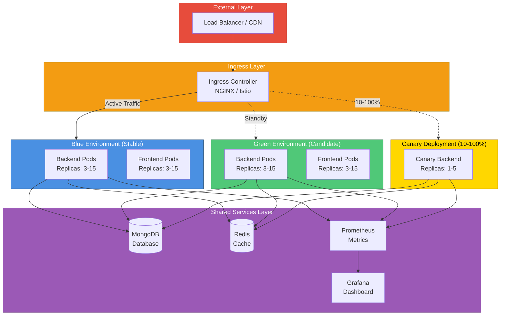

# Moodify Infrastructure Setup Guide

Complete guide for setting up the production-ready deployment infrastructure for Moodify.

## Table of Contents

- [Prerequisites](#prerequisites)
- [Infrastructure Overview](#infrastructure-overview)
- [Initial Setup](#initial-setup)
- [Kubernetes Cluster Setup](#kubernetes-cluster-setup)
- [Configure Blue-Green Deployment](#configure-blue-green-deployment)
- [Configure Canary Deployment](#configure-canary-deployment)
- [Setup Traffic Management](#setup-traffic-management)
- [Configure CI/CD Pipeline](#configure-cicd-pipeline)
- [Setup Monitoring](#setup-monitoring)
- [Security Configuration](#security-configuration)
- [Verification](#verification)
- [Troubleshooting](#troubleshooting)

## Prerequisites

### Required Tools

```bash
# Install kubectl
curl -LO "https://dl.k8s.io/release/$(curl -L -s https://dl.k8s.io/release/stable.txt)/bin/linux/amd64/kubectl"
chmod +x kubectl
sudo mv kubectl /usr/local/bin/

# Install Helm
curl https://raw.githubusercontent.com/helm/helm/main/scripts/get-helm-3 | bash

# Install Istio (optional, for advanced traffic management)
curl -L https://istio.io/downloadIstio | sh -
cd istio-*
export PATH=$PWD/bin:$PATH

# Install envsubst (for variable substitution)
# On macOS
brew install gettext
brew link --force gettext

# On Ubuntu/Debian
sudo apt-get install gettext-base

# Install Docker
# Follow instructions at: https://docs.docker.com/engine/install/
```

### Cloud Provider Account

Choose one:
- AWS (EKS)
- Google Cloud (GKE)
- Azure (AKS)
- DigitalOcean (DOKS)

### Access Requirements

- Kubernetes cluster admin access
- Docker registry (Docker Hub, ECR, GCR, ACR)
- Git repository access
- Jenkins instance (or CI/CD platform)

## Infrastructure Overview

### Architecture Diagram



### Components

| Component | Purpose | Technology |
|-----------|---------|------------|
| Kubernetes Cluster | Container orchestration | EKS/GKE/AKS |
| Load Balancer | External traffic | Cloud LB |
| Ingress Controller | Traffic routing | NGINX/Istio |
| Blue Environment | Active production | K8s Deployment |
| Green Environment | Candidate release | K8s Deployment |
| Canary Deployment | Progressive rollout | K8s Deployment |
| Service Mesh | Traffic management | Istio (optional) |
| Container Registry | Docker images | ECR/GCR/ACR |
| CI/CD | Automation | Jenkins |
| Monitoring | Observability | Prometheus/Grafana |
| Logging | Log aggregation | Fluent Bit/ELK |

## Initial Setup

### 1. Clone Repository

```bash
git clone https://github.com/your-org/moodify.git
cd moodify
```

### 2. Configure Environment Variables

Create `.env` file:

```bash
# Docker Registry
export IMAGE_REGISTRY=your-registry.azurecr.io
export DOCKER_USERNAME=your-username
export DOCKER_PASSWORD=your-password

# Kubernetes
export CLUSTER_NAME=moodify-production
export CLUSTER_REGION=us-east-1

# Application
export NAMESPACE_PRODUCTION=moodify-production
export NAMESPACE_STAGING=moodify-staging
```

Load environment:

```bash
source .env
```

## Kubernetes Cluster Setup

### Option 1: AWS EKS

```bash
# Install eksctl
curl --silent --location "https://github.com/weaveworks/eksctl/releases/latest/download/eksctl_$(uname -s)_amd64.tar.gz" | tar xz -C /tmp
sudo mv /tmp/eksctl /usr/local/bin

# Create cluster
eksctl create cluster \
  --name $CLUSTER_NAME \
  --region $CLUSTER_REGION \
  --nodes 3 \
  --nodes-min 3 \
  --nodes-max 10 \
  --node-type t3.large \
  --with-oidc \
  --managed

# Update kubeconfig
aws eks update-kubeconfig --name $CLUSTER_NAME --region $CLUSTER_REGION
```

### Option 2: Google Cloud GKE

```bash
# Create cluster
gcloud container clusters create $CLUSTER_NAME \
  --num-nodes=3 \
  --machine-type=n1-standard-2 \
  --zone=us-central1-a \
  --enable-autoscaling \
  --min-nodes=3 \
  --max-nodes=10

# Get credentials
gcloud container clusters get-credentials $CLUSTER_NAME --zone=us-central1-a
```

### Option 3: Azure AKS

```bash
# Create resource group
az group create --name moodify-rg --location eastus

# Create cluster
az aks create \
  --resource-group moodify-rg \
  --name $CLUSTER_NAME \
  --node-count 3 \
  --enable-addons monitoring \
  --generate-ssh-keys \
  --vm-set-type VirtualMachineScaleSets \
  --enable-cluster-autoscaler \
  --min-count 3 \
  --max-count 10

# Get credentials
az aks get-credentials --resource-group moodify-rg --name $CLUSTER_NAME
```

### Verify Cluster

```bash
kubectl cluster-info
kubectl get nodes
```

## Configure Blue-Green Deployment

### 1. Create Namespaces

```bash
# Create production namespace
kubectl create namespace $NAMESPACE_PRODUCTION

# Create staging namespace
kubectl create namespace $NAMESPACE_STAGING

# Verify
kubectl get namespaces
```

### 2. Create ConfigMaps and Secrets

```bash
# Create ConfigMap
kubectl create configmap moodify-config \
  -n $NAMESPACE_PRODUCTION \
  --from-literal=NODE_ENV=production \
  --from-literal=LOG_LEVEL=info \
  --from-literal=DB_HOST=documentdb-service \
  --from-literal=REDIS_HOST=redis-service

# Create Secrets
kubectl create secret generic moodify-secrets \
  -n $NAMESPACE_PRODUCTION \
  --from-literal=DB_PASSWORD=your-db-password \
  --from-literal=REDIS_PASSWORD=your-redis-password \
  --from-literal=JWT_SECRET=your-jwt-secret \
  --from-literal=SPOTIFY_CLIENT_SECRET=your-spotify-secret

# Verify
kubectl get configmaps -n $NAMESPACE_PRODUCTION
kubectl get secrets -n $NAMESPACE_PRODUCTION
```

### 3. Create Service Accounts

```bash
# Create service account
kubectl create serviceaccount moodify-backend-sa -n $NAMESPACE_PRODUCTION
kubectl create serviceaccount moodify-frontend-sa -n $NAMESPACE_PRODUCTION

# Verify
kubectl get serviceaccounts -n $NAMESPACE_PRODUCTION
```

### 4. Deploy Blue Environment

```bash
# Set image tag
export IMAGE_TAG=v1.0.0

# Deploy blue environment
envsubst < kubernetes/blue-green/backend-blue.yaml | kubectl apply -f -

# Deploy services
kubectl apply -f kubernetes/blue-green/backend-service.yaml

# Wait for deployment
kubectl rollout status deployment/backend-blue -n $NAMESPACE_PRODUCTION

# Verify
kubectl get deployments -n $NAMESPACE_PRODUCTION
kubectl get pods -n $NAMESPACE_PRODUCTION
kubectl get services -n $NAMESPACE_PRODUCTION
```

### 5. Deploy Green Environment

```bash
# Deploy green environment (initially inactive)
envsubst < kubernetes/blue-green/backend-green.yaml | kubectl apply -f -

# Wait for deployment
kubectl rollout status deployment/backend-green -n $NAMESPACE_PRODUCTION

# Verify both environments
kubectl get deployments -n $NAMESPACE_PRODUCTION
```

## Configure Canary Deployment

### 1. Deploy Canary Infrastructure

```bash
# Deploy canary deployment
export IMAGE_TAG=v1.1.0-canary
envsubst < kubernetes/canary/backend-canary.yaml | kubectl apply -f -

# Wait for deployment
kubectl rollout status deployment/backend-canary -n $NAMESPACE_PRODUCTION
```

### 2. Option A: Setup Istio Traffic Management

```bash
# Install Istio
istioctl install --set profile=production -y

# Enable Istio injection for namespace
kubectl label namespace $NAMESPACE_PRODUCTION istio-injection=enabled

# Restart deployments to inject sidecar
kubectl rollout restart deployment -n $NAMESPACE_PRODUCTION

# Apply Istio configuration
kubectl apply -f kubernetes/canary/istio-traffic-split.yaml

# Verify
kubectl get virtualservices -n $NAMESPACE_PRODUCTION
kubectl get destinationrules -n $NAMESPACE_PRODUCTION
kubectl get gateways -n $NAMESPACE_PRODUCTION
```

### 2. Option B: Setup NGINX Ingress

```bash
# Install NGINX Ingress Controller
kubectl apply -f https://raw.githubusercontent.com/kubernetes/ingress-nginx/controller-v1.8.1/deploy/static/provider/cloud/deploy.yaml

# Wait for ingress controller
kubectl wait --namespace ingress-nginx \
  --for=condition=ready pod \
  --selector=app.kubernetes.io/component=controller \
  --timeout=120s

# Apply ingress configuration
kubectl apply -f kubernetes/canary/nginx-ingress-canary.yaml

# Get ingress IP
kubectl get ingress -n $NAMESPACE_PRODUCTION
```

## Configure CI/CD Pipeline

### 1. Install Jenkins

**Using Helm:**

```bash
# Add Jenkins Helm repo
helm repo add jenkins https://charts.jenkins.io
helm repo update

# Install Jenkins
helm install jenkins jenkins/jenkins \
  --namespace jenkins \
  --create-namespace \
  --set controller.serviceType=LoadBalancer \
  --set controller.installPlugins[0]=kubernetes:latest \
  --set controller.installPlugins[1]=workflow-aggregator:latest \
  --set controller.installPlugins[2]=git:latest \
  --set controller.installPlugins[3]=configuration-as-code:latest

# Get Jenkins password
kubectl exec --namespace jenkins -it svc/jenkins -c jenkins -- /bin/cat /run/secrets/additional/chart-admin-password

# Get Jenkins URL
kubectl get svc jenkins -n jenkins
```

### 2. Configure Jenkins Credentials

In Jenkins UI, add credentials:

1. **docker-registry-url**: `your-registry.azurecr.io`
2. **docker-registry-credentials**: Username/Password for registry
3. **kubeconfig-production**: Upload your kubeconfig file
4. **sonarqube-url**: SonarQube server URL
5. **snyk-token**: Snyk API token
6. **slack-webhook**: Slack webhook URL

### 3. Create Jenkins Pipeline

1. Navigate to Jenkins → New Item
2. Enter name: "moodify-pipeline"
3. Select "Pipeline"
4. Under "Pipeline" section:
   - Definition: "Pipeline script from SCM"
   - SCM: Git
   - Repository URL: Your Git repo URL
   - Script Path: `Jenkinsfile`
5. Save

### 4. Make Scripts Executable

```bash
chmod +x scripts/deployment/*.sh
git add scripts/deployment/*.sh
git commit -m "Make deployment scripts executable"
git push
```

## Setup Monitoring

### 1. Install Prometheus

```bash
# Add Prometheus Helm repo
helm repo add prometheus-community https://prometheus-community.github.io/helm-charts
helm repo update

# Install Prometheus
helm install prometheus prometheus-community/kube-prometheus-stack \
  --namespace monitoring \
  --create-namespace \
  --set prometheus.prometheusSpec.serviceMonitorSelectorNilUsesHelmValues=false

# Verify
kubectl get pods -n monitoring
```

### 2. Install Grafana

Grafana is included with kube-prometheus-stack. Access it:

```bash
# Get Grafana password
kubectl get secret --namespace monitoring prometheus-grafana -o jsonpath="{.data.admin-password}" | base64 --decode

# Port forward Grafana
kubectl port-forward -n monitoring svc/prometheus-grafana 3000:80

# Access: http://localhost:3000
# Username: admin
# Password: <from above>
```

### 3. Configure Dashboards

Import dashboards:
- Kubernetes Cluster Monitoring: Dashboard ID 7249
- Kubernetes Deployments: Dashboard ID 8588
- Application Metrics: Custom dashboard

## Security Configuration

### 1. Network Policies

```bash
# Create network policy
cat <<EOF | kubectl apply -f -
apiVersion: networking.k8s.io/v1
kind: NetworkPolicy
metadata:
  name: backend-network-policy
  namespace: $NAMESPACE_PRODUCTION
spec:
  podSelector:
    matchLabels:
      app: moodify
      component: backend
  policyTypes:
  - Ingress
  - Egress
  ingress:
  - from:
    - podSelector:
        matchLabels:
          app: moodify
    ports:
    - protocol: TCP
      port: 8000
  egress:
  - to:
    - podSelector:
        matchLabels:
          app: database
    ports:
    - protocol: TCP
      port: 27017
EOF
```

### 2. Pod Security Policies

```bash
# Enable Pod Security Standards
kubectl label namespace $NAMESPACE_PRODUCTION \
  pod-security.kubernetes.io/enforce=restricted \
  pod-security.kubernetes.io/audit=restricted \
  pod-security.kubernetes.io/warn=restricted
```

### 3. TLS Certificates

**Using cert-manager:**

```bash
# Install cert-manager
kubectl apply -f https://github.com/cert-manager/cert-manager/releases/download/v1.13.0/cert-manager.yaml

# Create ClusterIssuer
cat <<EOF | kubectl apply -f -
apiVersion: cert-manager.io/v1
kind: ClusterIssuer
metadata:
  name: letsencrypt-prod
spec:
  acme:
    server: https://acme-v02.api.letsencrypt.org/directory
    email: devops@moodify.com
    privateKeySecretRef:
      name: letsencrypt-prod
    solvers:
    - http01:
        ingress:
          class: nginx
EOF
```

## Verification

### 1. Health Checks

```bash
# Check all deployments
kubectl get deployments -n $NAMESPACE_PRODUCTION

# Check pod status
kubectl get pods -n $NAMESPACE_PRODUCTION

# Check services
kubectl get services -n $NAMESPACE_PRODUCTION

# Run smoke tests
./scripts/deployment/smoke-tests.sh production
```

### 2. Test Blue-Green Deployment

```bash
# Deploy to green
./scripts/deployment/blue-green-deploy.sh \
  -e production \
  -v v1.0.1 \
  -t  # Test mode

# Verify green is healthy
kubectl get pods -n $NAMESPACE_PRODUCTION -l environment=green

# Switch traffic (manual)
kubectl patch service backend-service -n $NAMESPACE_PRODUCTION \
  -p '{"spec":{"selector":{"environment":"green"}}}'
```

### 3. Test Canary Deployment

```bash
# Deploy canary
./scripts/deployment/canary-deploy.sh \
  -v v1.1.0 \
  -s progressive \
  -m 60  # 1 minute monitoring per stage

# Check canary status
kubectl get pods -n $NAMESPACE_PRODUCTION -l version=canary
```

### 4. Test Rollback

```bash
# Test blue-green rollback
./scripts/deployment/rollback.sh -t blue-green -f

# Verify rollback
kubectl get service backend-service -n $NAMESPACE_PRODUCTION \
  -o jsonpath='{.spec.selector.environment}'
```

## Troubleshooting

### Common Issues

#### Pods Not Starting

```bash
# Check pod events
kubectl describe pod <pod-name> -n $NAMESPACE_PRODUCTION

# Check logs
kubectl logs <pod-name> -n $NAMESPACE_PRODUCTION

# Check resource constraints
kubectl top nodes
kubectl top pods -n $NAMESPACE_PRODUCTION
```

#### Service Not Accessible

```bash
# Check service endpoints
kubectl get endpoints backend-service -n $NAMESPACE_PRODUCTION

# Check ingress
kubectl get ingress -n $NAMESPACE_PRODUCTION
kubectl describe ingress <ingress-name> -n $NAMESPACE_PRODUCTION

# Port forward for testing
kubectl port-forward service/backend-service 8080:8000 -n $NAMESPACE_PRODUCTION
```

#### Image Pull Errors

```bash
# Check image pull secrets
kubectl get secrets -n $NAMESPACE_PRODUCTION

# Create docker registry secret
kubectl create secret docker-registry regcred \
  --docker-server=$IMAGE_REGISTRY \
  --docker-username=$DOCKER_USERNAME \
  --docker-password=$DOCKER_PASSWORD \
  -n $NAMESPACE_PRODUCTION

# Add to deployment
kubectl patch serviceaccount moodify-backend-sa \
  -p '{"imagePullSecrets": [{"name": "regcred"}]}' \
  -n $NAMESPACE_PRODUCTION
```

#### Traffic Not Routing Correctly

```bash
# Check service selector
kubectl get service backend-service -n $NAMESPACE_PRODUCTION -o yaml

# Check pod labels
kubectl get pods -n $NAMESPACE_PRODUCTION --show-labels

# For Istio
kubectl get virtualservices -n $NAMESPACE_PRODUCTION
istioctl analyze -n $NAMESPACE_PRODUCTION
```

### Debugging Commands

```bash
# Get all resources
kubectl get all -n $NAMESPACE_PRODUCTION

# Check events
kubectl get events -n $NAMESPACE_PRODUCTION --sort-by='.lastTimestamp'

# Exec into pod
kubectl exec -it <pod-name> -n $NAMESPACE_PRODUCTION -- /bin/sh

# View logs with follow
kubectl logs -f deployment/backend-blue -n $NAMESPACE_PRODUCTION

# Check resource usage
kubectl top pods -n $NAMESPACE_PRODUCTION
kubectl top nodes
```

## Next Steps

1. **Configure Auto-scaling**: Set up Cluster Autoscaler and HPA
2. **Setup Disaster Recovery**: Configure backup and restore procedures
3. **Implement Multi-Region**: Deploy to multiple regions for HA
4. **Advanced Monitoring**: Set up custom metrics and alerts
5. **Cost Optimization**: Implement resource quotas and limits
6. **Performance Tuning**: Optimize application and infrastructure

## Additional Resources

- [Kubernetes Documentation](https://kubernetes.io/docs/)
- [Istio Documentation](https://istio.io/latest/docs/)
- [Jenkins Pipeline Documentation](https://www.jenkins.io/doc/book/pipeline/)
- [Prometheus Documentation](https://prometheus.io/docs/)
- [Blue-Green Deployment Best Practices](https://docs.aws.amazon.com/whitepapers/latest/blue-green-deployments/welcome.html)

---

**Document Version**: 1.0
**Last Updated**: 2025-11-26
**Maintained by**: DevOps Team
