# **Moodify - Emotion-Based Music Recommendation App**

With the rise of personalized music streaming services, there is a growing need for systems that can recommend music based on users' emotional states.
Realizing this need, **Moodify** is being developed by **[Son Nguyen](https://github.com/hoangsonww)** in 2024 to provide personalized music recommendations based on users' detected emotions.

<p align="center">
  <a href="https://moodify-app.vercel.app/" target="_blank" rel="noopener noreferrer">
    
  </a>
</p>

The **Moodify** project is an integrated emotion-based music recommendation system that combines frontend, backend, AI/ML models, and data analytics to provide personalized music recommendations based on user emotions. The application analyzes **text, speech, or facial expressions** and suggests music that aligns with the detected emotions.

Supporting both desktop and mobile platforms, **Moodify** offers a seamless user experience with real-time emotion detection and music recommendations. The project leverages **React for the frontend, Django for the backend, and three advanced, self-trained AI/ML models for emotion detection**. **Data analytics** scripts and **Apache Spark and Hadoop** 
are also used to visualize emotion trends and model performance. Users will be directed to Spotify to listen to the recommended music, and they can save their favorite tracks to their Spotify account 🎸🥁🎹.

<p align="center">
  <!-- Frontend -->
  
  
  
  
  
  
  

  <!-- Backend -->
  
  
  
  
  
  
  
  

  <!-- Databases -->
  
  
  

  <!-- AI/ML -->
  
  
  
  
  
  
  
  
  
  
  

  <!-- Load Balancing -->
  
  

  <!-- Data Analytics -->
  
  
  

  <!-- Mobile -->
  
  
  

  <!-- DevOps / Deployment -->
  
  
  
  
  
  
  
  
  
  
</p>

> [!IMPORTANT]
> ⚠️ **Impersonation Alert**  
> Be aware that there may be fake accounts or handles (current known impersonator: **@MoodifyAPP** on **X**) claiming to be me and soliciting investments or personal information. **I am only “Son Nguyen” at [hoangsonww on GitHub](https://github.com/hoangsonww)** and on any other platforms linked here in this repo.
>
> • Do *not* send money or personal data to anyone else.
> 
> • Always verify you’re interacting with one of the links in this README.
> 
> • If you have any questions or concerns, please [contact me](mailto:hoangson091104@gmail.com) directly, before taking any action.

## **Table of Contents**

- [**🎵 Overview**](#-overview)
- [**🌐 Live Deployment**](#-live-frontend-demo)
- [**🌟 Features**](#-features)
- [**🛠️ Technologies**](#-technologies)
- [**🖼️ User Interface**](#-user-interface)
- [**📂 Complete File Structure**](#-complete-file-structure)
- [**🛠️ Getting Started**](#-getting-started)
    - [**Prerequisites**](#prerequisites)
    - [**Setup and Train AI/ML Models**](#1-setup-and-train-aiml-models)
    - [**Set Up the Backend**](#2-set-up-the-backend)
    - [**Install and Run the Frontend**](#3-install-and-run-the-frontend)
- [**📋 API Endpoints**](#-api-endpoints)
    - [**User Endpoints**](#user-endpoints)
    - [**Emotion Detection Endpoints**](#emotion-detection-endpoints)
    - [**Admin Interface Endpoints**](#admin-interface-endpoints)
    - [**Admin Interface**](#admin-interface)
- [**🚀 Backend APIs Documentation**](#-backend-apis-documentation)
- [**🤖 About the AI/ML Models**](#-about-the-aiml-models)
    - [**AI/ML Models Overview**](#aiml-models-overview)
    - [**Training the AI/ML Models**](#training-the-aiml-models)
    - [**Testing the AI/ML Models**](#testing-the-aiml-models)
    - [**Pre-Trained Models**](#pre-trained-models)
- [**📊 Analytics Scripts**](#-analytics-scripts)
- [**📱 Mobile App Version**](#-mobile-app-version)
- [**🔗 Load Balancing**](#-load-balancing)
- [**🐳 Containerization**](#-containerization)
- [**☸️ Kubernetes**](#-kubernetes)
- [**🔗 Jenkins**](#-jenkins)
- [**🚀 OpenAPI Specification**](#openapi-specification)
- [**🔧 Contributing**](#-contributing)
- [**📝 License**](#-license)
- [**📧 Contact**](#-contact)

<h2 id="-overview">🎵 Overview</h2>

Moodify provides personalized music recommendations based on users' emotional states detected through text, speech, and facial expressions. It interacts with a Django-based backend, AI/ML models for emotion detection, and utilizes data analytics for visual insights into emotion trends and model performance.

### System Architecture Overview


```mermaid
graph TB
    subgraph "Client Layer"
        A[Web App - React]
        B[Mobile App - React Native]
    end

    subgraph "Load Balancer Layer"
        C[NGINX Load Balancer]
    end

    subgraph "Application Layer"
        D[Django Backend API]
        E[AI/ML Service - Flask]
    end

    subgraph "AI/ML Models"
        F[Text Emotion Model<br/>BERT-based]
        G[Speech Emotion Model<br/>CNN + LSTM]
        H[Facial Emotion Model<br/>ResNet50]
    end

    subgraph "External Services"
        I[Spotify API]
    end

    subgraph "Data Layer"
        J[(MongoDB)]
        K[(Redis Cache)]
        L[(SQLite)]
    end

    subgraph "Analytics Layer"
        M[Apache Spark]
        N[Apache Hadoop]
        O[Data Visualization]
    end

    A -->|HTTPS| C
    B -->|HTTPS| C
    C -->|Load Balance| D
    D -->|REST API| E
    E --> F
    E --> G
    E --> H
    D -->|Fetch Music| I
    D --> J
    D --> K
    D --> L
    J -.->|Analytics| M
    M <--> N
    M --> O

    style A fill:#61DAFB
    style B fill:#61DAFB
    style C fill:#009639
    style D fill:#092E20
    style E fill:#000000
    style F fill:#FF6F00
    style G fill:#FF6F00
    style H fill:#FF6F00
    style I fill:#1DB954
    style J fill:#47A248
    style K fill:#DC382D
    style M fill:#E25A1C
    style N fill:#66CCFF
```

### Data Flow Architecture

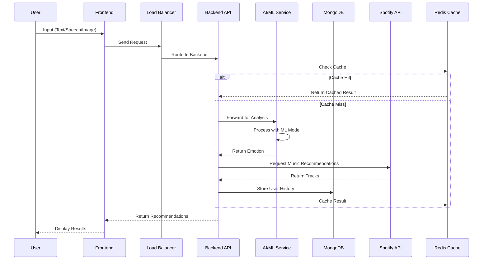
```mermaid
sequenceDiagram
    participant U as User
    participant FE as Frontend
    participant LB as Load Balancer
    participant BE as Backend API
    participant AI as AI/ML Service
    participant DB as MongoDB
    participant SP as Spotify API
    participant CH as Redis Cache

    U->>FE: Input (Text/Speech/Image)
    FE->>LB: Send Request
    LB->>BE: Route to Backend
    BE->>CH: Check Cache
    alt Cache Hit
        CH-->>BE: Return Cached Result
    else Cache Miss
        BE->>AI: Forward for Analysis
        AI->>AI: Process with ML Model
        AI-->>BE: Return Emotion
        BE->>SP: Request Music Recommendations
        SP-->>BE: Return Tracks
        BE->>DB: Store User History
        BE->>CH: Cache Result
    end
    BE-->>FE: Return Recommendations
    FE-->>U: Display Results
```

<h2 id="-live-frontend-demo">🌐 Live Deployment</h2>

The Moodify app is currently live and deployed on Vercel. You can access the live app using the following link: **[https://moodify-app.vercel.app](https://moodify-app.vercel.app).**

Feel free to also visit the backend at [Moodify Backend API](https://moodify-emotion-music-app.onrender.com/).

For your information, the front-end's production (deployment) branch is `frontend-deployment/production`, and the backend's production (deployment) branch is `main-deployment-branch/production`.

> [!IMPORTANT]
> **Disclaimer:** The backend of Moodify is currently hosted with the **Free Tier** of Render, so it may take a few seconds to load initially. Additionally, it may spin down after a period of inactivity or high traffic, so please be patient if the backend takes a few seconds to respond.

> [!IMPORTANT]
> **Note**: The amount of memory allocated by Render is only **512MB with 0.1 CPU**, so the backend may run out of memory if there are too many requests at once, which may cause the server to restart. **Also**, the facial and speech emotion detection models may also **cause the server to crash** due to memory constraints and the heavy processing required by AI applications, so please be patient if the server crashes and restarts. I'd also recommend that you clone the repository and replace the URLs with your own local backend server for a more stable experience.

> [!NOTE]
> There is no guarantee of uptime or performance with the current deployment, unless I have more resources _(money)_ to upgrade the server :( Feel free to [contact me](#contact) if you encounter any issues or need further assistance.

### Live Statuses

[](https://moodify-emotion-music-app.vercel.app/)
[](https://moodify-emotion-music-app.onrender.com/)
[](ai_ml)
[](https://moodify-emotion-music-app.netlify.app/)
[](docker-compose.yml)
[](http://moodify-app.vercel.app/)
[](kubernetes)
[](https://github.com/hoangsonww/Moodify-Emotion-Music-App)

<h2 id="-features">🌟 Features</h2>

The Moodify project aims to provide the following features:

- User registration and login functionality.
- Input analysis through text, speech, and facial expressions.
- Real-time music recommendations based on emotion detection.
- Visualization of emotion detection results and user history.
- Data analytics scripts for emotion trends and model performance.
- AI/ML models for text, speech, and facial emotion detection.
- User profile management and customization.
- Mobile app version for seamless user experience.
- Progressive Web App (PWA) features for offline support.
- Admin panel for managing users, recommendations, and data analytics.
- And so much more!

<h2 id="-technologies">🛠️ Technologies</h2>

Here is the list of technologies used in the Moodify project:

### **Frontend**:
- **React**: For building the user interface.
- **Axios**: For making HTTP requests to the backend.
- **Material UI**: For styling and UI components.
- **React Router**: For client-side routing.
- **Redux**: For state management.
- **Jest**: For unit testing.
- **React Testing Library**: For testing React components.

### **Backend**:
- **Django**: For building the backend API.
- **Django REST Framework (DRF)**: For creating RESTful APIs.
- **MongoEngine**: For MongoDB integration with Django.
- **JWT**: For user authentication and authorization.
- **Spotify API**: For fetching music recommendations.
- **Swagger**: For API documentation.
- **Redoc**: For API documentation.
- **Flask**: For serving the AI/ML models as APIs.
- **Gunicorn**: For serving the Django application.
- **NGINX**: For load balancing and reverse proxy.

### **Databases**:
- **MongoDB**: For storing user data and music recommendations.
- **Redis**: For caching and session management.
- **SQLite**: For development and testing purposes.
- **PostgreSQL**: For production database (optional, can be configured).

### **AI/ML Models**:
- **PyTorch**: For building and training AI/ML models.
- **TensorFlow**: For building and training AI/ML models.
- **Keras**: For building and training AI/ML models.
- **HuggingFace**: For using pre-trained models and transformers.
- **Pandas**: For data manipulation and analysis.
- **Scikit Learn**: For machine learning algorithms.
- **NumPy**: For numerical computations.
- **MLflow**: For tracking experiments and managing models.
- **FER**: For facial emotion recognition.

### **Data Analytics**:
- **Matplotlib**: For data visualization.
- **Apache Hadoop**: For big data processing and analytics.
- **Apache Spark**: For distributed data processing and analytics.
- **PySpark**: For using Spark with Python.

### **Mobile (in progress)**:
- **React Native**: For building the mobile application.
- **Expo**: For building and deploying the React Native app.
- **Expo Go**: For testing the React Native app on mobile devices.

### **Containerization, Deployment, and CI/CD**:
- **Docker**: For containerizing the application.
- **Kubernetes**: For orchestrating the containers.
- **Jenkins**: For continuous integration and deployment.
- **Render**: For hosting the backend API.
- **Vercel**: For hosting the frontend application.
- **Netlify**: For hosting the frontend application (backup).
- **GitHub Actions**: For automating workflows and deployments.
- **Docker Compose**: For managing multi-container application.

<h2 id="-user-interface">🖼️ User Interface</h2>

### Landing Page

<p align="center">
  
</p>

### Home Page

<p align="center">
  
</p>

#### Home Page - Dark Mode

<p align="center">
  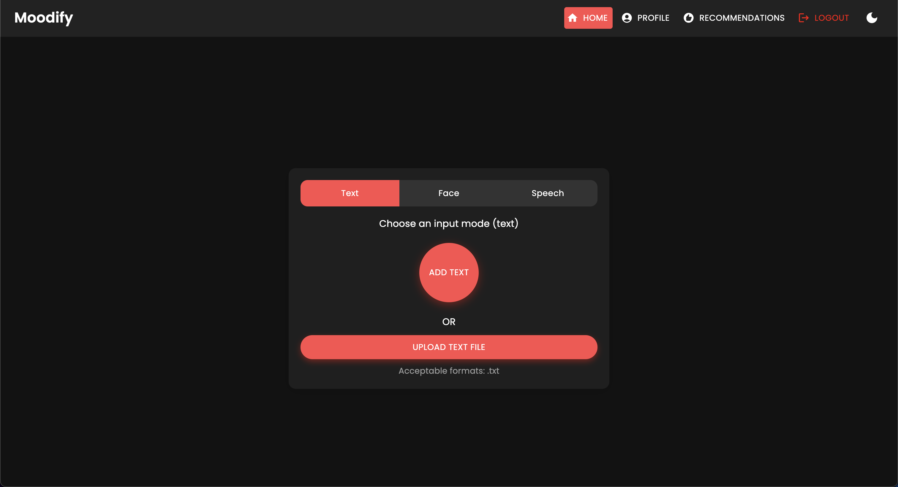
</p>

#### Text Input

<p align="center">
  
</p>

#### Text Input - Dark Mode

<p align="center">
  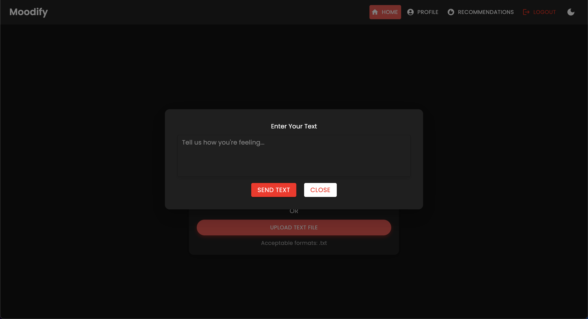
</p>

#### Speech Input

<p align="center">
  
</p>

<p align="center">
  
</p>

#### Speech Input - Dark Mode

<p align="center">
  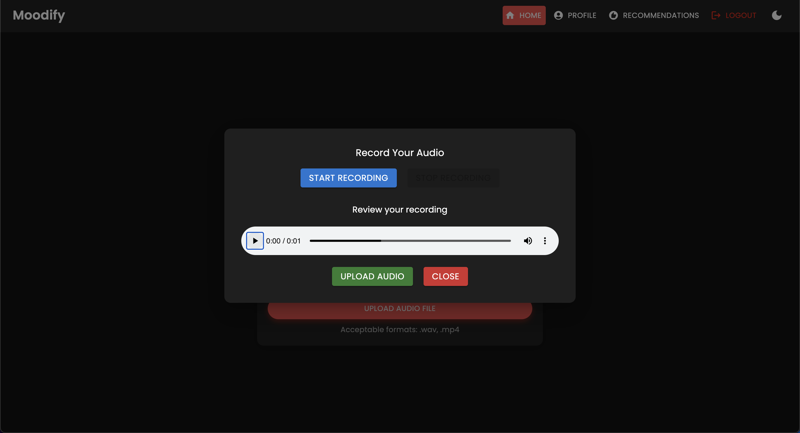
</p>

#### Facial Expression Input

<p align="center">
  
</p>

<p align="center">
  
</p>

#### Facial Expression Input - Dark Mode

<p align="center">
  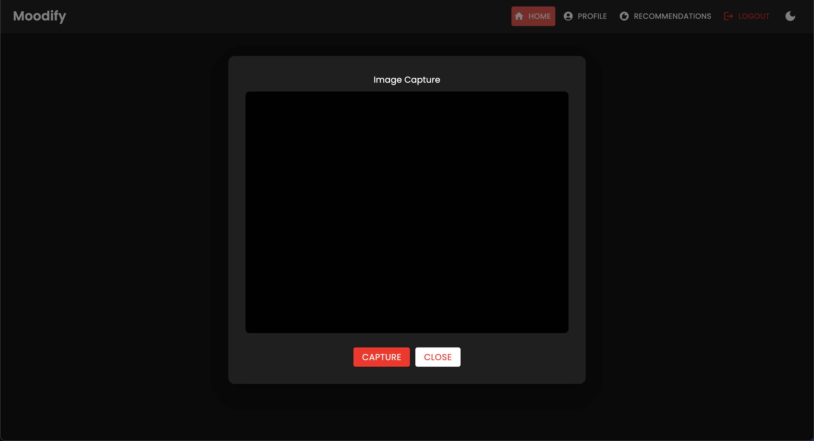
</p>

### Profile Page

<p align="center">
  
</p>

#### Profile Page (Continued)

<p align="center">
  
</p>

#### Profile Page - Dark Mode

<p align="center">
  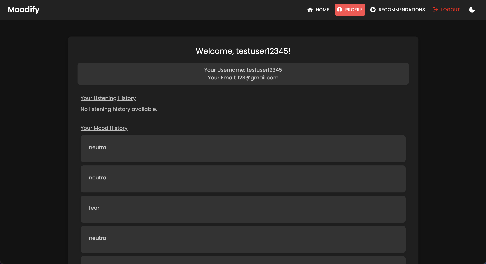
</p>

### Results - Recommendations Page

<p align="center">
  
</p>

#### Results - Recommendations Page - Dark Mode

<p align="center">
  
</p>

### Login Page

<p align="center">
  
</p>

### Registration Page

<p align="center">
  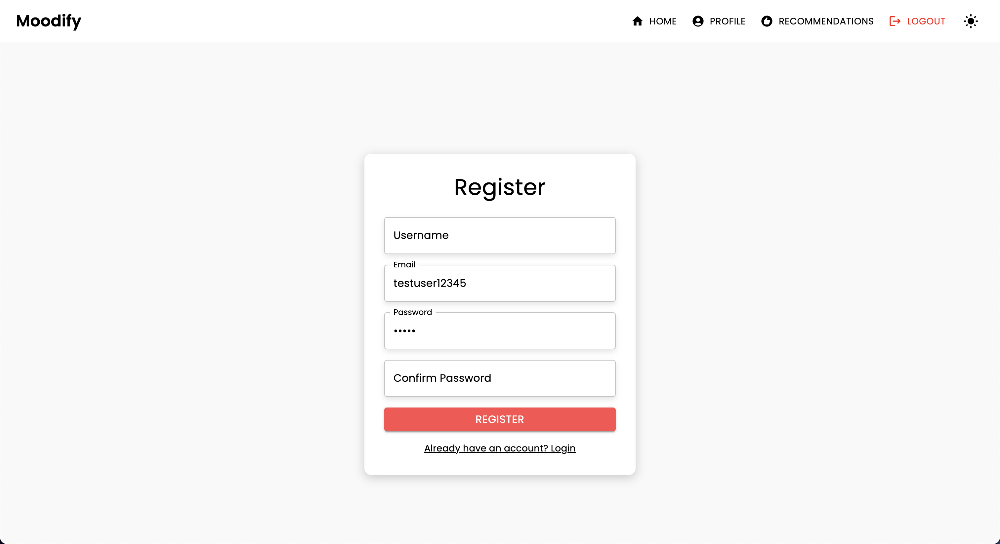
</p>

### Forgot Password Page

<p align="center">
  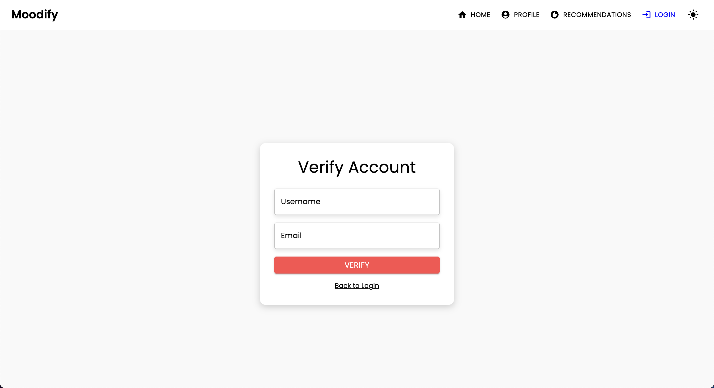
</p>

#### Reset Password - Once the User Has Verified Their Account Ownership

<p align="center">
  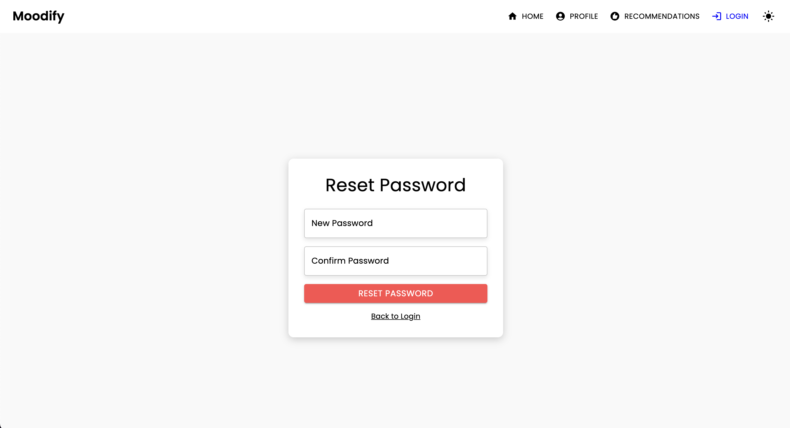
</p>

### Privacy Policy Page

<p align="center">
  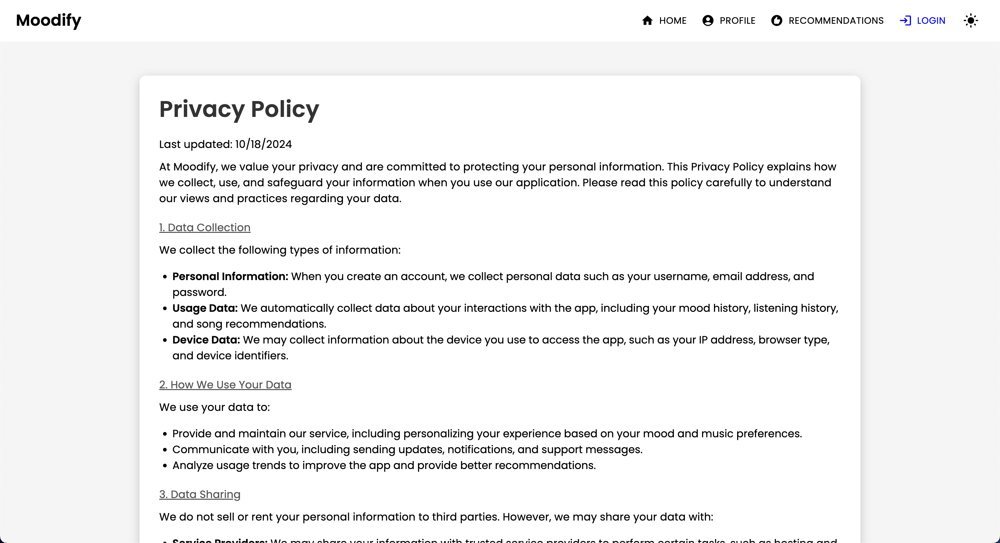
</p>

### Terms of Service Page

<p align="center">
  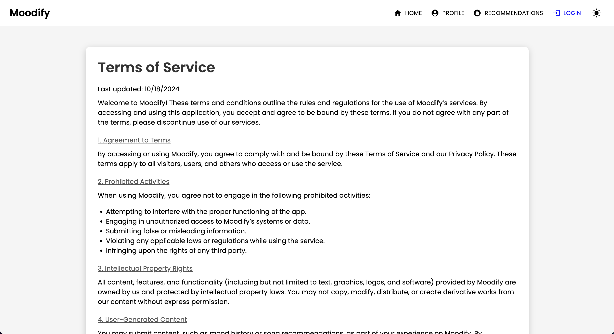
</p>

### Responsive Design - Mobile View

<p align="center">
  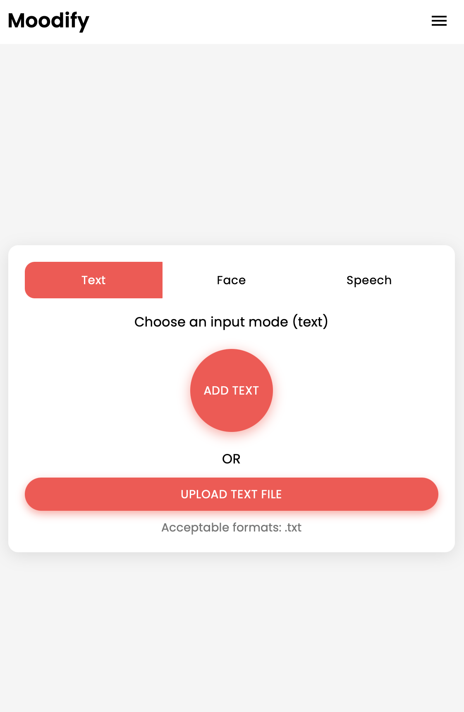
</p>

<p align="center">
  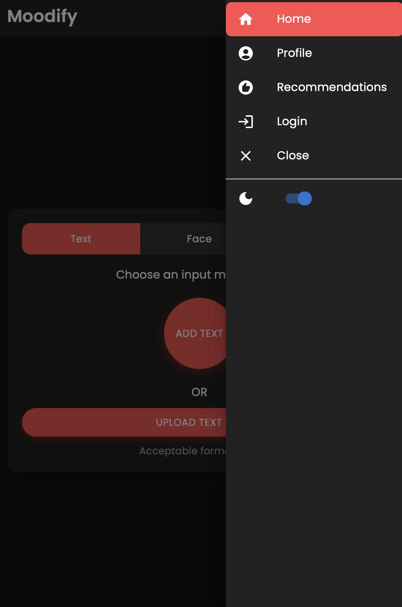
</p>

<h2 id="-complete-file-structure">📂 Complete File Structure</h2>

The project has a comprehensive file structure combining frontend, backend, AI/ML models, and data analytics components:

```plaintext
Moodify-Emotion-Music-App/
├── frontend/                      # React frontend for the web application
│   ├── public/
│   │   ├── index.html             # Main HTML file
│   │   ├── manifest.json          # Web app manifest
│   │   └── favicon.ico            # Favicon for the app
│   │
│   ├── src/
│   │   ├── components/            # Contains all React components
│   │   ├── pages/                 # Contains main pages of the app
│   │   ├── styles/                # Contains global styles and themes
│   │   ├── context/               # Contains React Context API
│   │   ├── App.js                 # Main App component
│   │   ├── index.js               # Entry point for React
│   │   └── theme.js               # Material UI theme configuration
│   │ 
│   ├── .gitignore                 # Git ignore file
│   ├── Dockerfile                 # Dockerfile for containerization
│   ├── package.json               # NPM dependencies and scripts
│   └── README.md                  # Project documentation
│ 
├── backend/                       # Django backend for API services and database management
│   ├── manage.py                  # Django's command-line utility
│   ├── requirements.txt           # Backend dependencies
│   ├── backend/
│   │   ├── settings.py            # Django settings for the project
│   │   ├── urls.py                # URL declarations for the project
│   │   ├── users/                 # User management components
│   │   └── api/                   # Emotion detection and recommendation APIs
│   │
│   ├── .gitignore                 # Git ignore file
│   ├── Dockerfile                 # Dockerfile for containerization
│   └── db.sqlite3                 # SQLite database (if used)
│
├── ai_ml/                         # AI/ML models for emotion detection
│   ├── data/                      # Datasets for training and testing
│   ├── models/                    # Trained models for emotion detection
│   ├── src/                       # Source files for emotion detection and recommendation
│   │   ├── api/                   # API scripts for running emotion detection services
│   │   ├── recommendation/        # Music recommendation logic
│   │   └── data_processing/       # Data preprocessing scripts
│   │
│   ├── Dockerfile                 # Dockerfile for containerization
│   └── README.md                  # AI/ML documentation
│
├── data_analytics/                # Data analytics scripts and visualizations
│   ├── emotion_distribution.py    # Script for visualizing emotion distribution
│   ├── training_visualization.py  # Script for visualizing training and validation metrics
│   ├── predictions_analysis.py    # Script for analyzing model predictions
│   ├── recommendation_analysis.py # Script for visualizing music recommendations
│   ├── spark-hadoop/              # Spark and Hadoop integration scripts
│   └── visualizations/            # Generated visualizations
│
├── kubernetes/                    # Kubernetes deployment files
│   ├── backend-deployment.yaml    # Deployment file for the backend service
│   ├── backend-service.yaml       # Deployment file for the backend service
│   ├── frontend-deployment.yaml   # Deployment file for the frontend service
│   ├── frontend-service.yaml      # Deployment file for the frontend service
│   └── configmap.yaml             # ConfigMap for environment variables
│ 
├── aws/                           # AWS deployment and infrastructure as code (IaC) files
├── gcp/                           # GCP deployment and infrastructure as code (IaC) files
│
├── mobile/                        # React Native mobile application
│   ├── App.js                     # Main entry point for React Native app
│   ├── index.js                   # App registry for React Native
│   ├── package.json               # NPM dependencies and scripts
│   ├── components/                # React Native components
│   │   ├── Footer.js              # Footer component
│   │   ├── Navbar.js              # Header component
│   │   ├── Auth/                  # Authentication components (e.g., Login, Register)
│   │   └── Profile/               # Profile-related components
│   │
│   ├── context/                   # React Context API for state management
│   │   └── DarkModeContext.js     # Dark mode context provider
│   │
│   ├── pages/                     # Main pages of the app
│   │   ├── HomePage.js            # Home page component
│   │   ├── ProfilePage.js         # Profile page component
│   │   ├── ResultsPage.js         # Results page component
│   │   ├── LandingPage.js         # Landing page component
│   │   └── (and more...)
│   │
│   ├── assets/                    # Images, fonts, and other assets
│   ├── styles/                    # Styling files (similar to CSS for web)
│   ├── .gitignore                 # Git ignore file
│   ├── package.json               # Dependencies and scripts
│   └── README.md                  # Mobile app documentation
│
├── nginx/                         # NGINX configuration files (for load balancing and reverse proxy)
│   ├── nginx.conf                 # Main NGINX configuration file
│   └── Dockerfile                 # Dockerfile for NGINX container
│
├── images/                        # Images used in the README documentation 
├── docker-compose.yml             # Docker Compose file for containerization
└── README.md                      # Comprehensive README file for the entire project
```

<h2 id="-getting-started">🛠️ Getting Started</h2>

### **Prerequisites**

- **Node.js** (v14 or higher)
- **Python 3.8** or later
- **MongoDB**
- **Virtual Environment** (`venv`)
- **`.env` File** (for environment variables - you create your own credentials following the [example file](.env.example) or contact me for mine.)

### **1. Setup and Train AI/ML Models**

Start with setting up and training the AI/ML models, as they will be required for the backend to function properly.

Or, you can download the pre-trained models from the Google Drive links provided in the [Pre-Trained Models](#pre-trained-models) section. If you choose to do so, you can skip this section for now.

1. **Clone the repository:**
   ```bash
   git clone https://github.com/hoangsonww/Moodify-Emotion-Music-App.git
   ```

2. **Navigate to the AI/ML directory:**
   ```bash
   cd Moodify-Emotion-Music-App/ai_ml
   ```

3. **Create and activate a virtual environment:**
   ```bash
   python -m venv venv
   source venv/bin/activate   # For macOS/Linux
   .\venv\Scripts\activate    # For Windows
   ```

4. **Install dependencies:**
   ```bash
   pip install -r requirements.txt
   ```

5. **Edit the configurations in the `src/config.py` file:**
    - Visit the `src/config.py` file and update the configurations as needed, especially your Spotify API keys and configure ALL the paths.
    - Visit the individual model training scripts in the `src/models` directory and update the paths to the datasets and output paths as needed.
    - Ensure all paths are correctly set before training the models!

6. **Train the text emotion model:**
   ```bash
   python src/models/train_text_emotion.py
   ```
   *Repeat similar commands for other models as needed (e.g., facial and speech emotion models).*

7. **Ensure all trained models are placed in the `models` directory, and that you have trained all necessary models before moving to the next step!**

8. **Test the trained AI/ML models as needed**:
    - Run the `src/models/test_emotion_models.py` script to test the trained models.
    - Ensure the models are providing accurate predictions before moving to the next step.

### **2. Set Up the Backend**

Once the AI/ML models are ready, proceed with setting up the backend.

1. **Navigate to the backend directory:**
   ```bash
   cd ../backend
   ```

2. **Create and activate a virtual environment:**
   ```bash
   python -m venv venv
   source venv/bin/activate   # For macOS/Linux
   .\venv\Scripts\activate    # For Windows
   ```

3. **Install dependencies:**
   ```bash
   pip install -r requirements.txt
   ```

4. **Configure your secrets and environment:**

    - Create a `.env` file in the `backend` directory.
    - Add the following environment variables to the `.env` file:
      ```plaintext
      SECRET_KEY=your_secret_key
      DEBUG=True
      ALLOWED_HOSTS=<your_hosts>
      MONGODB_URI=<your_mongodb_uri>
      ```
    - Visit `backend/settings.py` and add `SECRET_KEY` & set `DEBUG` to `True`.

> [!CAUTION]
> Ensure these steps are completed before running the backend server.

5. **Run database migrations:**
   ```bash
   python manage.py migrate
   ```

6. **Start the Django server:**
   ```bash
   python manage.py runserver
   ```
   The backend server will be running at `http://127.0.0.1:8000/`.

### **3. Install and Run the Frontend**

Finally, set up the frontend to interact with the backend.

1. **Navigate to the frontend directory:**
   ```bash
   cd ../frontend
   ```

2. **Install dependencies using Yarn:**
   ```bash
   npm install
   ```

3. **Start the development server:**
   ```bash
   npm start
   ```
   The frontend will start at `http://localhost:3000`.

> [!NOTE]
> If you encounter any problems or need my `.env` file, feel free to [contact me](#contact).

<h2 id="-api-endpoints">📋 API Endpoints</h2>

### **User Endpoints**

| HTTP Method | Endpoint                                                         | Description                                     |
|-------------|------------------------------------------------------------------|-------------------------------------------------|
| `POST`      | `/users/register/`                                               | Register a new user                             |
| `POST`      | `/users/login/`                                                  | Login a user and obtain a JWT token             |
| `GET`       | `/users/user/profile/`                                           | Retrieve the authenticated user's profile       |
| `PUT`       | `/users/user/profile/update/`                                    | Update the authenticated user's profile         |
| `DELETE`    | `/users/user/profile/delete/`                                    | Delete the authenticated user's profile         |
| `POST`      | `/users/recommendations/`                                        | Save recommendations for a user                 |
| `GET`       | `/users/recommendations/<str:username>/`                         | Retrieve recommendations for a user by username |
| `DELETE`    | `/users/recommendations/<str:username>/<str:recommendation_id>/` | Delete a specific recommendation for a user     |
| `DELETE`    | `/users/recommendations/<str:username>/`                         | Delete all recommendations for a user           |
| `POST`      | `/users/mood_history/<str:user_id>/`                             | Add a mood to the user's mood history           |
| `GET`       | `/users/mood_history/<str:user_id>/`                             | Retrieve mood history for a user                |
| `DELETE`    | `/users/mood_history/<str:user_id>/`                             | Delete a specific mood from the user's history  |
| `POST`      | `/users/listening_history/<str:user_id>/`                        | Add a track to the user's listening history     |
| `GET`       | `/users/listening_history/<str:user_id>/`                        | Retrieve listening history for a user           |
| `DELETE`    | `/users/listening_history/<str:user_id>/`                        | Delete a specific track from the user's history |
| `POST`      | `/users/user_recommendations/<str:user_id>/`                     | Save a user's recommendations                   |
| `GET`       | `/users/user_recommendations/<str:user_id>/`                     | Retrieve a user's recommendations               |
| `DELETE`    | `/users/user_recommendations/<str:user_id>/`                     | Delete all recommendations for a user           |
| `POST`      | `/users/verify-username-email/`                                  | Verify if a username and email are valid        |
| `POST`      | `/users/reset-password/`                                         | Reset a user's password                         |
| `GET`       | `/users/verify-token/`                                           | Verify a user's token                           |

### **Emotion Detection Endpoints**

| HTTP Method | Endpoint                     | Description                                |
|-------------|------------------------------|--------------------------------------------|
| `POST`      | `/api/text_emotion/`         | Analyze text for emotional content         |
| `POST`      | `/api/speech_emotion/`       | Analyze speech for emotional content       |
| `POST`      | `/api/facial_emotion/`       | Analyze facial expressions for emotions    |
| `POST`      | `/api/music_recommendation/` | Get music recommendations based on emotion |

### **Admin Interface Endpoints**

| HTTP Method | Endpoint                     | Description                                  |
|-------------|------------------------------|----------------------------------------------|
| `GET`       | `/admin/`                    | Access the Django Admin interface            |

### **Documentation Endpoints**

| HTTP Method | Endpoint    | Description                               |
|-------------|-------------|-------------------------------------------|
| `GET`       | `/swagger/` | Access the Swagger UI API documentation   |
| `GET`       | `/redoc/`   | Access the Redoc API documentation        |
| `GET`       | `/`         | Access the API root endpoint (Swagger UI) |

### **Admin Interface**

1. Create a superuser:
   ```bash
   python manage.py createsuperuser
   ```
2. Access the admin panel at `http://127.0.0.1:8000/admin/`

3. You should see the following login page:

<p align="center">
  
</p>

<h2 id="-backend-apis-documentation">🚀 Backend APIs Documentation</h2>

Our backend APIs are all well-documented using Swagger UI and Redoc. You can access the API documentation at the following URLs:
- **Swagger UI**: `https://moodify-emotion-music-app.onrender.com/swagger`.
- **Redoc**: `https://moodify-emotion-music-app.onrender.com/redoc`.

> [!IMPORTANT]
> Our backend server may spin down after a period of inactivity, so it may take a few seconds to load initially!

Alternatively, you can run the backend server locally and access the API documentation at the following endpoints:
- **Swagger UI**: `http://127.0.0.1:8000/swagger`.
- **Redoc**: `http://127.0.0.1:8000/redoc`.

Regardless of your choice, you should see the following API documentation if everything is running correctly:

**Swagger UI:**

<p align="center">
  
</p>

**Redoc:**

<p align="center">
  
</p>

<h2 id="-about-the-aiml-models">🤖 About the AI/ML Models</h2>

### **AI/ML Models Overview**

The AI/ML models are built using PyTorch, TensorFlow, Keras, and HuggingFace Transformers. These models are trained on various datasets to detect emotions from text, speech, and facial expressions.

The emotion detection models are used to analyze user inputs and provide real-time music recommendations based on the detected emotions. The models are trained on various datasets to capture the nuances of human emotions and provide accurate predictions.

- **Text Emotion Detection**: Detects emotions from text inputs.
- **Speech Emotion Detection**: Analyzes emotions from speech inputs.
- **Facial Emotion Detection**: Detects emotions from facial expressions.

The models are integrated into the backend API services to provide real-time emotion detection and music recommendations for users.

### **Training the AI/ML Models**

The models must be trained first before using them in the backend services. Ensure that the models are trained and placed in the `models` directory before running the backend server. Refer to the (Getting Started)[#getting-started] section for more details.

<p align="center">
  
  Examples of training the text emotion model.
</p>

To train the models, you can run the provided scripts in the `ai_ml/src/models` directory. These scripts are used to preprocess the data, train the models, and save the trained models for later use. These scripts include:

- `train_text_emotion.py`: Trains the text emotion detection model.
- `train_speech_emotion.py`: Trains the speech emotion detection model.
- `train_facial_emotion.py`: Trains the facial emotion detection model.

Ensure that you have the necessary dependencies, datasets, and configurations set up before training the models. Specifically, make sure to visit the `config.py` file and update the paths to the datasets and output directories to the correct ones on your system.

> [!IMPORTANT]
> By default, these scripts will prioritize using your GPU with CUDA (if available) for faster training.
> However, if that is not available on your machine, the scripts will automatically fall back to using the CPU for training.
> 
> To ensure that you have the necessary dependencies for GPU training, install PyTorch with CUDA support using the following command:

```bash
pip3 install torch torchvision torchaudio --index-url https://download.pytorch.org/whl/cu118
```

### **Testing the AI/ML Models**

After that, you can run the `test_emotion_models.py` script to test the trained models and ensure they are providing accurate predictions:

```bash
python src/models/test_emotion_models.py
```

Alternatively, you can run the simple Flask API to test the models via RESTful API endpoints:

```bash
python ai_ml/src/api/emotion_api.py
```

The endpoints are as follows:

- `/text_emotion`: Detects emotion from text input
- `/speech_emotion`: Detects emotion from speech audio
- `/facial_emotion`: Detects emotion from an image
- `/music_recommendation`: Provides music recommendations based on the detected emotion

> [!IMPORTANT]
> For more information about training and using the models, please refer to the [AI/ML documentation](ai_ml/README.md) in the `ai_ml` directory.**

### **Pre-Trained Models**

However, if training the model is too resource-intensive for you, you can use the following Google Drive links to download the pre-trained models:

- [Text Emotion Detection Model - `model.safetensors`](https://drive.google.com/file/d/1EjGqjYBmGclL1t8aF6tV2eWCfBSnOMot/view?usp=sharing). Please download this `model.safetensors` file and place it into the `ai_ml/models/text_emotion_model` directory.
- [Speech Emotion Detection Model - `scaler.pkl`](https://drive.google.com/file/d/1cd2m7NIsWfgIPs8jU7C2cB7M0QQY_u_l/view?usp=sharing). Please download this and place this into the `ai_ml/models/speech_emotion_model` directory.
- [Speech Emotion Detection Model - `trained_speech_emotion_model.pkl`](https://drive.google.com/file/d/1MPfkTkWjmjsVVs-cjkav48Mn8NUmVCG9/view?usp=sharing). Please download this and place this into the `ai_ml/models/speech_emotion_model` directory.
- [Facial Emotion Detection Model - `trained_facial_emotion_model.pt`](https://drive.google.com/file/d/1GuW8wQ7KLfeX4pr2f8CAlORIP4YqJvgv/view?usp=sharing). Please download this and place this into the `ai_ml/models/facial_emotion_model` directory.

These have been pre-trained on the datasets for you and are ready to use in the backend services or for testing purposes once downloaded and correctly placed in the `models` directory.

Feel free to [contect me](#-contact) if you encounter any issues or need further assistance with the AI/ML models.

<h2 id="-analytics-scripts">📊 Analytics Scripts</h2>

The `data_analytics` folder provides data analysis and visualization scripts to gain insights into the emotion detection model's performance.

1. **Run All Analytics Scripts:**
   ```bash
   python data_analytics/main.py
   ```

2. View generated visualizations in the `visualizations` folder.

3. Here are some example visualizations:

<p align="center">
  
  Emotion Distribution Visualization
</p>

<p align="center">
  
  Training Loss Curve Visualization
</p>

<h2 id="-mobile-app-version">📱 Mobile App Version</h2>

There is also a mobile version of the Moodify app built using React Native and Expo. You can find the mobile app in the `mobile` directory.

1. **Navigate to the mobile directory:**
   ```bash
   cd ../mobile
   ```

2. **Install dependencies using Yarn:**
   ```bash
    yarn install
    ```

3. **Start the Expo development server:**
    ```bash
    yarn start
    ```

4. **Scan the QR code using the Expo Go app on your mobile device to run the app.**

If successful, you should see the following home screen:

<p align="center">
  
</p>

Feel free to explore the mobile app and test its functionalities!

<h2 id="-load-balancing">🔗 Load Balancing</h2>

The project uses NGINX and Gunicorn for load balancing and serving the Django backend. NGINX acts as a reverse proxy server, while Gunicorn serves the Django application.

1. **Install NGINX:**
   ```bash
   sudo apt-get update
   sudo apt-get install nginx
   ```
   
2. **Install Gunicorn:**
   ```bash
    pip install gunicorn
    ```
   
3. **Configure NGINX:**
    - Update the NGINX configuration file (if needed) at `/nginx/nginx.conf` with your configuration.

4. **Start NGINX and Gunicorn:**
    - Start NGINX:
      ```bash
      sudo systemctl start nginx
      ```
    - Start Gunicorn:
      ```bash
      gunicorn backend.wsgi:application
      ```
      
5. **Access the backend at `http://<server_ip>:8000/`**.

Feel free to customize the NGINX configuration and Gunicorn settings as needed for your deployment.

<h2 id="-containerization">🐳 Containerization</h2>

The project can be containerized using Docker for easy deployment and scaling. You can create Docker images for the frontend, backend, and AI/ML models.

### Container Architecture


```mermaid
graph LR
    subgraph "Docker Compose Stack"
        subgraph "Application Containers"
            A[Frontend Container<br/>React:3000]
            B[Backend Container<br/>Django:8000]
            C[AI/ML Container<br/>Flask:5000]
        end

        subgraph "Database Containers"
            D[MongoDB Container<br/>:27017]
            E[Redis Container<br/>:6379]
        end

        subgraph "Infrastructure"
            F[NGINX Container<br/>:80]
        end
    end

    F -->|Proxy| A
    F -->|Proxy| B
    A -->|API Calls| B
    B -->|ML Requests| C
    B -->|Data| D
    B -->|Cache| E

    style A fill:#61DAFB
    style B fill:#092E20
    style C fill:#000000
    style D fill:#47A248
    style E fill:#DC382D
    style F fill:#009639
```

1. **Build the Docker images:**
   ```bash
   docker compose up --build
   ```

2. The Docker images will be built for the frontend, backend, and AI/ML models. Verify the images using:
   ```bash
   docker images
   ```

If you encounter any errors, try to rebuild your image without using the cache since Docker's cache may cause issues.
   ```bash
   docker-compose build --no-cache
   ```

### User Authentication Flow

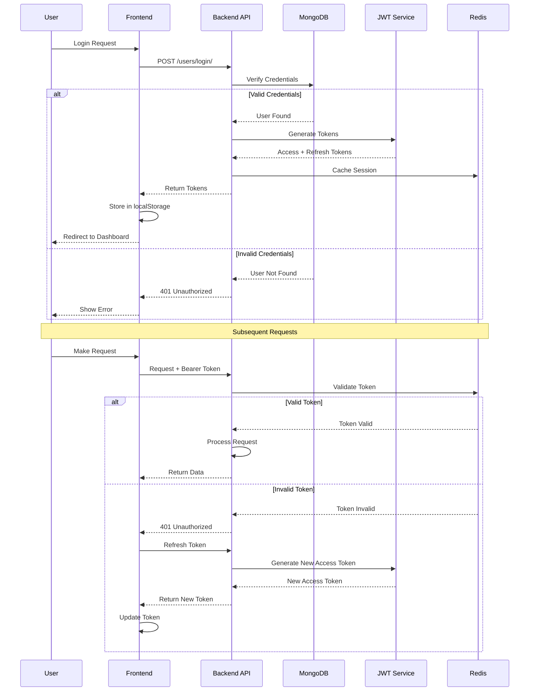
```mermaid
sequenceDiagram
    participant U as User
    participant FE as Frontend
    participant BE as Backend API
    participant DB as MongoDB
    participant JWT as JWT Service
    participant CH as Redis

    U->>FE: Login Request
    FE->>BE: POST /users/login/
    BE->>DB: Verify Credentials
    alt Valid Credentials
        DB-->>BE: User Found
        BE->>JWT: Generate Tokens
        JWT-->>BE: Access + Refresh Tokens
        BE->>CH: Cache Session
        BE-->>FE: Return Tokens
        FE->>FE: Store in localStorage
        FE-->>U: Redirect to Dashboard
    else Invalid Credentials
        DB-->>BE: User Not Found
        BE-->>FE: 401 Unauthorized
        FE-->>U: Show Error
    end

    Note over U,CH: Subsequent Requests
    U->>FE: Make Request
    FE->>BE: Request + Bearer Token
    BE->>CH: Validate Token
    alt Valid Token
        CH-->>BE: Token Valid
        BE->>BE: Process Request
        BE-->>FE: Return Data
    else Invalid Token
        CH-->>BE: Token Invalid
        BE-->>FE: 401 Unauthorized
        FE->>BE: Refresh Token
        BE->>JWT: Generate New Access Token
        JWT-->>BE: New Access Token
        BE-->>FE: Return New Token
        FE->>FE: Update Token
    end
```

<h2 id="-testing">🧪 Testing</h2>

**Moodify** uses Jest for backend API testing and Jest with React Testing Library for frontend component testing. The tests ensure that the APIs and components are functioning correctly.

### **Backend API and AI/ML Model Tests**

The project includes unit tests for the backend APIs and AI/ML models. You can run the tests to ensure everything is working correctly.

1. **Navigate to the backend directory:**
   ```bash
   cd backend
   ```
   
2. **Run the tests:**
   ```bash
   pytest -q
   ```
   
This will run all the tests in the API and AI/ML model directories. Ensure that all tests pass before deploying the application.

### **Frontend Tests**

The frontend also includes unit tests for the React components. You can run the tests using the following command:

```bash
cd frontend

# Run the frontend tests (default mode)
npm test

# Run the frontend tests in watch mode (will re-run tests on file changes)
npm test:watch

# Run the frontend tests in coverage mode (generates a coverage report)
npm test:coverage
```

This will run all the tests in the frontend directory and generate a coverage report. Ensure that all tests pass before deploying the frontend application.

<h2 id="-kubernetes">☸️ Kubernetes</h2>

We also added Kubernetes deployment files for the backend and frontend services. You can deploy the services on a Kubernetes cluster using the provided YAML files.

### Kubernetes Deployment Architecture


```mermaid
graph TB
    subgraph "Kubernetes Cluster"
        subgraph "Ingress Layer"
            ING[Ingress Controller<br/>NGINX]
        end

        subgraph "Service Layer"
            SVC1[Frontend Service<br/>ClusterIP]
            SVC2[Backend Service<br/>ClusterIP]
            SVC3[AI/ML Service<br/>ClusterIP]
            SVC4[MongoDB Service<br/>ClusterIP]
            SVC5[Redis Service<br/>ClusterIP]
        end

        subgraph "Deployment Layer"
            subgraph "Frontend Pods"
                FE1[Frontend Pod 1]
                FE2[Frontend Pod 2]
                FE3[Frontend Pod 3]
            end

            subgraph "Backend Pods"
                BE1[Backend Pod 1]
                BE2[Backend Pod 2]
                BE3[Backend Pod 3]
            end

            subgraph "AI/ML Pods"
                AI1[AI/ML Pod 1]
                AI2[AI/ML Pod 2]
            end

            subgraph "StatefulSets"
                DB1[MongoDB Pod]
                RD1[Redis Pod]
            end
        end

        subgraph "Storage Layer"
            PV1[(Persistent Volume<br/>MongoDB)]
            PV2[(Persistent Volume<br/>Models)]
        end

        subgraph "ConfigMaps & Secrets"
            CM[ConfigMap]
            SEC[Secrets]
        end
    end

    ING -->|Route /| SVC1
    ING -->|Route /api| SVC2
    SVC1 --> FE1 & FE2 & FE3
    SVC2 --> BE1 & BE2 & BE3
    SVC3 --> AI1 & AI2
    SVC4 --> DB1
    SVC5 --> RD1
    BE1 & BE2 & BE3 -->|Connect| SVC3
    BE1 & BE2 & BE3 -->|Connect| SVC4
    BE1 & BE2 & BE3 -->|Connect| SVC5
    DB1 --> PV1
    AI1 & AI2 --> PV2
    FE1 & FE2 & FE3 -.->|Config| CM
    BE1 & BE2 & BE3 -.->|Config| CM
    BE1 & BE2 & BE3 -.->|Credentials| SEC

    style ING fill:#009639
    style SVC1 fill:#326CE5
    style SVC2 fill:#326CE5
    style SVC3 fill:#326CE5
    style SVC4 fill:#326CE5
    style SVC5 fill:#326CE5
    style FE1 fill:#61DAFB
    style FE2 fill:#61DAFB
    style FE3 fill:#61DAFB
    style BE1 fill:#092E20
    style BE2 fill:#092E20
    style BE3 fill:#092E20
    style AI1 fill:#FF6F00
    style AI2 fill:#FF6F00
    style DB1 fill:#47A248
    style RD1 fill:#DC382D
```

1. **Deploy the backend service:**
   ```bash
   kubectl apply -f kubernetes/backend-deployment.yaml
   ```
   
2. **Deploy the frontend service:**
   ```bash
    kubectl apply -f kubernetes/frontend-deployment.yaml
    ```
   
3. **Expose the services:**
    ```bash
    kubectl expose deployment moodify-backend --type=LoadBalancer --port=8000
    kubectl expose deployment moodify-frontend --type=LoadBalancer --port=3000
    ```
   
4. **Access the services using the LoadBalancer IP:**
    - You can access the backend service at `http://<backend_loadbalancer_ip>:8000`.
    - You can access the frontend service at `http://<frontend_loadbalancer_ip>:3000`.

Feel free to visit the `kubernetes` directory for more information about the deployment files and configurations.

<h2 id="-jenkins">🔗 Jenkins</h2>

We have also included Jenkins pipeline script for automating the build and deployment process. You can use Jenkins to automate the CI/CD process for the Moodify app.

### CI/CD Pipeline Architecture


```mermaid
graph LR
    subgraph "Source Control"
        A[GitHub Repository]
    end

    subgraph "CI/CD Pipeline - GitHub Actions & Jenkins"
        B[Trigger on Push/PR]
        C[Run Tests]
        D[Build Docker Images]
        E[Security Scanning]
        F[Push to Registry]
        G[Deploy to Staging]
        H[Integration Tests]
        I[Deploy to Production]
    end

    subgraph "Container Registry"
        J[Docker Hub/ECR/GCR]
    end

    subgraph "Deployment Targets"
        K[Kubernetes Cluster]
        L[AWS/GCP]
        M[Vercel Frontend]
        N[Render Backend]
    end

    subgraph "Monitoring"
        O[Health Checks]
        P[Rollback on Failure]
    end

    A -->|Webhook| B
    B --> C
    C -->|Pass| D
    D --> E
    E -->|Pass| F
    F --> J
    J --> G
    G --> H
    H -->|Pass| I
    I --> K
    I --> L
    I --> M
    I --> N
    K & L & M & N --> O
    O -->|Failure| P
    P --> G

    style A fill:#181717
    style B fill:#2088FF
    style C fill:#34A853
    style D fill:#2496ED
    style E fill:#FF6B6B
    style F fill:#4CAF50
    style G fill:#FFA000
    style H fill:#34A853
    style I fill:#4CAF50
    style J fill:#2496ED
    style K fill:#326CE5
    style L fill:#FF9900
    style M fill:#000000
    style N fill:#46A2F1
```

### Deployment Workflow

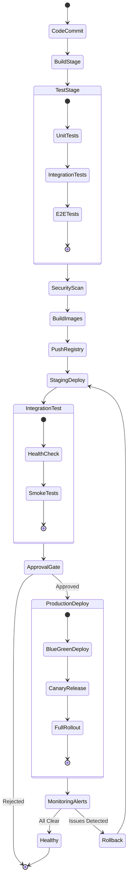
```mermaid
stateDiagram-v2
    [*] --> CodeCommit
    CodeCommit --> BuildStage
    BuildStage --> TestStage
    TestStage --> SecurityScan
    SecurityScan --> BuildImages
    BuildImages --> PushRegistry
    PushRegistry --> StagingDeploy
    StagingDeploy --> IntegrationTest

    state TestStage {
        [*] --> UnitTests
        UnitTests --> IntegrationTests
        IntegrationTests --> E2ETests
        E2ETests --> [*]
    }

    state IntegrationTest {
        [*] --> HealthCheck
        HealthCheck --> SmokeTests
        SmokeTests --> [*]
    }

    IntegrationTest --> ApprovalGate
    ApprovalGate --> ProductionDeploy: Approved
    ApprovalGate --> [*]: Rejected

    state ProductionDeploy {
        [*] --> BlueGreenDeploy
        BlueGreenDeploy --> CanaryRelease
        CanaryRelease --> FullRollout
        FullRollout --> [*]
    }

    ProductionDeploy --> MonitoringAlerts
    MonitoringAlerts --> Healthy: All Clear
    MonitoringAlerts --> Rollback: Issues Detected

    Rollback --> StagingDeploy
    Healthy --> [*]
```

1. **Install Jenkins on your server or local machine.**

2. **Create a new Jenkins pipeline job:**
    - Create a new pipeline job in Jenkins.
    - Configure the pipeline to use the `Jenkinsfile` in the `jenkins` directory.

3. **Run the Jenkins pipeline:**
    - Run the Jenkins pipeline to build and deploy the Moodify app.
    - The pipeline will automate the build, test, and deployment process for the app.

Feel free to explore the Jenkins pipeline script in the `Jenkinsfile` and customize it as needed for your deployment process.

<h2 id="openapi-specification">🚀 OpenAPI Specification</h2>

The backend APIs are documented using the OpenAPI Specification (OAS) format. The `openapi.yaml` file contains the API documentation in the OAS format, which can be used to generate client libraries, server stubs, and mock servers.

#### Using the `openapi.yaml` File

1. **View the API Documentation**
- Open [Swagger Editor](https://editor.swagger.io/).
- Upload the `openapi.yaml` file or paste its content.
- Visualize and interact with the API documentation.

2. **Test the API**
- Import `openapi.yaml` into [Postman](https://www.postman.com/):
  - Open Postman → Import → Select `openapi.yaml`.
  - Test the API endpoints directly from Postman.
- Or use [Swagger UI](https://swagger.io/tools/swagger-ui/):
  - Provide the file URL or upload it to view and test endpoints.

3. **Generate Client Libraries**
- Install OpenAPI Generator:
  ```bash
  npm install @openapitools/openapi-generator-cli -g
  ```
- Generate a client library:
  ```bash
  openapi-generator-cli generate -i openapi.yaml -g <language> -o ./client
  ```
- Replace `<language>` with the desired programming language.

4. **Generate Server Stubs**
- Generate a server stub:
  ```bash
  openapi-generator-cli generate -i openapi.yaml -g <framework> -o ./server
  ```
- Replace `<framework>` with the desired framework.

5. **Run a Mock Server**
- Install Prism:
  ```bash
  npm install -g @stoplight/prism-cli
  ```
- Start the mock server:
  ```bash
  prism mock openapi.yaml
  ```

6. **Validate the OpenAPI File**
- Use [Swagger Validator](https://validator.swagger.io/):
  - Upload `openapi.yaml` or paste its content to check for errors.

This guide enables you to view, test, and utilize the API.

<h2 id="-contributing">🔧 Contributing</h2>

- Contributions are welcome! Feel free to fork the repository and submit a pull request.

- Note that this project is still under active development, and any contributions are appreciated.

- If you have any suggestions, feature requests, or bug reports, feel free to open an issue [here](https://github.com/hoangsonww/Moodify-Emotion-Music-App/issues).

<h2 id="-license">📝 License</h2>

- This project is licensed under the **MIT License**. Please see the [LICENSE](LICENSE) file for details.
- If you use or build upon this project, please provide the necessary attribution and references.

<h2 id="-contact">📧 Contact</h2>

- Feel free to contact me at [hoangson091104@gmail.com](mailto:hoangson091104@gmail.com) for any questions or feedback.
- You can also connect with me on [LinkedIn](https://www.linkedin.com/in/hoangsonw/).

---

**Happy Coding and Vibin'! 🎶**

**Created with ❤️ by [Son Nguyen](https://github.com/hoangsonww) in 2024.**

---

[🔝 Back to Top](#moodify---emotion-based-music-recommendation-app)
