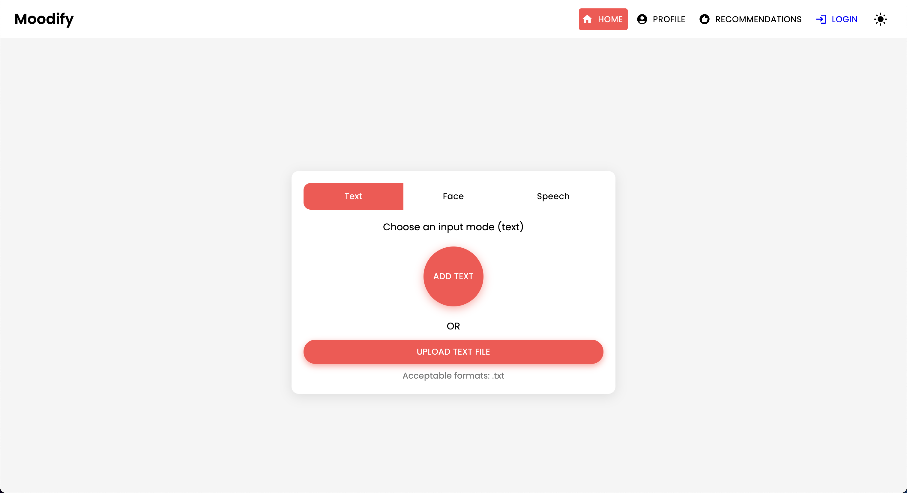
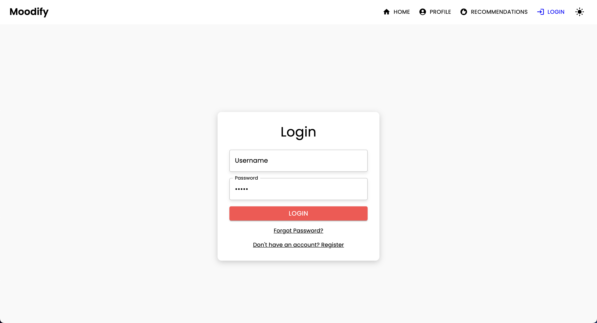

# **Moodify - Emotion-Based Music Recommendation System**

With the rise of personalized music streaming services, there is a growing need for systems that can recommend music based on users' emotional states.
Realizing this need, **Moodify** was developed by [Son Nguyen](https://github.com/hoangsonww) to provide personalized music recommendations based on users' detected emotions.

The Moodify project is an integrated emotion-based music recommendation system that combines frontend, backend, AI/ML models, and data analytics to provide personalized music recommendations based on user emotions. The application analyzes text, speech, or facial expressions and suggests music that aligns with the detected emotions.

Supporting both desktop and mobile platforms, Moodify offers a seamless user experience with real-time emotion detection and music recommendations. The project leverages **React for the frontend, Django for the backend, and three advanced AI/ML models for emotion detection**. Data analytics scripts are used to visualize emotion trends and model performance.

## **Table of Contents**

- [Overview](#overview)
- [Features](#features)
- [Technologies](#technologies)
- [User Interface](#user-interface)
- [Complete File Structure](#complete-file-structure)
- [Getting Started](#getting-started)
- [API Endpoints](#api-endpoints)
- [Backend APIs Documentation](#backend-apis-documentation)
- [About the AI/ML Models](#about-the-aiml-models)
- [Mobile App Version](#mobile-app-version)
- [Analytics Scripts](#analytics-scripts)
- [Contributing](#contributing)
- [License](#license)

## **Overview**

Moodify provides personalized music recommendations based on users' emotional states detected through text, speech, and facial expressions. It interacts with a Django-based backend, AI/ML models for emotion detection, and utilizes data analytics for visual insights into emotion trends and model performance.

## **Features**

- User registration and login functionality.
- Input analysis through text, speech, and facial expressions.
- Real-time music recommendations based on emotion detection.
- Visualization of emotion detection results and user history.
- Admin panel for managing users, recommendations, and data analytics.

## **Technologies**

- **Frontend**: React, Axios, Material UI (MUI), React Router, and more.
- **Backend**: Django, MongoDB, Redis (for Server-Side Caching), JWT Authentication.
- **AI/ML Models**: PyTorch, TensorFlow, Keras, HuggingFace Transformers.
- **Data Analytics**: Pandas, Matplotlib, Hadoop, Spark.
- **Mobile**: React Native, Expo.

## User Interface

### Home Page

<p align="center">
  
</p>

#### Text Input

<p align="center">
  
</p>

#### Speech Input

<p align="center">
  
</p>

<p align="center">
  
</p>

#### Facial Expression Input

<p align="center">
  
</p>

<p align="center">
  

### Profile Page

<p align="center">
  
</p>

<p align="center">
  
</p>

### Results/Recommendations Page

<p align="center">
  
</p>

### Login Page

<p align="center">
  
</p>

### Registration Page

<p align="center">
  
</p>

### 404 Not Found Page

<p align="center">
  
</p>

## Footer

<p align="center">
  
</p>

## **Complete File Structure**

The project has a comprehensive file structure combining frontend, backend, AI/ML models, and data analytics components:

```plaintext
Moodify/
├── frontend/                      # React frontend for the web application
│   ├── public/
│   │   ├── index.html             # Main HTML file
│   │   ├── manifest.json          # Web app manifest
│   │   └── favicon.ico            # Favicon for the app
│   │
│   ├── src/
│   │   ├── components/            # Contains all React components
│   │   ├── pages/                 # Contains main pages of the app
│   │   ├── styles/                # Contains global styles and themes
│   │   ├── App.js                 # Main App component
│   │   ├── index.js               # Entry point for React
│   │   └── theme.js               # Material UI theme configuration
│   │ 
│   ├── .gitignore                 # Git ignore file
│   ├── package.json               # NPM dependencies and scripts
│   └── README.md                  # Project documentation
│ 
├── backend/                       # Django backend for API services and database management
│   ├── manage.py                  # Django's command-line utility
│   ├── requirements.txt           # Backend dependencies
│   ├── backend/
│   │   ├── settings.py            # Django settings for the project
│   │   ├── urls.py                # URL declarations for the project
│   │   ├── users/                 # User management components
│   │   └── api/                   # Emotion detection and recommendation APIs
│   │
│   └── db.sqlite3                 # SQLite database (if used)
│
├── ai_ml/                         # AI/ML models for emotion detection
│   ├── data/                      # Datasets for training and testing
│   ├── models/                    # Trained models for emotion detection
│   ├── src/                       # Source files for emotion detection and recommendation
│   │   ├── api/                   # API scripts for running emotion detection services
│   │   ├── recommendation/        # Music recommendation logic
│   │   └── data_processing/       # Data preprocessing scripts
│   │
│   └── README.md                 # AI/ML documentation
│
├── data_analytics/                # Data analytics scripts and visualizations
│   ├── emotion_distribution.py    # Script for visualizing emotion distribution
│   ├── training_visualization.py  # Script for visualizing training and validation metrics
│   ├── predictions_analysis.py    # Script for analyzing model predictions
│   ├── recommendation_analysis.py # Script for visualizing music recommendations
│   ├── spark-hadoop/              # Spark and Hadoop integration scripts
│   └── visualizations/            # Generated visualizations
│
├── mobile/                        # React Native mobile application
│   ├── App.js                     # Main entry point for React Native app
│   ├── index.js                   # App registry for React Native
│   ├── components/                # React Native components
│   │   ├── Auth/                  # Authentication components (e.g., Login, Register)
│   │   ├── MoodInput/             # Components for facial, text, and speech inputs
│   │   ├── Profile/               # Profile-related components
│   │   └── Recommendations/       # Recommendation-related components
│   │
│   ├── pages/                     # Main pages of the app
│   │   ├── HomePage.js            # Home page component
│   │   ├── ProfilePage.js         # Profile page component
│   │   ├── ResultsPage.js         # Results page component
│   │   └── NotFoundPage.js        # 404 page component
│   │
│   ├── assets/                    # Images, fonts, and other assets
│   ├── styles/                    # Styling files (similar to CSS for web)
│   ├── .gitignore                 # Git ignore file
│   ├── package.json               # Dependencies and scripts
│   └── README.md                  # Mobile app documentation
│
├── images/                        # Images used in the README documentation
│ 
└── README.md                      # Comprehensive README file for the entire project
```

## **Getting Started**

### **Prerequisites**

- **Node.js** (v14 or higher)
- **Python 3.8** or later
- **MongoDB**
- **Virtual Environment** (`venv`)

### **1. Setup and Train AI/ML Models**

Start with setting up and training the AI/ML models, as they will be required for the backend to function properly.

1. **Clone the repository:**
   ```bash
   git clone https://github.com/hoangsonww/Moodify-Emotion-Music-App.git
   ```

2. **Navigate to the AI/ML directory:**
   ```bash
   cd Moodify/ai_ml
   ```

3. **Create and activate a virtual environment:**
   ```bash
   python -m venv venv
   source venv/bin/activate   # For macOS/Linux
   .\venv\Scripts\activate    # For Windows
   ```

4. **Install dependencies:**
   ```bash
   pip install -r requirements.txt
   ```

5. **Train the text emotion model:**
   ```bash
   python src/models/train_text_emotion.py
   ```
   *Repeat similar commands for other models as needed (e.g., facial and speech emotion models).*

6. **Ensure all trained models are placed in the `models` directory, and that you have trained all necessary models before moving to the next step!**

### **2. Set Up the Backend**

Once the AI/ML models are ready, proceed with setting up the backend.

1. **Navigate to the backend directory:**
   ```bash
   cd ../backend
   ```

2. **Create and activate a virtual environment:**
   ```bash
   python -m venv venv
   source venv/bin/activate   # For macOS/Linux
   .\venv\Scripts\activate    # For Windows
   ```

3. **Install dependencies:**
   ```bash
   pip install -r requirements.txt
   ```

4. **Configure MongoDB settings in `settings.py` or your environment variables.**

5. **Run database migrations:**
   ```bash
   python manage.py migrate
   ```

6. **Start the Django server:**
   ```bash
   python manage.py runserver
   ```
   The backend server will be running at `http://127.0.0.1:8000/`.

### **3. Install and Run the Frontend**

Finally, set up the frontend to interact with the backend.

1. **Navigate to the frontend directory:**
   ```bash
   cd ../frontend
   ```

2. **Install dependencies using Yarn:**
   ```bash
   npm install
   ```

3. **Start the development server:**
   ```bash
   npm start
   ```
   The frontend will start at `http://localhost:3000`.

## API Endpoints

### User Endpoints

| HTTP Method | Endpoint                                                         | Description                                     |
|-------------|------------------------------------------------------------------|-------------------------------------------------|
| `POST`      | `/users/register/`                                               | Register a new user                             |
| `POST`      | `/users/login/`                                                  | Login a user and obtain a JWT token             |
| `GET`       | `/users/user/profile/`                                           | Retrieve the authenticated user's profile       |
| `PUT`       | `/users/user/profile/update/`                                    | Update the authenticated user's profile         |
| `DELETE`    | `/users/user/profile/delete/`                                    | Delete the authenticated user's profile         |
| `POST`      | `/users/recommendations/`                                        | Save recommendations for a user                 |
| `GET`       | `/users/recommendations/<str:username>/`                         | Retrieve recommendations for a user by username |
| `DELETE`    | `/users/recommendations/<str:username>/<str:recommendation_id>/` | Delete a specific recommendation for a user     |
| `DELETE`    | `/users/recommendations/<str:username>/`                         | Delete all recommendations for a user           |
| `POST`      | `/users/mood_history/<str:user_id>/`                             | Add a mood to the user's mood history           |
| `GET`       | `/users/mood_history/<str:user_id>/`                             | Retrieve mood history for a user                |
| `DELETE`    | `/users/mood_history/<str:user_id>/`                             | Delete a specific mood from the user's history  |
| `POST`      | `/users/listening_history/<str:user_id>/`                        | Add a track to the user's listening history     |
| `GET`       | `/users/listening_history/<str:user_id>/`                        | Retrieve listening history for a user           |
| `DELETE`    | `/users/listening_history/<str:user_id>/`                        | Delete a specific track from the user's history |
| `POST`      | `/users/user_recommendations/<str:user_id>/`                     | Save a user's recommendations                   |
| `GET`       | `/users/user_recommendations/<str:user_id>/`                     | Retrieve a user's recommendations               |
| `DELETE`    | `/users/user_recommendations/<str:user_id>/`                     | Delete all recommendations for a user           |

### Emotion Detection Endpoints

| HTTP Method | Endpoint                     | Description                                |
|-------------|------------------------------|--------------------------------------------|
| `POST`      | `/api/text_emotion/`         | Analyze text for emotional content         |
| `POST`      | `/api/speech_emotion/`       | Analyze speech for emotional content       |
| `POST`      | `/api/facial_emotion/`       | Analyze facial expressions for emotions    |
| `POST`      | `/api/music_recommendation/` | Get music recommendations based on emotion |

### Admin Interface Endpoints

| HTTP Method | Endpoint                     | Description                                  |
|-------------|------------------------------|----------------------------------------------|
| `GET`       | `/admin/`                    | Access the Django Admin interface            |

### **Admin Interface**

1. Create a superuser:
   ```bash
   python manage.py createsuperuser
   ```
2. Access the admin panel at `http://127.0.0.1:8000/admin/`

3. You should see the following login page:

<p align="center">
  
</p>

## **Backend APIs Documentation**

Our backend APIs are all well-documented using Swagger UI and Redoc. You can access the API documentation at the following endpoints:
- **Swagger UI**: `http://127.0.0.1:8000/swagger`.
- **Redoc**: `http://127.0.0.1:8000/redoc`.

If you have set up the backend correctly, you should see the following API documentation:

**Swagger UI:**

<p align="center">
  
</p>

**Redoc:**

<p align="center">
  
</p>

## **About the AI/ML Models**

The AI/ML models are built using PyTorch, TensorFlow, Keras, and HuggingFace Transformers. These models are trained on various datasets to detect emotions from text, speech, and facial expressions.

The emotion detection models are used to analyze user inputs and provide real-time music recommendations based on the detected emotions. The models are trained on various datasets to capture the nuances of human emotions and provide accurate predictions.

- **Text Emotion Detection**: Detects emotions from text inputs.
- **Speech Emotion Detection**: Analyzes emotions from speech inputs.
- **Facial Emotion Detection**: Detects emotions from facial expressions.

The models are integrated into the backend API services to provide real-time emotion detection and music recommendations for users.

## **Mobile App Version**

There is also a mobile version of the Moodify app built using React Native and Expo. You can find the mobile app in the `mobile` directory.

1. **Navigate to the mobile directory:**
   ```bash
   cd ../mobile
   ```
   
2. **Install dependencies using Yarn:**
   ```bash
    yarn install
    ```
   
3. **Start the Expo development server:**
    ```bash
    yarn start
    ```
   
4. **Scan the QR code using the Expo Go app on your mobile device to run the app.**

If successful, you should see the following home screen:

<p align="center">
  
</p>

Feel free to explore the mobile app and test its functionalities!

## **Analytics Scripts**

The `data_analytics` folder provides data analysis and visualization scripts to gain insights into the emotion detection model's performance.

1. **Run All Analytics Scripts:**
   ```bash
   python data_analytics/main.py
   ```
2. View generated visualizations in the `visualizations` folder.

## **Contributing**

- Contributions are welcome! Feel free to fork the repository and submit a pull request.

## **License**

- This project is licensed under the MIT License. See the [LICENSE](LICENSE) file for details.

## **Contact**

- Feel free to contact me at [hoangson091104@gmail.com](mailto:hoangson091104@gmail.com) for any questions or feedback.

---

**Happy Coding and Analyzing! 🎶**

[🔝 Back to Top](#moodify---emotion-based-music-recommendation-system)
