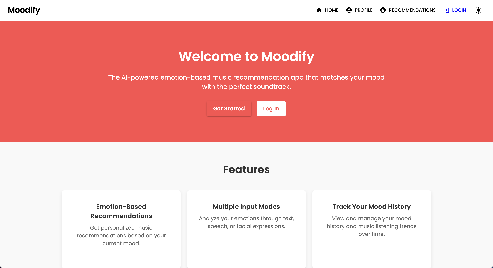
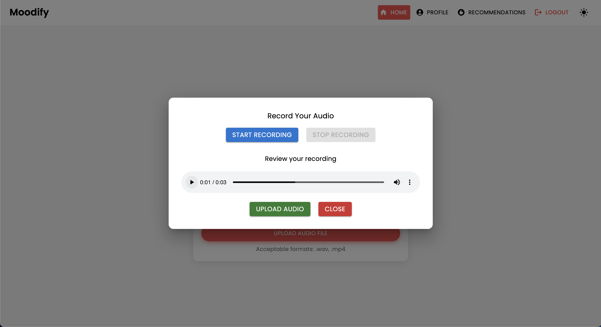
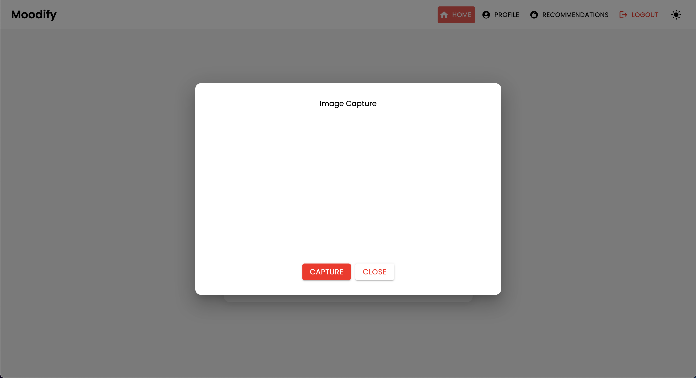
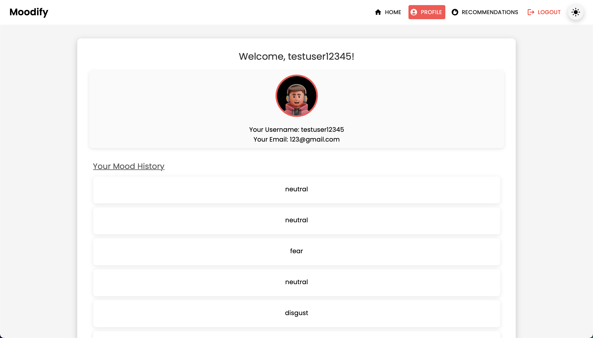
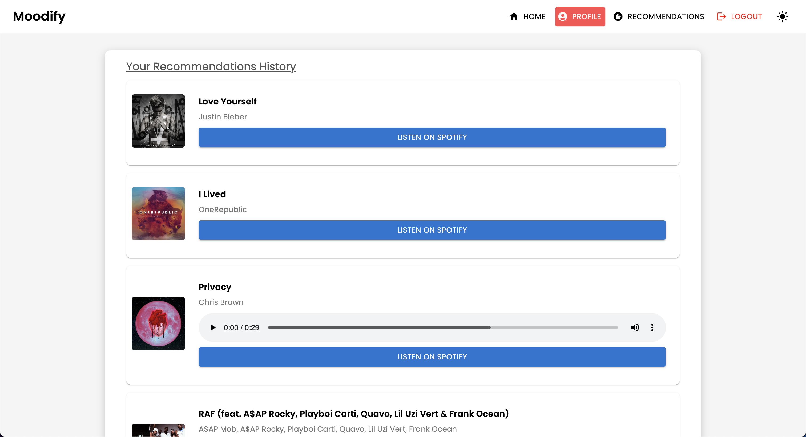
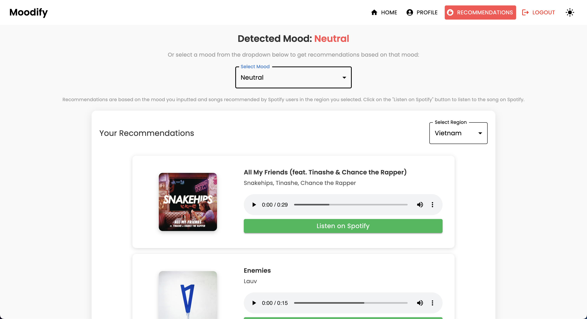

# **Moodify - Emotion-Based Music Recommendation App**

With the rise of personalized music streaming services, there is a growing need for systems that can recommend music based on users' emotional states.
Realizing this need, **Moodify** is being developed by [Son Nguyen](https://github.com/hoangsonww) in 2024 to provide personalized music recommendations based on users' detected emotions.

The **Moodify** project is an integrated emotion-based music recommendation system that combines frontend, backend, AI/ML models, and data analytics to provide personalized music recommendations based on user emotions. The application analyzes text, speech, or facial expressions and suggests music that aligns with the detected emotions.

Supporting both desktop and mobile platforms, **Moodify** offers a seamless user experience with real-time emotion detection and music recommendations. The project leverages **React for the frontend, Django for the backend, and three advanced, self-trained AI/ML models for emotion detection**. Data analytics scripts are used to visualize emotion trends and model performance.

<p align="center">
  
</p>

## **Table of Contents**

- [**🎵 Overview**](#-overview)
- [**🌟 Features**](#-features)
- [**🛠️ Technologies**](#-technologies)
- [**🖼️ User Interface**](#-user-interface)
    - [**Landing Page**](#landing-page)
    - [**Home Page**](#home-page)
    - [**Text Input**](#text-input)
    - [**Speech Input**](#speech-input)
    - [**Facial Expression Input**](#facial-expression-input)
    - [**Profile Page**](#profile-page)
    - [**Results/Recommendations Page**](#results---recommendations-page)
    - [**Login Page**](#login-page)
    - [**Registration Page**](#registration-page)
    - [**404 Not Found Page**](#404-not-found-page)
    - [**Footer**](#footer)
- [**🌐 Live Frontend Demo**](#-live-frontend-demo)
- [**📂 Complete File Structure**](#-complete-file-structure)
- [**🛠️ Getting Started**](#-getting-started)
    - [**Prerequisites**](#prerequisites)
    - [**Setup and Train AI/ML Models**](#1-setup-and-train-aiml-models)
    - [**Set Up the Backend**](#2-set-up-the-backend)
    - [**Install and Run the Frontend**](#3-install-and-run-the-frontend)
- [**📋 API Endpoints**](#-api-endpoints)
    - [**User Endpoints**](#user-endpoints)
    - [**Emotion Detection Endpoints**](#emotion-detection-endpoints)
    - [**Admin Interface Endpoints**](#admin-interface-endpoints)
    - [**Admin Interface**](#admin-interface)
- [**🚀 Backend APIs Documentation**](#-backend-apis-documentation)
- [**🤖 About the AI/ML Models**](#-about-the-aiml-models)
    - [**AI/ML Models Overview**](#aiml-models-overview)
    - [**Training the AI/ML Models**](#training-the-aiml-models)
    - [**Testing the AI/ML Models**](#testing-the-aiml-models)
    - [**Pre-Trained Models**](#pre-trained-models)
- [**📊 Analytics Scripts**](#-analytics-scripts)
- [**📱 Mobile App Version**](#-mobile-app-version)
- [**🐳 Containerization**](#-containerization)
- [**☸️ Kubernetes**](#-kubernetes)
- [**🔗 Jenkins**](#-jenkins)
- [**🔧 Contributing**](#-contributing)
- [**📝 License**](#-license)
- [**📧 Contact**](#-contact)

<h2 id="-overview">🎵 Overview</h2>

Moodify provides personalized music recommendations based on users' emotional states detected through text, speech, and facial expressions. It interacts with a Django-based backend, AI/ML models for emotion detection, and utilizes data analytics for visual insights into emotion trends and model performance.

<h2 id="-features">🌟 Features</h2>

- User registration and login functionality.
- Input analysis through text, speech, and facial expressions.
- Real-time music recommendations based on emotion detection.
- Visualization of emotion detection results and user history.
- Data analytics scripts for emotion trends and model performance.
- AI/ML models for text, speech, and facial emotion detection.
- User profile management and customization.
- Mobile app version for seamless user experience.
- Progressive Web App (PWA) features for offline support.
- Admin panel for managing users, recommendations, and data analytics.

<h2 id="-technologies">🛠️ Technologies</h2>

- **Frontend**:
    - React
    - Axios
    - Material UI (MUI)
    - React Router
    - React Redux
    - Jest and React Testing Library
- **Backend**:
    - Django
    - Django REST Framework
    - MongoEngine
    - JWT Authentication
    - Spotify APIs
    - Swagger and Redoc for API documentation
- **Databases**:
    - MongoDB
    - Redis (for server-side caching)
    - SQLite
- **AI/ML Models**:
    - PyTorch
    - TensorFlow
    - Keras
    - HuggingFace Transformers
    - Pandas
    - Scikit-learn
    - NumPy
    - FER (Facial Expression Recognition) Library
- **Data Analytics**:
    - Pandas
    - Matplotlib
    - Hadoop
    - Spark
- **Mobile**:
    - React Native
    - Expo
    - Expo Go
- **PWA**:
    - Progressive Web App features for offline support
- **Containerization, Deployment, and CI/CD**:
    - Docker
    - Kubernetes
    - Jenkins
    - Heroku
    - Vercel

<h2 id="-user-interface">🖼️ User Interface</h2>

### Landing Page

<p align="center">
  
</p>

### Home Page

<p align="center">
  
</p>

#### Text Input

<p align="center">
  
</p>

#### Speech Input

<p align="center">
  
</p>

<p align="center">
  
</p>

#### Facial Expression Input

<p align="center">
  
</p>

<p align="center">
  
</p>

### Profile Page

<p align="center">
  
</p>

<p align="center">
  
</p>

### Results - Recommendations Page

<p align="center">
  
</p>

### Login Page

<p align="center">
  
</p>

### Registration Page

<p align="center">
  
</p>

### 404 Not Found Page

<p align="center">
  
</p>

### Footer

<p align="center">
  
</p>

<h2 id="-live-frontend-demo">🌐 Live Frontend Demo</h2>

The frontend of the Moodify app is deployed on Vercel. You can access the live demo using the following link: [Moodify - Live Demo](https://moodify-emotion-music-app.vercel.app/).

**Note:** The backend APIs are not hosted and therefore not functional in the live demo. You can set up the backend locally to interact with the frontend, or you can explore the frontend features in the live demo. Note that features like emotion detection, user registration, login, and music recommendations will not work in the live demo without the backend services.

<h2 id="-complete-file-structure">📂 Complete File Structure</h2>

The project has a comprehensive file structure combining frontend, backend, AI/ML models, and data analytics components:

```plaintext
Moodify-Emotion-Music-App/
├── frontend/                      # React frontend for the web application
│   ├── public/
│   │   ├── index.html             # Main HTML file
│   │   ├── manifest.json          # Web app manifest
│   │   └── favicon.ico            # Favicon for the app
│   │
│   ├── src/
│   │   ├── components/            # Contains all React components
│   │   ├── pages/                 # Contains main pages of the app
│   │   ├── styles/                # Contains global styles and themes
│   │   ├── App.js                 # Main App component
│   │   ├── index.js               # Entry point for React
│   │   └── theme.js               # Material UI theme configuration
│   │ 
│   ├── .gitignore                 # Git ignore file
│   ├── Dockerfile                 # Dockerfile for containerization
│   ├── package.json               # NPM dependencies and scripts
│   └── README.md                  # Project documentation
│ 
├── backend/                       # Django backend for API services and database management
│   ├── manage.py                  # Django's command-line utility
│   ├── requirements.txt           # Backend dependencies
│   ├── backend/
│   │   ├── settings.py            # Django settings for the project
│   │   ├── urls.py                # URL declarations for the project
│   │   ├── users/                 # User management components
│   │   └── api/                   # Emotion detection and recommendation APIs
│   │
│   ├── .gitignore                 # Git ignore file
│   ├── Dockerfile                 # Dockerfile for containerization
│   └── db.sqlite3                 # SQLite database (if used)
│
├── ai_ml/                         # AI/ML models for emotion detection
│   ├── data/                      # Datasets for training and testing
│   ├── models/                    # Trained models for emotion detection
│   ├── src/                       # Source files for emotion detection and recommendation
│   │   ├── api/                   # API scripts for running emotion detection services
│   │   ├── recommendation/        # Music recommendation logic
│   │   └── data_processing/       # Data preprocessing scripts
│   │
│   └── README.md                  # AI/ML documentation
│
├── data_analytics/                # Data analytics scripts and visualizations
│   ├── emotion_distribution.py    # Script for visualizing emotion distribution
│   ├── training_visualization.py  # Script for visualizing training and validation metrics
│   ├── predictions_analysis.py    # Script for analyzing model predictions
│   ├── recommendation_analysis.py # Script for visualizing music recommendations
│   ├── spark-hadoop/              # Spark and Hadoop integration scripts
│   └── visualizations/            # Generated visualizations
│
├── kubernetes/                    # Kubernetes deployment files
│   ├── backend-deployment.yaml    # Deployment file for the backend service
│   ├── backend-service.yaml       # Deployment file for the backend service
│   ├── frontend-deployment.yaml   # Deployment file for the frontend service
│   ├── frontend-service.yaml      # Deployment file for the frontend service
│   └── configmap.yaml             # ConfigMap for environment variables
│
├── mobile/                        # React Native mobile application
│   ├── App.js                     # Main entry point for React Native app
│   ├── index.js                   # App registry for React Native
│   ├── package.json               # NPM dependencies and scripts
│   ├── babel.config.js            # Babel configuration for React Native
│   ├── 
│   ├── components/                # React Native components
│   │   ├── Footer.js              # Footer component
│   │   ├── Navbar.js              # Header component
│   │   ├── Auth/                  # Authentication components (e.g., Login, Register)
│   │   └── Profile/               # Profile-related components
│   │
│   ├── pages/                     # Main pages of the app
│   │   ├── HomePage.js            # Home page component
│   │   ├── ProfilePage.js         # Profile page component
│   │   ├── ResultsPage.js         # Results page component
│   │   └── NotFoundPage.js        # 404 page component
│   │
│   ├── assets/                    # Images, fonts, and other assets
│   ├── styles/                    # Styling files (similar to CSS for web)
│   ├── .gitignore                 # Git ignore file
│   ├── package.json               # Dependencies and scripts
│   └── README.md                  # Mobile app documentation
│
├── images/                        # Images used in the README documentation 
├── docker-compose.yml             # Docker Compose file for containerization
└── README.md                      # Comprehensive README file for the entire project
```

<h2 id="-getting-started">🛠️ Getting Started</h2>

### **Prerequisites**

- **Node.js** (v14 or higher)
- **Python 3.8** or later
- **MongoDB**
- **Virtual Environment** (`venv`)

### **1. Setup and Train AI/ML Models**

Start with setting up and training the AI/ML models, as they will be required for the backend to function properly.

1. **Clone the repository:**
   ```bash
   git clone https://github.com/hoangsonww/Moodify-Emotion-Music-App.git
   ```

2. **Navigate to the AI/ML directory:**
   ```bash
   cd Moodify-Emotion-Music-App/ai_ml
   ```

3. **Create and activate a virtual environment:**
   ```bash
   python -m venv venv
   source venv/bin/activate   # For macOS/Linux
   .\venv\Scripts\activate    # For Windows
   ```

4. **Install dependencies:**
   ```bash
   pip install -r requirements.txt
   ```

5. **Edit the configurations in the `src/config.py` file:**
    - Visit the `src/config.py` file and update the configurations as needed, especially your Spotify API keys and configure ALL the paths.
    - Visit the individual model training scripts in the `src/models` directory and update the paths to the datasets and output paths as needed.
    - Ensure all paths are correctly set before training the models!

6. **Train the text emotion model:**
   ```bash
   python src/models/train_text_emotion.py
   ```
   *Repeat similar commands for other models as needed (e.g., facial and speech emotion models).*

7. **Ensure all trained models are placed in the `models` directory, and that you have trained all necessary models before moving to the next step!**

8. **Test the trained AI/ML models as needed**:
    - Run the `src/models/test_emotion_models.py` script to test the trained models.
    - Ensure the models are providing accurate predictions before moving to the next step.

### **2. Set Up the Backend**

Once the AI/ML models are ready, proceed with setting up the backend.

1. **Navigate to the backend directory:**
   ```bash
   cd ../backend
   ```

2. **Create and activate a virtual environment:**
   ```bash
   python -m venv venv
   source venv/bin/activate   # For macOS/Linux
   .\venv\Scripts\activate    # For Windows
   ```

3. **Install dependencies:**
   ```bash
   pip install -r requirements.txt
   ```

4. **Configure your secrets and environment:**

    - Create a `.env` file in the `backend` directory.
    - Add the following environment variables to the `.env` file:
      ```plaintext
      SECRET_KEY=your_secret_key
      DEBUG=True
      ALLOWED_HOSTS=<your_hosts>
      MONGODB_URI=<your_mongodb_uri>
      ```
    - Visit `backend/settings.py` and add `SECRET_KEY` & set `DEBUG` to `True`.
    - **Important**: Ensure these steps are completed before running the backend server.

5. **Run database migrations:**
   ```bash
   python manage.py migrate
   ```

6. **Start the Django server:**
   ```bash
   python manage.py runserver
   ```
   The backend server will be running at `http://127.0.0.1:8000/`.

### **3. Install and Run the Frontend**

Finally, set up the frontend to interact with the backend.

1. **Navigate to the frontend directory:**
   ```bash
   cd ../frontend
   ```

2. **Install dependencies using Yarn:**
   ```bash
   npm install
   ```

3. **Start the development server:**
   ```bash
   npm start
   ```
   The frontend will start at `http://localhost:3000`.

**Note:** If you encounter any problems or need my `.env` file, feel free to [contact me](#contact).

<h2 id="-api-endpoints">📋 API Endpoints</h2>

### **User Endpoints**

| HTTP Method | Endpoint                                                         | Description                                     |
|-------------|------------------------------------------------------------------|-------------------------------------------------|
| `POST`      | `/users/register/`                                               | Register a new user                             |
| `POST`      | `/users/login/`                                                  | Login a user and obtain a JWT token             |
| `GET`       | `/users/user/profile/`                                           | Retrieve the authenticated user's profile       |
| `PUT`       | `/users/user/profile/update/`                                    | Update the authenticated user's profile         |
| `DELETE`    | `/users/user/profile/delete/`                                    | Delete the authenticated user's profile         |
| `POST`      | `/users/recommendations/`                                        | Save recommendations for a user                 |
| `GET`       | `/users/recommendations/<str:username>/`                         | Retrieve recommendations for a user by username |
| `DELETE`    | `/users/recommendations/<str:username>/<str:recommendation_id>/` | Delete a specific recommendation for a user     |
| `DELETE`    | `/users/recommendations/<str:username>/`                         | Delete all recommendations for a user           |
| `POST`      | `/users/mood_history/<str:user_id>/`                             | Add a mood to the user's mood history           |
| `GET`       | `/users/mood_history/<str:user_id>/`                             | Retrieve mood history for a user                |
| `DELETE`    | `/users/mood_history/<str:user_id>/`                             | Delete a specific mood from the user's history  |
| `POST`      | `/users/listening_history/<str:user_id>/`                        | Add a track to the user's listening history     |
| `GET`       | `/users/listening_history/<str:user_id>/`                        | Retrieve listening history for a user           |
| `DELETE`    | `/users/listening_history/<str:user_id>/`                        | Delete a specific track from the user's history |
| `POST`      | `/users/user_recommendations/<str:user_id>/`                     | Save a user's recommendations                   |
| `GET`       | `/users/user_recommendations/<str:user_id>/`                     | Retrieve a user's recommendations               |
| `DELETE`    | `/users/user_recommendations/<str:user_id>/`                     | Delete all recommendations for a user           |

### **Emotion Detection Endpoints**

| HTTP Method | Endpoint                     | Description                                |
|-------------|------------------------------|--------------------------------------------|
| `POST`      | `/api/text_emotion/`         | Analyze text for emotional content         |
| `POST`      | `/api/speech_emotion/`       | Analyze speech for emotional content       |
| `POST`      | `/api/facial_emotion/`       | Analyze facial expressions for emotions    |
| `POST`      | `/api/music_recommendation/` | Get music recommendations based on emotion |

### **Admin Interface Endpoints**

| HTTP Method | Endpoint                     | Description                                  |
|-------------|------------------------------|----------------------------------------------|
| `GET`       | `/admin/`                    | Access the Django Admin interface            |

### **Admin Interface**

1. Create a superuser:
   ```bash
   python manage.py createsuperuser
   ```
2. Access the admin panel at `http://127.0.0.1:8000/admin/`

3. You should see the following login page:

<p align="center">
  
</p>

<h2 id="-backend-apis-documentation">🚀 Backend APIs Documentation</h2>

Our backend APIs are all well-documented using Swagger UI and Redoc. You can access the API documentation at the following endpoints:
- **Swagger UI**: `http://127.0.0.1:8000/swagger`.
- **Redoc**: `http://127.0.0.1:8000/redoc`.

If you have set up the backend correctly, you should see the following API documentation:

**Swagger UI:**

<p align="center">
  
</p>

**Redoc:**

<p align="center">
  
</p>

<h2 id="-about-the-aiml-models">🤖 About the AI/ML Models</h2>

### **AI/ML Models Overview**

The AI/ML models are built using PyTorch, TensorFlow, Keras, and HuggingFace Transformers. These models are trained on various datasets to detect emotions from text, speech, and facial expressions.

The emotion detection models are used to analyze user inputs and provide real-time music recommendations based on the detected emotions. The models are trained on various datasets to capture the nuances of human emotions and provide accurate predictions.

- **Text Emotion Detection**: Detects emotions from text inputs.
- **Speech Emotion Detection**: Analyzes emotions from speech inputs.
- **Facial Emotion Detection**: Detects emotions from facial expressions.

The models are integrated into the backend API services to provide real-time emotion detection and music recommendations for users.

### **Training the AI/ML Models**

The models must be trained first before using them in the backend services. Ensure that the models are trained and placed in the `models` directory before running the backend server. Refer to the (Getting Started)[#getting-started] section for more details.

<p align="center">
  
  Examples of training the text emotion model.
</p>

To train the models, you can run the provided scripts in the `ai_ml/src/models` directory. These scripts are used to preprocess the data, train the models, and save the trained models for later use. These scripts include:

- `train_text_emotion.py`: Trains the text emotion detection model.
- `train_speech_emotion.py`: Trains the speech emotion detection model.
- `train_facial_emotion.py`: Trains the facial emotion detection model.

Ensure that you have the necessary datasets and configurations set up before training the models. Specifically, make sure to visit the `config.py` file and update the paths to the datasets and output directories to the correct ones on your system.

### **Testing the AI/ML Models**

After that, you can run the `test_emotion_models.py` script to test the trained models and ensure they are providing accurate predictions:

```bash
python src/models/test_emotion_models.py
```

Alternatively, you can run the simple Flask API to test the models via RESTful API endpoints:

```bash
python ai_ml/src/api/emotion_api.py
```

The endpoints are as follows:

- `/text_emotion`: Detects emotion from text input
- `/speech_emotion`: Detects emotion from speech audio
- `/facial_emotion`: Detects emotion from an image
- `/music_recommendation`: Provides music recommendations based on the detected emotion

For more information about training and using the models, please refer to the [AI/ML documentation](ai_ml/README.md) in the `ai_ml` directory.

### **Pre-Trained Models**

However, if training the model is too resource-intensive for you, you can use the following Google Drive links to download the pre-trained models:

- [Text Emotion Detection Model - `model.safetensors`](https://drive.google.com/file/d/1EjGqjYBmGclL1t8aF6tV2eWCfBSnOMot/view?usp=sharing). Please download this `model.safetensors` file and place it into the `ai_ml/models/text_emotion_model` directory.
- [Speech Emotion Detection Model - `scaler.pkl`](https://drive.google.com/file/d/1cd2m7NIsWfgIPs8jU7C2cB7M0QQY_u_l/view?usp=sharing). Please download this and place this into the `ai_ml/models/speech_emotion_model` directory.
- [Speech Emotion Detection Model - `trained_speech_emotion_model.pkl`](https://drive.google.com/file/d/1MPfkTkWjmjsVVs-cjkav48Mn8NUmVCG9/view?usp=sharing). Please download this and place this into the `ai_ml/models/speech_emotion_model` directory.
- [Facial Emotion Detection Model - `trained_facial_emotion_model.pt`](https://drive.google.com/file/d/1GuW8wQ7KLfeX4pr2f8CAlORIP4YqJvgv/view?usp=sharing). Please download this and place this into the `ai_ml/models/facial_emotion_model` directory.

These have been pre-trained on the datasets for you and are ready to use in the backend services or for testing purposes once downloaded and correctly placed in the `models` directory.

Feel free to [contect me](#-contact) if you encounter any issues or need further assistance with the AI/ML models.

<h2 id="-analytics-scripts">📊 Analytics Scripts</h2>

The `data_analytics` folder provides data analysis and visualization scripts to gain insights into the emotion detection model's performance.

1. **Run All Analytics Scripts:**
   ```bash
   python data_analytics/main.py
   ```

2. View generated visualizations in the `visualizations` folder.

3. Here are some example visualizations:

<p align="center">
  
  Emotion Distribution Visualization
</p>

<p align="center">
  
  Training Loss Curve Visualization
</p>

<h2 id="-mobile-app-version">📱 Mobile App Version</h2>

There is also a mobile version of the Moodify app built using React Native and Expo. You can find the mobile app in the `mobile` directory.

1. **Navigate to the mobile directory:**
   ```bash
   cd ../mobile
   ```

2. **Install dependencies using Yarn:**
   ```bash
    yarn install
    ```

3. **Start the Expo development server:**
    ```bash
    yarn start
    ```

4. **Scan the QR code using the Expo Go app on your mobile device to run the app.**

If successful, you should see the following home screen:

<p align="center">
  
</p>

Feel free to explore the mobile app and test its functionalities!

<h2 id="-containerization">🐳 Containerization</h2>

The project can be containerized using Docker for easy deployment and scaling. You can create Docker images for the frontend, backend, and AI/ML models.

1. **Build the Docker images:**
   ```bash
   docker compose up --build
   ```

2. The Docker images will be built for the frontend, backend, and AI/ML models. Verify the images using:
   ```bash
   docker images
   ```

If you encounter any errors, try to rebuild your image without using the cache since Docker's cache may cause issues.
   ```bash
   docker-compose build --no-cache
   ```

<h2 id="-kubernetes">☸️ Kubernetes</h2>

We also added Kubernetes deployment files for the backend and frontend services. You can deploy the services on a Kubernetes cluster using the provided YAML files.

1. **Deploy the backend service:**
   ```bash
   kubectl apply -f kubernetes/backend-deployment.yaml
   ```
   
2. **Deploy the frontend service:**
   ```bash
    kubectl apply -f kubernetes/frontend-deployment.yaml
    ```
   
3. **Expose the services:**
    ```bash
    kubectl expose deployment moodify-backend --type=LoadBalancer --port=8000
    kubectl expose deployment moodify-frontend --type=LoadBalancer --port=3000
    ```
   
4. **Access the services using the LoadBalancer IP:**
    - You can access the backend service at `http://<backend_loadbalancer_ip>:8000`.
    - You can access the frontend service at `http://<frontend_loadbalancer_ip>:3000`.

Feel free to visit the `kubernetes` directory for more information about the deployment files and configurations.

<h2 id="-jenkins">🔗 Jenkins</h2>

We have also included Jenkins pipeline script for automating the build and deployment process. You can use Jenkins to automate the CI/CD process for the Moodify app.

1. **Install Jenkins on your server or local machine.**

2. **Create a new Jenkins pipeline job:**
    - Create a new pipeline job in Jenkins.
    - Configure the pipeline to use the `Jenkinsfile` in the `jenkins` directory.

3. **Run the Jenkins pipeline:**
    - Run the Jenkins pipeline to build and deploy the Moodify app.
    - The pipeline will automate the build, test, and deployment process for the app.

Feel free to explore the Jenkins pipeline script in the `Jenkinsfile` and customize it as needed for your deployment process.

<h2 id="-contributing">🔧 Contributing</h2>

- Contributions are welcome! Feel free to fork the repository and submit a pull request.

- Note that this project is still under active development, and any contributions are appreciated.

- If you have any suggestions, feature requests, or bug reports, feel free to open an issue [here](https://github.com/hoangsonww/Moodify-Emotion-Music-App/issues).

<h2 id="-license">📝 License</h2>

- This project is licensed under the **MIT License**. Please see the [LICENSE](LICENSE) file for details.

<h2 id="-contact">📧 Contact</h2>

- Feel free to contact me at [hoangson091104@gmail.com](mailto:hoangson091104@gmail.com) for any questions or feedback.

---

**Happy Coding and Analyzing! 🎶**

**Created with ❤️ by [Son Nguyen](https://github.com/hoangsonww) in 2024.**

---

[🔝 Back to Top](#moodify---emotion-based-music-recommendation-app)
