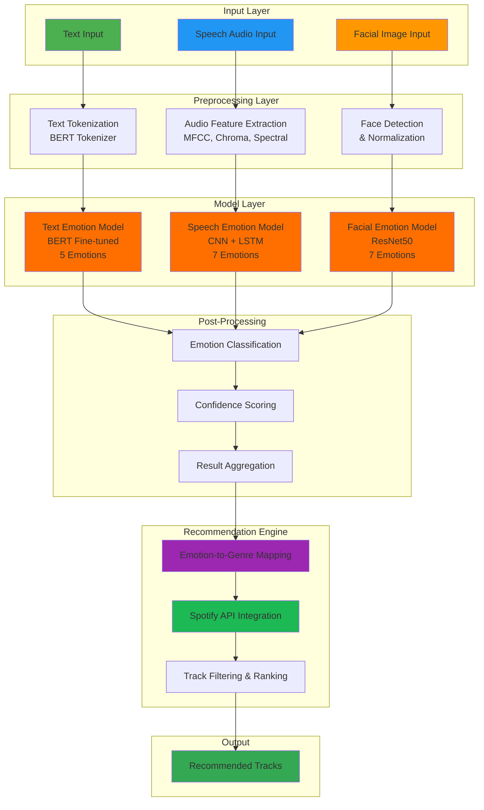
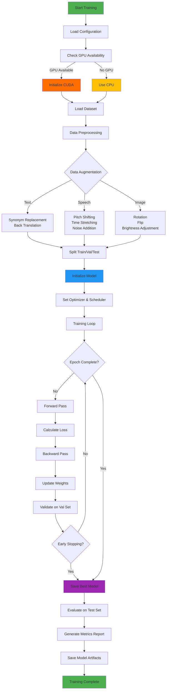
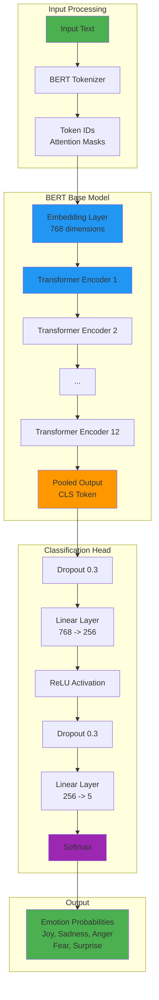
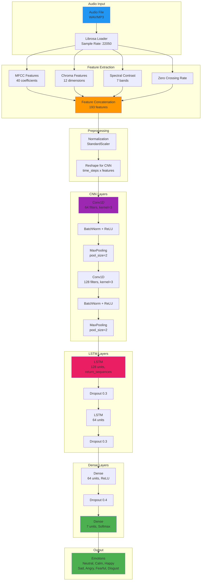
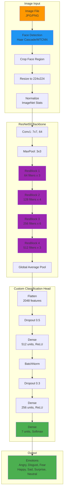

# **Emotion-Based Music Recommendation - AI/ML Directory**

The `ai_ml` directory contains all the necessary components for building, training, and testing the emotion detection models and integrating them with the emotion-based music recommendation system. This directory handles three main types of emotion detection: text-based, speech-based, and facial-based, with each component designed to work seamlessly with the backend recommendation tool.

## Table of Contents

- [Directory Structure](#directory-structure)
- [Getting Started](#getting-started)
- [Install Dependencies](#1-install-dependencies)
- [Install PyTorch (GPU Support)](#2-install-pytorch-gpu-support)
- [Setting Up Configuration](#3-setting-up-configuration)
- [Training the Text Emotion Model](#4-training-the-text-emotion-model)
- [Testing the Emotion Detection Models](#5-testing-the-emotion-detection-models)
- [Running the Flask APIs](#6-running-the-flask-apis)
- [Testing the APIs on Windows and macOS](#testing-the-apis-on-windows-and-macos)
  - [Testing `/text_emotion` Endpoint](#1-testing-text_emotion-endpoint)
  - [Testing `/speech_emotion` Endpoint](#2-testing-speech_emotion-endpoint)
  - [Testing `/facial_emotion` Endpoint](#3-testing-facial_emotion-endpoint)
  - [Testing `/music_recommendation` Endpoint](#4-testing-music_recommendation-endpoint)
- [Notes and Tips](#notes-and-tips)

## **AI/ML System Architecture**



## **Directory Structure**

Here's a detailed breakdown of the directory and its contents:

```
ai_ml/
├── data/
│   ├── training.csv                # Training dataset for the text emotion model
│   └── test.csv                    # Test dataset for evaluating the text emotion model
│
├── models/
│   ├── text_emotion_model/         # Directory containing the trained text emotion model
│   ├── speech_emotion_model/       # Directory containing the trained speech emotion model and scaler
│   │   ├── trained_speech_emotion_model.pkl  # Trained speech emotion model saved as a pickle file
│   │   └── scaler.pkl              # Scaler used for speech emotion feature normalization
│   └── facial_emotion_model/       # Directory intended to store the facial emotion model
│
└── src/
    ├── api/
    │   └── emotion_api.py          # Flask API to test the emotion detection and music recommendation models
    │
    ├── config.py                   # Configuration file containing settings and credentials (e.g., Spotify API credentials)
    │
    ├── utils.py                    # Utility functions, including fetching Spotify access tokens
    │
    ├── recommendation/
    │   └── music_recommendation.py # Contains logic to fetch music recommendations based on detected emotions
    │
    ├── models/
    │   ├── text_emotion.py         # Code for predicting emotions from text inputs
    │   ├── speech_emotion.py       # Code for predicting emotions from speech inputs
    │   ├── facial_emotion.py       # Code for predicting emotions from facial image inputs
    │   ├── download_models.py      # Script to download pre-trained models for speech and facial emotion detection
    │   ├── train_text_emotion.py   # Script to train the text emotion model
    │   └── test_emotion_models.py  # Script to test all emotion models and get music recommendations
    │
    └── data_processing/
        ├── preprocess_text.py      # Optional file for additional preprocessing (if needed)
        └── feature_extraction.py   # Contains functions for extracting features from audio files (used in speech model training)
```

## **Getting Started**

Follow these steps to get started with the project:

### **1. Install Dependencies**

It’s recommended to set up a virtual environment before installing the required packages.

```bash
# Create a virtual environment
python -m venv .venv

# Activate the virtual environment
# On Windows
.venv\Scripts\activate

# On Linux/macOS
source .venv/bin/activate

# Install dependencies
pip install -r requirements.txt
```

### **2. Install PyTorch (GPU Support)**

If you want to train models using GPU support, install PyTorch with CUDA:

```bash
pip3 install torch torchvision torchaudio --index-url https://download.pytorch.org/whl/cu118
```

This installation command is optimized for CUDA 11.8. Check the [official PyTorch website](https://pytorch.org/get-started/locally/) for other CUDA versions.

### **3. Setting Up Configuration**

Update the `config.py` file with your Spotify API credentials and other configuration settings:
```python
CONFIG = {
    "model_name": "bert-base-uncased",
    "num_labels": 5,  # Number of emotion labels
    "batch_size": 16,
    "num_epochs": 4,
    "learning_rate": 2e-5,
    "train_data_path": "C:/Users/hoang/PycharmProjects/Emotion-Based-Music-App/Emotion-Based-Music-App/ai_ml/data/training.csv",  # Replace with your data path
    "test_data_path": "C:/Users/hoang/PycharmProjects/Emotion-Based-Music-App/Emotion-Based-Music-App/ai_ml/data/test.csv", # Replace with your data path
    "output_dir": "C:/Users/hoang/PycharmProjects/Emotion-Based-Music-App/Emotion-Based-Music-App/ai_ml/models/text_emotion_model", # Replace with your data path
    "speech_emotion_model_path": "C:/Users/hoang/PycharmProjects/Emotion-Based-Music-App/Emotion-Based-Music-App/ai_ml/models/speech_emotion_model", # Replace with your data path
    "facial_emotion_model_path": "C:/Users/hoang/PycharmProjects/Emotion-Based-Music-App/Emotion-Based-Music-App/ai_ml/models/facial_emotion_model", # Replace with your data path
    "spotify_client_id": "your_spotify_client_id",  # Replace with your Spotify client ID
    "spotify_client_secret": "your_spotify_client_secret",  # Replace with your Spotify client secret
    "api_port": 5000,
    "max_length": 128,
}
```

### **4. Training the Text Emotion Model**

The `train_text_emotion.py` script trains a BERT-based text emotion model using the dataset found in `data/training.csv`. To start training, run:

```bash
python ai_ml/src/models/train_text_emotion.py
```

Note that, by default, the model will be trained using GPU support if available. If you want to train the model on the CPU, you can modify the script to use the CPU instead.
Before training by GPU, make sure you have installed the necessary dependencies and set up PyTorch with CUDA support.

### **Model Training Workflow**



### **Text Emotion Model Architecture**



### **Speech Emotion Model Architecture**



### **Facial Emotion Model Architecture**



### **Expected Output**
After training, the model and tokenizer will be saved in the `models/text_emotion_model` directory. Below is an example of the expected training output:

<p align="center">
  
</p>

### **5. Testing the Emotion Detection Models**

To test the emotion detection models (text, speech, and facial), run the `test_emotion_models.py` script:

```bash
python ai_ml/src/models/test_emotion_models.py
```

You will be prompted to choose which model you want to test and provide any necessary input files (audio, image, or text).

### **6. Running the Flask APIs**

A simple REST API is provided using Flask to test the models and receive music recommendations. To start the API:

```bash
python ai_ml/src/api/emotion_api.py
```

### **7. Music Recommendation Model**

The `music_recommendation.py` script contains the logic to fetch music recommendations based on the detected emotions. The script uses the Spotify API to fetch music recommendations for the detected emotion.

To test the music recommendation model, run the following command:

```bash
python ai_ml/src/recommendation/music_recommendation.py
```

### **Endpoints:**

- `/text_emotion`: Detects emotion from text input
- `/speech_emotion`: Detects emotion from speech audio
- `/facial_emotion`: Detects emotion from an image
- `/music_recommendation`: Provides music recommendations based on the detected emotion

Here's a detailed guide on **how to test the APIs on both Windows and macOS** using `cURL`. This will help avoid the problems you faced earlier with PowerShell, as it behaves slightly differently from typical command-line interfaces.

### **Testing the APIs on Windows and macOS**

After running the Flask API using:

```bash
python ai_ml/src/api/emotion_api.py
```

You can test the API endpoints using `cURL` commands. Below are the instructions for **both Windows (PowerShell)** and **macOS/Linux (Terminal)**.

#### **1. Testing `/text_emotion` Endpoint**

#### **Windows (PowerShell)**

```powershell
Invoke-WebRequest -Uri "http://127.0.0.1:5000/text_emotion" `
    -Method POST `
    -ContentType "application/json" `
    -Body '{"text": "I am feeling very happy today!"}' `
    -UseBasicParsing
```

#### **macOS/Linux (Terminal)**

```bash
curl -X POST "http://127.0.0.1:5000/text_emotion" \
    -H "Content-Type: application/json" \
    -d '{"text": "I am feeling very happy today!"}'
```

#### **2. Testing `/speech_emotion` Endpoint**

For testing the speech emotion endpoint, you need to upload an audio file (e.g., `speech.mp4` or `speech.wav`).

#### **Windows (PowerShell)**

```powershell
Invoke-WebRequest -Uri "http://127.0.0.1:5000/speech_emotion" `
    -Method POST `
    -InFile "C:\path\to\your\audio\file\speech.mp4" `
    -ContentType "multipart/form-data" `
    -UseBasicParsing
```

#### **macOS/Linux (Terminal)**

```bash
curl -X POST "http://127.0.0.1:5000/speech_emotion" \
    -F "file=@/path/to/your/audio/file/speech.mp4"
```

#### **3. Testing `/facial_emotion` Endpoint**

For testing the facial emotion endpoint, you need to upload an image file (e.g., `image.jpg`).

#### **Windows (PowerShell)**

```powershell
Invoke-WebRequest -Uri "http://127.0.0.1:5000/facial_emotion" `
    -Method POST `
    -InFile "C:\path\to\your\image\file\image.jpg" `
    -ContentType "multipart/form-data" `
    -UseBasicParsing
```

#### **macOS/Linux (Terminal)**

```bash
curl -X POST "http://127.0.0.1:5000/facial_emotion" \
    -F "file=@/path/to/your/image/file/image.jpg"
```

#### **4. Testing `/music_recommendation` Endpoint**

#### **Windows (PowerShell)**

```powershell
Invoke-WebRequest -Uri "http://127.0.0.1:5000/music_recommendation" `
    -Method POST `
    -ContentType "application/json" `
    -Body '{"emotion": "joy"}' `
    -UseBasicParsing
```

#### **macOS/Linux (Terminal)**

```bash
curl -X POST "http://127.0.0.1:5000/music_recommendation" \
    -H "Content-Type: application/json" \
    -d '{"emotion": "joy"}'
```

#### **Explanation:**

- **Windows PowerShell**:
  - PowerShell uses the built-in `Invoke-WebRequest` command for HTTP requests, which differs from the traditional `curl` command.
  - Use backticks (`\``) to break lines in PowerShell.
  - The `-UseBasicParsing` flag is needed in newer versions of PowerShell to bypass certain security checks.

- **macOS/Linux**:
  - Use `curl` with the `-X POST` flag for POST requests.
  - The `-F` flag is used for uploading files, while `-d` is used to send data in JSON format.


### **Notes and Tips**

- **Pre-trained Models:** The `download_models.py` script in `models/` can be used to download pre-trained models for speech and facial emotion detection. These models should be saved in their respective directories (`models/speech_emotion_model` and `models/facial_emotion_model`).
- **Data Handling:** Place your datasets (training and test data) in the `data/` folder before training or testing.

## Contact

If you have any questions or need further assistance, feel free to reach out to me at [hoangson091104@gmail.com](mailto:hoangson091104@gmail.com).

---

Happy training and testing! 🚀

[🔝 Back to Top](#emotion-based-music-recommendation---aiml-directory)
