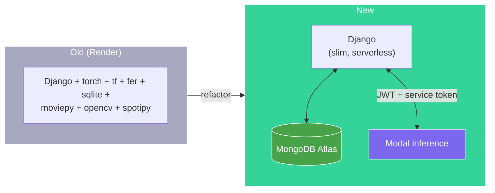
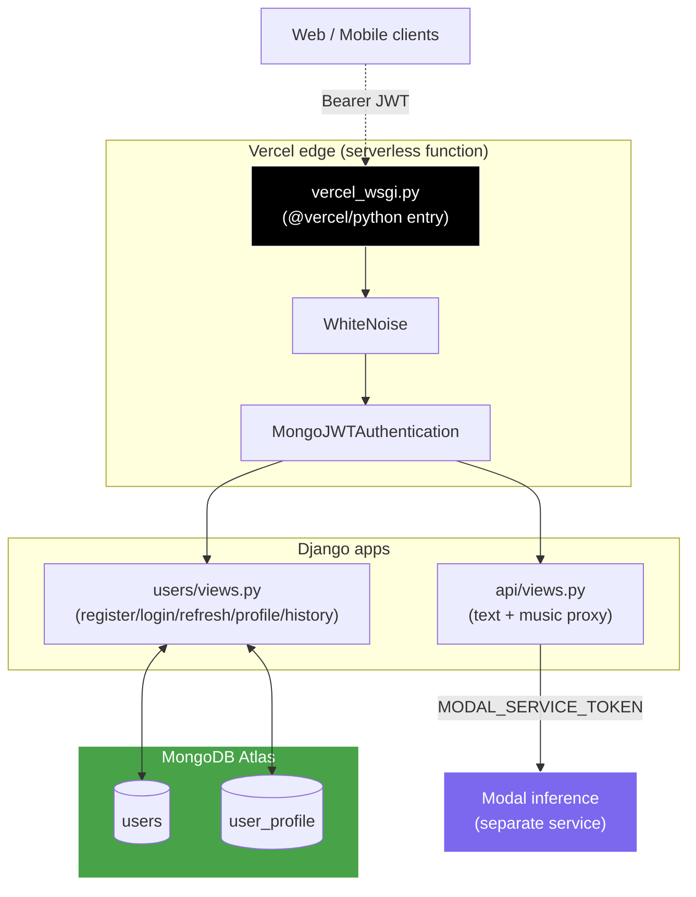
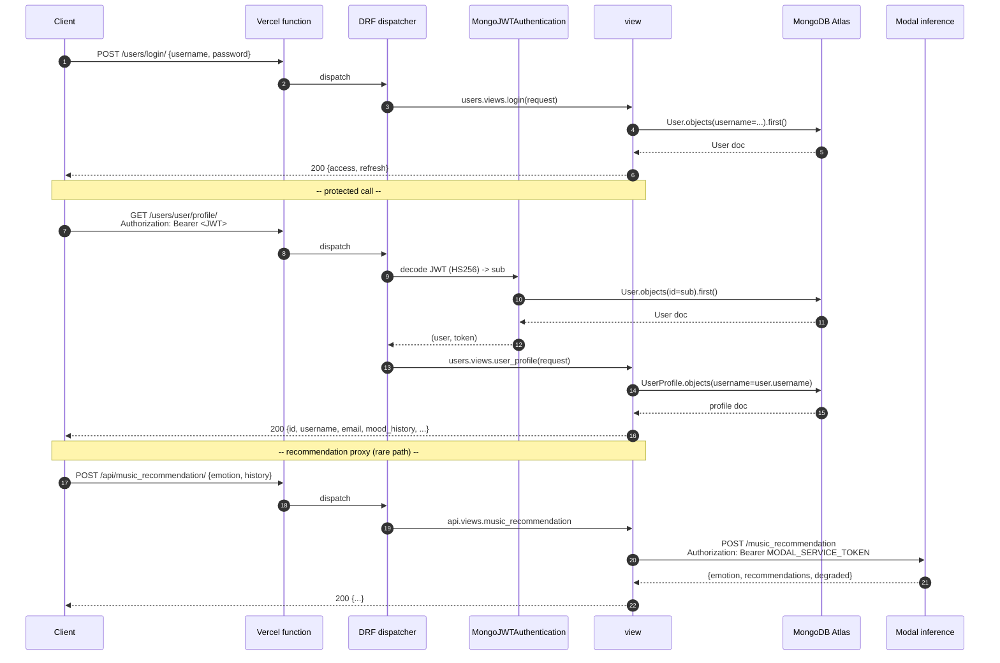
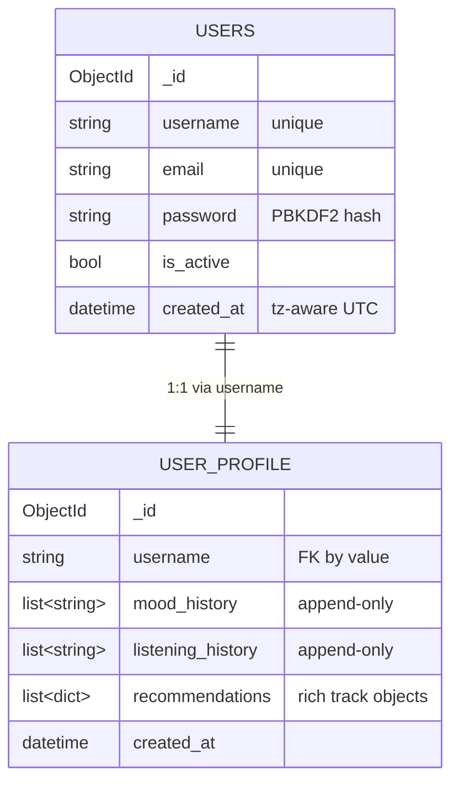
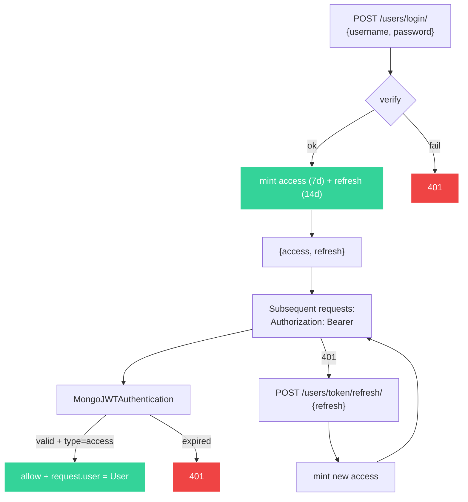
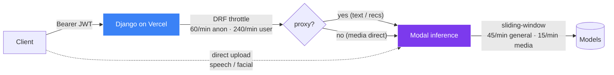

# Moodify Backend (Django API)

<p align="center">
  
</p>

<p align="center">
  Serverless <strong>Django REST API</strong> for Moodify. Owns
  authentication, user profiles, mood / listening history, and proxies
  inference requests to the Modal ML service. Runs on Vercel against
  MongoDB Atlas — no SQL database, no in-process ML.
</p>

<p align="center">
  
  
  
  
  
  
  
  
  
</p>

---

## Table of contents

1. [What it is](#what-it-is)
2. [Why it looks the way it does](#why-it-looks-the-way-it-does)
3. [Architecture](#architecture)
4. [Request lifecycle](#request-lifecycle)
5. [Data model](#data-model)
6. [Authentication](#authentication)
7. [Endpoint reference](#endpoint-reference)
8. [Project layout](#project-layout)
9. [Environment variables](#environment-variables)
10. [Running locally](#running-locally)
11. [Testing](#testing)
12. [OpenAPI / Swagger / Redoc](#openapi--swagger--redoc)
13. [Deployment (Vercel)](#deployment-vercel)
14. [Resilience + serverless gotchas](#resilience--serverless-gotchas)
15. [Troubleshooting](#troubleshooting)
16. [FAQ](#faq)

---

## What it is

A small, slim Django REST API. The deliberate design constraints:

- **No SQL database.** All persistence is MongoDB Atlas via
  `mongoengine`. `DATABASES = {}` in `settings.py` — Django 5 permits
  it. The `auth` app is installed only because DRF + drf-yasg import
  from it; no SQL tables are ever queried.
- **No machine learning code.** Inference (text / speech / face /
  recommendation) lives in the Modal service. This tier proxies to it
  and never imports torch / transformers / fer / librosa / opencv.
  That's what makes the Vercel bundle small enough to ship.
- **Stateless JWT auth** against a Mongo `User` document — no sessions,
  no cookies, no CSRF surface.
- **Always-on Swagger / Redoc**, loaded from a CDN so the docs page
  works on Vercel without `collectstatic`.

---

## Why it looks the way it does

The previous backend was a heavyweight Django + SQLite app that imported
torch, transformers, fer, librosa, opencv, moviepy, facenet-pytorch,
and spotipy at startup. It worked on a Render dyno; it could not deploy
to Vercel. The refactor split the responsibilities cleanly:


```mermaid
flowchart LR
    subgraph Old["Old (Render)"]
        OldD["Django + torch + tf + fer + sqlite +<br/>moviepy + opencv + spotipy"]
    end

    subgraph New["New"]
        NewD["Django<br/>(slim, serverless)"]
        Modal["Modal inference"]
        Atlas[("MongoDB Atlas")]
    end

    Old -- "refactor" --> New
    NewD <--> Atlas
    NewD <-->|JWT + service token| Modal

    style Old fill:#a8a8c0,stroke:#fff,color:#fff
    style New fill:#34d399,stroke:#fff,color:#fff
    style Modal fill:#7B68EE,stroke:#fff,color:#fff
    style Atlas fill:#47A248,stroke:#fff,color:#fff
```

Result: Vercel bundle dropped from 600+ MB to ~20 MB, cold start went
from 30-60 s to 1-2 s, idle memory from 2-4 GB to 0.

---

## Architecture


```mermaid
flowchart TB
    subgraph Edge["Vercel edge (serverless function)"]
        Vw["vercel_wsgi.py<br/>(@vercel/python entry)"]
        Wn["WhiteNoise"]
        Mw["MongoJWTAuthentication"]
    end

    subgraph Apps["Django apps"]
        ApiV["api/views.py<br/>(text + music proxy)"]
        UsersV["users/views.py<br/>(register/login/refresh/profile/history)"]
    end

    Vw --> Wn --> Mw --> ApiV
    Mw --> UsersV

    subgraph Store["MongoDB Atlas"]
        UColl[("users")]
        PColl[("user_profile")]
    end

    UsersV <--> UColl
    UsersV <--> PColl

    Modal["Modal inference<br/>(separate service)"]
    ApiV -- "MODAL_SERVICE_TOKEN" --> Modal

    Clients["Web / Mobile clients"]
    Clients -. "Bearer JWT" .-> Vw

    style Vw fill:#000,stroke:#fff,color:#fff
    style Modal fill:#7B68EE,stroke:#fff,color:#fff
    style Store fill:#47A248,stroke:#fff,color:#fff
```

The web frontend and mobile app call the Modal service *directly* with
a user JWT — Django doesn't sit in the data path for media uploads (a
Vercel function would time out on a 12 MB audio file anyway). Django
*can* proxy text + music recommendation through `api/views.py`
(`/api/text_emotion/`, `/api/music_recommendation/`), using the
`MODAL_SERVICE_TOKEN`; this exists for server-to-server calls and tests.

All user state — mood history, listening history, saved recommendations
— is read and written here, via `mongoengine`.

---

## Request lifecycle


```mermaid
sequenceDiagram
    autonumber
    participant C as Client
    participant V as Vercel function
    participant DRF as DRF dispatcher
    participant Auth as MongoJWTAuthentication
    participant View as view
    participant Mongo as MongoDB Atlas
    participant Modal as Modal inference

    C->>V: POST /users/login/ {username, password}
    V->>DRF: dispatch
    DRF->>View: users.views.login(request)
    View->>Mongo: User.objects(username=...).first()
    Mongo-->>View: User doc
    View-->>C: 200 {access, refresh}

    Note over C,View: -- protected call --

    C->>V: GET /users/user/profile/<br/>Authorization: Bearer <JWT>
    V->>DRF: dispatch
    DRF->>Auth: decode JWT (HS256) -> sub
    Auth->>Mongo: User.objects(id=sub).first()
    Mongo-->>Auth: User doc
    Auth-->>DRF: (user, token)
    DRF->>View: users.views.user_profile(request)
    View->>Mongo: UserProfile.objects(username=user.username)
    Mongo-->>View: profile doc
    View-->>C: 200 {id, username, email, mood_history, ...}

    Note over C,View: -- recommendation proxy (rare path) --

    C->>V: POST /api/music_recommendation/ {emotion, history}
    V->>DRF: dispatch
    DRF->>View: api.views.music_recommendation
    View->>Modal: POST /music_recommendation<br/>Authorization: Bearer MODAL_SERVICE_TOKEN
    Modal-->>View: {emotion, recommendations, degraded}
    View-->>C: 200 {...}
```

---

## Data model

Two MongoDB documents, both via `mongoengine`. Indexes managed in Atlas
(the app sets `auto_create_index=False`, which is the right pattern for
serverless — see [serverless gotchas](#resilience--serverless-gotchas)).


```mermaid
erDiagram
    USERS ||--|| USER_PROFILE : "1:1 via username"

    USERS {
        ObjectId _id
        string username "unique"
        string email "unique"
        string password "PBKDF2 hash"
        bool is_active
        datetime created_at "tz-aware UTC"
    }

    USER_PROFILE {
        ObjectId _id
        string username "FK by value"
        list~string~ mood_history "append-only"
        list~string~ listening_history "append-only"
        list~dict~ recommendations "rich track objects"
        datetime created_at
    }
```

| Collection | Defined in | Notes |
|---|---|---|
| `users` | `users/documents.py` | Auth-bearing; replaces `django.contrib.auth.models.User`. Password hashing reuses `django.contrib.auth.hashers` (pure functions). |
| `user_profile` | `api/models.py` | Re-exported from `users/models.py` so both apps share one definition. |

---

## Authentication


```mermaid
flowchart TD
    A["POST /users/login/<br/>{username, password}"] --> V{"verify"}
    V -- "ok" --> M["mint access (7d) + refresh (14d)"]
    V -- "fail" --> R1["401"]
    M --> Tok["{access, refresh}"]

    Tok --> Use["Subsequent requests:<br/>Authorization: Bearer <access>"]
    Use --> D["MongoJWTAuthentication"]
    D -->|valid + type=access| OK["allow + request.user = User"]
    D -->|expired| R2["401"]
    Use -- "401" --> Ref["POST /users/token/refresh/<br/>{refresh}"]
    Ref --> M2["mint new access"]
    M2 --> Use

    style M fill:#34d399,stroke:#fff,color:#fff
    style OK fill:#34d399,stroke:#fff,color:#fff
    style R1 fill:#ef4444,stroke:#fff,color:#fff
    style R2 fill:#ef4444,stroke:#fff,color:#fff
```

- **HS256 JWTs** signed with `JWT_SIGNING_KEY` — the same key the Modal
  inference service uses to verify them. Django signs; Modal verifies.
- **Custom auth class** (`users/authentication.py`) replaces
  `rest_framework_simplejwt` + the SQL `auth_user` table. It decodes
  the token, looks up the Mongo `User` by `sub`, and attaches it as
  `request.user`.
- **No sessions, no CSRF.** Auth travels in the header.
  `CsrfViewMiddleware` is intentionally omitted (silenced via
  `SILENCED_SYSTEM_CHECKS`).

---

## Throttling + cost protection

Django sits in front of MongoDB Atlas (cheap) and the Modal inference
service (the expensive bit). Two layers of throttling protect the
Modal budget end-to-end:


```mermaid
flowchart LR
    C[Client] -->|Bearer JWT| D[Django on Vercel]
    D -- "DRF throttle<br/>60/min anon · 240/min user" --> P{proxy?}
    P -- "yes (text / recs)" --> M[Modal inference]
    P -- "no (media direct)" --> M
    C -.->|direct upload<br/>speech / facial| M
    M -- "sliding-window<br/>45/min general · 15/min media" --> Models[(Models)]

    style D fill:#3b82f6,stroke:#fff,color:#fff
    style M fill:#7c3aed,stroke:#fff,color:#fff
```

| Layer | Where | Default | What it protects |
|---|---|---|---|
| **DRF throttling** (`AnonRateThrottle`, `UserRateThrottle`) | Django, every endpoint | `60/min` anon, `240/min` user | DB load, login brute-force, the proxied inference paths |
| **Modal sliding-window limit** | Modal, per inference endpoint | `45/min` general, `15/min` media (per user JWT `sub`) | Modal compute spend |
| **`MAX_CONTAINERS=5`** | Modal app config | hard cap | Final cost ceiling — see `modal_inference/README.md` |

Tune the DRF tier via `THROTTLE_ANON` / `THROTTLE_USER`; tune the
Modal tier via `RATE_LIMIT_PER_USER` / `RATE_LIMIT_MEDIA_PER_USER` in
the Modal Secret. **Service-token (Django → Modal proxy) calls bypass
the Modal limiter entirely** — DRF is the right place to throttle
proxied traffic, so we don't double-limit a single user via two
different counters.

For the full caching + rate-limit design (algorithms, multi-container
trade-offs, observability), see
[`../modal_inference/README.md`](../modal_inference/README.md#rate-limiting).

---

## SRE metrics

A custom Django middleware (`observability.middleware.MetricsMiddleware`)
records **one row per request** to a MongoDB Atlas time-series
collection (`backend_metrics`). The aggregated view is queryable via
`GET /api/metrics/`.

### Schema (one doc per request)

```json
{
  "ts":         "2026-05-23T14:30:00.123Z",
  "meta": {
    "service":      "django",
    "endpoint":     "/users/<str:user_id>/profile/",
    "method":       "GET",
    "container":    "iad1-...",
    "status_class": "2xx"
  },
  "status":     200,
  "latency_ms": 18.7
}
```

* The `endpoint` is the **URL pattern** (`/users/<str:user_id>/...`),
  not the resolved path -- a million distinct user IDs collapse to
  one bucket so the time-series stays sane.
* **TTL: 30 days** native (env-tunable). No cron required.
* Internal paths skipped: `/swagger/`, `/redoc/`, `/favicon.ico`,
  `/api/health/`, `/api/metrics/` itself -- liveness probes would
  otherwise drown signal in noise.

### Reading: `GET /api/metrics/?window=1h`

**Admin-only**: requires `Authorization: Bearer <ADMIN_METRICS_TOKEN>`
(falls back to `MODAL_SERVICE_TOKEN` if the dedicated admin secret
isn't set). End-user JWTs are explicitly rejected -- the endpoint is
listed in Swagger under the **System** tag.

```bash
curl -s -H "Authorization: Bearer $ADMIN_METRICS_TOKEN" \
     "https://<YOUR_URL>/api/metrics/?window=1h" | jq
```

`window` ∈ `{5m, 15m, 1h, 6h, 24h, 7d, 30d}` (default `1h`).
`endpoint=` optionally narrows to one URL pattern.

Response shape (identical to the Modal `/metrics` shape, just
`service: "django"`):

```json
{
  "service": "django",
  "window": {"label": "1h", "since": "...", "until": "...", "seconds": 3600},
  "persisted": {
    "available": true,
    "endpoints": [
      {
        "endpoint": "/users/login/", "method": "POST",
        "count": 412, "error_count": 3, "error_rate": 0.0073,
        "latency_ms": {"p50": 12, "p95": 31, "p99": 78, "max": 142, "mean": 18, "samples": 412},
        "status_codes": {"200": 409, "401": 3}
      }
    ]
  },
  "live": { "container": "...", "uptime_seconds": 412.5, "endpoints": [...] }
}
```

### Configuration

```
METRICS_ENABLED        # default: True
METRICS_COLLECTION     # default: backend_metrics
METRICS_TTL_DAYS       # default: 30
ADMIN_METRICS_TOKEN    # admin bearer for /api/metrics/; falls back to MODAL_SERVICE_TOKEN
```

### Resilience

The middleware is **fully defensive** -- a Mongo outage, a recorder
bug, or a stats failure cannot break a request. All exceptions are
caught locally and logged at WARNING. See `observability/middleware.py`.

For the matching Modal-side design, see
[`../modal_inference/README.md#sre-metrics`](../modal_inference/README.md#sre-metrics).

---

## Endpoint reference

### Auth + account management — `/users/`

| Method | Path | Auth | Body | Effect |
|---|---|---|---|---|
| `POST` | `/users/register/` | none | `{username, email, password}` | Creates `User` + empty `UserProfile`. |
| `POST` | `/users/login/` | none | `{username, password}` | Returns `{access, refresh}`. |
| `POST` | `/users/token/refresh/` | none | `{refresh}` | Returns a fresh access token. |
| `GET`  | `/users/validate_token/` | bearer | — | 200 if the access token is valid. |
| `POST` | `/users/verify-username-email/` | none | `{username, email}` | First step of forgot-password (proves identity). |
| `POST` | `/users/reset-password/` | none | `{username, new_password}` | Second step; resets password. |
| `GET`  | `/users/user/profile/` | bearer | — | Returns the signed-in user's profile. |
| `PUT`  | `/users/user/profile/update/` | bearer | `{email}` | Updates mutable profile fields. |
| `DELETE` | `/users/user/profile/delete/` | bearer | — | Permanently deletes the account + profile. |

### History — `/users/{kind}/<user_id>/`

| Kind | Methods | Body |
|---|---|---|
| `mood_history` | `GET`, `POST` (append), `DELETE` (single entry) | `{mood}` |
| `listening_history` | `GET`, `POST` (append), `DELETE` (single entry) | `{track}` |
| `recommendations` | `GET`, `POST` (append), `DELETE` (clear all) | `{recommendations: [...]}` |

### Inference proxy — `/api/`

| Method | Path | Auth | Body | What it does |
|---|---|---|---|---|
| `GET` | `/api/health/` | none | — | `{status: ok}`. |
| `POST` | `/api/text_emotion/` | none | `{text}` | Proxies to Modal `/text_emotion`. |
| `POST` | `/api/music_recommendation/` | none | `{emotion, market?, history?}` | Proxies to Modal `/music_recommendation`. |

The proxy paths exist for server-to-server use; the web + mobile
clients usually call Modal directly with their own user JWT.

### Docs

| Path | Body |
|---|---|
| `/` | 302 to `/swagger/`. |
| `/swagger/` | Swagger UI (CDN-loaded, see `backend/swagger.py`). |
| `/redoc/` | Redoc UI (CDN-loaded). |
| `/swagger.json` & `/swagger.yaml` | OpenAPI schema. |
| `/favicon.ico` | 302 to a music-note SVG on jsDelivr. |

---

## Project layout

```
backend/
├── manage.py
├── vercel_wsgi.py          @vercel/python entrypoint (uses backend.wsgi:application)
├── vercel.json             routes everything to vercel_wsgi.py
├── requirements.txt        slim deps -- NO ML packages
├── backend/
│   ├── settings.py         JWT + MongoDB + CORS + drf-yasg
│   ├── urls.py             /, /users/, /api/, /swagger/, /redoc/, /favicon.ico
│   ├── swagger.py          CDN-loaded Swagger + Redoc + schema endpoints
│   └── wsgi.py             standard Django WSGI application
├── api/
│   ├── views.py            health, text_emotion proxy, music_recommendation proxy
│   ├── urls.py
│   ├── models.py           UserProfile (mood/listening/recommendations history)
│   └── services/
│       └── inference_client.py    HTTP client to Modal, with retry
├── users/
│   ├── views.py            register, login, refresh, profile, password-reset, history
│   ├── urls.py
│   ├── authentication.py   MongoJWTAuthentication (replaces SQL auth)
│   ├── documents.py        User (Mongo, with PBKDF2 hashing)
│   └── tokens.py           jwt encode/decode wrappers
├── tests/                  80 tests, runs against mongomock
└── .env.example
```

---

## Environment variables

Copy `.env.example` → `backend/.env` for local dev; set the same names
in your Vercel project's Environment Variables for production.

| Variable | Required | Purpose |
|---|---|---|
| `SECRET_KEY` | yes | Django secret (use `openssl rand -hex 32`) |
| `DEBUG` | no | Default `False`; do **not** set true in prod |
| `ALLOWED_HOSTS` | no | Default `*`. `.vercel.app,localhost,127.0.0.1` is reasonable |
| `MONGO_DB_URI` | yes | Atlas connection string (`mongodb+srv://...`) |
| `MONGO_DB_NAME` | no | Default `emotion_based_music_db` |
| `MONGO_DB_USERNAME` / `MONGO_DB_PASSWORD` | sometimes | Only if not embedded in the URI |
| `MONGO_MAX_POOL_SIZE` | no | Default `10`; small for serverless |
| `JWT_SIGNING_KEY` | yes | **Must match Modal**'s `JWT_SIGNING_KEY` |
| `JWT_ACCESS_TOKEN_DAYS` | no | Default 7 |
| `JWT_REFRESH_TOKEN_DAYS` | no | Default 14 |
| `MODAL_INFERENCE_URL` | yes | URL printed by `modal deploy modal_app.py` |
| `MODAL_SERVICE_TOKEN` | yes | **Must match Modal**'s `MODAL_SERVICE_TOKEN` |
| `CORS_ALLOW_ALL_ORIGINS` | no | Default `True`; flip to lock down |
| `CORS_ALLOWED_ORIGINS` | no | When the above is `False` |
| `THROTTLE_ANON` | no | DRF anonymous-user rate. Default `60/min`. |
| `THROTTLE_USER` | no | DRF authenticated-user rate. Default `240/min`. |
| `CACHE_REDIS_URL` | no | If set, use Redis (e.g. Upstash) instead of LocMem cache |

---

## Running locally

```bash
cd backend
python -m venv .venv && source .venv/bin/activate
pip install -r requirements.txt

cp .env.example .env                # fill in MONGO_DB_URI, JWT_SIGNING_KEY, ...
python manage.py runserver

# Sanity:
curl http://127.0.0.1:8000/api/health/        # {"status":"ok"}
curl -I http://127.0.0.1:8000/                # 302 -> /swagger/
open http://127.0.0.1:8000/swagger/           # CDN-loaded Swagger UI
```

No `migrate` step — there's no SQL database. The first request that
needs the Mongo `User` collection will simply hit Atlas.

---

## Testing

```bash
pip install -r requirements.txt
pytest -q                                     # 80 tests, runs against mongomock
```

The whole suite is offline — `conftest.py` swaps the live mongoengine
connection for a `mongomock.MongoClient`, so no real Atlas cluster is
needed.

| File | Tests | Covers |
|---|---|---|
| `test_api_views.py` | 12 | `/api/health/`, text-emotion proxy, music-recommendation proxy (including history cap + sanitization) |
| `test_auth_endpoints.py` | 17 | register, login, refresh, validate, forgot-password (verify + reset) |
| `test_history_endpoints.py` | 14 | mood / listening / recommendations CRUD |
| `test_inference_client.py` | 8 | HTTP client to Modal, retry behaviour, missing-URL guard |
| `test_profile_endpoints.py` | 5 | profile read, email update, account delete |
| `test_functional_journey.py` | 1 | end-to-end: register → login → analyse → save → fetch |
| `test_users.py` | 23 | document-level checks for `User` + `UserProfile` |

---

## OpenAPI / Swagger / Redoc

`backend/swagger.py` returns hand-rolled HTML for the UI pages with
Swagger UI / Redoc loaded from jsDelivr. That sidesteps Django's
`staticfiles` pipeline entirely — the docs render correctly on Vercel
without ever running `collectstatic`. The OpenAPI schema itself is
still produced by `drf_yasg` and served at `/swagger.json` and
`/swagger.yaml`.

A music-note SVG favicon (Twemoji on jsDelivr) is referenced by both
docs pages and served from `/favicon.ico` so browser tabs and request
logs stop showing 404s.

---

## Deployment (Vercel)

```bash
cd backend
vercel link                                   # name the project, e.g. moodify-api

# Set every required env var. CLI prompts for the value of each.
for v in SECRET_KEY DEBUG ALLOWED_HOSTS \
         MONGO_DB_URI MONGO_DB_NAME MONGO_DB_USERNAME MONGO_DB_PASSWORD \
         JWT_SIGNING_KEY MODAL_INFERENCE_URL MODAL_SERVICE_TOKEN; do
    vercel env add "$v" production
done

vercel --prod
```

`vercel.json` routes every request to `vercel_wsgi.py`, which the
`@vercel/python` runtime detects and serves. The `staticfiles/`
directory is not generated at build time — WhiteNoise serves from the
source tree via `WHITENOISE_USE_FINDERS = True`, and the doc pages
load assets from a CDN so there's nothing to collect anyway.

After deploy:

```bash
curl https://<YOUR_DJANGO_VERCEL_URL>/api/health/           # {"status":"ok"}
curl -I https://<YOUR_DJANGO_VERCEL_URL>/                   # 302 -> /swagger/
open https://<YOUR_DJANGO_VERCEL_URL>/swagger/
```

---

## Resilience + serverless gotchas

| Gotcha | Why it bites on serverless | Fix in this codebase |
|---|---|---|
| **`pkg_resources` missing on Python 3.12** | `drf_yasg` still imports `pkg_resources` at module load | `setuptools<81` pinned in `requirements.txt` |
| **Index conflicts on first request** | Every cold start would call `ensure_indexes()`, which 500s if Atlas already has a conflicting / dirty spec | `auto_create_index=False` on both documents; indexes managed in Atlas |
| **Mongo connection storms** | Each warm pod opens its own pool; many pods × big pool = Atlas connection limit hit | `MONGO_MAX_POOL_SIZE=10` |
| **`staticfiles/` doesn't exist** | Vercel build doesn't run `collectstatic` | WhiteNoise `USE_FINDERS=True`; docs load from CDN |
| **No SQL** | Django insists on SQL by default | `DATABASES = {}` (Django 5 allows this) |
| **CSRF** | Browsers don't send a CSRF token to a JWT API | `CsrfViewMiddleware` omitted, `security.W003` silenced |

---

## Troubleshooting

| Symptom | Likely cause | Fix |
|---|---|---|
| 500 on every request after deploy | `pkg_resources` missing (Python 3.12) | Confirm `setuptools<81` in `requirements.txt` |
| 500 on first login after deploy | Atlas has a stale unique index from an older schema | Re-set indexes in Atlas, or just drop the affected collection (start fresh) |
| 401 on every authenticated call from clients | `JWT_SIGNING_KEY` mismatch between Django and Modal | Set both to the same value, redeploy both |
| `/swagger/` renders blank | Wrong code path — make sure you're on the CDN-loaded `swagger.py` | `git pull`, redeploy |
| Cold start > 5 s | Mongo connection cold + lambda init | Acceptable; warms up after one request |
| `INFRA: connection limit` from Atlas | Too many warm pods × pool size | Lower `MONGO_MAX_POOL_SIZE`, or bump the Atlas tier |

---

## FAQ

**Why MongoDB instead of Postgres?** Atlas's free tier is generous, the
data model is a few document types with very list-shaped relations
(history arrays inside profiles), and Vercel's serverless model fits
mongoengine's stateless usage well. There's no relational join in the
app's hot paths.

**Why not put inference *behind* Django?** Two reasons: (1) Vercel
functions time out before a 12 MB audio file finishes uploading, and
(2) Modal's GPU access and memory snapshots are not available through
a Django bundle. The current split — clients call Modal directly with
their JWT — avoids both ceilings.

**Why no admin app?** No SQL → no Django admin. We never needed one;
all state is per-user history.

**Can I run this against a local MongoDB?** Yes — set
`MONGO_DB_URI=mongodb://localhost:27017/emotion_based_music_db` and
remove `ssl=True` from `settings.py` if your local instance is plain.
The test suite uses `mongomock` anyway, so this only matters for
manual smoke-testing.

---

> Part of the [Moodify](../README.md) monorepo.
> Inference: [`../modal_inference/README.md`](../modal_inference/README.md).
> Web client: [`../frontend/README.md`](../frontend/README.md).
> Mobile client: [`../mobile/README.md`](../mobile/README.md).
> Full architecture: [`../ARCHITECTURE.md`](../ARCHITECTURE.md).
