# Moodify Deployment Architecture

Comprehensive visual documentation of the Moodify deployment architecture using Mermaid diagrams.

## Table of Contents

- [Overall Architecture](#overall-architecture)
- [Blue-Green Deployment Flow](#blue-green-deployment-flow)
- [Canary Deployment Flow](#canary-deployment-flow)
- [Traffic Management](#traffic-management)
- [CI/CD Pipeline](#cicd-pipeline)
- [Rollback Procedures](#rollback-procedures)
- [Infrastructure Components](#infrastructure-components)
- [Security Architecture](#security-architecture)

## Overall Architecture

### High-Level System Architecture

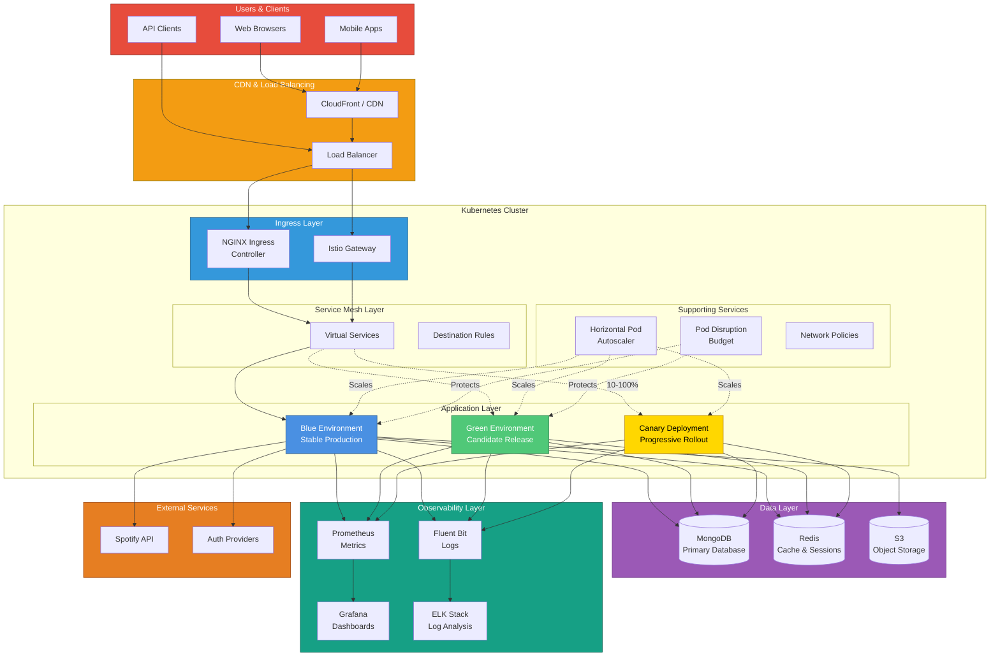

## Blue-Green Deployment Flow

### Complete Blue-Green Deployment Process

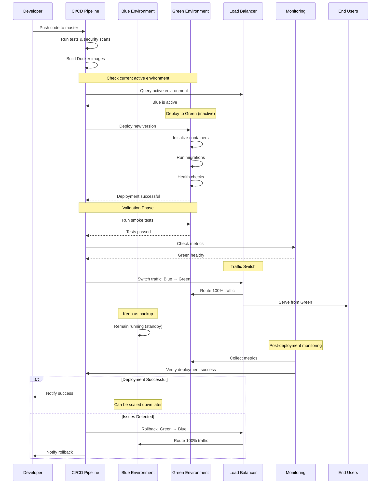

### Blue-Green State Transitions

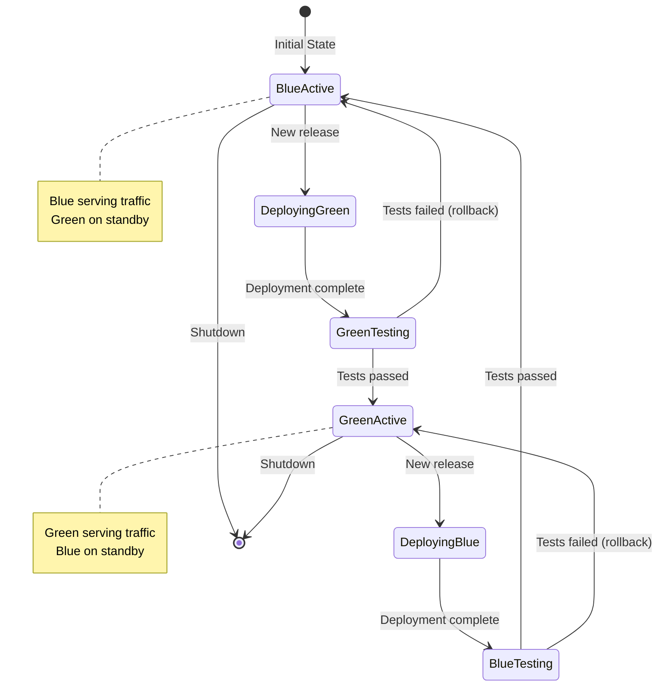

## Canary Deployment Flow

### Progressive Canary Rollout

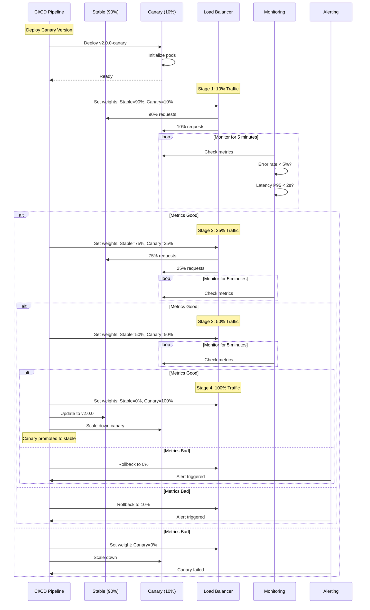

### Canary Deployment State Machine

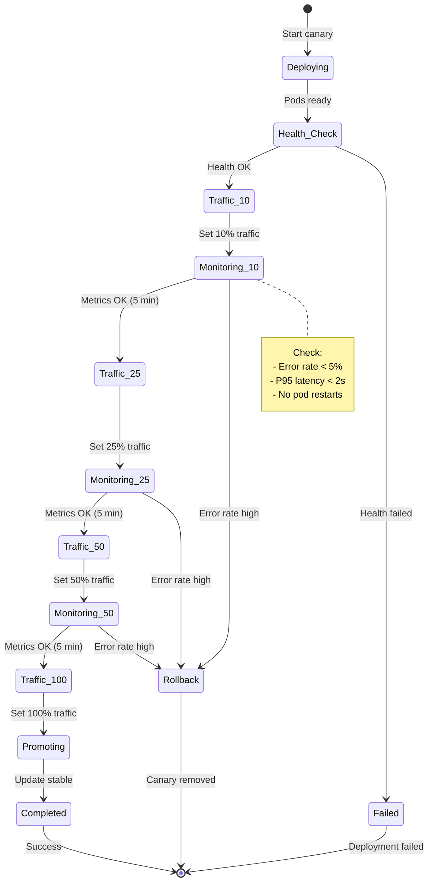

## Traffic Management

### Istio Traffic Routing

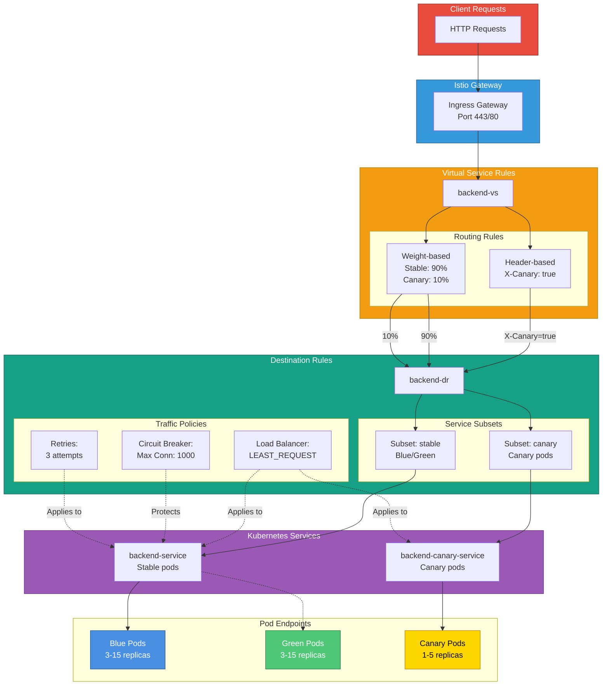

### NGINX Ingress Canary Routing

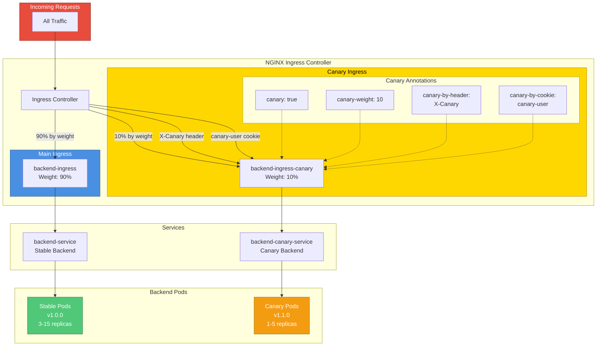

## CI/CD Pipeline

### Complete Pipeline Architecture

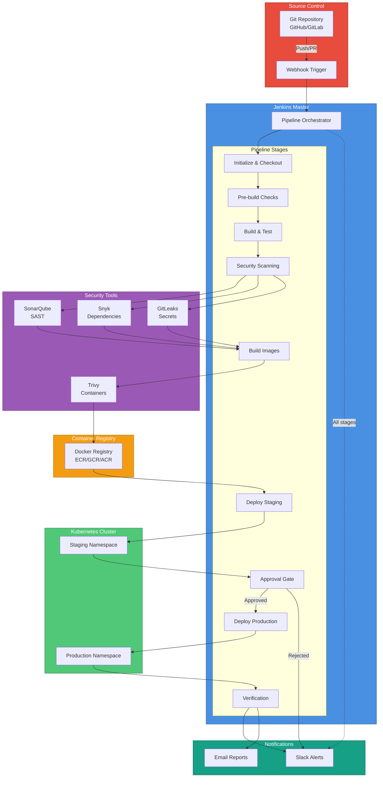

### Deployment Decision Tree

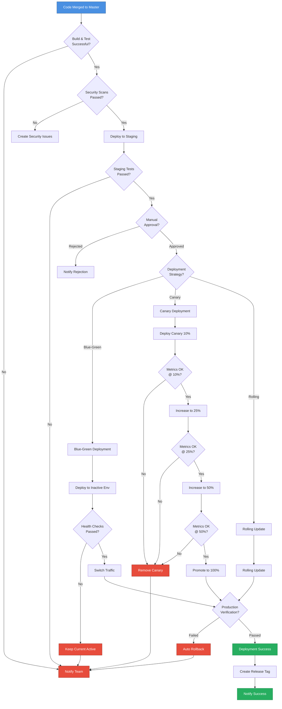

## Rollback Procedures

### Rollback Flow

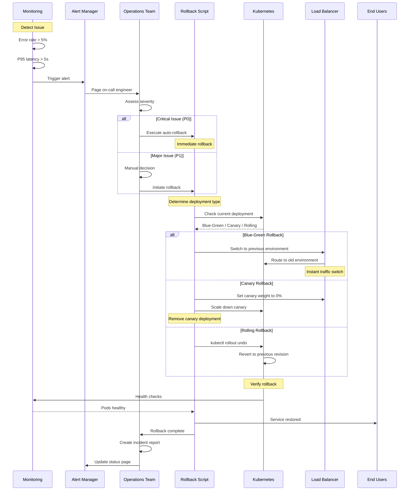

### Rollback Decision Matrix

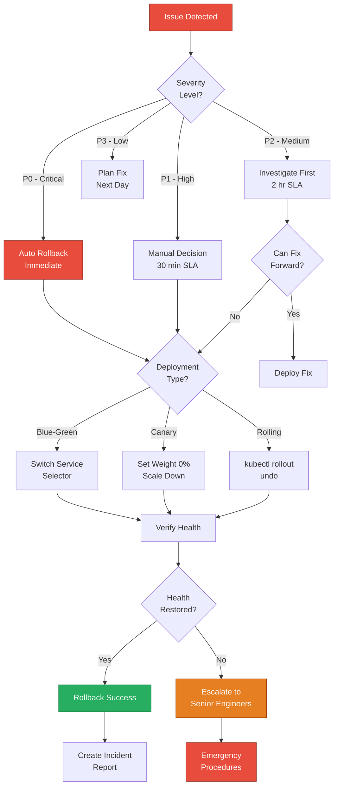

## Infrastructure Components

### Kubernetes Resource Hierarchy

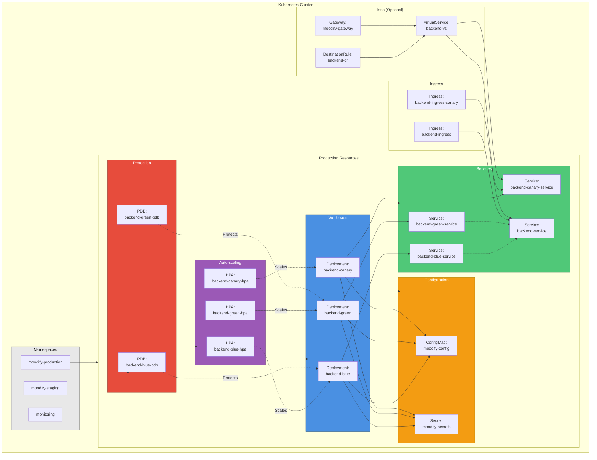

## Security Architecture

### Multi-Layer Security Model

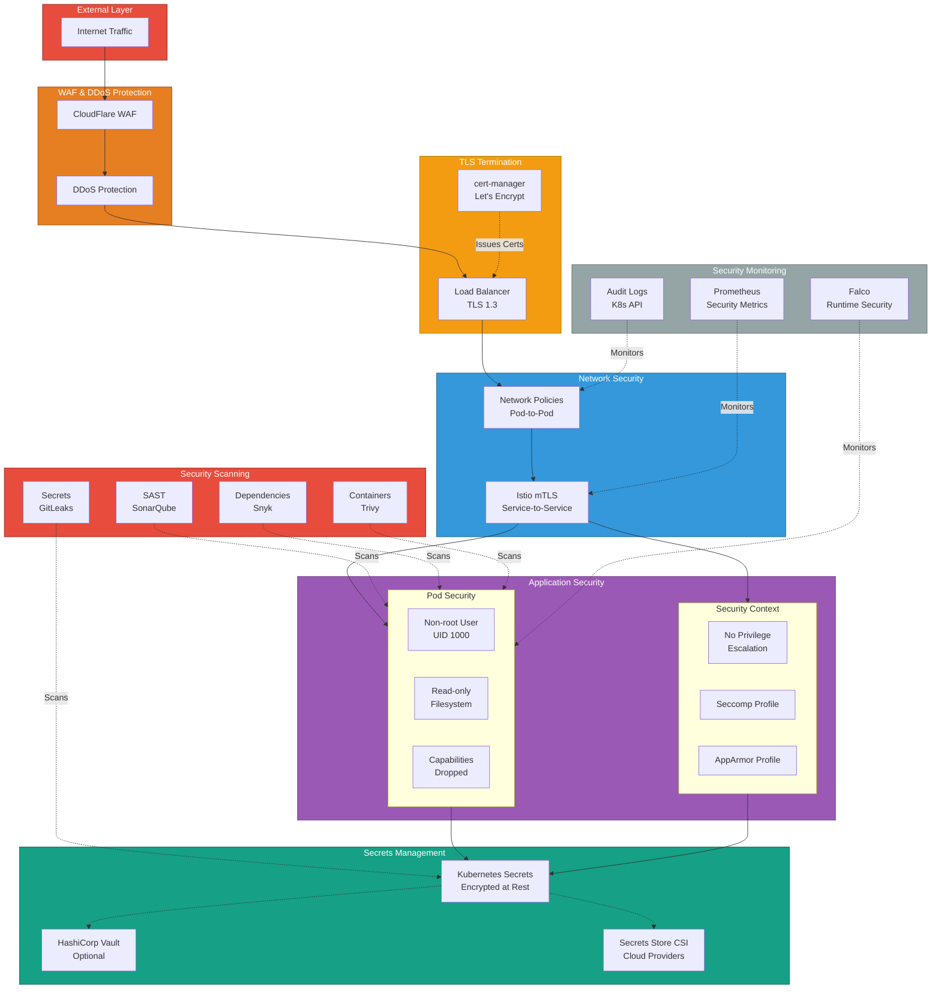

### Security Scanning Pipeline

```mermaid
graph LR
    subgraph Code["Code Stage"]
        GIT[Git Commit]
    end

    subgraph PreBuild["Pre-build Scans"]
        GITLEAKS[GitLeaks<br/>Secret Detection]
        SONAR[SonarQube<br/>SAST]
    end

    subgraph BuildTime["Build-time Scans"]
        SNYK_DEP[Snyk<br/>Dependencies]
        SNYK_CODE[Snyk Code<br/>SAST]
    end

    subgraph ImageScans["Image Scans"]
        TRIVY[Trivy<br/>Container Scan]
        CLAIR[Clair<br/>Vulnerability DB]
    end

    subgraph Runtime["Runtime Security"]
        FALCO[Falco<br/>Behavior Monitoring]
        OPA[OPA Gatekeeper<br/>Policy Enforcement]
    end

    subgraph Results["Results"]
        PASS[Security Approved]
        FAIL[Block Deployment]
    end

    GIT --> GITLEAKS
    GIT --> SONAR

    GITLEAKS --> SNYK_DEP
    SONAR --> SNYK_DEP

    SNYK_DEP --> SNYK_CODE
    SNYK_CODE --> TRIVY

    TRIVY --> CLAIR
    CLAIR --> CHECK{All Scans<br/>Passed?}

    CHECK -->|Yes| PASS
    CHECK -->|No| FAIL

    PASS --> DEPLOY[Deploy to Cluster]
    DEPLOY --> FALCO
    DEPLOY --> OPA

    style Code fill:#4A90E2,stroke:#2E5C8A,color:#fff
    style PreBuild fill:#F39C12,stroke:#9A7D0A,color:#fff
    style BuildTime fill:#9B59B6,stroke:#6C3483,color:#fff
    style ImageScans fill:#E67E22,stroke:#A04000,color:#fff
    style Runtime fill:#16A085,stroke:#0E6655,color:#fff
    style PASS fill:#27AE60,stroke:#1E8449,color:#fff
    style FAIL fill:#E74C3C,stroke:#922B21,color:#fff
```

---

**Document Version**: 1.0
**Last Updated**: 2025-11-26
**Maintained by**: DevOps Team

This document provides comprehensive visual documentation of the Moodify deployment architecture using Mermaid diagrams. All diagrams are rendered automatically in Markdown-compatible viewers.
