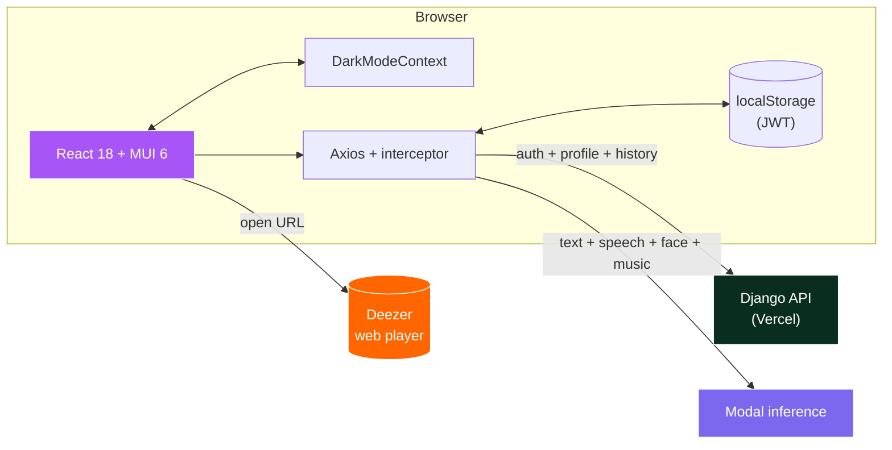
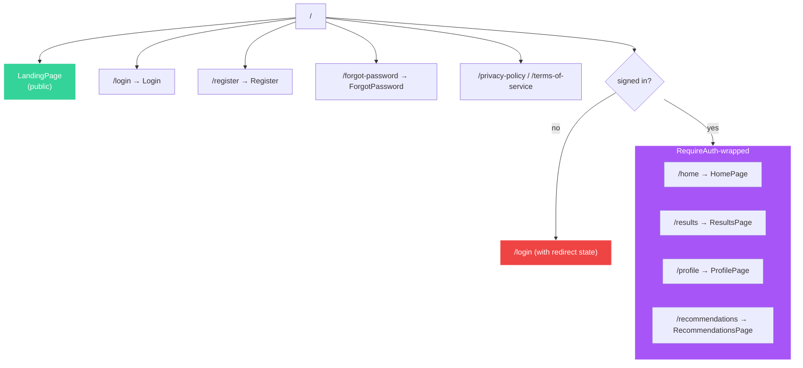
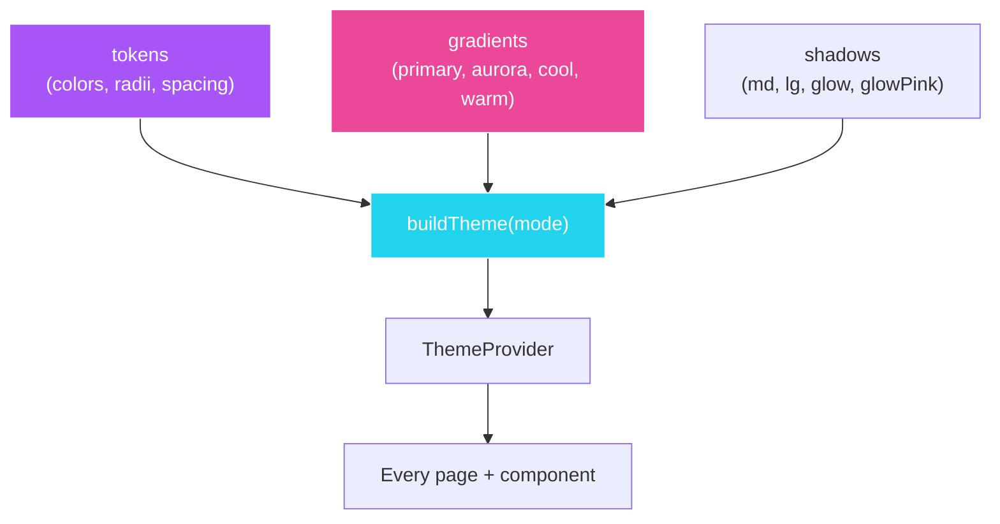
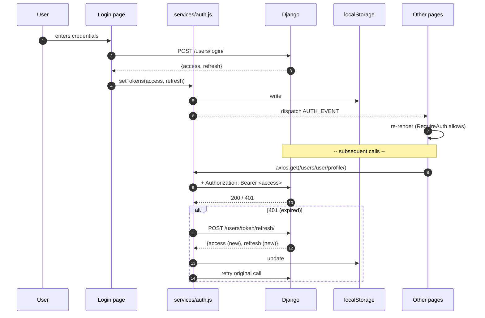

# Moodify Web Frontend

<p align="center">
  
</p>

<p align="center">
  React 18 + MUI 6 web client for Moodify. Modern, gated UI with a
  violet→pink brand system, glassmorphic navbar, animated landing page,
  and gated feature routes. Detects a mood from text, voice or a
  webcam selfie and returns a Deezer playlist tuned to it.
</p>

<p align="center">
  
  
  
  
  
  
  
  
  
</p>

---

## Table of contents

1. [What it is](#what-it-is)
2. [Architecture](#architecture)
3. [Route map + auth gating](#route-map--auth-gating)
4. [Page tour](#page-tour)
5. [Design system](#design-system)
6. [Auth flow](#auth-flow)
7. [Service layer](#service-layer)
8. [Project layout](#project-layout)
9. [Environment + config](#environment--config)
10. [Running locally](#running-locally)
11. [Testing](#testing)
12. [Deployment (Vercel)](#deployment-vercel)
13. [Troubleshooting](#troubleshooting)
14. [FAQ](#faq)

---

## What it is

A single-page React application that calls two backends:

- **Django REST API** (`REACT_APP_API_URL`) — register, login, refresh,
  profile, mood + listening + recommendations history.
- **Modal inference service** (`REACT_APP_MODAL_API_URL`) — text /
  speech / face emotion detection + Deezer-backed music recommendations.

The full system architecture is in [`../ARCHITECTURE.md`](../ARCHITECTURE.md);
the backends each have their own README ([`../backend/README.md`](../backend/README.md),
[`../modal_inference/README.md`](../modal_inference/README.md)).

---

## Architecture


```mermaid
flowchart LR
    subgraph Browser["Browser"]
        UI["React 18 + MUI 6"]
        Ctx["DarkModeContext"]
        LS[("localStorage<br/>(JWT)")]
        Ax["Axios + interceptor"]
    end

    UI <--> Ctx
    UI --> Ax
    Ax <--> LS

    Ax -- "auth + profile + history" --> API["Django API<br/>(Vercel)"]
    Ax -- "text + speech + face + music" --> Modal["Modal inference"]
    UI -- "open URL" --> Deezer[("Deezer<br/>web player")]

    style UI fill:#a855f7,stroke:#fff,color:#fff
    style API fill:#092E20,stroke:#fff,color:#fff
    style Modal fill:#7B68EE,stroke:#fff,color:#fff
    style Deezer fill:#FF6600,stroke:#fff,color:#fff
```

`services/auth.js` installs a global axios interceptor: every outgoing
request carries the JWT, and a `401` triggers **one** silent refresh +
retry before the user is bounced to `/login`. Same-tab logout is
broadcast via `AUTH_EVENT`; cross-tab logout is picked up via the
browser's `storage` event.

---

## Route map + auth gating

Every feature route is wrapped in `<RequireAuth>` — anonymous visitors
are redirected to `/login` with the attempted path preserved in router
state so they bounce back after sign-in.


```mermaid
flowchart TD
    A["/"] --> L["LandingPage<br/>(public)"]
    A --> N1["/login → Login"]
    A --> N2["/register → Register"]
    A --> N3["/forgot-password → ForgotPassword"]
    A --> N4["/privacy-policy / /terms-of-service"]

    A --> G{"signed in?"}
    G -- "no" --> Bounce["/login (with redirect state)"]
    G -- "yes" --> Gated

    subgraph Gated["RequireAuth-wrapped"]
        Home["/home → HomePage"]
        Res["/results → ResultsPage"]
        Prof["/profile → ProfilePage"]
        Rec["/recommendations → RecommendationsPage"]
    end

    style L fill:#34d399,stroke:#fff,color:#fff
    style Bounce fill:#ef4444,stroke:#fff,color:#fff
    style Gated fill:#a855f7,stroke:#fff,color:#fff
```

Code: `components/RequireAuth.jsx` + `App.js`.

---

## Page tour

### Landing (`/`)

Public. Hero with gradient title, floating orbs, animated mood pills.
Three-mode showcase (Text / Voice / Face), a how-it-works strip, a
Features grid, and a gradient CTA card. ~500 lines, no marketing copy
bloat.

### Login / Register / Forgot password

Shared `AuthShell` two-panel layout:
- **Left**: brand gradient panel with a checklist of selling points.
- **Right**: compact MUI form with proper error surface.

`ForgotPassword` adds a real two-step progress rail (verify → reset).
After register, the form auto-signs in and routes to `/home`.

### Home (`/home`, gated)

Pill mode tabs (`Text` / `Face` / `Speech`) with per-mode accent colours
(violet / pink / cyan). A single panel swaps context-appropriate
inputs:

| Mode | Inputs |
|---|---|
| Text | Multiline textarea |
| Face | "Upload Image" file picker **or** "Use Camera" → inline `react-webcam` capture |
| Speech | "Upload Audio" file picker **or** in-place `MediaRecorder` recording with a pulsing stop button + preview `<audio>` |

Submit posts to the Modal service, saves mood + recommendations to the
Django history, and navigates to `/results`.

### Results (`/results`, gated)

Big mood-banner hero with a bobbing emoji, per-mood colour gradient,
and a gradient mood title. Two `Select` filters underneath:

- **Sort by mood** — re-fetches recommendations for the chosen emotion.
- **Sort by region** — passes a market hint (Deezer accepts ISO-3166).

Tracks render as cover-art cards with hover lift, inline 30-second
preview audio, and a gradient "Listen on Deezer" CTA.

### Profile (`/profile`, gated)

Account avatar (gradient initial), stats (moods logged / saved tracks /
listened), recent moods chips, recent tracks chips (tappable → Deezer
search). Settings entry point for email / password / data actions
(handled by sub-components under `components/Profile/`).

### Privacy / Terms / 404

Lightweight pages; consistent with the new design tokens.

---

## Design system

In `src/theme.js`. Three exported surfaces:

| Export | What it is |
|---|---|
| `tokens` | Raw design values — colours, surfaces, borders, text. |
| `gradients` | `primary` (violet → pink), `primarySoft`, `aurora` (background), `cool`, `warm`. |
| `buildTheme(mode)` | MUI theme factory for `'light' \| 'dark'`. Sets palette, typography (Poppins / Inter / system), rounded buttons, glassmorphic AppBar, gradient-text selection, polished scrollbar. |

`App.js` rebuilds the theme reactively when dark mode flips. Every
page uses the same tokens via `import { tokens, gradients, shadows } from "../theme"`.


```mermaid
flowchart TD
    Tokens["tokens<br/>(colors, radii, spacing)"]
    Grads["gradients<br/>(primary, aurora, cool, warm)"]
    Shadows["shadows<br/>(md, lg, glow, glowPink)"]
    Build["buildTheme(mode)"]

    Tokens --> Build
    Grads --> Build
    Shadows --> Build

    Build --> TP["ThemeProvider"]
    TP --> Pages["Every page + component"]

    style Tokens fill:#a855f7,stroke:#fff,color:#fff
    style Grads fill:#ec4899,stroke:#fff,color:#fff
    style Build fill:#22d3ee,stroke:#fff,color:#fff
```

Brand palette mirrors the mobile app (`mobile/theme.js`) — violet
(`#a855f7`) and pink (`#ec4899`), with cool / warm accents on a deep
near-black surface in dark mode.

---

## Auth flow


```mermaid
sequenceDiagram
    autonumber
    participant U as User
    participant L as Login page
    participant A as services/auth.js
    participant API as Django
    participant LS as localStorage
    participant App as Other pages

    U->>L: enters credentials
    L->>API: POST /users/login/
    API-->>L: {access, refresh}
    L->>A: setTokens(access, refresh)
    A->>LS: write
    A-->>App: dispatch AUTH_EVENT
    App->>App: re-render (RequireAuth allows)

    Note over App,API: -- subsequent calls --

    App->>A: axios.get(/users/user/profile/)
    A->>API: + Authorization: Bearer <access>
    API-->>A: 200 / 401

    alt 401 (expired)
        A->>API: POST /users/token/refresh/
        API-->>A: {access (new), refresh (new)}
        A->>LS: update
        A->>API: retry original call
    end
```

- **Single in-flight refresh** — `services/auth.js` dedupes concurrent
  401-triggered refreshes so a burst of parallel requests doesn't
  thunder-herd the refresh endpoint.
- **Cross-tab sync** — `setTokens` / `clearTokens` dispatch
  `AUTH_EVENT` for same-tab listeners and also write to localStorage,
  whose `storage` event other tabs already observe.

---

## Service layer

| File | Responsibility |
|---|---|
| `services/auth.js` | Token storage, JWT validity check, `installAuthInterceptor()` (called once at startup), `AUTH_EVENT`, login/register/logout, silent refresh. |
| `config.js` | Centralised `API_URL` + `MODAL_API_URL`, sourced from `REACT_APP_*` env vars with sensible production fallbacks. |
| `components/RequireAuth.jsx` | Route guard — wraps a child, redirects to `/login` when unauthenticated, syncs on auth events. |
| `context/DarkModeContext.js` | Persistent dark / light toggle. |

The service layer is purely client-side and depends on nothing besides
`axios` and `jwt-decode`.

---

## Project layout

```
frontend/
├── public/                         static index.html, favicons
├── src/
│   ├── App.js                      router + ThemeProvider + RequireAuth wiring
│   ├── index.js                    React entry
│   ├── theme.js                    tokens + gradients + buildTheme(mode)
│   ├── config.js                   API_URL + MODAL_API_URL (env + fallbacks)
│   ├── styles/styles.css           one-off resets + fonts
│   ├── components/
│   │   ├── Navbar.js               glassmorphic, gradient logo, drawer
│   │   ├── Footer.js
│   │   ├── RequireAuth.jsx         route guard
│   │   ├── Auth/Login.js           Login + AuthShell (shared layout)
│   │   ├── Auth/Register.js
│   │   └── Profile/...             profile sub-components
│   ├── pages/
│   │   ├── LandingPage.js
│   │   ├── HomePage.js
│   │   ├── ResultsPage.js
│   │   ├── ProfilePage.js
│   │   ├── ForgotPassword.js
│   │   ├── RecommendationsPage.js
│   │   ├── PrivacyPolicyPage.js
│   │   ├── TermsOfServicePage.js
│   │   └── NotFoundPage.js
│   ├── services/auth.js
│   ├── context/DarkModeContext.js
│   └── __tests__/                  17 RTL tests
├── .env.example                    REACT_APP_API_URL, REACT_APP_MODAL_API_URL
└── package.json
```

---

## Environment + config

Two values to set — same names as the mobile app, scoped with
`REACT_APP_*` so CRA exposes them at build time.

```dotenv
# Production Vercel URLs (these are the defaults in src/config.js too).
REACT_APP_API_URL=https://moodify-backend-api.vercel.app
REACT_APP_MODAL_API_URL=https://<you>--moodify-inference-inferenceservice-web.modal.run
```

| Variable | Required | Purpose |
|---|---|---|
| `REACT_APP_API_URL` | yes (in prod) | Django REST API base URL |
| `REACT_APP_MODAL_API_URL` | yes (in prod) | Modal inference base URL |

`config.js` falls back to the real production URLs when these are not
set, so a misconfigured Vercel build still works — but you should
always set them explicitly per environment.

---

## Running locally

```bash
cd frontend
npm install

cp .env.example .env                # then fill in REACT_APP_*
npm start                           # http://localhost:3000
```

Common dev patterns:

- **Against a local Django**: set `REACT_APP_API_URL=http://127.0.0.1:8000`.
- **Against the deployed Modal**: leave `REACT_APP_MODAL_API_URL` unset
  in `.env` — `config.js` falls back to the deployed URL.

---

## Testing

```bash
CI=true npm test -- --watchAll=false      # 17 RTL tests
```

| File | Covers |
|---|---|
| `LandingPage.test.jsx` | hero title + subtitle, "Get Started" / "Log In" navigation, Features heading |
| `HomePage.test.jsx` | three mode tabs (Text / Face / Speech), prompt text reflects active mode, file-input accept attribute |
| `ResultsPage.test.jsx` | mood + recommendation render, mood-change POSTs with right payload, region-change POSTs with right payload, personalised mount fetch when signed in, no fetch when signed out |
| `ProfilePage.test.jsx` | profile fetch + history rendering |
| `RecommendationsPage.test.jsx` | placeholder content |

The redesign was done with these assertions in mind — the contract is
preserved (button names, headings, POST payload shapes).

---

## Deployment (Vercel)

```bash
cd frontend
vercel link                         # name the project, e.g. moodify-web

vercel env add REACT_APP_API_URL production
vercel env add REACT_APP_MODAL_API_URL production

vercel --prod                       # prints the live URL
```

`vercel.json` is the standard CRA setup — no special build steps
needed. Vercel auto-rebuilds on every push to `master` once the project
is linked to the repo.

---

## Troubleshooting

| Symptom | Likely cause | Fix |
|---|---|---|
| Anonymous visitors can reach `/home` | You're not on the latest branch (route gating ships in the redesign) | `git pull`, redeploy |
| Login succeeds but the next request 401s instantly | `JWT_SIGNING_KEY` mismatch between Django and Modal | Set both to the same value, redeploy both |
| Results page renders but tracks have no cover art | Deezer items are missing `album.cover_medium` — usually for very long-tail tracks | Cosmetic; the placeholder icon renders fine |
| Inference returns generic fallback tracks | Modal cold start (~1-2 s) — the request fell back to the curated list | Retry once; subsequent calls hit the warm container |
| `process is not defined` in build | A stale CRA / Node mismatch | `npm install` against a clean `node_modules` |
| Build OOM on CI | CRA + MUI peak memory; rare | Bump CI container memory; or switch to Vite (out of scope here) |

---

## FAQ

**Why MUI 6 instead of Tailwind / shadcn?** The codebase already had a
deep MUI footprint and the brand fits comfortably inside a customised
MUI theme. The redesign builds on the existing `<Typography>`,
`<Button>`, `<Card>` surface area instead of replacing it.

**Why is dark mode the default?** Brand identity matches the mobile
app, which is dark-only. The light theme is supported but visually
secondary — the gradient hero, glow shadows, and aurora background
are tuned for dark.

**Where does the JWT live?** `localStorage` under the `token` /
`refresh_token` keys, set by `services/auth.js`. The interceptor
attaches it to every outgoing request.

**Can I unhide the gated routes?** Yes — remove the `<RequireAuth>`
wrapper around the relevant `<Route>` in `App.js`. By default,
everything *functional* is gated and the marketing pages are public.

---

> Part of the [Moodify](../README.md) monorepo.
> Backend: [`../backend/README.md`](../backend/README.md).
> Inference: [`../modal_inference/README.md`](../modal_inference/README.md).
> Mobile: [`../mobile/README.md`](../mobile/README.md).
> Full architecture: [`../ARCHITECTURE.md`](../ARCHITECTURE.md).
