# Moodify Frontend

Moodify is a React-based frontend application that analyzes user input (text, speech, or facial expressions) to provide personalized music recommendations. It interacts with a backend API to handle user authentication, mood tracking, and music recommendation retrieval.

## Table of Contents

- [Features](#features)
- [Technologies](#technologies)
- [Getting Started](#getting-started)
- [API Endpoints](#api-endpoints)
- [Running the Application](#running-the-application)
- [Contributing](#contributing)
- [License](#license)

## File Structure

```plaintext
frontend/
│
├── public/
│   ├── index.html                   # Main HTML file
│   ├── manifest.json                # Web app manifest
│   └── favicon.ico                  # Favicon for the app
│
├── src/
│   ├── components/                  # Contains all React components
│   │   ├── Auth/
│   │   │   ├── Login.js             # Login component
│   │   │   └── Register.js          # Registration component
│   │   ├── MoodInput/
│   │   │   ├── FacialInput.js       # Main MoodInput component
│   │   │   ├── SpeechInput.js       # Speech input component
│   │   │   ├── TextInput.js         # Text input component
│   │   ├── Profile/
│   │   │   ├── Profile.js           # Profile component
│   │   │   ├── ListeningHistory.js  # Listening history component
│   │   │   ├── MoodHistory.js       # Mood history component
│   │   │   └── Recommendations.js   # Music recommendations component
│   │   ├── Passkeys/
│   │   │   └── PasskeyPromptModal.jsx # Post-sign-up "set up a passkey?" modal
│   │   ├── Footer.js                # Footer component
│   │   ├── Navbar.js                # Header (Account dropdown → Passkeys / Log Out)
│   │   └── ModalComponent.js        # Modal component for user input
│   │
│   ├── pages/                       # Contains main pages of the app
│   │   ├── HomePage.js              # Home page component
│   │   ├── ProfilePage.js           # Profile page component
│   │   ├── PasskeysPage.js          # Passkey management (add / rename / delete)
│   │   ├── ResultsPage.js           # Results page component
│   │   ├── NotFoundPage.js          # 404 page component
│   │   └── RecommendationsPage.js   # Recommendations page component
│   │
│   ├── services/                    # API + browser-capability clients
│   │   ├── auth.js                  # Token storage + 401-refresh interceptor
│   │   └── passkeys.js              # WebAuthn ceremony helpers + passkey API
│   │
│   ├── styles/                      # Contains global styles and themes
│   │   └── styles.css               # Main CSS file
│   │
│   ├── App.js                       # Main App component
│   ├── App.css                      # CSS for the main App component
│   ├── index.js                     # Entry point for React
│   ├── theme.js                     # Material UI theme configuration
│   └── reportWebVitals.js           # For measuring performance
│
├── .gitignore                       # Git ignore file
├── package.json                     # NPM dependencies and scripts
└── README.md                        # Project documentation
```

## Frontend Architecture Overview


```mermaid
graph TB
    subgraph "React Application"
        subgraph "Routing Layer"
            A[React Router]
        end

        subgraph "Pages"
            B[Landing Page]
            C[Home Page]
            D[Profile Page]
            E[Results Page]
            F[Login/Register]
            G[404 Page]
        end

        subgraph "Components"
            subgraph "Layout"
                H[Navbar]
                I[Footer]
            end

            subgraph "Authentication"
                J[Login Form]
                K[Register Form]
            end

            subgraph "Mood Input"
                L[Text Input]
                M[Speech Input]
                N[Facial Input]
                O[Modal Component]
            end

            subgraph "Profile"
                P[User Profile]
                Q[Mood History]
                R[Listening History]
                S[Recommendations]
            end
        end

        subgraph "State Management"
            T[Redux Store]
            U[Auth Slice]
            V[User Slice]
            W[Theme Slice]
        end

        subgraph "Services"
            X[API Service<br/>Axios]
            Y[Auth Service]
            Z[Storage Service<br/>localStorage]
        end

        subgraph "Styling"
            AA[Material-UI]
            AB[Custom Theme]
            AC[Dark Mode]
        end
    end

    subgraph "Backend"
        AD[Django REST API]
    end

    A --> B & C & D & E & F & G
    B & C & D & E & F --> H & I
    C --> L & M & N
    L & M & N --> O
    F --> J & K
    D --> P & Q & R & S
    J & K --> Y
    P & Q & R & S --> X
    L & M & N --> X
    Y --> T
    X --> T
    T --> U & V & W
    Z --> U
    AA --> AB
    AB --> AC
    X --> AD

    style A fill:#CA4245
    style T fill:#764ABC
    style X fill:#5A29E4
    style AD fill:#092E20
    style AA fill:#007FFF
```

### Component Hierarchy

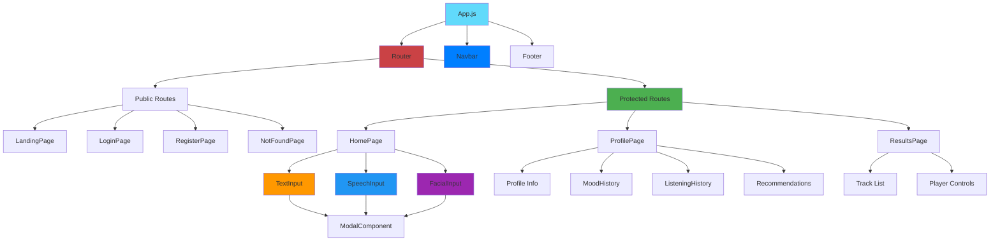
```mermaid
graph TD
    A[App.js] --> B[Router]

    B --> C[Public Routes]
    B --> D[Protected Routes]

    C --> E[LandingPage]
    C --> F[LoginPage]
    C --> G[RegisterPage]
    C --> H[NotFoundPage]

    D --> I[HomePage]
    D --> J[ProfilePage]
    D --> K[ResultsPage]

    A --> L[Navbar]
    A --> M[Footer]

    I --> N[TextInput]
    I --> O[SpeechInput]
    I --> P[FacialInput]

    N & O & P --> Q[ModalComponent]

    J --> R[Profile Info]
    J --> S[MoodHistory]
    J --> T[ListeningHistory]
    J --> U[Recommendations]

    K --> V[Track List]
    K --> W[Player Controls]

    style A fill:#61DAFB
    style B fill:#CA4245
    style D fill:#4CAF50
    style L fill:#007FFF
    style N fill:#FF9800
    style O fill:#2196F3
    style P fill:#9C27B0
```

### State Management Flow

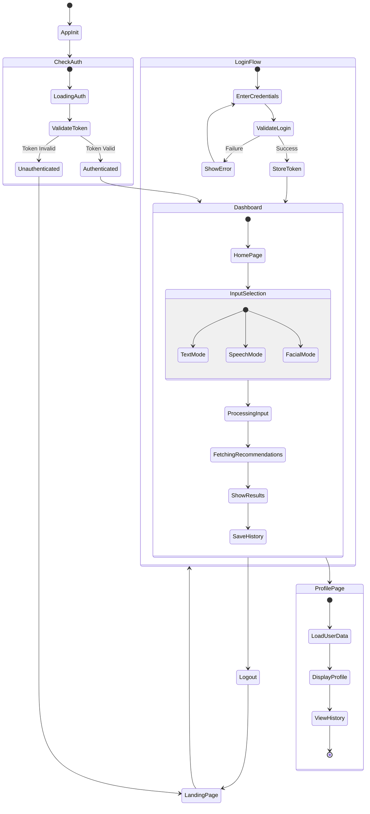
```mermaid
stateDiagram-v2
    [*] --> AppInit
    AppInit --> CheckAuth

    state CheckAuth {
        [*] --> LoadingAuth
        LoadingAuth --> ValidateToken
        ValidateToken --> Authenticated: Token Valid
        ValidateToken --> Unauthenticated: Token Invalid
    }

    Authenticated --> Dashboard
    Unauthenticated --> LandingPage

    state Dashboard {
        [*] --> HomePage
        HomePage --> InputSelection

        state InputSelection {
            [*] --> TextMode
            [*] --> SpeechMode
            [*] --> FacialMode
        }

        InputSelection --> ProcessingInput
        ProcessingInput --> FetchingRecommendations
        FetchingRecommendations --> ShowResults
        ShowResults --> SaveHistory
    }

    Dashboard --> ProfilePage
    state ProfilePage {
        [*] --> LoadUserData
        LoadUserData --> DisplayProfile
        DisplayProfile --> ViewHistory
        ViewHistory --> [*]
    }

    Dashboard --> Logout
    Logout --> LandingPage

    LandingPage --> LoginFlow
    state LoginFlow {
        [*] --> EnterCredentials
        EnterCredentials --> ValidateLogin
        ValidateLogin --> StoreToken: Success
        ValidateLogin --> ShowError: Failure
        StoreToken --> Dashboard
        ShowError --> EnterCredentials
    }
```

### User Interaction Flow

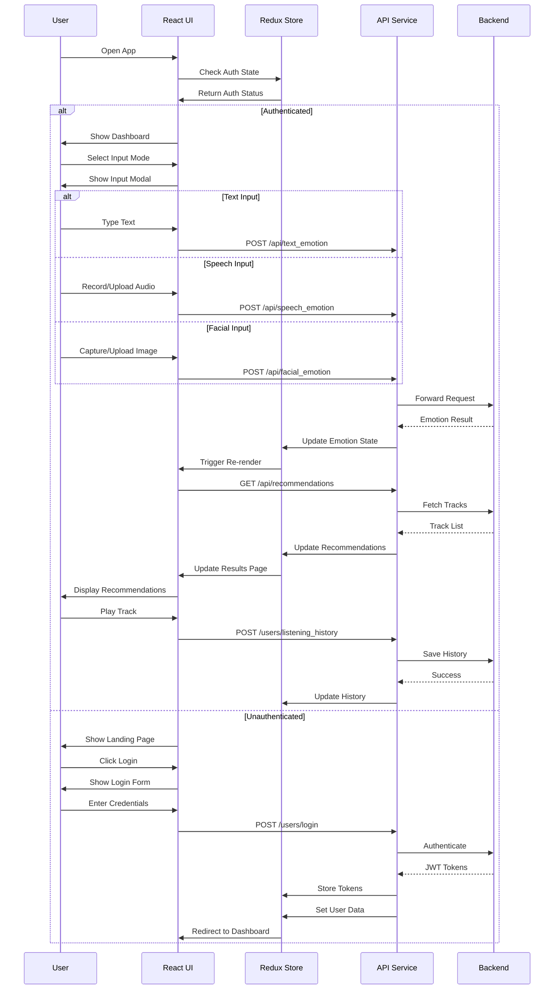
```mermaid
sequenceDiagram
    participant U as User
    participant UI as React UI
    participant ST as Redux Store
    participant API as API Service
    participant BE as Backend

    U->>UI: Open App
    UI->>ST: Check Auth State
    ST->>UI: Return Auth Status

    alt Authenticated
        UI->>U: Show Dashboard
        U->>UI: Select Input Mode
        UI->>U: Show Input Modal

        alt Text Input
            U->>UI: Type Text
            UI->>API: POST /api/text_emotion
        else Speech Input
            U->>UI: Record/Upload Audio
            UI->>API: POST /api/speech_emotion
        else Facial Input
            U->>UI: Capture/Upload Image
            UI->>API: POST /api/facial_emotion
        end

        API->>BE: Forward Request
        BE-->>API: Emotion Result
        API->>ST: Update Emotion State
        ST->>UI: Trigger Re-render
        UI->>API: GET /api/recommendations
        API->>BE: Fetch Tracks
        BE-->>API: Track List
        API->>ST: Update Recommendations
        ST->>UI: Update Results Page
        UI->>U: Display Recommendations

        U->>UI: Play Track
        UI->>API: POST /users/listening_history
        API->>BE: Save History
        BE-->>API: Success
        API->>ST: Update History

    else Unauthenticated
        UI->>U: Show Landing Page
        U->>UI: Click Login
        UI->>U: Show Login Form
        U->>UI: Enter Credentials
        UI->>API: POST /users/login
        API->>BE: Authenticate
        BE-->>API: JWT Tokens
        API->>ST: Store Tokens
        API->>ST: Set User Data
        ST->>UI: Redirect to Dashboard
    end
```

## Features

- User registration and login functionality — **sign in with your username _or_ email** (case-insensitive). A cold-started backend returns a "waking up" notice and the client auto-retries, so a slow first request never shows a false "invalid credentials".
- **Passwordless sign-in with passkeys (WebAuthn / FIDO2).** Sign in with Face ID, Touch ID, Windows Hello, or a security key. Users can:
  - Enroll **multiple passkeys** and manage them on a dedicated **Account → Passkeys** page (add, rename, delete) — reached from the navbar **Account** dropdown that replaces the lone Log Out button when signed in.
  - Get a styled, on-brand **set-up prompt right after sign-up** (never a browser `alert`).
  - Use **"Sign in with a passkey"** on the login screen, including usernameless flows.
- Ability to analyze user input through:
  - Text input.
  - Speech input (recording or file upload).
  - Facial expression input (via webcam or file upload).
- Retrieve user profile information.
- Access mood history and music recommendations.
- **Reinforcement-learning feedback on recommendations** — 👍 / 👎 each track to tune your personal ranking. Votes **persist across reloads** (restored from the backend), can be **toggled off** (un-vote), and feed the Thompson-sampling bandit once you have enough history.
- **Rich listening history** — "Tracks you've opened" on the Profile page renders full cards (cover art + 30-second preview player + Deezer link), matching saved recommendations.
- **Instant dark / light theme** — the toggle recolors the entire app immediately, no reload.
- Minimalistic and clean UI with Material UI components.
- Responsive design suitable for both desktop and mobile devices.

## Technologies

- **React**: A JavaScript library for building user interfaces.
- **Axios**: For making HTTP requests to the backend API.
- **Material UI (MUI)**: A library for React components that implements Google's Material Design.
- **Poppins Font**: Custom font for a modern look and feel.

## User Interface

### Home Page

<p align="center">
  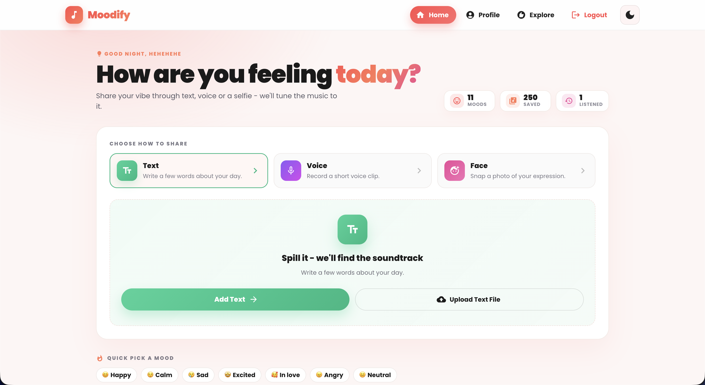
</p>

<p align="center">
  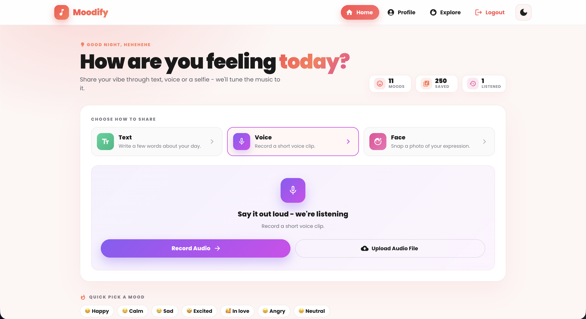
</p>

<p align="center">
  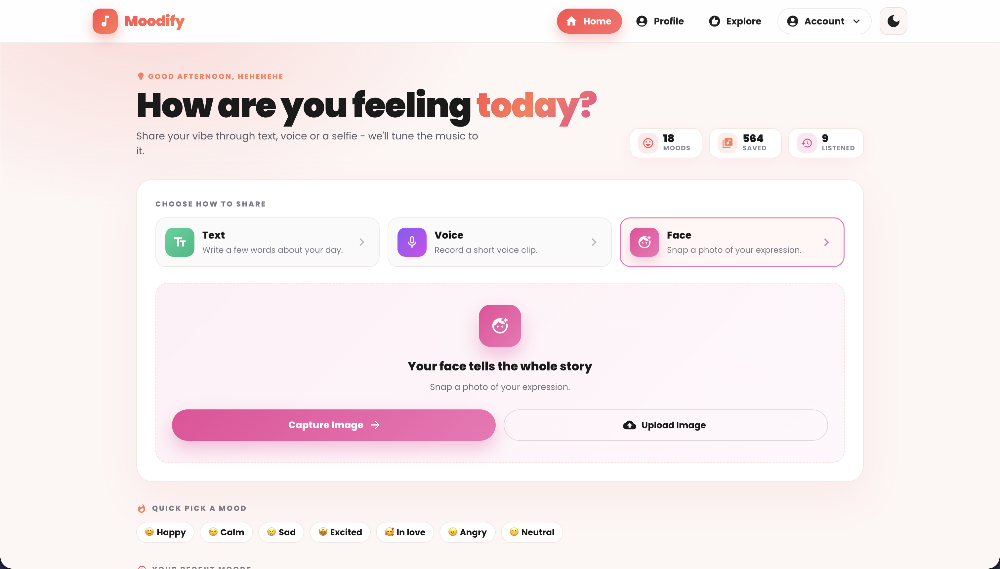
</p>

### Home Page - Dark Mode

<p align="center">
  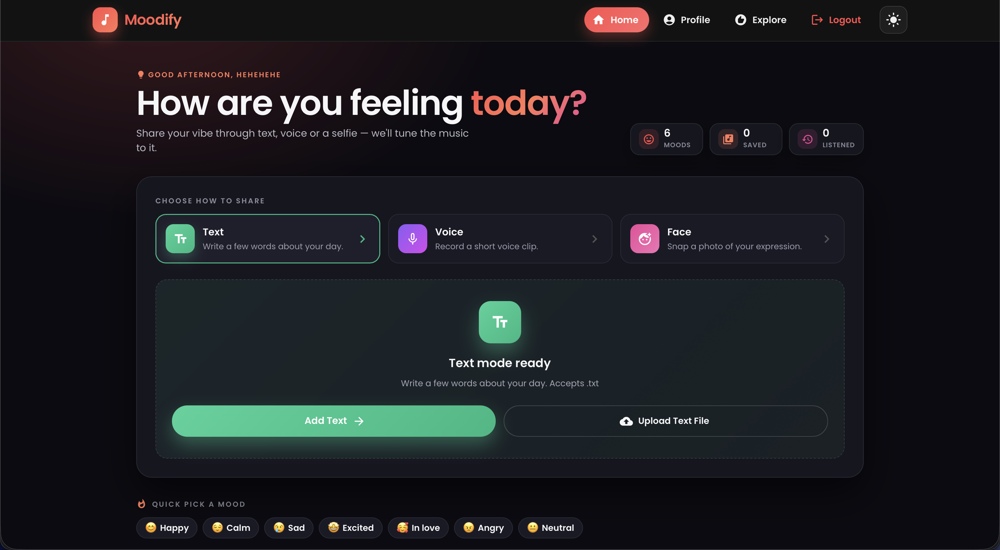
</p>

### Text Input

<p align="center">
  
</p>

#### Speech Input

<p align="center">
  
</p>

#### Facial Expression Input

<p align="center">
  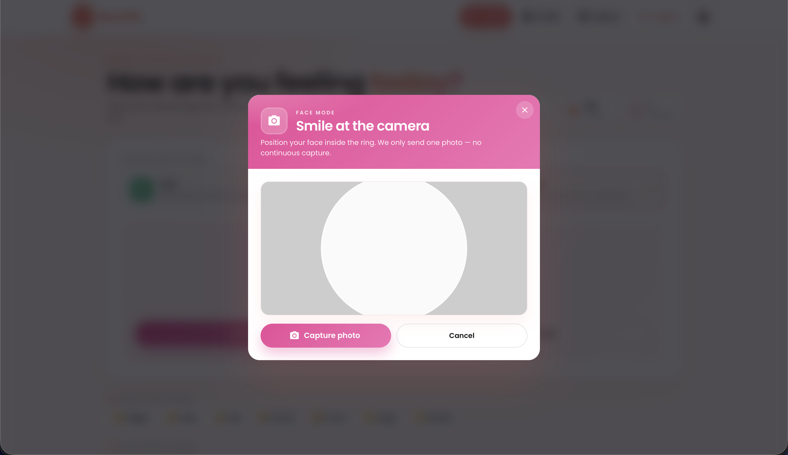
</p>

### Profile Page

<p align="center">
  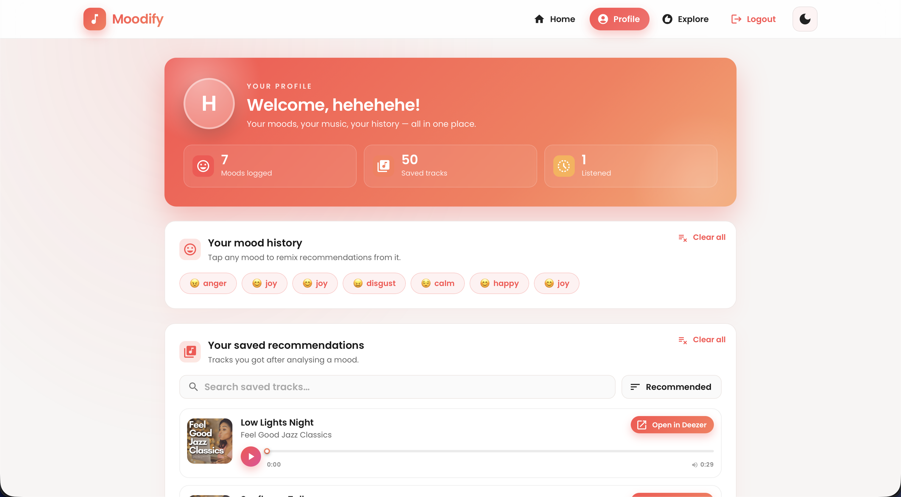
</p>

### Results - Recommendations Page

<p align="center">
  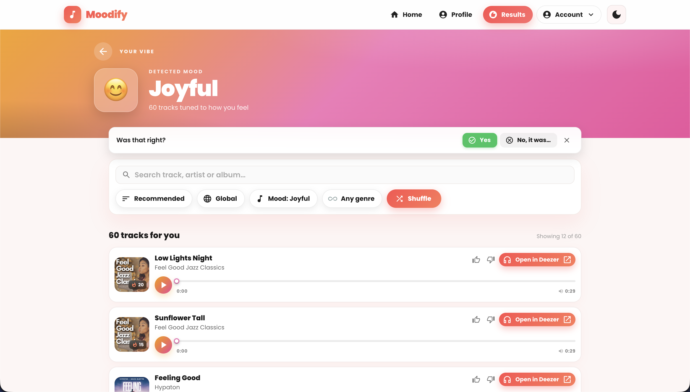
</p>

### Explore Page

<p align="center">
  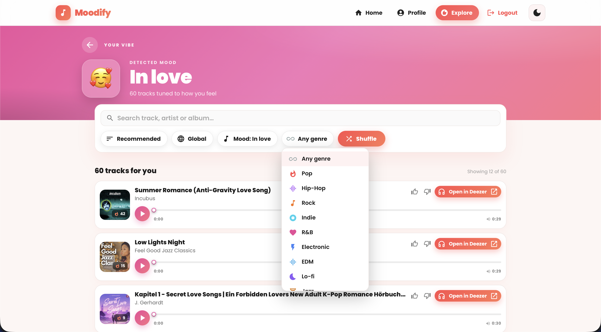
</p>

### Login Page

<p align="center">
  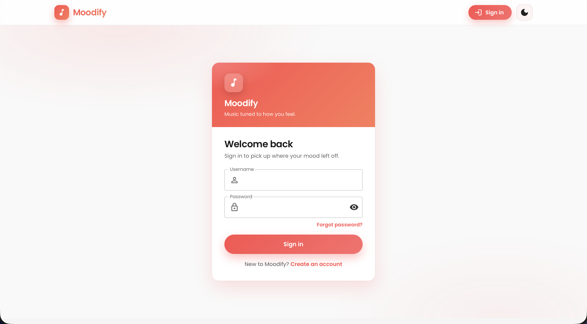
</p>

### Registration Page

<p align="center">
  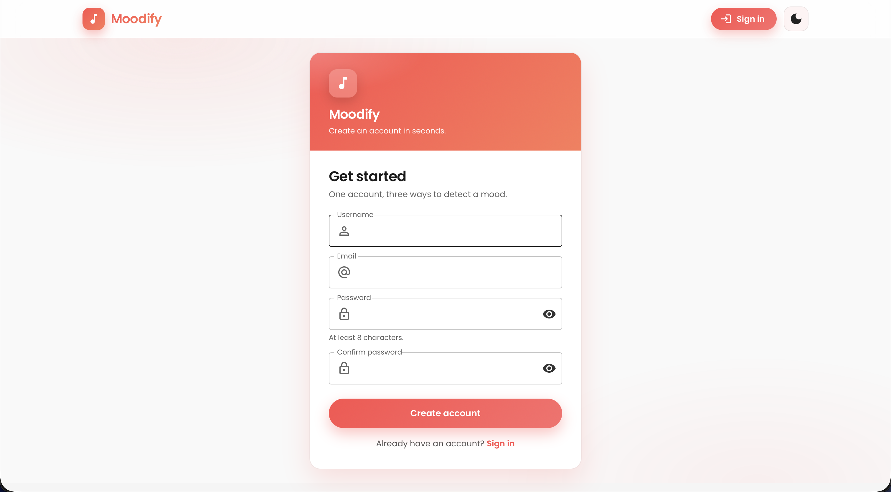
</p>

### Forgot Password Page

<p align="center">
  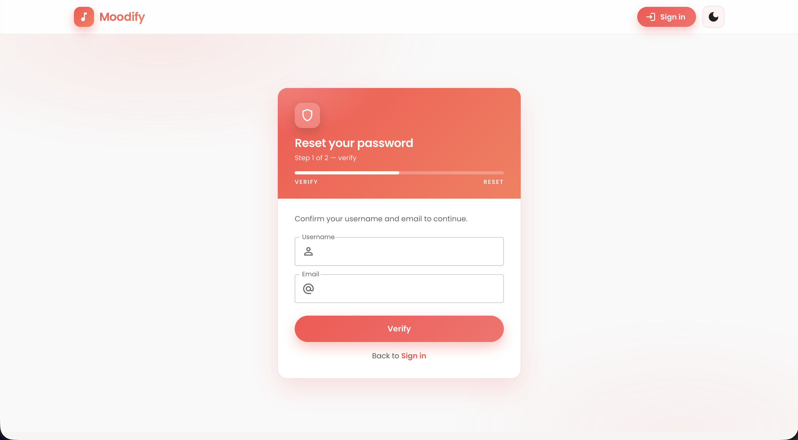
</p>

#### Reset Password - Once the User Has Verified Their Account Ownership

<p align="center">
  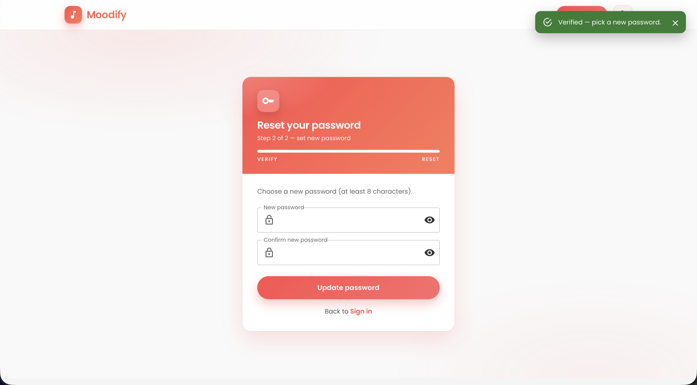
</p>

### Privacy Policy Page

<p align="center">
  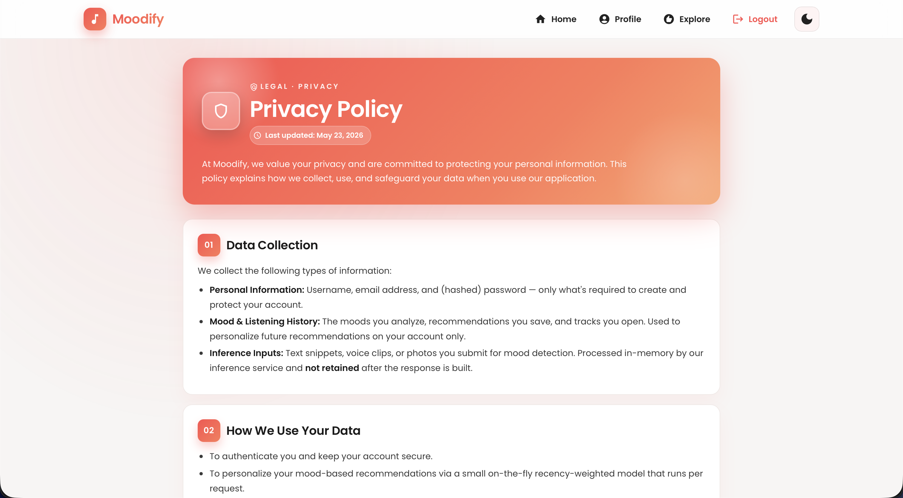
</p>

### Terms of Service Page

<p align="center">
  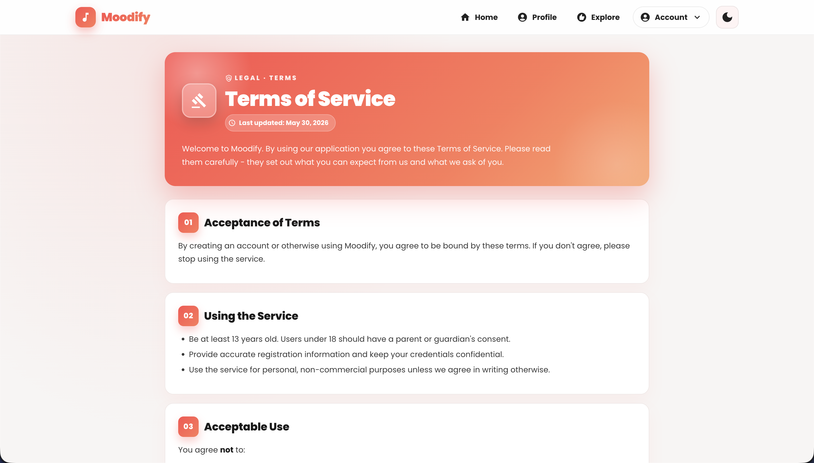
</p>

### Responsive Design - Mobile View

<p align="center">
  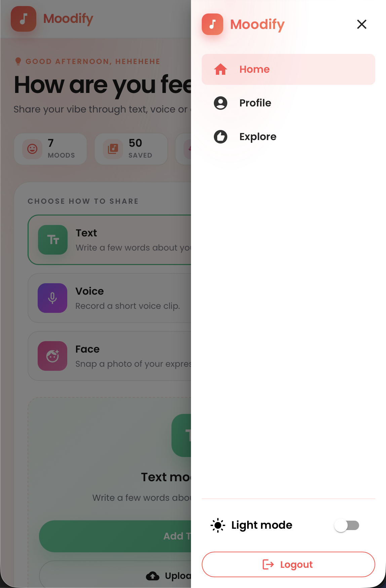
</p>

## Getting Started

### Prerequisites

- Node.js (v14 or higher)
- npm (Node package manager)

### Installation

1. Clone the repository:

   ```bash
   git clone https://github.com/hoangsonww/Moodify-Emotion-Music-App.git
   ```

2. Navigate to the frontend directory:

   ```bash
   cd /Moodify-Emotion-Music-App/frontend
   ```

3. Install the dependencies:

   ```bash
   npm install
   ```

4. Point the app at your backends. Copy `frontend/.env.example` to
   `frontend/.env` and fill in the two URLs:

   ```bash
   cp .env.example .env
   # then edit:
   #   REACT_APP_API_URL=https://<your-django-api>
   #   REACT_APP_MODAL_API_URL=https://<your-modal-inference-app>
   ```

   These are the only deployment-specific values the app needs. When
   deploying to Vercel, set the same two variables in the project's
   Environment Variables panel (Production / Preview / Development) and
   redeploy - `frontend/src/config.js` reads them at build time.

   Optionally, enable **Sentry** error + performance monitoring by also
   setting `REACT_APP_SENTRY_DSN` (from the `unc-a4/moodify-app` project).
   Leave it empty to disable — `frontend/src/index.js` only initialises the
   SDK when a DSN is present, so local dev and CI builds send nothing.
   `REACT_APP_SENTRY_ENVIRONMENT` and `REACT_APP_SENTRY_TRACES_SAMPLE_RATE`
   (default `0.1`) tune the stage label and trace sampling. Only the public
   DSN belongs in the client build.

### Running the Application

To start the development server, run the following command:

```bash
npm start
```

This will start the React application at `http://localhost:3000`. If this port is in use, you may be prompted to use a different port.

### Testing

The frontend uses **Jest** with **React Testing Library**. Tests live under `src/**/__tests__/` and include a full set of **snapshot tests** for every screen in `src/__tests__/snapshots/` (one file per screen — Landing, Home, Profile, Results, Recommendations, Not Found, Forgot Password, Passkeys, Privacy Policy, Terms of Service). Each snapshot test renders the page inside its providers and asserts the rendered markup with `toMatchSnapshot()`, so any unintended UI change shows up as a snapshot diff. Baselines are committed under the adjacent `__snapshots__/` directories.

```bash
# Run the full test suite
npm test

# Watch mode (re-runs on file changes)
npm run test:watch

# Coverage report
npm run test:coverage

# Run only the snapshot suite
npm test -- src/__tests__/snapshots

# Update snapshots after an intentional UI change
npm test -- -u
```

When you change a screen on purpose, update its snapshot with `npm test -- -u` and commit the refreshed `.snap` file with your change.

### Contributing

Contributions are welcome! Feel free to fork the repository and submit a pull request.

### License

This project is licensed under the MIT License. See the [LICENSE](LICENSE) file for details.

---

Happy coding! 🚀

[🔝 Back to Top](#moodify-frontend)
