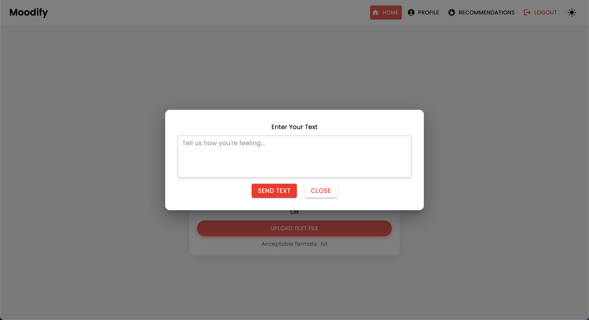
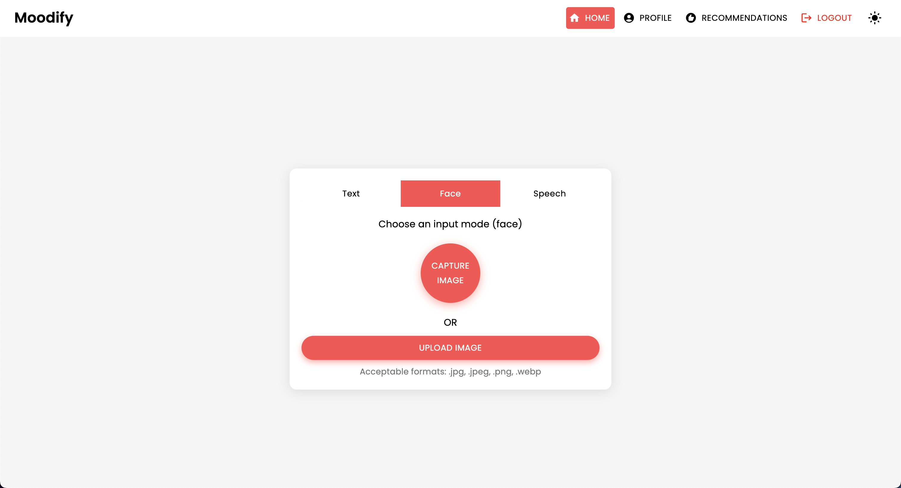

# Moodify Frontend

Moodify is a React-based frontend application that analyzes user input (text, speech, or facial expressions) to provide personalized music recommendations. It interacts with a backend API to handle user authentication, mood tracking, and music recommendation retrieval.

## Table of Contents

- [Features](#features)
- [Technologies](#technologies)
- [Getting Started](#getting-started)
- [API Endpoints](#api-endpoints)
- [Running the Application](#running-the-application)
- [Contributing](#contributing)
- [License](#license)

## File Structure

```plaintext
frontend/
│
├── public/
│   ├── index.html                   # Main HTML file
│   ├── manifest.json                # Web app manifest
│   └── favicon.ico                  # Favicon for the app
│
├── src/
│   ├── components/                  # Contains all React components
│   │   ├── Auth/
│   │   │   ├── Login.js             # Login component
│   │   │   └── Register.js          # Registration component
│   │   ├── MoodInput/
│   │   │   ├── FacialInput.js       # Main MoodInput component
│   │   │   ├── SpeechInput.js       # Speech input component
│   │   │   ├── TextInput.js         # Text input component
│   │   ├── Profile/
│   │   │   ├── Profile.js           # Profile component
│   │   │   ├── ListeningHistory.js  # Listening history component
│   │   │   ├── MoodHistory.js       # Mood history component
│   │   │   └── Recommendations.js   # Music recommendations component
│   │   ├── Footer.js                # Footer component
│   │   ├── Navbar.js                # Header component
│   │   ├── ModalComponent.js        # Modal component for user input
│   │
│   ├── pages/                       # Contains main pages of the app
│   │   ├── HomePage.js              # Home page component
│   │   ├── ProfilePage.js           # Profile page component
│   │   ├── ResultsPage.js           # Results page component
│   │   ├── NotFoundPage.js          # 404 page component
│   │   └── RecommendationsPage.js   # Recommendations page component
│   │
│   ├── styles/                      # Contains global styles and themes
│   │   └── styles.css               # Main CSS file
│   │
│   ├── App.js                       # Main App component
│   ├── App.css                      # CSS for the main App component
│   ├── index.js                     # Entry point for React
│   ├── theme.js                     # Material UI theme configuration
│   └── reportWebVitals.js           # For measuring performance
│
├── .gitignore                       # Git ignore file
├── package.json                     # NPM dependencies and scripts
└── README.md                        # Project documentation
```

## Features

- User registration and login functionality.
- Ability to analyze user input through:
  - Text input.
  - Speech input (recording or file upload).
  - Facial expression input (via webcam or file upload).
- Retrieve user profile information.
- Access mood history and music recommendations.
- Minimalistic and clean UI with Material UI components.
- Responsive design suitable for both desktop and mobile devices.

## Technologies

- **React**: A JavaScript library for building user interfaces.
- **Axios**: For making HTTP requests to the backend API.
- **Material UI (MUI)**: A library for React components that implements Google's Material Design.
- **Poppins Font**: Custom font for a modern look and feel.

## User Interface

### Home Page

<p align="center">
  
</p>

#### Text Input

<p align="center">
  
</p>

#### Speech Input

<p align="center">
  
</p>

<p align="center">
  
</p>

#### Facial Expression Input

<p align="center">
  
</p>

<p align="center">
  

### Profile Page

<p align="center">
  
</p>

<p align="center">
  
</p>

### Results/Recommendations Page

<p align="center">
  
</p>

### Login Page

<p align="center">
  
</p>

### Registration Page

<p align="center">
  
</p>

### 404 Not Found Page

<p align="center">
  
</p>

## Footer

<p align="center">
  
</p>

## Getting Started

### Prerequisites

- Node.js (v14 or higher)
- npm (Node package manager)

### Installation

1. Clone the repository:
   ```bash
   git clone https://github.com/hoangsonww/Moodify-Emotion-Music-App.git
   ```

2. Navigate to the frontend directory:
   ```bash
   cd /Moodify-Emotion-Music-App/frontend
   ```

3. Install the dependencies:
   ```bash
   npm install
   ```

### Running the Application

To start the development server, run the following command:

```bash
npm start
```

This will start the React application at `http://localhost:3000`. If this port is in use, you may be prompted to use a different port.

### Contributing

Contributions are welcome! Feel free to fork the repository and submit a pull request.

### License

This project is licensed under the MIT License. See the [LICENSE](LICENSE) file for details.
