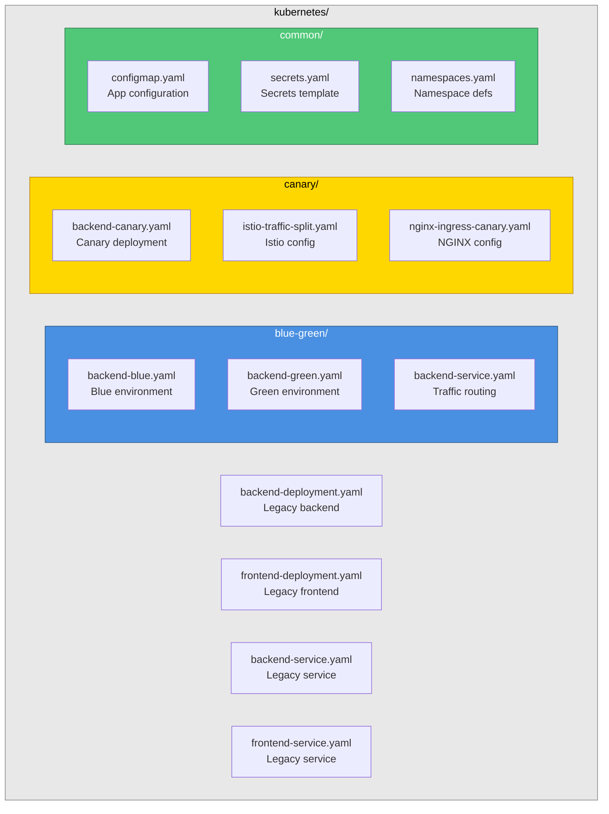

# Kubernetes Deployment Manifests

This directory contains all Kubernetes deployment manifests for the Moodify application with support for Blue-Green and Canary deployment strategies.

## Directory Structure



## Quick Start

### Prerequisites

```bash
# Ensure kubectl is configured
kubectl cluster-info

# Set environment variables
export IMAGE_TAG=v1.2.3
export IMAGE_REGISTRY=your-registry.azurecr.io
export NAMESPACE=moodify-production
```

### Blue-Green Deployment

#### Deploy Blue Environment (Initial Setup)

```bash
# Apply blue deployment
envsubst < blue-green/backend-blue.yaml | kubectl apply -f -

# Apply services
kubectl apply -f blue-green/backend-service.yaml

# Verify
kubectl get deployments -n $NAMESPACE
kubectl get services -n $NAMESPACE
```

#### Deploy Green Environment

```bash
# Update IMAGE_TAG for new version
export IMAGE_TAG=v1.2.4

# Apply green deployment
envsubst < blue-green/backend-green.yaml | kubectl apply -f -

# Wait for rollout
kubectl rollout status deployment/backend-green -n $NAMESPACE

# Test green environment directly
kubectl port-forward service/backend-green-service 8080:8000 -n $NAMESPACE
```

#### Switch Traffic to Green

```bash
# Switch main service to point to green
kubectl patch service backend-service -n $NAMESPACE \
  -p '{"spec":{"selector":{"environment":"green"}}}'

# Verify
kubectl get service backend-service -n $NAMESPACE \
  -o jsonpath='{.spec.selector.environment}'
```

### Canary Deployment

#### Deploy Canary

```bash
export IMAGE_TAG=v1.3.0-canary

# Apply canary deployment
envsubst < canary/backend-canary.yaml | kubectl apply -f -

# Verify
kubectl get deployment backend-canary -n $NAMESPACE
```

#### Configure Traffic Splitting (Istio)

```bash
# Install Istio resources
kubectl apply -f canary/istio-traffic-split.yaml

# Adjust traffic weights (edit the file)
# Default: 90% stable, 10% canary
kubectl edit virtualservice backend-vs -n $NAMESPACE
```

#### Configure Traffic Splitting (NGINX)

```bash
# Apply NGINX ingress configuration
kubectl apply -f canary/nginx-ingress-canary.yaml

# Adjust canary weight (10%)
kubectl annotate ingress backend-ingress-canary -n $NAMESPACE \
  nginx.ingress.kubernetes.io/canary-weight="10" \
  --overwrite

# Increase weight progressively
kubectl annotate ingress backend-ingress-canary -n $NAMESPACE \
  nginx.ingress.kubernetes.io/canary-weight="25" \
  --overwrite
```

## Deployment Strategies

### Blue-Green Deployment

**Use When:**
- Major releases
- Database migrations
- Critical updates requiring quick rollback

**Benefits:**
- Instant rollback
- Zero downtime
- Full environment validation

**How It Works:**
1. Blue is currently active (serving traffic)
2. Deploy new version to Green
3. Test Green thoroughly
4. Switch traffic from Blue to Green
5. Keep Blue running for instant rollback

### Canary Deployment

**Use When:**
- Gradual feature rollouts
- A/B testing
- Risk mitigation for changes

**Benefits:**
- Gradual traffic increase
- Early issue detection
- Minimal user impact on failures

**How It Works:**
1. Deploy canary version alongside stable
2. Route small percentage (10%) to canary
3. Monitor metrics and errors
4. Progressively increase traffic if healthy
5. Promote to 100% or rollback

## Configuration

### Environment Variables

Required for deployment manifests:

```bash
# Docker Image
IMAGE_REGISTRY=your-registry.azurecr.io
IMAGE_TAG=v1.2.3

# Kubernetes
NAMESPACE=moodify-production

# Application (in ConfigMap)
NODE_ENV=production
LOG_LEVEL=info
DB_HOST=documentdb-service
REDIS_HOST=redis-service

# Secrets (in Secrets)
DB_PASSWORD=***
REDIS_PASSWORD=***
JWT_SECRET=***
SPOTIFY_CLIENT_SECRET=***
```

### Resource Limits

Default resource configuration:

```yaml
resources:
  requests:
    memory: "512Mi"
    cpu: "500m"
  limits:
    memory: "2Gi"
    cpu: "2000m"
```

### Auto-scaling

HPA Configuration:
- Min Replicas: 3
- Max Replicas: 15
- Target CPU: 70%
- Target Memory: 80%

## Health Checks

### Liveness Probe

```yaml
livenessProbe:
  httpGet:
    path: /health/live
    port: 8000
  initialDelaySeconds: 30
  periodSeconds: 10
  failureThreshold: 3
```

### Readiness Probe

```yaml
readinessProbe:
  httpGet:
    path: /health/ready
    port: 8000
  initialDelaySeconds: 10
  periodSeconds: 5
  failureThreshold: 3
```

### Startup Probe

```yaml
startupProbe:
  httpGet:
    path: /health/startup
    port: 8000
  periodSeconds: 5
  failureThreshold: 30
```

## Traffic Management

### Using Istio

**VirtualService** controls traffic routing:
- Header-based routing for canary users
- Weight-based percentage routing
- Retry and timeout policies

**DestinationRule** configures:
- Load balancing strategy
- Connection pooling
- Circuit breaking
- Outlier detection

**Gateway** manages external traffic:
- TLS termination
- Domain routing
- Protocol handling

### Using NGINX Ingress

**Canary Annotations:**

```yaml
# Weight-based canary
nginx.ingress.kubernetes.io/canary: "true"
nginx.ingress.kubernetes.io/canary-weight: "10"

# Header-based canary
nginx.ingress.kubernetes.io/canary-by-header: "X-Canary"
nginx.ingress.kubernetes.io/canary-by-header-value: "always"

# Cookie-based canary
nginx.ingress.kubernetes.io/canary-by-cookie: "canary-user"
```

## Monitoring

### Prometheus Metrics

Pods expose metrics at `/metrics`:
- HTTP request rates
- Response times
- Error rates
- Custom business metrics

### Logging

Fluent Bit sidecar ships logs to:
- CloudWatch (AWS)
- Cloud Logging (GCP)
- Log Analytics (Azure)

## Security

### Pod Security

- Run as non-root user (UID 1000)
- Read-only root filesystem
- No privilege escalation
- All capabilities dropped

### Network Security

- Network policies restrict pod-to-pod communication
- Istio mTLS for service-to-service encryption
- TLS termination at ingress

### Secrets Management

**Never commit secrets to Git!**

Create secrets securely:

```bash
kubectl create secret generic moodify-secrets \
  -n $NAMESPACE \
  --from-literal=DB_PASSWORD="..." \
  --from-literal=REDIS_PASSWORD="..." \
  --from-literal=JWT_SECRET="..." \
  --from-literal=SPOTIFY_CLIENT_SECRET="..."
```

Or use external secret management:
- AWS Secrets Manager
- Azure Key Vault
- Google Secret Manager
- HashiCorp Vault

## Troubleshooting

### Pods Not Starting

```bash
# Check pod status
kubectl get pods -n $NAMESPACE

# Describe pod
kubectl describe pod <pod-name> -n $NAMESPACE

# Check logs
kubectl logs <pod-name> -n $NAMESPACE

# Check events
kubectl get events -n $NAMESPACE --sort-by='.lastTimestamp'
```

### Service Not Routing Traffic

```bash
# Check service endpoints
kubectl get endpoints backend-service -n $NAMESPACE

# Check service selector
kubectl get service backend-service -n $NAMESPACE -o yaml

# Check pod labels
kubectl get pods -n $NAMESPACE --show-labels
```

### Image Pull Errors

```bash
# Check image pull secrets
kubectl get secrets -n $NAMESPACE

# Create docker registry secret
kubectl create secret docker-registry regcred \
  --docker-server=$IMAGE_REGISTRY \
  --docker-username=$DOCKER_USERNAME \
  --docker-password=$DOCKER_PASSWORD \
  -n $NAMESPACE

# Add to service account
kubectl patch serviceaccount moodify-backend-sa \
  -p '{"imagePullSecrets": [{"name": "regcred"}]}' \
  -n $NAMESPACE
```

### Canary Not Receiving Traffic

**Istio:**

```bash
# Check VirtualService
kubectl get virtualservice backend-vs -n $NAMESPACE -o yaml

# Check weights
kubectl get virtualservice backend-vs -n $NAMESPACE \
  -o jsonpath='{.spec.http[1].route[*].weight}'

# Analyze configuration
istioctl analyze -n $NAMESPACE
```

**NGINX:**

```bash
# Check canary annotation
kubectl get ingress backend-ingress-canary -n $NAMESPACE \
  -o jsonpath='{.metadata.annotations}'

# Check ingress status
kubectl describe ingress backend-ingress-canary -n $NAMESPACE
```

## Best Practices

### Deployment

1. **Always test in staging first**
2. **Use semantic versioning for images**
3. **Never use `latest` tag in production**
4. **Document deployment in CHANGELOG**
5. **Monitor metrics after deployment**

### Rollback

1. **Keep previous environment running (blue-green)**
2. **Test rollback procedure regularly**
3. **Document rollback steps**
4. **Have runbooks for common issues**

### Security

1. **Use secrets, not ConfigMaps for sensitive data**
2. **Regularly update base images**
3. **Scan images for vulnerabilities**
4. **Follow principle of least privilege**
5. **Enable Pod Security Standards**

### Monitoring

1. **Set up alerts for critical metrics**
2. **Monitor error rates during deployment**
3. **Track deployment frequency and success rate**
4. **Use distributed tracing**
5. **Implement SLOs and SLIs**

## Additional Resources

- [Deployment Runbook](../DEPLOYMENT.md)
- [Infrastructure Setup Guide](../INFRASTRUCTURE_SETUP.md)
- [Deployment Scripts](../scripts/deployment/)
- [Jenkins Pipeline](../Jenkinsfile)

---

**Last Updated**: 2025-11-26
**Maintained by**: DevOps Team
