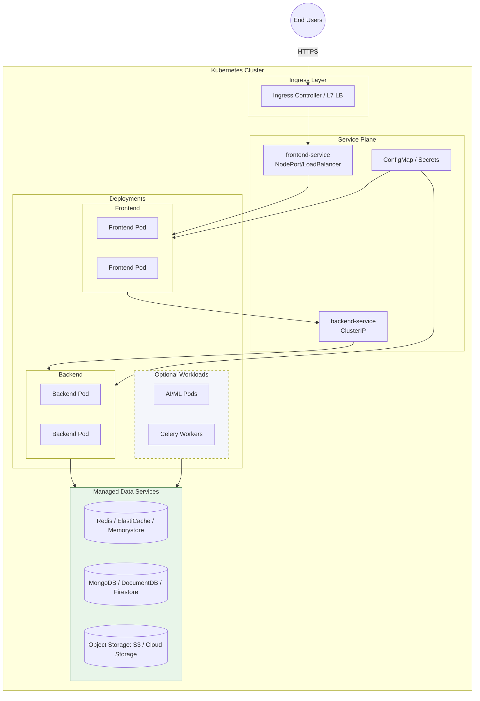
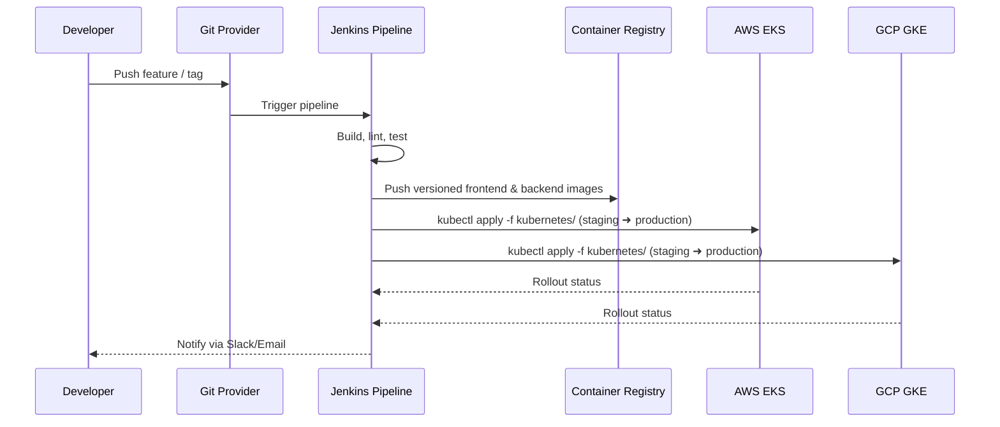

# Moodify Kubernetes Guide

Moodify relies on Kubernetes as the consistent deployment substrate across local development clusters, AWS Elastic Kubernetes Service (EKS), and Google Kubernetes Engine (GKE). The manifests in this directory provide the baseline workloads for the frontend and backend; the cloud-specific guides in `../aws/` and `../gcp/` extend the same primitives with managed ingress, data stores, and platform automation.

## Role in the Overall Platform
- Provides a portable execution layer that mirrors production topologies whether you run in Kind/Minikube, EKS, or GKE.
- Works with the GitOps/Jenkins pipelines described in `../DEPLOYMENT.md` to support blue/green + canary rollouts.
- Integrates with the infrastructure defined in `../aws/terraform` and `../gcp/terraform`, where the underlying VPC, node pools, registries, and load balancers are provisioned.
- Centralises configuration via ConfigMaps/Secrets so that services can switch between AWS (DocumentDB, ElastiCache, S3) and GCP (Firestore, Memorystore, Cloud Storage) without code changes.

## Repository Layout

| File | Purpose | Notes |
| --- | --- | --- |
| `frontend-deployment.yaml` | React single-page app deployment | Uses `moodify-frontend` image; replace hostPath volume with a persistent volume in production.
| `frontend-service.yaml` | Service that exposes the frontend | Default `NodePort` for local clusters; switch to `LoadBalancer` or ingress in managed clouds.
| `backend-deployment.yaml` | Django/REST backend deployment | Consumes `moodify-backend` image and ConfigMap values; update environment variables per environment.
| `backend-service.yaml` | Internal service for backend traffic | `ClusterIP` for intra-cluster access from the frontend and workers.
| `configmap.yaml` | Shared non-secret configuration | Overrides runtime settings without rebuilding images.

## Reference Architecture



## Target Environments

| Environment | Cluster Provisioning | Obtaining `kubeconfig` | Reference |
| --- | --- | --- | --- |
| Local development | Kind / Minikube / Docker Desktop | `kind get kubeconfig` or `minikube kubectl -- get pods` | Maintain parity with production for quick iteration. |
| AWS Production | EKS via Terraform modules | `aws eks update-kubeconfig --name moodify-production-eks` | See `../aws/README.md` for Terraform and ECR bootstrap. |
| GCP Production | GKE via Terraform modules | `gcloud container clusters get-credentials moodify-production-gke --region us-central1` | See `../gcp/README.md` for node pool and Artifact Registry guidance. |

## Prerequisites
- `kubectl` v1.27+ configured for the target cluster.
- Container registry access (Docker Hub, ECR, or Artifact Registry) with the frontend/backend images pushed under versioned tags.
- Namespace created (e.g. `kubectl create namespace moodify-production`).
- Secrets for credentials already provisioned (see below).

## Quick Start (Local Baseline)
1. **Build images locally**
   ```bash
   docker build -t moodify-frontend:latest ../frontend
   docker build -t moodify-backend:latest ../backend
   ```
2. **Switch context and namespace**
   ```bash
   kubectl config use-context kind-moodify
   kubectl create namespace moodify-local
   ```
3. **Apply shared configuration**
   ```bash
   kubectl -n moodify-local apply -f configmap.yaml
   ```
4. **Deploy workloads**
   ```bash
   kubectl -n moodify-local apply -f backend-deployment.yaml
   kubectl -n moodify-local apply -f backend-service.yaml
   kubectl -n moodify-local apply -f frontend-deployment.yaml
   kubectl -n moodify-local apply -f frontend-service.yaml
   ```
5. **Verify rollout**
   ```bash
   kubectl -n moodify-local get pods,svc
   kubectl -n moodify-local port-forward svc/frontend-service 3001:3001
   ```

> **Tip:** The provided deployments mount code via `hostPath` to accelerate local development. Replace these with persistent volumes or baked images before running in managed clusters.

## Production Deployment Workflow
- **Images:** Update the `image:` fields to point to the registry promoted by your CI pipeline, for example `123456789012.dkr.ecr.us-east-1.amazonaws.com/moodify-frontend:2025.10.07`.
- **Namespace & Labels:** Align namespaces with the staging/production strategy defined in `../DEPLOYMENT.md` (`moodify-staging`, `moodify-production`).
- **Ingress:** Managed environments terminate TLS using ALB (AWS) or GCLB (GCP). Expose the frontend via an ingress resource created by Terraform or add an `Ingress` manifest referencing the cluster-specific ingress class.
- **Blue/Green + Canary:** The Jenkins pipeline updates a staging namespace first, then promotes by patching the `image` tag on the live deployment. Keep `.spec.strategy.type` as `RollingUpdate` or introduce additional canary deployments if you need finer control.

### AWS (EKS) Notes
- Replace `NodePort` with `LoadBalancer` or reference the AWS Load Balancer Controller ingress specified in `../aws/terraform`.
- Mount managed services via endpoints provided in Secrets (DocumentDB, ElastiCache). The Terraform outputs expose these values for CI to template into `kubectl` manifests.

### GCP (GKE) Notes
- Use `kubectl annotate deployment frontend-deployment cloud.google.com/neg-status=true` only if you rely on native container-native load balancing.
- Service accounts map through Workload Identity; ensure pods carry the correct annotations set by CI or overlays described in `../gcp/README.md`.

## Configuration and Secrets
1. **ConfigMap**: Update `configmap.yaml` or create environment-specific overlays.
   ```bash
   kubectl -n moodify-production apply -f configmap.yaml
   ```
2. **Secrets**: Store credentials outside source control.
   ```bash
   kubectl -n moodify-production create secret generic moodify-secrets \
     --from-literal=DJANGO_SECRET_KEY=changeme \
     --from-literal=SPOTIFY_CLIENT_ID=... \
     --from-literal=SPOTIFY_CLIENT_SECRET=...
   ```
3. **Mounting**: Reference the secret in your deployment with `envFrom` or explicit `valueFrom`. Extend the existing deployment manifests as needed.

## Storage Considerations
- Replace `hostPath` with `PersistentVolumeClaim` definitions backed by EBS (AWS) or Persistent Disks (GCP) for any component that needs durable storage.
- External data services (MongoDB, Redis) are provisioned through managed services. Keep only service endpoints and credentials in the cluster.

## Scaling and Observability
- Enable Horizontal Pod Autoscalers once resource requests/limits are set:
  ```bash
  kubectl autoscale deployment backend-deployment \
    --cpu-percent=70 --min=3 --max=10 -n moodify-production
  ```
- Cluster autoscaling is managed in Terraform (`../aws/terraform` node groups, `../gcp/terraform` node pools).
- Export logs to CloudWatch (AWS) or Cloud Logging (GCP) using the respective agents. Calibrate alerts using the SLOs defined in `../DEPLOYMENT.md`.

## CI/CD Hand-off



## Day-2 Operations Cheat Sheet
- Inspect deployments: `kubectl -n moodify-production get deploy -o wide`
- Watch rollout: `kubectl -n moodify-production rollout status deploy/frontend-deployment`
- Tail logs: `kubectl -n moodify-production logs deploy/backend-deployment -f`
- Run smoke test job: `kubectl -n moodify-production create job --from=cronjob/smoke-tester smoke-on-demand`
- Roll back quickly: `kubectl -n moodify-production rollout undo deploy/backend-deployment`

## Additional References
- Platform overview in `../README.md` and architecture deep dive in `../ARCHITECTURE.md`.
- Deployment runbooks and incident procedures in `../DEPLOYMENT.md`.
- Cloud specifics in `../aws/README.md` and `../gcp/README.md`.
- API documentation in `../openapi.yaml` for confirming service contracts post-deploy.

Keeping the Kubernetes manifests aligned with these guides ensures Moodify behaves consistently across clouds, environments, and release cadence.
