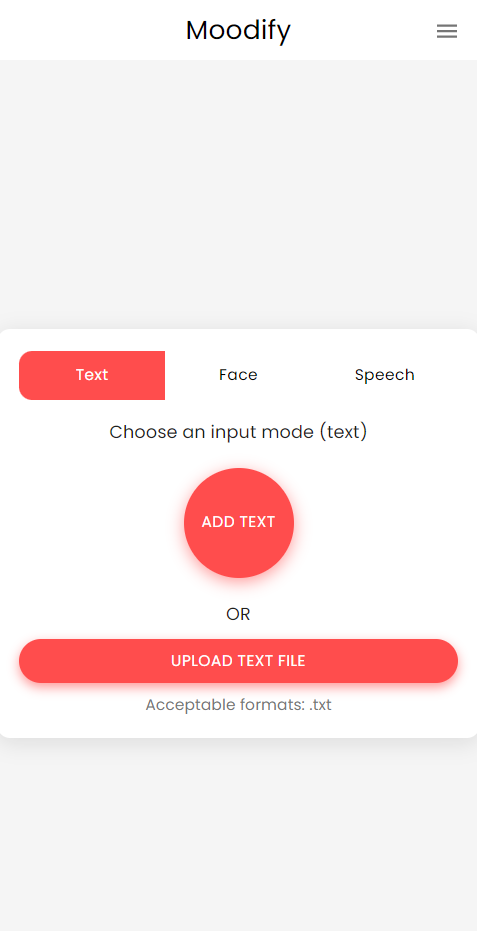

# **Moodify Mobile - Emotion-Based Music Recommendation App**

The **Moodify Mobile** application is a **React Native-based** version of the Moodify project, allowing users to access emotion-based music recommendations directly from their mobile devices. It integrates with the backend API to analyze user inputs such as text, speech, or facial expressions to provide personalized music recommendations based on the detected emotions.

## **Table of Contents**

- [Overview](#overview)
- [Features](#features)
- [Technologies](#technologies)
- [Installation and Setup](#installation-and-setup)
- [Directory Structure](#directory-structure)
- [Screenshots](#screenshots)
- [Running the App](#running-the-app)
- [Contributing](#contributing)
- [License](#license)
- [Contact](#contact)

## **Overview**

The Moodify Mobile app brings the emotion-based music recommendation experience to mobile devices. With a seamless and intuitive user interface, the app allows users to detect emotions through text, speech, and facial expressions, offering real-time music recommendations that align with their mood.

## **Features**

- **User Authentication:** Registration and login functionality using JWT tokens.
- **Emotion Detection:** Analyze emotions using:
    - Text input
    - Speech input (recording or file upload)
    - Facial expressions captured via the device camera
- **Music Recommendations:** Real-time recommendations based on detected emotions.
- **User Profile Management:** Access listening history, mood history, and personalized music recommendations.
- **Offline Mode:** Cached recommendations are stored locally for offline access.
- **Responsive and Interactive UI:** Intuitive design for seamless user experience on both Android and iOS devices.
- And all the features available in the web version of Moodify!

## **Technologies**

- **React Native**: Framework for building mobile apps using React.
- **Expo**: Toolchain for building React Native apps.
- **Axios**: For making HTTP requests to the backend API.
- **React Navigation**: For handling navigation between screens.
- **Styled Components**: For styling components in React Native.

## **Installation and Setup**

### Prerequisites

- **Node.js** (v14 or higher)
- **Yarn**: Install Yarn by running:
  ```bash
  npm install --global yarn
  ```
- **Expo CLI**: Install Expo CLI by running:
  ```bash
  yarn global add expo-cli
  ```

### Installation

1. **Clone the repository:**
   ```bash
   git clone https://github.com/hoangsonww/Moodify-Emotion-Music-App.git
   ```

2. **Navigate to the mobile directory:**
   ```bash
   cd Moodify/mobile
   ```

3. **Install dependencies using Yarn:**
   ```bash
   yarn install
   ```

## **Directory Structure**

```plaintext
mobile/
│
├── assets/                    # Images, fonts, and other assets
│
├── components/                # React Native components
│   ├── Auth/                  # Authentication components (e.g., Login, Register)
│   ├── MoodInput/             # Components for facial, text, and speech inputs
│   ├── Profile/               # Profile-related components
│   └── Recommendations/       # Recommendation-related components
│
├── pages/                     # Main pages of the app
│   ├── HomePage.js           # Home page component
│   ├── ProfilePage.js         # Profile page component
│   ├── ResultsPage.js         # Results page component
│   └── NotFoundPage.js        # 404 page component
│
├── styles/                    # Styling files (similar to CSS for web)
│   ├── globalStyles.js        # Global styles for the app
│   └── theme.js               # Theme configuration
│
├── App.js                     # Main entry point for the React Native app
├── index.js                   # App registry for React Native
├── app.json                   # Expo configuration
├── babel.config.js            # Babel configuration
├── .gitignore                 # Git ignore file
├── package.json               # Dependencies and scripts
└── README.md                  # Mobile app documentation
```

## **Screenshots**

<p align="center">
  
</p>

## **Running the App**

### Using Expo

1. **Start the Expo development server:**
   ```bash
   yarn start
   ```

2. **Scan the QR code:** Once the Expo server is running, scan the QR code using the Expo Go app on your mobile device (available on the App Store and Google Play Store).

3. **Start using the Moodify app:** The app will automatically load on your device, allowing you to interact with all the features.

## **Contributing**

Contributions to the Moodify Mobile app are welcome! To contribute:

1. Fork the repository.
2. Create a new branch for your feature or bug fix.
3. Commit your changes and submit a pull request.

## **License**

This project is licensed under the MIT License. See the [LICENSE](LICENSE) file for details.

## **Contact**

If you have any questions or need further assistance, feel free to reach out to the project maintainer at [hoangson091104@gmail.com](mailto:hoangson091104@gmail.com).

---

**Happy Coding and Enjoy the Music! 🎶**

[🔝 Back to Top](#moodify-mobile---emotion-based-music-recommendation-app)
