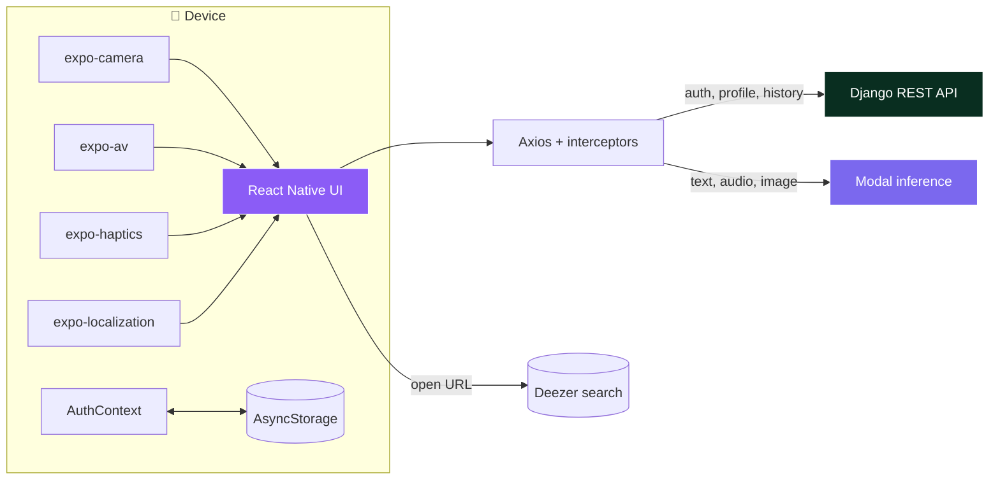
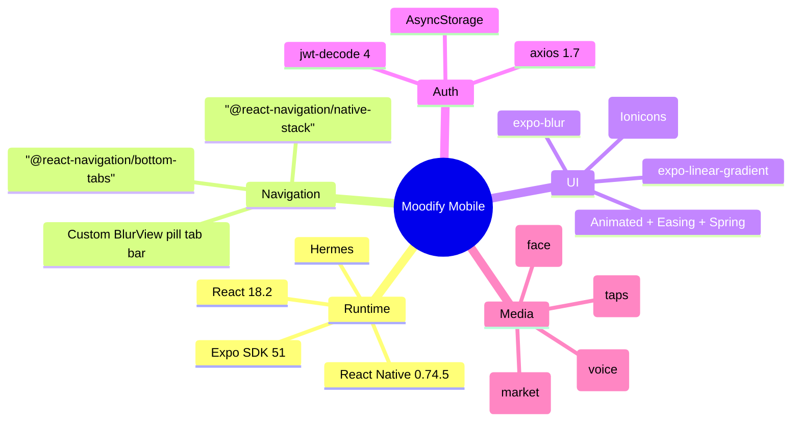
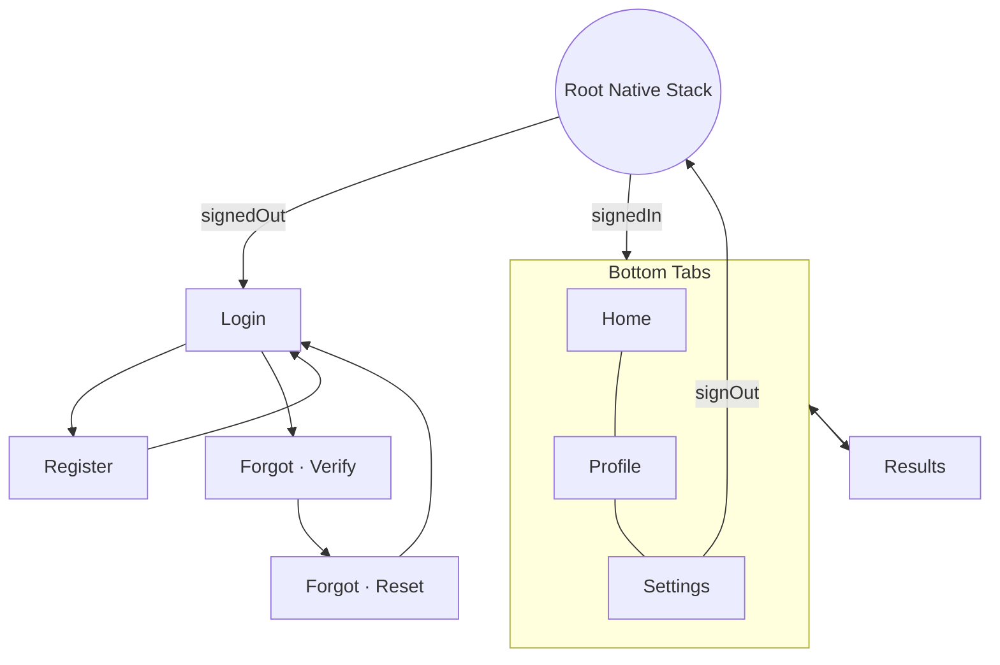
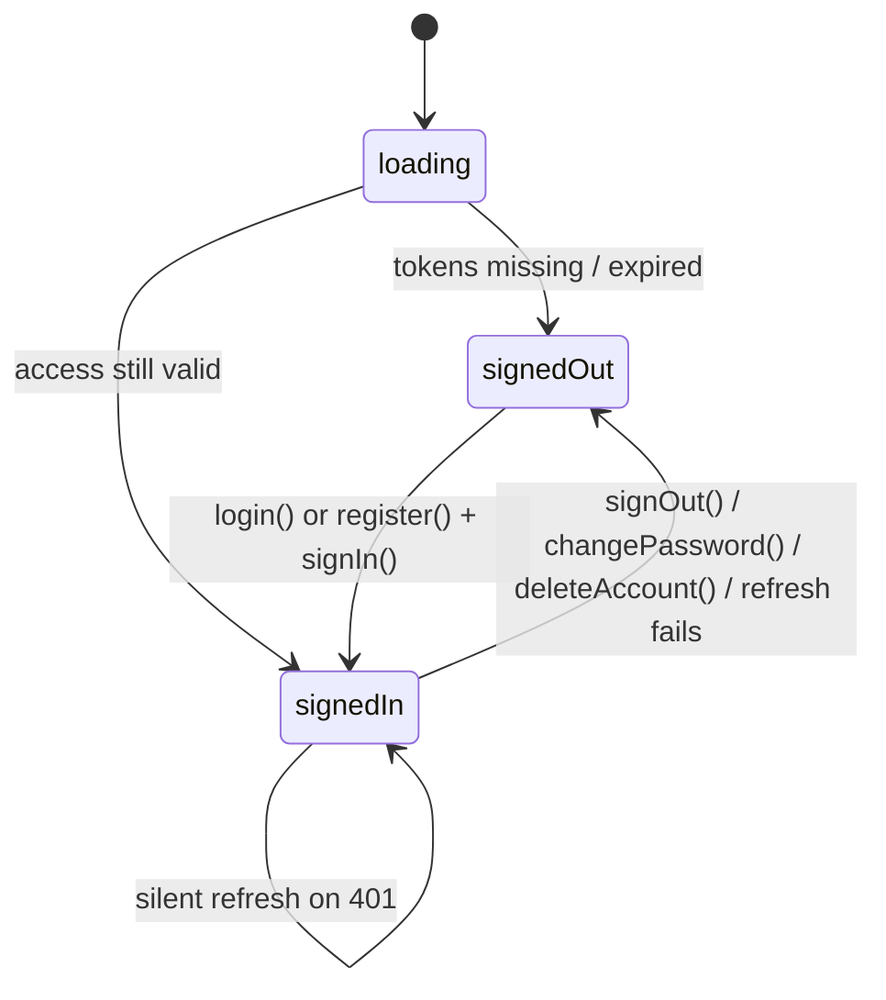
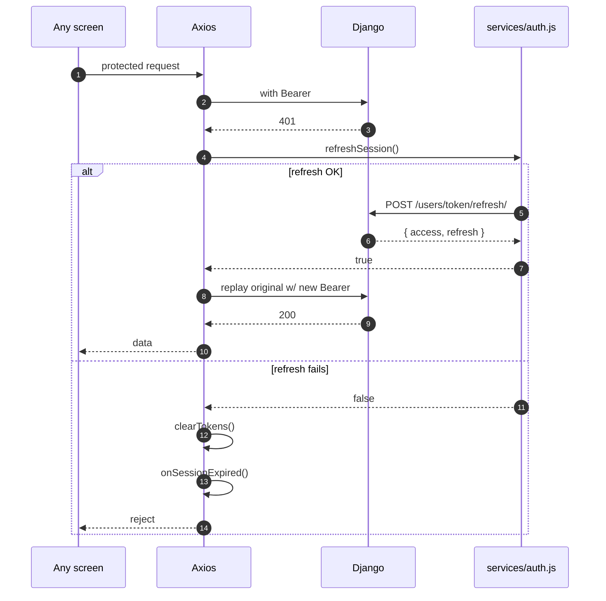
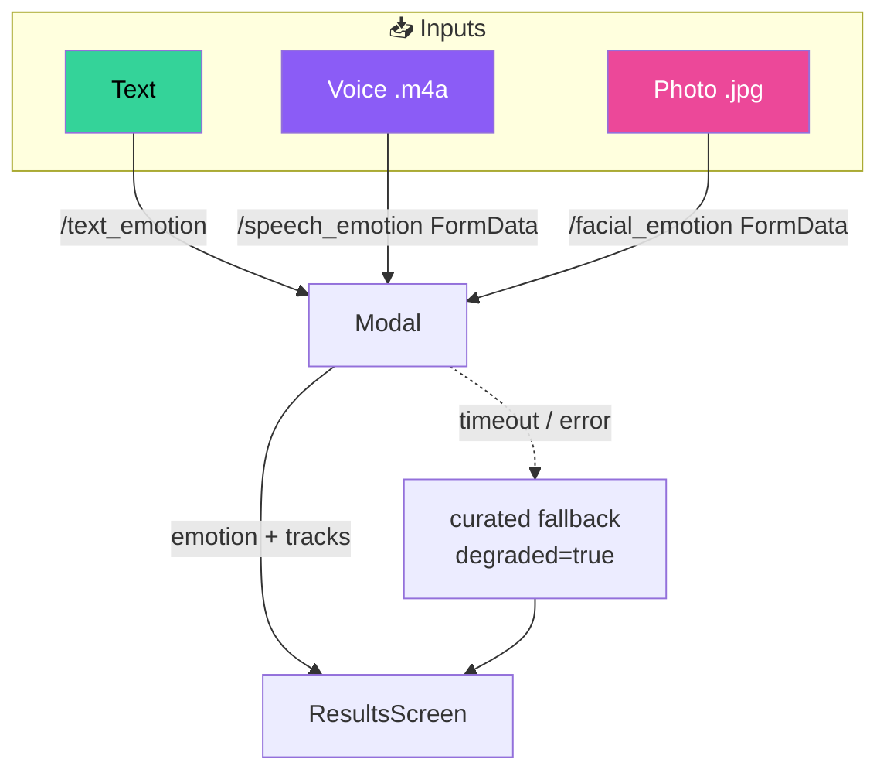
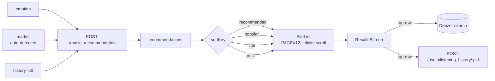
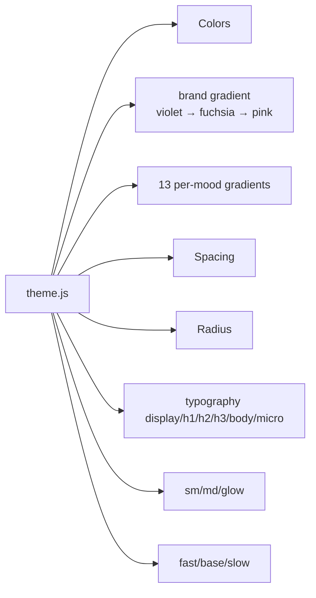
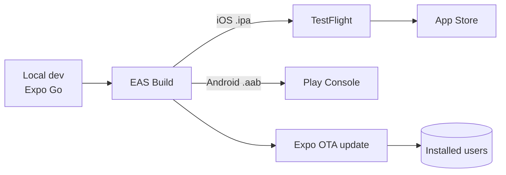
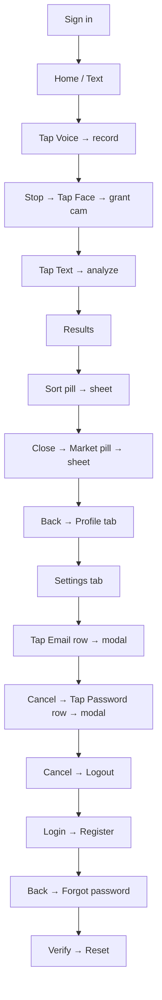

# Moodify Mobile

<p align="center">
  
</p>

<p align="center">
  A native <strong>React Native (Expo SDK 51)</strong> app for Moodify —
  detect a mood from text, voice or a selfie and get a matching,
  market-aware playlist of Deezer tracks. Premium dark UI, JWT auth with
  silent token refresh, graceful offline-degraded inference, and a
  custom blurred pill tab bar.
</p>

<p align="center">
  
  
  
  
  
  
  
  
  
  
</p>

> 📘 For the full deep dive — every screen, every flow, every diagram —
> see **[`../MOBILE_APPS.md`](../MOBILE_APPS.md)** (at repo root).

---

## Table of contents

1. [Highlights](#highlights)
2. [Quick visual tour](#quick-visual-tour)
3. [Architecture at a glance](#architecture-at-a-glance)
4. [Stack](#stack)
5. [Project layout](#project-layout)
6. [Navigation](#navigation)
7. [Auth lifecycle](#auth-lifecycle)
8. [Mood inference](#mood-inference)
9. [Recommendations + Results](#recommendations--results)
10. [Theme + mood palette](#theme--mood-palette)
11. [Component reference](#component-reference)
12. [Animation cookbook](#animation-cookbook)
13. [Haptics matrix](#haptics-matrix)
14. [Environment + config](#environment--config)
15. [Permissions](#permissions)
16. [Running it](#running-it)
17. [iOS simulator one-liner](#ios-simulator-one-liner)
18. [Android emulator one-liner](#android-emulator-one-liner)
19. [EAS production build](#eas-production-build)
20. [Build + release flow](#build--release-flow)
21. [Screens at a glance](#screens-at-a-glance)
22. [Capturing screenshots](#capturing-screenshots)
23. [Performance + accessibility](#performance--accessibility)
24. [Platform differences](#platform-differences)
25. [Troubleshooting](#troubleshooting)
26. [FAQ](#faq)
27. [License](#license)

---

## Highlights

<table>
  <tr>
    <td valign="top" width="50%">
      <ul>
        <li>🎙️ <strong>Three inference modes</strong> — text, voice (.m4a), front-facing selfie.</li>
        <li>🎨 <strong>Per-mood gradient theming</strong> — 13 distinct mood palettes.</li>
        <li>🔐 <strong>JWT auth with silent refresh</strong> — single in-flight refresh, no thundering herd.</li>
        <li>📡 <strong>Graceful degradation</strong> — Modal cold start / network failure still produces a playlist.</li>
        <li>🌍 <strong>Auto-detected market</strong> from device locale (16 countries + Global).</li>
      </ul>
    </td>
    <td valign="top" width="50%">
      <ul>
        <li>📜 <strong>Mood + listening history</strong> with one-tap clearing.</li>
        <li>📱 <strong>Custom blurred pill tab bar</strong> — gradient active pill, outline inactive icons.</li>
        <li>🧠 <strong>Smart password reset</strong> — two-step verify → reset with animated progress rail.</li>
        <li>⚡ <strong>Hermes JS engine</strong> for low cold-start memory.</li>
        <li>📲 <strong>Cross-platform</strong> — single Expo codebase, identical UX on iOS + Android.</li>
      </ul>
    </td>
  </tr>
</table>

---

## Quick visual tour

| Login | Home — Voice | Results | Profile |
|:---:|:---:|:---:|:---:|
|  |  |  |  |

| Settings | Edit Email | Change Password | Forgot — Reset |
|:---:|:---:|:---:|:---:|
|  |  |  |  |

| Home — Text | Home — Face | Sort sheet | Market sheet |
|:---:|:---:|:---:|:---:|
|  |  |  |  |

| Register | Forgot — Verify | Explore (iOS) | Explore (Android) |
|:---:|:---:|:---:|:---:|
|  |  |  |  |

The full **15 iOS + 15 Android** captures live in
[`docs/screenshots/`](docs/screenshots) and are walked through one-by-one
in [`../MOBILE_APPS.md`](../MOBILE_APPS.md).

---

## Architecture at a glance


```mermaid
flowchart LR
    subgraph Device[📱 Device]
        UI[React Native UI]
        Ctx[AuthContext]
        Store[(AsyncStorage)]
        Cam[expo-camera]
        Mic[expo-av]
        Hap[expo-haptics]
        Loc[expo-localization]
    end

    UI --> Ax[Axios + interceptors]
    Ctx <--> Store
    Cam --> UI
    Mic --> UI
    Hap --> UI
    Loc --> UI

    Ax -- "auth, profile, history" --> API[Django REST API]
    Ax -- "text, audio, image" --> Modal[Modal inference]
    UI -- "open URL" --> Deezer[(Deezer search)]

    style UI fill:#8b5cf6,stroke:#fff,color:#fff
    style API fill:#092E20,stroke:#fff,color:#fff
    style Modal fill:#7B68EE,stroke:#fff,color:#fff
```

The app talks to the **same two backends as the web frontend**:

| Service                     | Purpose                                                              |
| --------------------------- | -------------------------------------------------------------------- |
| `EXPO_PUBLIC_API_URL`       | Django REST API — register, login, refresh, profile, mood + listening history |
| `EXPO_PUBLIC_MODAL_API_URL` | Modal inference service — text/speech/facial emotion + music recommender      |

`src/services/auth.js` installs global axios interceptors: every
authenticated request carries the JWT, and a `401` triggers **one**
silent refresh + retry before the user is bounced back to Login.

---

## Stack


```mermaid
mindmap
  root((Moodify Mobile))
    Runtime
      Expo SDK 51
      React Native 0.74.5
      React 18.2
      Hermes
    Navigation
      "@react-navigation/native-stack"
      "@react-navigation/bottom-tabs"
      Custom BlurView pill tab bar
    UI
      expo-blur
      expo-linear-gradient
      @expo/vector-icons (Ionicons)
      Animated + Easing + Spring
    Auth
      axios 1.7
      jwt-decode 4
      AsyncStorage
    Media
      expo-camera (face)
      expo-av (voice)
      expo-haptics (taps)
      expo-localization (market)
```

---

## Project layout

```
mobile/
├── App.js                       # auth-gated root navigator
├── app.json                     # Expo manifest, bundle ids, plugins
├── config.js                    # EXPO_PUBLIC_* env URL resolver
├── theme.js                     # design tokens
├── docs/screenshots/{ios,android}/  # 14 captures per platform
├── assets/                      # icon, splash, adaptive icon
└── src/
    ├── context/AuthContext.js   # AuthProvider + useAuth()
    ├── services/
    │   ├── auth.js              # tokens, interceptors, silent refresh
    │   └── emotion.js           # inference + history APIs (never throws)
    ├── navigation/TabNavigator.js
    ├── screens/                 # Login, Register, Forgot, Home, Results, Profile, Settings
    ├── components/              # Screen, AppButton, TextField, MoodHero, TrackCard, OptionSheet, FaceCapture, StatCard, SectionHeader, Skeleton, EmptyState, Toast, GradientBorder
    └── util/haptics.js
```

---

## Navigation


```mermaid
flowchart TD
    Root((Root Native Stack)) -->|signedOut| L[Login]
    Root -->|signedIn| Tabs

    L --> R[Register]
    L --> F1[Forgot · Verify]
    F1 --> F2[Forgot · Reset]
    R --> L
    F2 --> L

    subgraph Tabs[Bottom Tabs]
        H[Home] --- P[Profile] --- S[Settings]
    end
    Tabs --> RES[Results]
    RES --> Tabs
    S -->|signOut| Root
```

| Tab       | What it does                                                                                              |
| --------- | --------------------------------------------------------------------------------------------------------- |
| Home      | Pick a mode (Text / Voice / Face), run inference, push Results.                                            |
| Profile   | Avatar, three stat tiles, recent mood chips, recent listening rows, pull-to-refresh.                       |
| Settings  | Edit email, change password, clear mood / saved / listening history, delete account, log out.              |

The custom tab bar is a `BlurView`-backed floating pill: active tab is a
gradient pill with a label, inactive tabs are outline icons.

---

## Auth lifecycle


```mermaid
stateDiagram-v2
    [*] --> loading
    loading --> signedOut: tokens missing / expired
    loading --> signedIn: access still valid
    signedOut --> signedIn: login() or register() + signIn()
    signedIn --> signedOut: signOut() / changePassword() / deleteAccount() / refresh fails
    signedIn --> signedIn: silent refresh on 401
```


```mermaid
sequenceDiagram
    autonumber
    participant U as Any screen
    participant X as Axios
    participant API as Django
    participant S as services/auth.js

    U->>X: protected request
    X->>API: with Bearer
    API-->>X: 401
    X->>S: refreshSession()
    alt refresh OK
        S->>API: POST /users/token/refresh/
        API-->>S: { access, refresh }
        S-->>X: true
        X->>API: replay original w/ new Bearer
        API-->>X: 200
        X-->>U: data
    else refresh fails
        S-->>X: false
        X->>X: clearTokens()
        X->>X: onSessionExpired()
        X-->>U: reject
    end
```

A `_skipAuth` flag opts the login/register/refresh/reset endpoints out
of this dance so they never loop back into themselves. A
`refreshInFlight` promise collapses concurrent 401s into a single
refresh round-trip.

### Auth function map

| Function                                | Endpoint                                | Side effects                                 |
| --------------------------------------- | --------------------------------------- | -------------------------------------------- |
| `login(u, p)`                           | `POST /users/login/`                    | persist `access` + `refresh`                  |
| `register(u, e, p)`                     | `POST /users/register/`                 | none (auto-followed by `signIn`)              |
| `logout()`                              | n/a                                     | `clearTokens()`                               |
| `refreshSession()`                      | `POST /users/token/refresh/`            | persist new pair, single in-flight            |
| `verifyUsernameEmail(u, e)`             | `POST /users/verify-username-email/`    | none                                          |
| `resetPassword(u, p)`                   | `POST /users/reset-password/`           | none                                          |
| `changePassword(p)`                     | `POST /users/reset-password/` (self)    | `clearTokens()` (forces re-sign-in)           |
| `updateProfile({ email })`              | `PUT /users/user/profile/update/`       | none                                          |
| `deleteAccount()`                       | `DELETE /users/user/profile/delete/`    | `clearTokens()`                               |

---

## Mood inference


```mermaid
flowchart TB
    subgraph Inputs[📥 Inputs]
        T[Text]:::text
        V[Voice .m4a]:::voice
        F[Photo .jpg]:::face
    end

    T -->|/text_emotion| M[Modal]
    V -->|/speech_emotion FormData| M
    F -->|/facial_emotion FormData| M

    M -->|emotion + tracks| R[ResultsScreen]
    M -.timeout / error.-> FB[curated fallback<br/>degraded=true]
    FB --> R

    classDef text fill:#34d399,color:#000
    classDef voice fill:#8b5cf6,color:#fff
    classDef face fill:#ec4899,color:#fff
```

Key resilience properties:

- All three inference helpers in `services/emotion.js` are
  **try/catch-wrapped** and resolve to `{ degraded: true, recommendations: FALLBACK_TRACKS }`
  on any failure — the Results screen never has to surface an inference error to the user.
- A **60 s timeout** absorbs Modal cold starts.
- After a successful inference the screen *fires-and-forgets* `saveMood`
  and `saveRecommendations` to the Django API so the user is never
  blocked by analytics persistence.

### Mode comparison

| Mode  | Input      | Sent as                | Endpoint             | UI affordance                            |
| ----- | ---------- | ---------------------- | -------------------- | ---------------------------------------- |
| Text  | string     | `{ text }` JSON         | `/text_emotion`      | multiline `TextField` + Analyze button   |
| Voice | .m4a URI   | multipart file         | `/speech_emotion`    | gradient mic → red stop + pulse ring     |
| Face  | .jpg URI   | multipart file         | `/facial_emotion`    | front camera + circular alignment ring   |

---

## Recommendations + Results


```mermaid
flowchart LR
    E[emotion] --> Rec[POST /music_recommendation]
    Mkt[market<br/>auto-detected] --> Rec
    Hist[history -50] --> Rec
    Rec --> Tracks[recommendations]
    Tracks --> Sort{sortKey}
    Sort -->|recommended| Pg
    Sort -->|popular| Pg
    Sort -->|title| Pg
    Sort -->|artist| Pg
    Pg[FlatList<br/>PAGE=12, infinite scroll] --> UI[ResultsScreen]
    UI -->|tap row| Deezer[(Deezer search)]
    UI -->|tap row| Log[POST /users/listening_history/:pid]
```

`expo-localization` provides the initial market suggestion; an `OptionSheet`
bottom-sheet handles both **sort** and **market** pickers (4 sort modes,
17 market entries including Global).

### Sort modes

| Sort key      | Comparator                                                              |
| ------------- | ----------------------------------------------------------------------- |
| `recommended` | identity (preserve server order)                                        |
| `popular`     | `(b.popularity \|\| 0) - (a.popularity \|\| 0)`                          |
| `title`       | `String(a.name \|\| '').localeCompare(String(b.name \|\| ''))`           |
| `artist`      | `String(a.artist \|\| '').localeCompare(String(b.artist \|\| ''))`       |

### Markets shipped

`Global · US · GB · CA · AU · IN · IE · DE · FR · ES · IT · NL · SE · BR · MX · JP · KR`

---

## Theme + mood palette


```mermaid
flowchart LR
    T["theme.js"] --> Colors
    T --> Gradient["brand gradient<br/>violet → fuchsia → pink"]
    T --> Mood["13 per-mood gradients"]
    T --> Spacing
    T --> Radius
    T --> Type["typography display/h1/h2/h3/body/micro"]
    T --> Shadows["sm/md/glow"]
    T --> Motion["fast/base/slow"]
```

| Mood       | Emoji | Gradient                          |
| ---------- | :---: | --------------------------------- |
| joy/happy  |  😊   | `#f59e0b → #f472b6 → #ec4899`     |
| love       |  🥰   | `#ec4899 → #f472b6 → #fb7185`     |
| excited    |  🤩   | `#f97316 → #ec4899 → #a855f7`     |
| surprised  |  😲   | `#06b6d4 → #22d3ee → #a855f7`     |
| calm       |  😌   | `#10b981 → #22d3ee → #3b82f6`     |
| sad        |  😢   | `#1e3a8a → #3b82f6 → #60a5fa`     |
| fearful    |  😨   | `#4c1d95 → #7c3aed → #a855f7`     |
| angry      |  😠   | `#9f1239 → #e11d48 → #f43f5e`     |
| disgust    |  😖   | `#365314 → #65a30d → #a3e635`     |
| neutral    |  😌   | slate scale                       |

`moodPaletteFor(emotion)` is case-insensitive and falls back to the brand
gradient + a `🎧` glyph for unknown emotions — the Results screen is never
without a coherent palette.

---

## Component reference

| Component        | One-liner                                            |
| ---------------- | ---------------------------------------------------- |
| `Screen`         | safe-area scroll container + mood-tinted background  |
| `AppButton`      | primary / ghost / danger variants w/ loading state   |
| `TextField`      | labeled input with optional leading icon             |
| `GradientBorder` | 1.5 px gradient frame around any card                |
| `MoodHero`       | mood card on Results — gradient + emoji + label      |
| `TrackCard`      | track row — art, name, artist, popularity, play      |
| `OptionSheet`    | bottom-sheet single-select picker                    |
| `FaceCapture`    | camera permission + preview + capture button         |
| `StatCard`       | 3-up stat tile on Profile                            |
| `SectionHeader`  | title + subtitle pair                                |
| `Skeleton`       | shimmer placeholder row                              |
| `EmptyState`     | icon + title + message + optional CTA                |
| `Toast`          | provider + `useToast()` hook for transient alerts    |

---

## Animation cookbook

| Where                   | What                                  | Driver / spec                                                          |
| ----------------------- | ------------------------------------- | ---------------------------------------------------------------------- |
| Login / Reg / Forgot    | entry fade + slide                    | `parallel(timing(fade,520), spring(slide))`                            |
| Login / Reg / Forgot    | logo halo (subtle)                    | `loop(timing(halo) 2.4s)`, opacity 0.12 → 0.22, scale 0.96 → 1.06       |
| Login / Reg / Forgot    | drifting background orbs              | `loop(timing(orbA) 5.4s)`, `loop(timing(orbB) 6.8s with 400ms delay)`  |
| Forgot password         | progress-rail width crossfade         | `timing(progress, 380ms, Easing.out(cubic))` → width 0% → 100%         |
| Home / Voice            | recording pulse ring                  | `loop` of scale 1 → 1.35 and opacity 0.6 → 0 over 900ms each direction |
| Home                    | greeting fade-in                      | `timing(fade, 460ms)`                                                  |
| Profile                 | scroll fade-in on data load           | `timing(fade, 360ms)`                                                  |
| Modals / sheets         | slide-up over blurred scrim           | `<Modal animationType="slide">` + `<BlurView intensity={30}>`           |

All loops use `useNativeDriver: true` where possible.

---

## Haptics matrix

`src/util/haptics.js` wraps `expo-haptics`:

| Helper       | Style                                | Where                                            |
| ------------ | ------------------------------------ | ------------------------------------------------ |
| `tapLight`   | `ImpactFeedbackStyle.Light`          | mode-card tap, sheet open, mood-chip tap         |
| `tapMedium`  | `ImpactFeedbackStyle.Medium`         | mic start/stop, camera capture                   |
| `select`     | `selectionAsync()`                   | tab change                                       |
| `success`    | `NotificationFeedbackType.Success`   | login/register/save/reset OK                     |
| `error`      | `NotificationFeedbackType.Error`     | validation fail, network error                   |

---

## Environment + config

The app reads two `EXPO_PUBLIC_*` env vars from `.env` (loaded by Expo)
at bundle build time. Both have production fallbacks baked into
[`config.js`](config.js).

```bash
# mobile/.env
EXPO_PUBLIC_API_URL=https://moodify-backend-api.vercel.app
EXPO_PUBLIC_MODAL_API_URL=https://hoangsonww--moodify-inference-inferenceservice-web.modal.run
```

| Var                          | Resolves to (default)                                                    |
| ---------------------------- | ------------------------------------------------------------------------ |
| `EXPO_PUBLIC_API_URL`        | `https://moodify-backend-api.vercel.app`                                  |
| `EXPO_PUBLIC_MODAL_API_URL`  | `https://hoangsonww--moodify-inference-inferenceservice-web.modal.run`    |

`config.js` strips trailing slashes from both so the rest of the app
can `${API_URL}/users/...` safely.

---

## Permissions

| Permission   | When asked                                | What's sent                |
| ------------ | ----------------------------------------- | -------------------------- |
| Microphone   | First Voice-mode tap                      | One short `.m4a` clip       |
| Camera       | First Face-mode tap                       | One front-facing `.jpg`     |
| (none)       | Text mode                                 | A plain `{ text }` payload  |

If either is denied the rest of the app still works; the affected mode
shows its empty-state UI. Permission strings are declared in
[`app.json`](app.json).

---

## Running it

### Local dev

```bash
cd mobile
npm install
cp .env.example .env        # set EXPO_PUBLIC_API_URL / EXPO_PUBLIC_MODAL_API_URL
npm start                   # then press i / a, or scan with Expo Go
```

If port `8081` is already taken by another Expo project on your machine:

```bash
npx expo start --port 8083
```

The app reads the two `EXPO_PUBLIC_*` URLs at build time and has
production fallbacks baked into `config.js` — an empty `.env` still
produces a working build.

### Available scripts

| Script         | Does                                                |
| -------------- | --------------------------------------------------- |
| `npm start`    | `expo start` — opens DevTools                       |
| `npm run ios`  | `expo start --ios` — boots Expo Go in iOS sim       |
| `npm run android` | `expo start --android` — opens in Android emulator |
| `npm run web`  | `expo start --web` — opens in browser               |

---

## iOS simulator one-liner

```bash
xcrun simctl boot 'iPhone 16 Pro'
open -a Simulator
cd mobile && npx expo start --ios --port 8083
# snap a screenshot
xcrun simctl io booted screenshot ~/Desktop/shot.png
```

---

## Android emulator one-liner

```bash
emulator -avd Pixel_8_Pro_API_35
cd mobile && npx expo start --android --port 8083
# snap a screenshot
adb exec-out screencap -p > ~/Desktop/shot.png
```

---

## EAS production build

```bash
npx eas-cli login
npx eas-cli env:create EXPO_PUBLIC_API_URL --value https://moodify-backend-api.vercel.app
npx eas-cli env:create EXPO_PUBLIC_MODAL_API_URL --value https://hoangsonww--moodify-inference-inferenceservice-web.modal.run
npx eas-cli build -p ios       # or -p android
```

Bundle identifier for both platforms: **`com.moodify.mobile`**.
iPad support is enabled (`ios.supportsTablet: true`).

---

## Build + release flow


```mermaid
flowchart LR
    Dev[Local dev<br/>Expo Go] --> EAS[EAS Build]
    EAS -->|iOS .ipa| TF[TestFlight]
    EAS -->|Android .aab| PS[Play Console]
    TF --> AS[App Store]
    EAS --> OTA[Expo OTA update]
    OTA --> Users[(Installed users)]
```

OTA updates (Expo Updates) let small JS-only changes ship without a
store re-review, while native dependency bumps require a fresh EAS build.

---

## Screens at a glance

A one-line summary per screen — full descriptions and side-by-side
iOS/Android shots are in [`../MOBILE_APPS.md`](../MOBILE_APPS.md).

- **Login** — `Welcome back` hero with three feature chips and a
  gradient-bordered sign-in card.
- **Register** — Two sub-cards (identity / secure) with a live password
  strength meter and four rule chips.
- **Forgot password** — Single screen, two animated steps (Verify →
  Reset) with a progress rail and palette swap.
- **Home** — Time-aware greeting, last-mood chip, three mode cards
  (Text / Voice / Face), and a recent-moods strip.
- **Results** — `MoodHero` palette card + sort/market pills + paginated
  `TrackCard` list + shuffle + analyze-another CTA.
- **Profile** — Gradient avatar ring, three stat tiles, recent-mood
  chips and recent-listening rows; pull-to-refresh.
- **Settings** — Account (email + password), data (3 clears), danger
  zone (delete + logout).

---

## Capturing screenshots

The 14 + 14 captures in `docs/screenshots/` were driven through the app
in this order:


```mermaid
flowchart TD
    A[Sign in] --> B[Home / Text]
    B --> C[Tap Voice → record]
    C --> D[Stop → Tap Face → grant cam]
    D --> E[Tap Text → analyze]
    E --> F[Results]
    F --> G[Sort pill → sheet]
    G --> H[Close → Market pill → sheet]
    H --> I[Back → Profile tab]
    I --> J[Settings tab]
    J --> K[Tap Email row → modal]
    K --> L[Cancel → Tap Password row → modal]
    L --> M[Cancel → Logout]
    M --> N[Login → Register]
    N --> O[Back → Forgot password]
    O --> P[Verify → Reset]
```

Each frame is snapped natively:

```bash
xcrun simctl io booted screenshot docs/screenshots/ios/NN-name.png
adb exec-out screencap -p     >  docs/screenshots/android/NN-name.png
```

---

## Performance + accessibility

| Concern                  | Mitigation                                                       |
| ------------------------ | ---------------------------------------------------------------- |
| FlatList scroll perf     | `removeClippedSubviews`, PAGE = 12, compact `TrackCard`           |
| Animated loops           | `useNativeDriver: true` wherever possible                         |
| Concurrent 401s          | Single in-flight refresh via `refreshInFlight`                    |
| Modal cold starts        | 60 s timeout + automatic fallback playlist (`degraded: true`)     |
| Photo upload size        | `quality: 0.6` + `skipProcessing: true`                           |
| Color contrast           | Body copy passes 4.5 : 1 on `colors.bg`                            |
| VoiceOver / TalkBack     | `accessibilityRole`, `accessibilityState`, labels on every tab    |

---

## Platform differences

| Surface             | iOS                                                 | Android                                                 |
| ------------------- | --------------------------------------------------- | ------------------------------------------------------- |
| Status bar          | `<StatusBar style="light" />`                       | Same — translucent over `colors.bg`                     |
| Tab bar safe area   | `useSafeAreaInsets().bottom` (~34 pt on Pro models) | Usually 0; falls back to `spacing.sm`                   |
| Blur                | Native `expo-blur`                                  | Tint-only fallback on older devices                     |
| Keyboard avoid      | `behavior="padding"`                                | Native resize                                           |
| Audio record        | Needs `allowsRecordingIOS:true`                     | Just permission                                         |
| Haptics             | Full taptic engine                                  | Vibration only on supported devices                     |

---

## Troubleshooting

| Symptom                              | Likely cause                          | Fix                                                            |
| ------------------------------------ | ------------------------------------- | -------------------------------------------------------------- |
| Stuck on "Reading your mood…"        | Modal cold start                      | Wait — next call is warm; check Modal dashboard if it persists. |
| Always lands on Login after open     | Refresh token expired                 | Re-sign-in.                                                     |
| Camera tab empty after granting      | Permission cache desync               | Force-quit the app, reopen; clear permission in iOS Settings.  |
| `Port 8081 is running ...`           | Other Expo project running locally    | `npx expo start --port 8083`.                                  |
| Every request errors                 | Wrong `EXPO_PUBLIC_*` envs            | Verify env URLs; defaults in `config.js` should otherwise work. |
| Sign-in succeeds, then immediate logout | System clock skew > 30 s          | Sync NTP on the device.                                         |
| Blur not rendering on Android        | Older device without RenderEffect     | Tint-only fallback — visual but functional.                     |

More entries: see [`../MOBILE_APPS.md → Troubleshooting`](../MOBILE_APPS.md#troubleshooting).

---

## FAQ

**Q. Do I need an Expo account to run the app locally?**
No. `npx expo start` works without one. EAS Build (cloud builds) needs
one.

**Q. Does the app store data offline?**
Only the JWT pair (in AsyncStorage). All mood / listening / profile data
lives on the Django API and is fetched on demand. There is no offline
queue for unsent inference requests.

**Q. Why Deezer and not Spotify?**
Deezer's free, no-key search endpoint is the most robust way to deep-link
into a streamable result without OAuth. Spotify integration is on the
roadmap.

**Q. Can I run it on web?**
`npm run web` renders most screens via `react-native-web`. The camera
and microphone modes require native permissions, so on web they show
their empty-state UI.

**Q. What's the minimum Expo Go version?**
Expo Go for SDK 51 (currently shipping as 2.31.x at the time of writing).
Older Expo Go clients won't load the bundle.

---

## License

Same license as the parent repo — see [`../LICENSE`](../LICENSE).

---

<p align="center">
  Built with ☕, ❤️ and an unhealthy amount of <strong>Expo Go</strong>.
</p>
