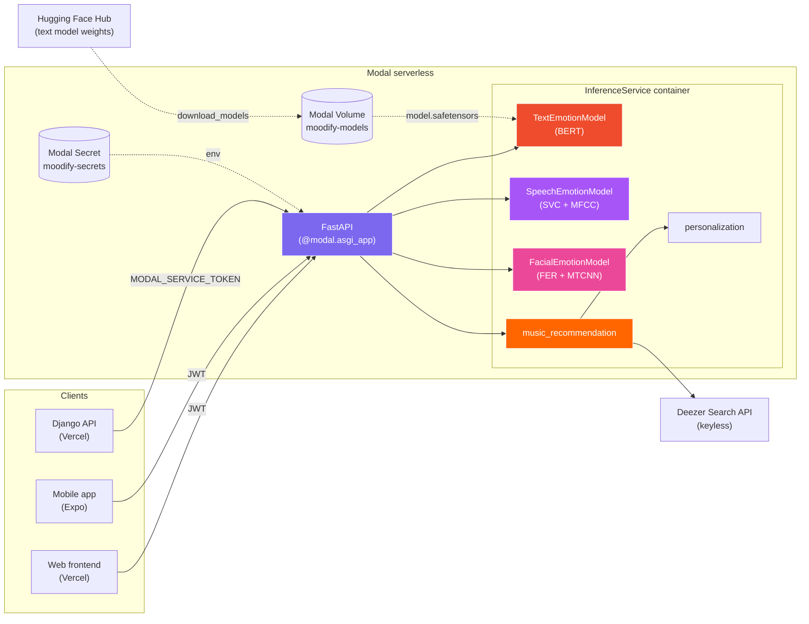
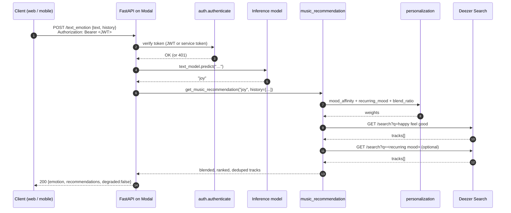
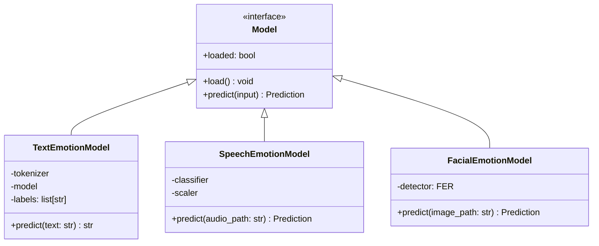
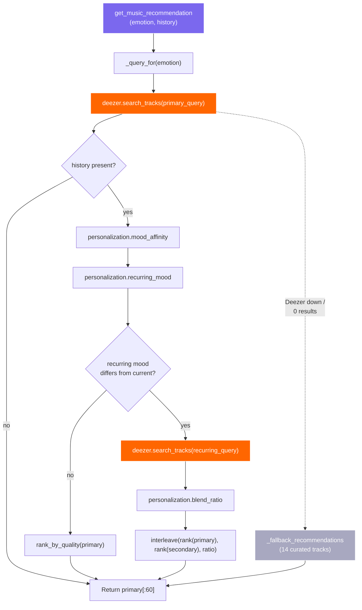
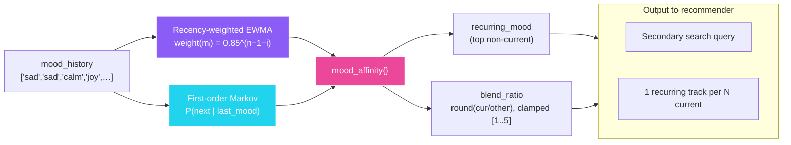
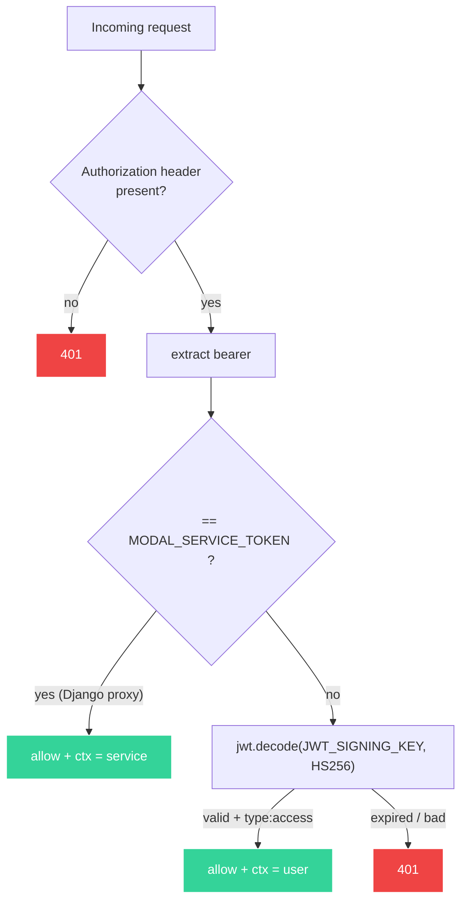
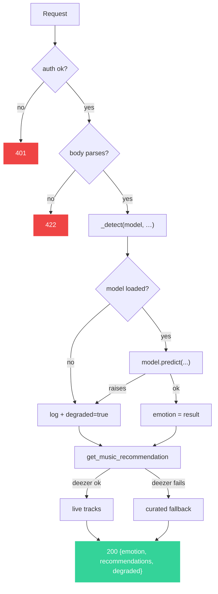
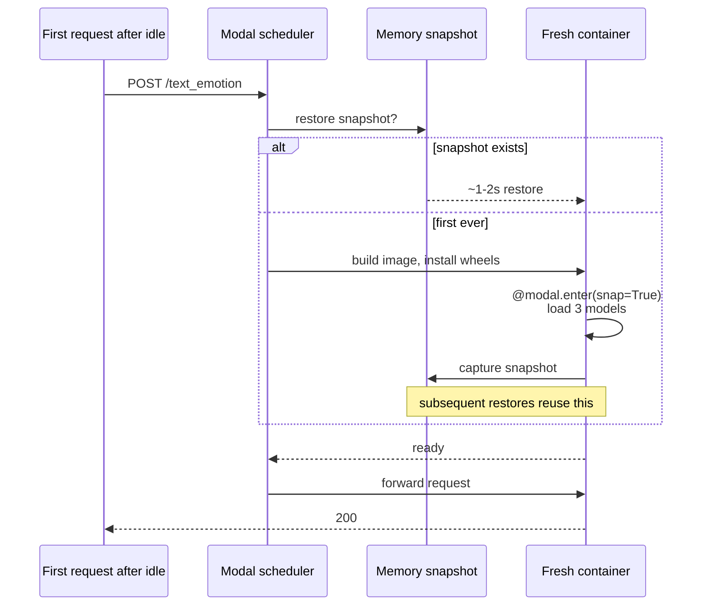

# Moodify ML Inference Service

<p align="center">
  
</p>

<p align="center">
  Standalone serverless ML inference service for Moodify, deployed on
  <a href="https://modal.com"><strong>Modal</strong></a>. Hosts three
  emotion-recognition models (text, speech, face), drives a Deezer-backed
  music recommender, and runs a lightweight personalization model that
  blends each user's recurring moods into every result — all behind a
  single FastAPI surface that scales to zero when idle.
</p>

<p align="center">
  
  
  
  
  
  
  
  
  
  
  
  
</p>

---

## Table of contents

1. [What it is](#what-it-is)
2. [Why it exists (vs. in-process Django)](#why-it-exists-vs-in-process-django)
3. [High-level architecture](#high-level-architecture)
4. [Request lifecycle](#request-lifecycle)
5. [The three emotion models](#the-three-emotion-models)
6. [Recommendation pipeline](#recommendation-pipeline)
7. [Personalization model (lightweight ML)](#personalization-model-lightweight-ml)
8. [Authentication](#authentication)
9. [Rate limiting](#rate-limiting)
10. [Caching](#caching)
11. [Endpoint reference](#endpoint-reference)
12. [Resilience guarantees](#resilience-guarantees)
13. [Project layout](#project-layout)
14. [Configuration](#configuration)
15. [Cold-start behaviour + memory snapshots](#cold-start-behaviour--memory-snapshots)
16. [Setup + deploy](#setup--deploy)
17. [Local development](#local-development)
18. [Testing](#testing)
19. [Observability](#observability)
20. [Cost + scaling notes](#cost--scaling-notes)
21. [GPU flip](#gpu-flip)
22. [Troubleshooting](#troubleshooting)
23. [FAQ](#faq)

---

## What it is

`modal_inference/` is a self-contained Python service that exposes five
HTTP endpoints — `/health`, `/text_emotion`, `/speech_emotion`,
`/facial_emotion`, `/music_recommendation` — and packs three things into
each request:

1. **Mood detection** from text, audio, or a photo.
2. **Live recommendations** from Deezer's public Search API.
3. **Personalization** that blends a user's recurring mood into the
   ranked result set, driven by a recency-weighted affinity model.

It runs on Modal as a `@modal.asgi_app()` exposing a FastAPI app, scales
to zero when idle, and uses CPU memory snapshots so cold starts restore
in seconds instead of re-importing torch / TF and re-loading every
model.

---

## Why it exists (vs. in-process Django)

The Django API used to import torch + transformers + tensorflow + fer +
opencv directly. That made the Vercel bundle unshippable (>50 MB lambda
limit), cold starts catastrophic, and every Django pod needed multi-GB
memory just to *boot*. Splitting inference out fixed all three:

| Concern | In-process Django | Modal inference service |
|---|---|---|
| Vercel bundle | 600+ MB, refuses to deploy | 20 MB Django slim, ML lives elsewhere |
| Cold start | 30-60s pulling wheels + loading models | ~1-2s with memory snapshot restore |
| Memory at idle | 2-4 GB resident | 0 (scales to zero) |
| Scaling | One process per pod, scaled by Vercel | Per-call container, Modal auto-scales |
| GPU access | Impossible on Vercel | One-line `gpu="T4"` flag flip |

---

## High-level architecture



Three things to notice:

- **One container holds all three models.** Loading them in parallel
  amortises the cold-start cost. A failure loading any one model is
  isolated: its endpoint reports degraded, the others keep serving.
- **The big text-model weights live in a Modal Volume**, not the image.
  Image stays small; the volume is mounted at `/models`. A one-time
  `modal run modal_app.py::download_models` pulls `model.safetensors`
  from Hugging Face and commits it to the volume.
- **Deezer replaces Spotify.** Spotify locked down `/v1/search` for
  client-credentials apps (every call 403s); Deezer's public API is
  keyless and returns the same shape of data — track name, artist,
  album, 30s preview, cover art, popularity rank.

---

## Request lifecycle



Two things this diagram makes obvious:

- The personalization model runs *before* the Deezer calls — it decides
  whether to fetch a second mood at all, and at what blend ratio.
- Auth is checked *first*. Every endpoint other than `/health` requires
  a valid JWT (end-user) or `MODAL_SERVICE_TOKEN` (Django proxy).

---

## The three emotion models

| Model | Library | Weights | Where | Output labels |
|---|---|---|---|---|
| **Text** | `transformers` (BERT) | Fine-tuned `BertForSequenceClassification` | HF Hub → Modal Volume (`/models/text_emotion_model/`) | `sadness, joy, love, anger, fear` |
| **Speech** | `scikit-learn` SVC + scaler over `librosa` MFCCs | Pickled, bundled in image (`/assets/speech_emotion_model/`) | `calm, happy, sad, angry, fearful, disgust, surprised, neutral` |
| **Face** | `fer` (Keras model wrapped in MTCNN) | Bundled with the `fer` package | `angry, disgust, fear, happy, sad, surprise, neutral` |

Loading is decoupled — each model exposes `load()`, `loaded: bool`, and
`predict()`. The `InferenceService` calls all three in its
`@modal.enter(snap=True)` hook so they're in memory before the snapshot
is taken. One failing model logs and stays `loaded=False`; its endpoint
returns `degraded: true` with `config.DEFAULT_EMOTION` (`neutral`)
instead of a 500.



---

## Recommendation pipeline

`modal_inference/recommendation/music_recommendation.py` is the
orchestrator; `deezer.py` is a thin HTTP client around Deezer's keyless
search API.



**Why this design works without Spotify:**

1. Deezer's search returns mood-keyword results — almost as good as
   Spotify's curated playlists for our purposes.
2. The personalization stays meaningful: blending recurring moods
   doesn't depend on having access to playlist endpoints.
3. The curated fallback list (14 popular tracks) guarantees a non-empty
   200 response even on full network outage.

**Emotion → query map** (full list in `EMOTION_TO_QUERY`):

| Detected | Search phrase |
|---|---|
| joy / happy | `happy feel good` |
| sadness / sad | `sad songs` |
| anger / angry | `angry rock` |
| love | `love songs romance` |
| fear / fearful | `calm soothing` |
| calm | `peaceful calm` |
| excited | `energetic hype` |
| nostalgic | `throwback nostalgia` |
| ... | ... (30+ entries) |
| (unknown) | `popular hits` |

---

## Personalization model (lightweight ML)

In `recommendation/personalization.py`. Three classical, sub-millisecond
techniques compose into the blend:



| Component | What it does | Why |
|---|---|---|
| **EWMA** | Exponentially decays older history entries. Tunable: `RECENCY_DECAY = 0.85`. | Recent moods dominate; ancient history fades. |
| **First-order Markov** | Counts transitions in the mood sequence, predicts the next mood, boosts its affinity. `MARKOV_BOOST = 0.6`. | Captures recurring patterns like "calm → joy" or oscillation. |
| **`rank_by_quality`** | Reorders one mood's tracks by curated position blended with Deezer popularity. `POPULARITY_WEIGHT = 0.2`. | Surfaces strongly popular tracks while keeping the curated rank as the dominant signal. |
| **Adaptive `blend_ratio`** | `round(current_affinity / other_affinity)`, clamped `[1, 5]`. | A strongly recurring mood interleaves often; a faint one only occasionally. |
| **`interleave`** | One recurring-mood track per N current ones; deduplicated by external URL. | The current mood stays the backbone; the recurring mood is a flavour. |

Everything is O(history + tracks) integer/float counting. Adds well
under a millisecond per request — fast enough to run inline on every
recommendation call. 14 unit tests in `tests/test_personalization.py`
cover the maths.

---

## Authentication



`JWT_SIGNING_KEY` is **shared** with the Django API — Django signs
end-user tokens, Modal verifies. `MODAL_SERVICE_TOKEN` is a constant
shared with Django specifically for the proxy path. Code in `auth.py`,
mounted as a FastAPI dependency in `service.py`.

---

## Rate limiting

Per-caller **sliding-window** throttle, in-process, applied to every
inference endpoint (`/health` is exempt). The goal is *cost protection
without UX cost* — a real user never hits the limit; a stuck retry
loop trips within seconds and stops bleeding compute budget.

### Two tiers

The modalities have very different compute costs, so we run two
independent limiters with separate per-user budgets:

| Tier | Endpoints | Default | Why |
|---|---|---|---|
| `general` | `/text_emotion`, `/music_recommendation` | **45 req / 60 s** per user | ~1 call every 1.3 s sustained. A demo session toggling moods rapidly hits maybe 20–30/min, so headroom is ~50%. A stuck retry loop still trips in ~1 s. |
| `media`   | `/speech_emotion`, `/facial_emotion`       | **15 req / 60 s** per user | ~1 upload every 4 s sustained. Recording + sending an emotion clip realistically takes 5–15 s in the UI, so even a power-user demo has ~3× headroom. Fan-out exploits trip immediately. |

The actual cost ceiling lives one layer down at `MAX_CONTAINERS=5`
(see [Configuration](#configuration)), so these per-user limits are
tuned for UX — loosening them doesn't widen the bill, it only
changes which callers get a 429 first when the service is saturated.

A user's general budget and media budget are **separate**, so a heavy
voice/photo session doesn't lock you out of text inference.

### Keying

| Caller | Key | Behaviour |
|---|---|---|
| End-user JWT | `user:<sub>` (or `user:<user_id>` fallback) | Limited |
| End-user JWT with neither claim | `jwt:<sha256(json(claims))[0:16]>` | Limited (defensive) |
| Service-token (Django → Modal proxy) | `None` | **Bypassed** — Django's DRF throttling (`60/min` anon, `240/min` user) is the right place to limit those calls. |

Sub-keying by JWT `sub` means a single account can't fan out across
tabs to multiply its budget.

### Algorithm

Per key we keep a `deque` of arrival timestamps (monotonic clock).
On every `check()`:

1. Pop timestamps older than `window`.
2. If `len(deque) >= limit`, **block** and report
   `retry_after = oldest_in_window − cutoff` (= seconds until the
   window slides forward enough to admit one more).
3. Otherwise, append `now`, **allow**.

Sliding (not fixed-bucket) is deliberate: a naive bucket of
60-per-minute would let a client send 60 in the last second of one
minute + 60 in the first second of the next — 120 across ~2 s. The
sliding deque caps that to `limit` over **any** rolling `window`.

### Response headers

Every response from a rate-limited endpoint carries:

```
X-RateLimit-Limit: 60
X-RateLimit-Remaining: 47
X-RateLimit-Window: 60
```

On a block we add `Retry-After: <seconds>` (rounded up) and return
`429 Too Many Requests` with a JSON body
`{"detail": "Rate limit exceeded -- slow down and retry shortly."}`.
The front-end can read either header to back off cleanly instead of
spinning.

### Multi-container reality

Each Modal container runs its own in-memory limiter — there is **no
shared store** (no Redis). When Modal scales out to *N* containers
under load, the effective per-user ceiling is at most
`N × limit / window` during a burst, **not** exactly `limit/window`.

That trade-off is intentional:

- Modal's request routing keeps a returning user pinned to the same
  warm container during normal use (5-minute scaledown window).
- A distributed Redis-backed limiter would add ~5–10 ms of latency to
  every request just to harden an upper bound that the Modal billing
  cap already enforces.
- The limit is a **cost-protection floor**, not a contractual SLA.

If you ever need exact distributed enforcement, swap the in-memory
`OrderedDict` in `rate_limit.SlidingWindowLimiter` for a Redis
Lua-scripted sliding window keyed the same way — the public API of
the module won't change.

### Tuning

```
RATE_LIMIT_ENABLED         # "1" / "0" master switch
RATE_LIMIT_PER_USER        # general tier (default 45)
RATE_LIMIT_MEDIA_PER_USER  # media tier (default 15)
RATE_LIMIT_WINDOW          # seconds (default 60)
MAX_CONTAINERS             # hard parallelism cap (default 5)
```

All four are env vars on the Modal Secret — change them and redeploy,
no code edit needed.

---

## Caching

Two in-process caches sit in front of the expensive bits of the
request path. Both are **thread-safe**, **LRU-bounded**, **per-entry
TTL'd**, and explicitly **never serve a wrong answer**.

### Where caching is safe (and why)

| Cache | Key | TTL | Max entries | Why it's safe |
|---|---|---|---|---|
| `text_emotion`  | `text.strip().lower()` | **24 h**  | 2048 | BERT classifier is deterministic; `bert-base-uncased` already lowercases, so two inputs that normalise the same way *must* produce the same label. |
| `deezer_search` | `(query, limit)` (query lowercased) | **1 h** | 256 | Only ~30 mood-keyword queries exist. Deezer's `rank` (which we map to `popularity`) refreshes daily at most — 1 h is well inside "fresh". Personalisation runs AFTER this layer, per-request, so each user still gets a unique blend. |
| `speech_emotion` | `sha256(upload_bytes)` | **6 h** | 256 | Defends against retry-storm pathologies (a stuck `useEffect` resubmitting) AND captures whole working sessions of demo uploads. Cache stores **only the predicted label** — never the bytes, so privacy is neutral at any TTL. |
| `facial_emotion` | `sha256(upload_bytes)` | **6 h** | 256 | Same as speech. Hashing ~0.5 MB of bytes costs ~10 ms — cheap vs. the FER + MTCNN forward pass it saves. |
| `get_music_recommendation` (final) | — | **never** | — | Includes per-user history; caching the final result would risk leaking one user's blend to another. We cache the *ingredient* (Deezer search), not the *dish*. |

### What's NEVER cached

- **Empty Deezer responses** — never memoise an upstream outage; the
  next call retries.
- **Network / HTTP errors** — same reasoning.
- **`degraded=True` model results** — a transient failure (e.g.
  ffmpeg hiccup on a corrupt clip) must not get locked in for the
  TTL window.
- **Profile reads / writes** — those live in Django/Mongo, not Modal.

### Invalidation

Three independent mechanisms, in priority order:

1. **Lazy TTL expiry.** Every `get()` checks `now >= expires_at` and
   evicts past-due entries; they count as a miss and **never** get
   served stale.
2. **LRU eviction.** When `len(store) > max_size` after a `set`, the
   least-recently-used entry is popped. Memory is bounded regardless
   of TTL.
3. **Container restart.** Each `modal deploy` (or scale-from-zero
   after a long idle) brings up fresh containers with empty caches.
   So redeploying after retraining the BERT model is itself a hard
   invalidation — there's no stale-after-redeploy risk.

### Sizing & memory cost

| Cache | Worst-case footprint | Notes |
|---|---|---|
| `text_emotion`  | ~2048 × (≈300 B) ≈ **600 KB** | Just short strings → labels. |
| `deezer_search` | ~256 × ~30 tracks × ~300 B ≈ **2.3 MB** | Stores parsed track dicts. |
| `speech_emotion`/`facial_emotion` | ~256 × ~120 B each ≈ **30 KB each** | Just `sha256_hex → label`. Long TTL is essentially free at this footprint. |

Total: **under 5 MB** with everything full. Trivial inside the
4 GB container.

### Why in-process, not Redis

Modal containers are short-lived and scale-to-zero. A Redis tier
would:

- Add ~5–10 ms of latency to every read (network hop).
- Become a single point of failure for the whole service.
- Cost more (per-month) than it would save on Modal compute at this
  traffic shape.

The wins from caching are mostly *intra-session* — repeats inside a
single user's session over the next minute, not cross-user
cross-day. Modal's 5-minute `SCALEDOWN_WINDOW` means a returning
user almost always hits the same warm container anyway, so an
in-process cache captures the realistic hit rate.

### Observability

`GET /health` returns full cache + rate-limit stats:

```json
{
  "status": "ok",
  "models_loaded": {"text": true, "speech": true, "facial": true},
  "caches": {
    "text_emotion":   {"size": 42, "max_size": 2048, "ttl_seconds": 86400,
                       "hits": 312, "misses": 51, "evictions": 0,
                       "expired": 2,  "hit_ratio": 0.8595},
    "deezer_search":  {"size": 18, "max_size": 256,  "ttl_seconds": 3600, ...},
    "speech_emotion": {"size": 3,  "max_size": 256,  "ttl_seconds": 3600, ...},
    "facial_emotion": {"size": 4,  "max_size": 256,  "ttl_seconds": 3600, ...}
  },
  "rate_limit": {
    "enabled": true,
    "general": {"limit": 60, "window_seconds": 60, "tracked_keys": 7,
                "allowed": 412, "blocked": 0, "block_ratio": 0.0},
    "media":   {"limit": 20, "window_seconds": 60, "tracked_keys": 2,
                "allowed": 18,  "blocked": 0, "block_ratio": 0.0}
  }
}
```

If any sub-system's `stats()` raises, `/health` still returns 200
with `"status": "degraded"` and `{"error": "<ExceptionName>"}` in the
affected slot — the probe never returns 5xx, so Modal won't recycle
the container on a stats glitch.

### Tuning

```
CACHE_DEEZER_TTL  / CACHE_DEEZER_MAX
CACHE_TEXT_TTL    / CACHE_TEXT_MAX
CACHE_MEDIA_TTL   / CACHE_MEDIA_MAX
```

All six are env vars on the Modal Secret. Defaults are tuned for the
current traffic shape; raise the `MAX` values if you see high
eviction rates on `/health` and have RAM to spare.

---

## Endpoint reference

| Method | Path | Auth | Rate-limit tier | Request body | Response |
|---|---|---|---|---|---|
| `GET`  | `/health`              | none   | exempt  | —                                  | `{status, models_loaded, caches, rate_limit}` |
| `POST` | `/text_emotion`        | Bearer | general | `{text: str (1..5000)}`            | `EmotionResponse` |
| `POST` | `/speech_emotion`      | Bearer | media   | multipart `file` (≤12 MB)          | `EmotionResponse` |
| `POST` | `/facial_emotion`      | Bearer | media   | multipart `file` (≤12 MB)          | `EmotionResponse` |
| `POST` | `/music_recommendation`| Bearer | general | `{emotion, market?, history? (≤50)}` | `EmotionResponse` |

Rate-limited endpoints also emit `X-RateLimit-Limit`,
`X-RateLimit-Remaining`, and `X-RateLimit-Window` headers on every
response (plus `Retry-After` on a 429). See
[Rate limiting](#rate-limiting) for details.

**`EmotionResponse`** (shape is identical across endpoints):

```json
{
  "emotion": "joy",
  "recommendations": [
    {
      "name": "Harder, Better, Faster, Stronger",
      "artist": "Daft Punk",
      "album": "Discovery",
      "preview_url": "https://cdns-preview-.../mp3",
      "external_url": "https://www.deezer.com/track/3135556",
      "image_url": "https://e-cdns-images.../cover/.../250x250-...jpg",
      "popularity": 95,
      "duration_ms": 224000,
      "release_date": null
    }
  ],
  "degraded": false,
  "market": null
}
```

`degraded: true` means a model failed and the response is a fallback
(neutral emotion + curated tracks). Clients should still render — the
shape is unchanged.

OpenAPI / Swagger UI is auto-served at `/docs`, redoc at `/redoc`.

---

## Resilience guarantees

This service is engineered so that **no failure path ever returns a 500
on its mainline endpoints**. The only non-200 responses are:

| Status | When |
|---|---|
| `401` | Missing / bad / expired Authorization |
| `413` | Upload `Content-Length` exceeds `MAX_UPLOAD_BYTES` (early reject) |
| `422` | Pydantic validation failed (malformed request body) |
| `429` | Per-user sliding-window rate limit tripped — includes `Retry-After` header |
| `200` + `degraded:true` | Anything else — model unavailable, model raised, upload empty / chunked-and-oversized, Deezer down, etc. |



Real-world failure modes this covers:

| Failure | Behaviour |
|---|---|
| HF Volume missing / unreadable | Text model `loaded=False`, `/text_emotion` returns degraded |
| OOM / model raises | Caught, degraded response |
| Upload empty / >12 MB | Logged, degraded response |
| Deezer 429 / 5xx | Curated fallback list returned |
| Modal cold start mid-request | Snapshot restore + retry by client |

---

## Project layout

```
modal_inference/
├── modal_app.py            Modal App: Image, Volume, Secret, @app.cls
├── service.py              build_app(): FastAPI surface + auth+quota deps
├── config.py               env vars, model paths, cache + rate-limit knobs
├── auth.py                 JWT + service-token verification
├── cache.py                TTLCache primitive (thread-safe LRU + per-entry TTL)
├── rate_limit.py           SlidingWindowLimiter + caller_key
├── schemas.py              Pydantic request/response models
├── download_models.py      one-shot HF → Modal Volume sync
├── inference/
│   ├── text_emotion.py     TextEmotionModel (BERT) + prediction cache
│   ├── speech_emotion.py   SpeechEmotionModel (sklearn + librosa)
│   └── facial_emotion.py   FacialEmotionModel (fer + MTCNN)
├── recommendation/
│   ├── music_recommendation.py    orchestrator
│   ├── deezer.py                  Deezer HTTP client + search cache
│   └── personalization.py         EWMA + Markov + ranker
├── assets/                 small files bundled in the image
│   ├── speech_emotion_model/      pickled SVC + scaler
│   └── text_emotion_model/        config + tokenizer (weights live on Volume)
├── tests/                  151 tests; all run offline against fakes
│   ├── test_auth.py
│   ├── test_cache.py              TTLCache + per-endpoint cache integration
│   ├── test_config.py
│   ├── test_download_models.py
│   ├── test_inference_modules.py
│   ├── test_personalization.py
│   ├── test_rate_limit.py         SlidingWindowLimiter + end-to-end 429
│   ├── test_recommendation.py
│   ├── test_schemas.py
│   ├── test_service.py
│   └── test_functional.py         real models; auto-skipped if ML stack absent
├── conftest.py             autouse fixture clears caches + limiters per test
├── requirements.txt        CPU dependencies (production)
├── requirements-gpu.txt    NVIDIA path (future)
└── requirements-dev.txt    lightweight test dependencies (no ML)
```

---

## Configuration

All values come from a single Modal Secret named `moodify-secrets`,
which is mounted as environment variables at runtime. Local development
loads the same names from `modal_inference/.env`.

| Variable | Required | Purpose |
|---|---|---|
| `HF_TEXT_MODEL_REPO` | yes | Hugging Face repo holding the fine-tuned text-emotion weights |
| `HF_TOKEN` | no | Only needed if the HF repo is private |
| `JWT_SIGNING_KEY` | yes | HS256 key shared with Django for end-user JWT verification |
| `MODAL_SERVICE_TOKEN` | yes | Shared secret for trusted Django → Modal proxy calls |
| `ALLOWED_ORIGINS` | no | Comma-separated CORS origins; empty = `*` (with loud warning) |
| `RATE_LIMIT_ENABLED` | no | Master switch (`"1"`/`"0"`). Default `1`. |
| `RATE_LIMIT_PER_USER` | no | General tier limit per window per user. Default `45`. |
| `RATE_LIMIT_MEDIA_PER_USER` | no | Media tier limit per window per user. Default `15`. |
| `RATE_LIMIT_WINDOW` | no | Window in seconds. Default `60`. |
| `MAX_CONTAINERS` | no | Hard ceiling on parallel Modal containers. Default `5`. Final cost-protection floor. |
| `CACHE_TEXT_TTL` / `CACHE_TEXT_MAX` | no | Text emotion cache. Defaults `86400` s, `2048` entries. |
| `CACHE_DEEZER_TTL` / `CACHE_DEEZER_MAX` | no | Deezer search cache. Defaults `3600` s, `256` entries. |
| `CACHE_MEDIA_TTL` / `CACHE_MEDIA_MAX` | no | Speech + facial caches. Defaults `21600` s (6 h), `256` entries each. |

Other (compile-time) tunables live in `config.py`:

| Constant | Default | Effect |
|---|---|---|
| `MIN_CONTAINERS` | `0` | `0` = scale to zero; `1` = keep one warm 24/7 (paid) |
| `SCALEDOWN_WINDOW` | `300` s | How long a container stays warm after last request |
| `CONTAINER_CPU` | `1.0` | vCPU per container — ample for these small models |
| `CONTAINER_MEMORY_MB` | `4096` | RAM per container — covers all three models loaded |
| `MAX_TEXT_LENGTH` | `128` | BERT tokenizer truncation |
| `MAX_UPLOAD_BYTES` | `12 MB` | Cap on speech/face uploads |

---

## Cold-start behaviour + memory snapshots



`enable_memory_snapshot=True` + `@modal.enter(snap=True)` is what
makes "scale to zero" viable. Without it, every cold start would
re-import torch / transformers / tensorflow / fer (10-30 s) and then
re-load every model file (5-10 s). With snapshots, a cold restore is
1-2 s — about as fast as the cheapest Vercel function.

---

## Setup + deploy

Run all commands from `modal_inference/`.

```bash
pip install modal
modal token new                                    # browser auth

# 1. One-time: create the secret.
modal secret create moodify-secrets \
  HF_TEXT_MODEL_REPO=<your-hf-username>/moodify-text-emotion \
  HF_TOKEN= \
  JWT_SIGNING_KEY=<shared with Django> \
  MODAL_SERVICE_TOKEN=<shared with Django> \
  ALLOWED_ORIGINS=

# 2. One-time: pull the text-model weights from HF into the Modal Volume.
modal run modal_app.py::download_models

# 3. Deploy.
modal deploy modal_app.py
# Prints:  https://<you>--moodify-inference-inferenceservice-web.modal.run

# 4. Smoke test.
curl https://<YOUR_URL>/health
#   {"status":"ok","models_loaded":{"text":true,"speech":true,"facial":true}}
```

Then set `MODAL_INFERENCE_URL` to the printed URL in your Django/Vercel
project's environment variables. The clients read the same URL via
`MODAL_API_URL` (web `REACT_APP_MODAL_API_URL`, mobile
`EXPO_PUBLIC_MODAL_API_URL`).

---

## Local development

`modal serve` runs the service against your local code but on Modal's
infrastructure — fastest feedback loop, no Docker required:

```bash
modal serve modal_app.py
# auto-reloads on file changes
```

If you need to run completely offline (no Modal at all), the FastAPI
app from `service.py` is constructible standalone — the tests do this
with fake models. There's no `uvicorn` script wired up because the
production deploy is via `modal deploy`.

---

## Testing

```bash
# Lightweight suite -- 141 tests, no ML stack required, runs in <10s.
pip install -r requirements-dev.txt
pytest tests/ -q -k "not functional"

# Full suite -- 151 tests, including real models (loads weights, slow).
pip install -r requirements.txt
pytest tests/ -q
```

| File | Tests | Covers |
|---|---|---|
| `test_auth.py` | 8 | JWT verify, service-token bypass, malformed headers |
| `test_cache.py` | 25 | TTLCache primitive, Deezer cache integration, text-emotion cache integration, media cache |
| `test_config.py` | 5 | env var loading, `config.require` |
| `test_download_models.py` | 3 | empty-repo guard, snapshot_download invocation, token forwarding |
| `test_inference_modules.py` | 9 | model interface contracts |
| `test_personalization.py` | 18 | EWMA, Markov, blend ratio, ranker, interleave |
| `test_rate_limit.py` | 28 | SlidingWindowLimiter, caller_key (incl. non-hashable claims), per-tier limits, /health robustness, Content-Length precheck |
| `test_recommendation.py` | 15 | Deezer mocks, fallback, history blending |
| `test_schemas.py` | 10 | Pydantic validation |
| `test_service.py` | 20 | full FastAPI surface (text/speech/face/music), auth wiring |
| `test_functional.py` | 10 | real BERT + SVC + FER inference (auto-skipped when ML deps absent) |

`conftest.py` registers an autouse fixture that clears every cache +
limiter (and restores configured limits) between tests, so module-level
state can't leak across cases.

CI runs only the lightweight suite — no GPU, no model weights, no
network. The full suite is for local pre-deploy verification.

---

## Observability

| Signal | Where |
|---|---|
| Container logs | `modal app logs moodify-inference` |
| Per-call metrics | Modal dashboard → app → Functions tab |
| Cold-start traces | dashboard → "Snapshot created / restored" log lines |
| Health + cache + rate-limit stats | `GET /health` — see [Caching § Observability](#observability-1) |
| Per-response rate-limit budget | `X-RateLimit-*` headers on every response |

Useful log greps:

```bash
modal app logs moodify-inference | grep "Deezer search failed"
modal app logs moodify-inference | grep "Failed to load"
modal app logs moodify-inference | grep "degraded"
# Spot rate-limit blocks:
modal app logs moodify-inference | grep "Rate limit exceeded"
# Spot oversized uploads:
modal app logs moodify-inference | grep "Upload too large"
```

To watch the cache warm up live (useful right after a redeploy):

```bash
watch -n 5 "curl -s https://<YOUR_URL>/health | jq '.caches | map_values({size, hit_ratio})'"
```

---

## Cost + scaling notes

With `MIN_CONTAINERS=0` and `SCALEDOWN_WINDOW=300`:

| Traffic shape | Approx. monthly cost |
|---|---|
| Idle most of the time, occasional bursts | **Pennies** (no idle billing) |
| Steady ~1 req/min | A few dollars (one container kept warm via the window) |
| Sustained traffic | Scales horizontally; pay per container-second |

Cost protection is layered — each layer below the last is the
backstop if the previous one fails:

1. **Caching** ([§ Caching](#caching)) collapses repeated work to a
   dict lookup. A warm container serving the same text/clip twice
   runs inference exactly once. Hit ratios are visible on `/health`.
2. **Per-user rate limit** ([§ Rate limiting](#rate-limiting)) caps
   any single user's fanout. Tuned for UX headroom, so it only
   trips on retry loops / scripted abuse.
3. **`MAX_CONTAINERS=5`** caps total parallelism. Even if every user
   limit failed open, this is the hard ceiling.
4. **Modal billing cap** — set this in the Modal dashboard for the
   absolute kill-switch.

### Worst-case math (defaults)

Modal pricing: ~$0.000104/sec for a 1 vCPU + 4 GB container (CPU).

| Path | Per-call container time | Per-call cost |
|---|---|---|
| `/text_emotion` (cache miss) | ~100 ms | $0.0000104 |
| `/text_emotion` (cache hit)  | ~5 ms   | $0.00000052 |
| `/music_recommendation` (Deezer miss) | ~200 ms | $0.0000208 |
| `/music_recommendation` (Deezer hit)  | ~30 ms  | $0.0000031 |
| `/speech_emotion` or `/facial_emotion` (cache miss) | ~500 ms | $0.000052 |
| `/speech_emotion` or `/facial_emotion` (cache hit)  | ~15 ms  | $0.0000016 |

With the defaults, the **worst case for a single saturating
attacker** (cache always missing, no idle) is:

```
general: 45/min × $0.0000208 ≈ $0.000936/min
media:   15/min × $0.000052  ≈ $0.000780/min
                              -----------
total per attacking user:    ≈ $0.00172/min   ($0.10/hour)
```

And the **hard service ceiling** is bounded by `MAX_CONTAINERS`:

```
5 containers × $0.000104/sec × 60 s ≈ $0.0312/min
                                    = $1.87/hour
                                    ≈ $45/day worst case
```

A realistic month under normal traffic (mostly cache hits + idle
windows + scale-to-zero) is **pennies to a few dollars**.

To keep one container always warm (eliminate the 1-2 s cold start at
the cost of always-on billing): set `MIN_CONTAINERS=1` in `config.py`.

---

## GPU flip

CPU + memory snapshots is the right default — these models are small
enough that GPU doesn't help, and GPU billing is much more expensive
per second. If you ever fine-tune larger models or batch many requests:

```python
# modal_app.py, in @app.cls(...)
gpu="T4",                                # or "A10G" / "L4" / "A100"
image=inference_image_gpu,               # build from requirements-gpu.txt
```

`requirements-gpu.txt` is already in the tree with the CUDA-PyTorch
index. No code changes needed in `inference/*` — the models pick up
CUDA automatically when available.

---

## Troubleshooting

| Symptom | Likely cause | Fix |
|---|---|---|
| `/health` reports `text: false` after deploy | `download_models` never ran, or HF repo path is wrong | `modal run modal_app.py::download_models` |
| `OSError: ... does not appear to have a file named config.json` | HF repo only has weights — bundled tokenizer/config didn't merge | Already handled by `download_models.py`; re-run it |
| `Deezer search failed` warnings | Transient network blip from Modal's egress — the curated fallback served the request | Usually nothing to do |
| `401` on every call | `JWT_SIGNING_KEY` mismatch between Modal Secret and Django env | Re-set both to the *same* value, redeploy both |
| `429 Rate limit exceeded` for a real user | Front-end is in a retry loop, OR the limit is too tight for your traffic shape | Check the browser network panel first; if it's legit, raise `RATE_LIMIT_PER_USER` / `RATE_LIMIT_MEDIA_PER_USER` |
| `413 Upload too large` | Client sent a Content-Length above `MAX_UPLOAD_BYTES` | Compress upstream, or raise the cap if you really need bigger uploads (mind the cost) |
| Cache `hit_ratio` stays 0 on `/health` | Container was just spun up (cold caches), OR your traffic is too varied to repeat | Wait a few minutes; the cache is intra-session by design |
| `/health` returns `status: degraded` | One sub-system's `stats()` raised; check the `error` field in the affected slot | Not customer-facing — the inference endpoints continue serving normally |
| Memory snapshot disabled | `min_containers > 0` and you're using `modal serve` | Snapshots only apply to `modal deploy`. Normal during dev. |
| Cold start > 10 s consistently | Image is being rebuilt every deploy | Don't change `add_local_dir` paths or `pip_install` order between deploys |

---

## FAQ

**Why not Spotify?** Spotify locked down `/v1/search` for
client-credentials apps in mid-2025 — every call returns 403. Deezer's
public search API is free, keyless, returns the same shape of data, and
is unlikely to disappear. If Spotify ever opens up again, you'd add a
new client module and a new branch in `_collect_for_query`; the rest of
the pipeline is source-agnostic.

**Why CPU not GPU?** The biggest model in the stack is BERT-base
(~110M parameters). Inference on a single sentence runs in ~30 ms on
CPU. GPU would cost 10× more per second and would only help if you
batched requests, which Moodify doesn't (each user analyses one input
at a time).

**Why split inference out of Django at all?** See [§Why it exists](#why-it-exists-vs-in-process-django).
Vercel bundle size, cold start, memory cost, and GPU access — four
hard ceilings the previous architecture kept hitting.

**Where does the personalization training data come from?**
Nowhere — it's not a trained ML model in the SGD sense. It's a small,
hand-designed pipeline (EWMA + first-order Markov + linear ranker)
that operates per-request on the user's own history. Zero training,
zero offline data, fully explainable.

**How big is the Modal image?** ~1.5 GB compressed (CPU PyTorch +
TF + transformers + fer + opencv-headless). The model weights
(~440 MB) live in the Volume, not the image, so image rebuilds stay
fast.

**Why no Redis for the cache or rate limiter?** Modal containers are
short-lived and scale-to-zero. A Redis tier would add ~5–10 ms of
network latency to every cache lookup and rate-limit check, become a
single point of failure for the whole service, and cost more per
month than it saves at the current traffic shape. The wins from
caching here are *intra-session* (a single user's repeats over the
next minute), not cross-user cross-day — and Modal's 5-minute
scaledown window keeps a returning user on the same warm container
anyway. See [Caching § Why in-process](#why-in-process-not-redis)
and [Rate limiting § Multi-container](#multi-container-reality).

**Can a cached prediction ever be wrong?** No. The text-emotion
cache key normalises exactly what the BERT tokenizer normalises
(`text.strip().lower()` ⊇ `bert-base-uncased`), so two inputs that
share a cache slot would produce identical model output anyway. The
media caches key on a `sha256` of the raw bytes — collisions are
astronomically improbable. The Deezer cache stores the upstream
search result, not the personalised result, so cross-user leakage
is impossible. Empty / failed / `degraded=True` results are never
cached.

**What happens to in-flight requests during scale-down?** Modal
finishes them before reclaiming the container; the next request
after the scaledown window cold-starts a new container with empty
caches. That's the only "invalidation" most caches ever need.

**How do I temporarily disable rate limiting?** Set
`RATE_LIMIT_ENABLED=0` in the Modal Secret and redeploy. The
dependency short-circuits and headers stop being emitted; nothing
else changes.

---

> Part of the [Moodify](../README.md) monorepo.
> See [`../ARCHITECTURE.md`](../ARCHITECTURE.md) for the full system
> overview, [`../backend/README.md`](../backend/README.md) for the
> Django API, and [`../docs/PRODUCTION_REFACTOR_PLAN.md`](../docs/PRODUCTION_REFACTOR_PLAN.md)
> for the migration that produced this service.
