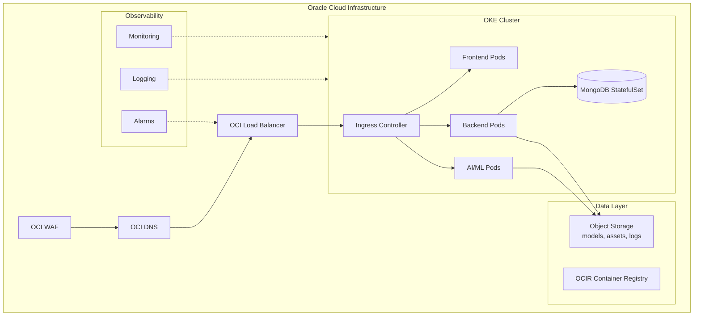

# Moodify Oracle Cloud Infrastructure (OCI) Deployment Guide

Production-ready deployment guide for hosting Moodify on **Oracle Cloud Infrastructure (OCI)** using **OKE (Kubernetes)**, **OCIR (Container Registry)**, **Object Storage**, and **OCI Load Balancer/WAF**.

## Table of Contents

- [Architecture Overview](#architecture-overview)
- [Prerequisites](#prerequisites)
- [Repository Layout](#repository-layout)
- [Infrastructure Provisioning (Terraform)](#infrastructure-provisioning-terraform)
- [Container Registry (OCIR)](#container-registry-ocir)
- [Kubernetes Deployment](#kubernetes-deployment)
- [DNS + TLS](#dns--tls)
- [Monitoring & Logging](#monitoring--logging)
- [Security & Compliance](#security--compliance)
- [Cost & Scaling](#cost--scaling)
- [Disaster Recovery](#disaster-recovery)
- [Troubleshooting](#troubleshooting)

## Architecture Overview



## Prerequisites

### Required Tools

- **OCI CLI** (v3.40+)
- **Terraform** (v1.5+)
- **kubectl** (v1.27+)
- **Docker** (v24+)

### OCI Tenancy Requirements

- Tenancy with Admin permissions
- Compartment for production workloads
- Quota to create:
  - VCN, subnets, Internet/NAT/Service gateways
  - OKE cluster + node pools
  - OCI Load Balancer
  - OCIR repos
  - Object Storage buckets

## Repository Layout

```
oracle-cloud/
├── README.md
├── scripts/
│   ├── ocir-login.sh
│   ├── push-images.sh
│   └── kubeconfig.sh
├── terraform/
│   ├── versions.tf
│   ├── providers.tf
│   ├── variables.tf
│   ├── outputs.tf
│   ├── network.tf
│   ├── oke.tf
│   ├── iam.tf
│   ├── registry.tf
│   ├── object-storage.tf
│   └── observability.tf
└── kubernetes/
    ├── base/
    │   ├── namespace.yaml
    │   ├── configmap.yaml
    │   ├── secret-template.yaml
    │   ├── backend-deployment.yaml
    │   ├── backend-service.yaml
    │   ├── ai-ml-deployment.yaml
    │   ├── ai-ml-service.yaml
    │   ├── frontend-deployment.yaml
    │   ├── frontend-service.yaml
    │   ├── mongo-statefulset.yaml
    │   ├── mongo-service.yaml
    │   ├── ingress.yaml
    │   ├── hpa.yaml
    │   ├── pdb.yaml
    │   ├── networkpolicy.yaml
    │   └── kustomization.yaml
    └── overlays/
        └── production/
            ├── kustomization.yaml
            └── image-tags.yaml
```

## Infrastructure Provisioning (Terraform)

1. **Create `terraform.tfvars`** in `oracle-cloud/terraform/`:

   ```hcl
   tenancy_ocid       = "ocid1.tenancy.oc1..example"
   user_ocid          = "ocid1.user.oc1..example"
   fingerprint        = "12:34:56:78:90:ab:cd:ef"
   private_key_path   = "~/.oci/oci_api_key.pem"
   region             = "us-ashburn-1"
   compartment_ocid   = "ocid1.compartment.oc1..example"

   vcn_cidr           = "10.20.0.0/16"
   public_subnet_cidr = "10.20.1.0/24"
   private_subnet_cidr = "10.20.2.0/24"

   oke_cluster_name   = "moodify-oke"
   oke_k8s_version    = "v1.28.2"
   node_pool_size     = 3
   node_shape         = "VM.Standard.E4.Flex"
   node_ocpus         = 4
   node_memory_gbs    = 16

   ocir_namespace     = "yourtenancy"
   object_storage_bucket_prefix = "moodify"
   enable_waf         = true
   ```

2. **Initialize & Apply**:

   ```bash
   cd oracle-cloud/terraform
   terraform init
   terraform plan
   terraform apply
   ```

3. **Get kubeconfig**:

   ```bash
   ../scripts/kubeconfig.sh <CLUSTER_OCID> ~/.kube/config
   ```

## Container Registry (OCIR)

1. **Login to OCIR**:

   ```bash
   ./scripts/ocir-login.sh <REGION> <NAMESPACE>
   ```

2. **Build and push images**:

   ```bash
   ./scripts/push-images.sh <REGION> <NAMESPACE>
   ```

## Kubernetes Deployment

1. **Configure secrets**:

   ```bash
   kubectl -n moodify-production apply -f oracle-cloud/kubernetes/base/secret-template.yaml
   ```

2. **Deploy production overlay**:

   ```bash
   kubectl apply -k oracle-cloud/kubernetes/overlays/production
   ```

3. **Verify**:

   ```bash
   kubectl -n moodify-production get pods,svc,ingress
   ```

## DNS + TLS

- Point your domain to the OCI Load Balancer IP from the ingress.
- Use OCI Certificates or cert-manager with ACME to provision TLS.
- Update `oracle-cloud/kubernetes/base/ingress.yaml` with your hostnames and TLS secrets.

## Monitoring & Logging

- Terraform provisions log groups and metrics policies.
- Install **OCI Logging Add-on** and **Metrics Server** in OKE.
- Enable alerts in `observability.tf` for 5xx LB errors and pod crashes.

## Security & Compliance

- Network segmentation: private subnets for nodes, public subnets for LB.
- OCI WAF enabled (optional via `enable_waf`).
- Secrets are stored in Kubernetes secrets; use OCI Vault for encryption at rest.
- Enforce least privilege with dynamic groups and policies defined in `iam.tf`.

## Cost & Scaling

- Use autoscaling on node pool sizes and HPA for services.
- Offload model storage to OCI Object Storage.
- Right-size AI/ML nodes separately when GPU shapes are required.

## Disaster Recovery

- Use Object Storage lifecycle + replication for model artifacts.
- Export MongoDB backups to Object Storage.
- Store Terraform state in OCI Object Storage S3-compatible backend.

## Troubleshooting

- Verify subnets route to Internet Gateway and Service Gateway.
- Check OKE node pool status:
  ```bash
  oci ce node-pool get --node-pool-id <id>
  ```
- Inspect ingress load balancer:
  ```bash
  kubectl -n moodify-production describe ingress moodify-ingress
  ```
