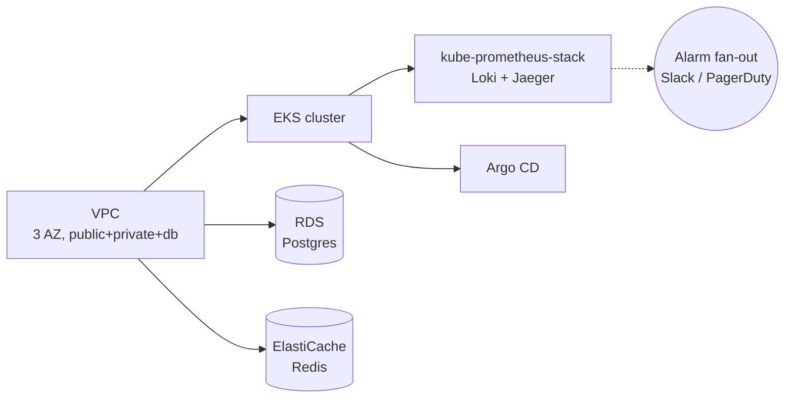

# Moodify — Terraform IaC

Multi-cloud Terraform stack for the self-hosted variant of Moodify.
Modules live in `modules/` and per-env wrappers in `environments/`.
The **canonical** Moodify production runs on **Vercel + Modal** —
this stack is the optional, AWS-first replacement that drops the
whole app onto an EKS cluster with managed Postgres / Redis / S3 /
monitoring.

## Layout

```
terraform/
├── main.tf               root composition: VPC + EKS + RDS + Redis + S3 + Monitoring + ArgoCD
├── variables.tf          input vars (env name, region, sizing, secrets)
├── modules/
│   ├── vpc/              3-AZ VPC w/ public + private + DB subnets, NAT, flow logs
│   ├── eks/              EKS cluster + managed node groups + IRSA + OIDC
│   ├── aks/              Azure equivalent (parity with EKS surface)
│   ├── gke/              GCP equivalent
│   ├── rds/              Postgres (Multi-AZ in prod, single-AZ in dev)
│   ├── redis/            ElastiCache w/ encryption-at-rest + in-transit
│   ├── s3/               app + state + backup buckets, versioned, SSE-S3
│   ├── monitoring/       kube-prometheus-stack + Loki + Jaeger (Helm-installed)
│   └── argocd/           Argo CD install + initial Application root
└── environments/
    ├── dev/              t3.small node group, single AZ, no Multi-AZ DB
    ├── staging/          mid-sized, 2 AZs, Multi-AZ DB, autoscaling on
    └── production/       large nodes, 3 AZs, full HA, longer retention
```

## Usage

```bash
# Pick an environment + initialise
cd environments/production
terraform init -upgrade

# Plan + apply
terraform plan -out=tfplan.bin
terraform apply tfplan.bin

# Via the root Makefile
make tf-init ENV=production
make tf-plan ENV=production
make tf-apply ENV=production
```

## Required env / vars

| Variable                       | Purpose                                            |
| ------------------------------ | -------------------------------------------------- |
| `AWS_PROFILE` or `AWS_*` creds | Authenticate to AWS                                |
| `TF_VAR_environment`           | `dev` / `staging` / `production`                   |
| `TF_VAR_aws_region`            | e.g. `us-east-1`                                   |
| `TF_VAR_db_password`           | Postgres root password (use `sops` / Vault in real life) |
| `TF_VAR_grafana_admin_password`| Grafana initial admin password                     |
| `TF_VAR_slack_webhook_url`     | Slack alarm fan-out (optional)                     |

## State backend

State is stored in S3 (`moodify-terraform-state` bucket) with
DynamoDB-backed locking (`moodify-terraform-locks` table). Bootstrap
the backend resources separately before the first `terraform init` —
they cannot live inside the same state file.

## Module composition



## Adding a new environment

1. Create `environments/<env>/` with a `main.tf` that wires this root
   module via a single `module "moodify" { source = "../../" … }` block.
2. Set the right `environment`, `aws_region`, sizing vars.
3. Set up a dedicated state key (`<env>/terraform.tfstate`).
4. `terraform init` + `plan` + `apply`.

## See also

* [`modules/vpc/`](modules/vpc/) — VPC details
* [`modules/eks/`](modules/eks/) — EKS details
* [`modules/monitoring/`](modules/monitoring/) — observability stack
* [`../INFRASTRUCTURE_SETUP.md`](../INFRASTRUCTURE_SETUP.md) — full setup walkthrough
* [`../DEPLOYMENT.md`](../DEPLOYMENT.md) — deploy guide
